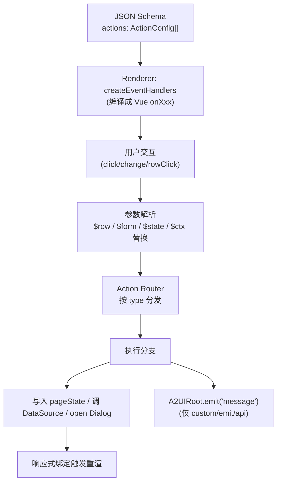
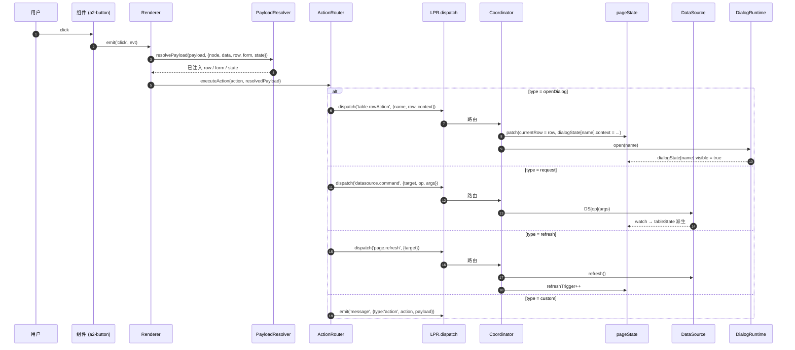
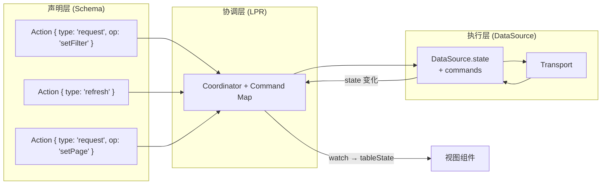
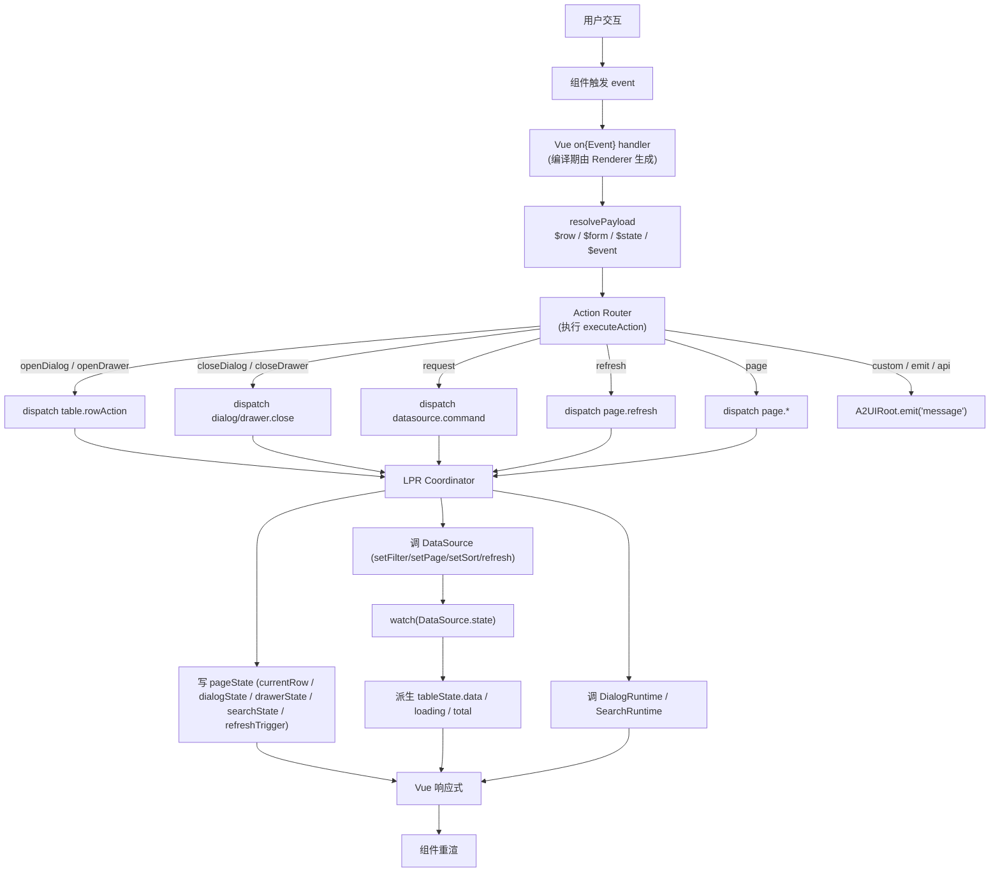
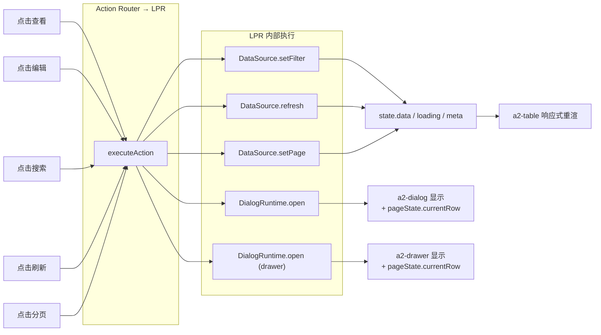
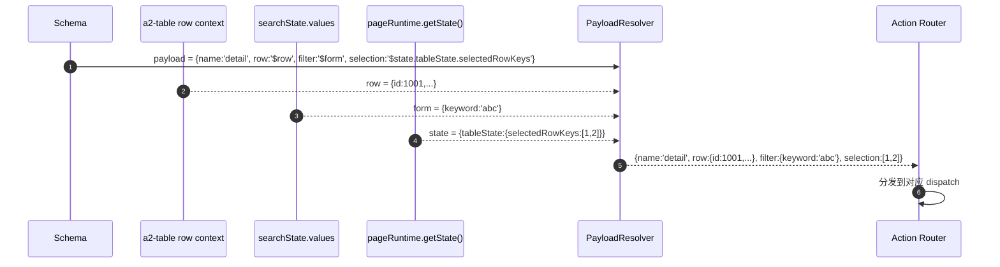

# Action System 执行机制（Light Page Runtime 视角）

> 本文档定义在 Light Page Runtime（LPR）中 **Action** 的类型、执行流程、参数传递、与 PageState / DataSource 的交互关系。
>
> 前置阅读：
> - [Light Page Runtime 设计](/architecture/runtime-design)
> - [PageState 模型设计](/architecture/page-state)
> - [DataSource 设计](/architecture/datasource)
>
> 本文档不涉及任何代码实现。

---

## 1. 定位与硬性约束

### 1.1 定位

Action 是 A2UI 协议驱动交互的核心机制。在 LPR 语境下，Action 承担的角色更明确：

> **Action = 组件事件（DOM 层）→ 页面级意图（协议层）的翻译器；由 LPR 统一执行。**

- **组件不写业务逻辑**：任何"点击后要做什么"都通过 `actions[]` 声明；
- **执行不散落**：所有 Action 走 LPR 统一调度；
- **参数可注入**：`$row / $form / $state / $ctx` 由执行器在触发时替换；
- **可回放**：Action 是 JSON 声明，可日志、可 mock、可重放。

### 1.2 硬性约束

- ❌ **不允许组件内写业务逻辑**（`@click="handleSubmit"` 是反模式）；
- ❌ **不允许组件绕过 LPR 直接改 pageState / DataSource**；
- ❌ **不允许在 Schema 中写任意 JS**（`callback` 类型仅供受控降级）；
- ✅ **所有 Action 通过 Page Runtime 执行**；
- ✅ **所有对 pageState / DataSource 的写入必须通过 Action 或 dispatch**；
- ✅ **参数传递必须是声明式的**（`$row` 而非硬编码值）。

### 1.3 与现有 Action System 的关系

现有 Action `type` 保留：`emit / callback / navigate / api`（详见既有 Action 生命周期章节）。

LPR 视角下 **新增** 4 个可选类型：

| 新 type | 含义 | 落到 |
| --- | --- | --- |
| `openDialog` / `closeDialog` | 打开 / 关闭 Dialog | LPR dispatch → DialogRuntime |
| `openDrawer` / `closeDrawer` | 打开 / 关闭 Drawer | LPR dispatch → DialogRuntime |
| `request` | 触发 DataSource 命令 | LPR dispatch → DataSource |
| `refresh` | 刷新 DataSource / Page | LPR dispatch → DataSource.refresh |
| `page` | 页面级操作（reset / setCurrentRow） | LPR dispatch → Coordinator |
| `custom` | 由宿主处理（等价 emit）| A2UIRoot emit('message') |

**additive**：老 Schema 若不使用这些类型，行为完全等价。

---

## 2. Action 类型设计

以下是 LPR 视角下的 Action 类型全集，按语义分层。

### 2.1 通用结构

所有 Action 共用同一结构（沿用协议）：

```jsonc
{
  "event":   "click",         // 触发事件（click / change / rowClick / submit ...）
  "type":    "openDialog",    // Action 类型
  "payload": { /* ... */ },   // 载荷（可含 $row / $form / $state 占位符）
  "handler": "..."            // 仅 callback / custom 使用
}
```

### 2.2 openDialog / openDrawer

用于打开 Dialog / Drawer，并携带触发上下文：

```jsonc
{
  "event": "click",
  "type":  "openDialog",
  "payload": {
    "name":   "detail",      // 对应 pageState.dialogState[name]
    "row":    "$row",        // 由渲染上下文注入当前行
    "context": { "source": "row-action" }
  }
}
```

行为：
1. 写入 `pageState.currentRow = $row`（若 payload.row 存在）；
2. 写入 `pageState.dialogState[name].context = context`；
3. 调 `DialogRuntime[name].open()`（内部会写 `visible = true`）；

`openDrawer` 与之完全对称，改写 `drawerState`。

### 2.3 closeDialog / closeDrawer

```jsonc
{
  "event": "click",
  "type":  "closeDialog",
  "payload": { "name": "detail" }
}
```

行为：
1. 调 `DialogRuntime[name].close()`；
2. 若 `destroyOnClose = true`，清空 `currentRow`；
3. 组件子树按声明销毁。

### 2.4 request（DataSource 命令）

对 DataSource 发起命令，涵盖搜索 / 分页 / 排序 / 过滤 / 缓存失效等：

```jsonc
{
  "event": "click",
  "type":  "request",
  "payload": {
    "target": "orderList",       // DataSource id
    "op":     "setFilter",       // 命令名
    "args":   "$form"            // 命令参数（可为占位符）
  }
}
```

`op` 允许值：`refresh / fetch / setPage / setPageSize / setSort / setSearch / setFilter / setExtra / invalidateCache`。

### 2.5 refresh（快捷刷新）

`refresh` 是 `request` 的语义糖，聚焦"刷新"这一最高频操作：

```jsonc
{
  "event": "click",
  "type":  "refresh",
  "payload": { "target": "orderList" }   // 缺省 = 当前 page 内所有 DataSource
}
```

行为：
- 单个 target：`DataSource.refresh()`；
- 缺省：`DataSourceManager.refreshAll()` + `pageState.refreshTrigger++`。

### 2.6 page（页面级操作）

```jsonc
{
  "event": "click",
  "type":  "page",
  "payload": {
    "op": "reset"            // reset | setCurrentRow | clearSelection
  }
}
```

- `reset`：清 search values + clear filter + 回到首页；
- `setCurrentRow`：写入 `currentRow`（不打开 overlay，供高级组合使用）；
- `clearSelection`：清空 `tableState.selectedRowKeys`。

### 2.7 custom（宿主处理）

等价于既有 `emit`：把意图上抛，由宿主处理。

```jsonc
{
  "event": "click",
  "type":  "custom",
  "payload": { "action": "export", "row": "$row" }
}
```

宿主监听 `A2UIRoot.emit('message', ...)` 后自行处理。**custom 是最后的降级**，任何能用 openDialog / request / refresh 表达的意图都不该走 custom。

### 2.8 类型分层

```
┌────────────────────────────────────────────────────────┐
│ 声明式 Action（LPR 就地执行，零胶水）                     │
│   openDialog / closeDialog / openDrawer / closeDrawer    │
│   request     / refresh                                   │
│   page                                                    │
├────────────────────────────────────────────────────────┤
│ 宿主接管（Runtime 只透传）                                │
│   custom / emit / api                                    │
├────────────────────────────────────────────────────────┤
│ 副作用（Runtime 直接执行）                                │
│   navigate                                                │
├────────────────────────────────────────────────────────┤
│ 兜底降级（不推荐）                                        │
│   callback                                                │
└────────────────────────────────────────────────────────┘
```

---

## 3. Action 执行流程

Action 的执行遵循固定 6 阶段流水线，全部由 LPR 完成，组件不参与决策。

### 3.1 执行流程图



### 3.2 六阶段说明

1. **声明**：Schema 中 `actions: ActionConfig[]` 挂在节点上；
2. **编译**：Renderer 遍历 actions，用 `createEventHandlers` 生成 Vue 的 `onClick / onChange / onRowClick` 处理器；
3. **触发**：用户在组件上操作，触发处理器；
4. **解析**：`resolvePayload(payload, ctx)` 把 `$row / $form / $state / $ctx` 占位符替换为运行时值；
5. **路由**：`Action Router` 按 `type` 分发到对应执行器；
6. **执行**：执行器写 pageState、调 DataSource、开 Overlay 或 emit message。

### 3.3 单个 Action 的完整序列



### 3.4 参数解析（占位符协议）

Action 的 `payload` 支持以下占位符，由 `PayloadResolver` 在触发时替换：

| 占位符 | 含义 | 来源 |
| --- | --- | --- |
| `$row` | 当前行数据 | `a2-table` 渲染行时注入的 `ComponentContext.row` |
| `$form` | 当前表单数据 | `pageState.searchState.values` 或 `data.form` |
| `$state` | 页面状态快照 | `pageRuntime.getState()` |
| `$ctx` | 完整上下文（node/data/path） | 组件当前 `ComponentContext` |
| `$event` | 原生事件对象 | 触发时的 `event` 参数 |
| `$row.xxx` | 深路径 | 支持 `$row.orderNo` 类嵌套 |
| `$state.tableState.selectedRowKeys` | 深路径 | 状态子树 |

**替换规则**：
- 只替换字符串值恰好为占位符（`"$row"`）或以 `$xxx.` 开头的路径；
- 对象 / 数组内的占位符递归解析；
- 未匹配的占位符保留原字符串（便于调试）。

**注意**：占位符解析是**在 Action 触发的瞬间**发生的一次性快照，不建立响应式订阅。

### 3.5 编译期 vs 触发期

- **编译期**（Renderer 阶段）：actions[] → Vue on{Event} handler；发生 1 次；
- **触发期**（用户交互）：resolvePayload → dispatch → 执行；每次触发发生。

这样组件本身不承担 action 逻辑，重渲染时 handler 引用稳定。

---

## 4. Action → PageState 更新机制

pageState 的一切写入都可以追溯到某个 Action（或宿主命令式 dispatch）。因此 Action 是 pageState 的 **唯一变更源**。

### 4.1 更新链路

```
Action(声明)
   │  resolvePayload
   ▼
ActionRouter → dispatch(type, payload)
   │
   ▼
Coordinator
   ├─ patch(pageState.xxx = ...)     ← 状态写
   ├─ DataSource.command(...)         ← 触发请求 → watch → tableState 派生
   └─ DialogRuntime.open/close        ← 副作用 → 组件响应
   ▼
Vue 响应式 → 组件重渲
```

### 4.2 五个目标场景的 pageState 更新映射

| 用户操作 | Action 声明 | 触发的 dispatch | 影响的 pageState |
| --- | --- | --- | --- |
| 点击"查看" | `openDialog / name:detail / row:$row` | `table.rowAction` | `currentRow`、`dialogState.detail.visible` |
| 点击"编辑" | `openDrawer / name:edit / row:$row` | `table.rowAction` | `currentRow`、`drawerState.edit.visible` |
| 点击"搜索" | `request / target:orderList / op:setFilter / args:$form` | `search.submit` | `searchState.lastSubmit`、`tableState.pagination.pageNum=1`、`tableState.data`（异步）、`tableState.loading` |
| 点击"刷新" | `refresh / target:orderList` | `page.refresh` | `refreshTrigger++`、`tableState.data / loading`（异步派生） |
| 点击"分页" | `request / target:orderList / op:setPage / args:{pageNum:$event}` | `table.pageChange` | `tableState.pagination.pageNum`、`tableState.data`（异步派生） |

所有场景都遵循 **同一模式**：Action → dispatch → Coordinator → 写入 pageState / 调用 DataSource → 响应式更新。

### 4.3 只读投影字段无法被 Action 直接写

`tableState.data / loading / total` 是 DataSource 的反投影，Action 不能直接写这些字段。想更新数据 → 必须走 `request` / `refresh` 触发 DataSource。

这是"单一数据真源"的物理保证。

### 4.4 参数注入示例：把当前行传给 Dialog

```jsonc
// Schema
{
  "type": "a2-button",
  "props": { "text": "查看" },
  "actions": [
    {
      "event": "click",
      "type":  "openDialog",
      "payload": { "name": "detail", "row": "$row" }
    }
  ]
}

// 触发时 payload 被解析为：
{ "name": "detail", "row": { "id": 1001, "orderNo": "ORD-1001", ... } }

// Coordinator 写入：
pageState.currentRow = { id: 1001, orderNo: "ORD-1001", ... }
pageState.dialogState.detail.visible = true

// Dialog 内部子组件通过 bindings 消费：
{
  "type": "a2-text",
  "bindings": {
    "value": { "type": "path", "value": "$page.orderPage.currentRow.orderNo" }
  }
}
```

**结论**：从"点击"到"Dialog 显示当前行数据"，全流程零胶水。

---

## 5. Action 与 DataSource 的关系

Action 是"发起者"，DataSource 是"执行者"，LPR Coordinator 是"中介"。三者形成清晰的三层。

### 5.1 关系图



### 5.2 分工

| 层 | 职责 | 不做的事 |
| --- | --- | --- |
| Action 声明 | 描述"什么事件触发什么意图" | 不描述"怎么发请求" |
| LPR Coordinator | 把意图翻译成 DataSource 命令 | 不发请求、不解析响应 |
| DataSource | 执行请求、维护 state / cache / retry | 不知道谁触发它 |

### 5.3 request vs refresh 的抉择

- **参数变化** → 用 `request`（`setFilter / setPage / setSort` 会更新 params 并 refetch）；
- **参数不变，只想重新获取** → 用 `refresh`；
- **强制绕过缓存** → `request / op:refresh / args:{force:true}`。

### 5.4 与既有 `api` 类型的边界

| 场景 | 用什么 |
| --- | --- |
| 列表 / 详情数据加载 | `request` / `refresh`（DataSource） |
| 表单提交 / 触发工作流 | `api`（宿主处理） |
| 单次不关心 loading 的调用 | `custom` / `emit`（宿主处理） |

**判断标准**：需不需要在 UI 上一致地展示 loading / error / total？需要 → DataSource；不需要 → api。

---

## 6. 五个目标行为的完整 Schema 示例

以下 5 个 Schema 片段展示 LPR 视角下如何实现题目要求的行为。全部**零胶水**（宿主无需编写响应函数）。

### 6.1 点击"查看" → 打开 Dialog

```jsonc
{
  "id": "table.actions.view",
  "type": "a2-button",
  "props": { "text": "查看", "size": "small" },
  "actions": [
    {
      "event": "click",
      "type":  "openDialog",
      "payload": {
        "name": "detail",
        "row":  "$row",
        "context": { "mode": "view" }
      }
    }
  ]
}
```

行为链：click → `resolvePayload({row: <当前行>})` → `dispatch('table.rowAction', {name:'detail', row})` → `currentRow=row` + `dialogState.detail.visible=true` → Dialog 渲染 → 子组件消费 `$page.<pageId>.currentRow`。

### 6.2 点击"编辑" → 打开 Drawer

```jsonc
{
  "id": "table.actions.edit",
  "type": "a2-button",
  "props": { "text": "编辑", "size": "small" },
  "actions": [
    {
      "event": "click",
      "type":  "openDrawer",
      "payload": {
        "name": "edit",
        "row":  "$row",
        "context": { "mode": "edit" }
      }
    }
  ]
}
```

行为链与 6.1 对称，只是落到 `drawerState.edit.visible = true`。

### 6.3 点击"搜索" → 调 API

```jsonc
{
  "id": "search.submit-btn",
  "type": "a2-button",
  "props": { "text": "搜索", "type": "primary" },
  "actions": [
    {
      "event": "click",
      "type":  "request",
      "payload": {
        "target": "orderList",
        "op":     "setFilter",
        "args":   "$form"            // 由 a2-search 注入 searchState.values
      }
    }
  ]
}
```

行为链：click → `resolvePayload({args: <当前表单值>})` → `dispatch('search.submit', {values})` → Coordinator 调 `DataSource.setFilter(values) + setPage(1)` → DataSource fetch → `watch → tableState` → Table 重渲。

### 6.4 点击"刷新" → reload table

```jsonc
{
  "id": "toolbar.refresh",
  "type": "a2-button",
  "props": { "text": "刷新", "icon": "refresh" },
  "actions": [
    {
      "event": "click",
      "type":  "refresh",
      "payload": { "target": "orderList" }
    }
  ]
}
```

行为链：click → `dispatch('page.refresh', {target:'orderList'})` → `DataSource.refresh()` → `refreshTrigger++` → 若开启 cache 也可 `refresh({force:true})` 绕过。

### 6.5 点击"分页" → reload table

Pagination 组件通常内建 `change` 事件；在 Schema 层这样声明：

```jsonc
{
  "id": "toolbar.pagination",
  "type": "a2-pagination",
  "bindings": {
    "dataSource": { "type": "datasource", "value": "orderList" }
  },
  "actions": [
    {
      "event": "change",
      "type":  "request",
      "payload": {
        "target": "orderList",
        "op":     "setPage",
        "args":   "$event"          // {pageNum, pageSize}
      }
    }
  ]
}
```

行为链：pagination change → `resolvePayload({args:{pageNum, pageSize}})` → `dispatch('table.pageChange', ...)` → `DataSource.setPage(pageNum)` → fetch → tableState 派生。

若同时想支持 `pageSize` 变化，Pagination 可再声明一条：

```jsonc
{
  "event": "pageSizeChange",
  "type":  "request",
  "payload": { "target": "orderList", "op": "setPageSize", "args": "$event" }
}
```

### 6.6 五种行为的对照汇总

| 用户点击 | Action type | payload | 落到 |
| --- | --- | --- | --- |
| 查看 | `openDialog` | `{name, row:$row}` | pageState.dialogState + currentRow |
| 编辑 | `openDrawer` | `{name, row:$row}` | pageState.drawerState + currentRow |
| 搜索 | `request` | `{target, op:setFilter, args:$form}` | DataSource.setFilter → tableState |
| 刷新 | `refresh` | `{target}` | DataSource.refresh → tableState |
| 分页 | `request` | `{target, op:setPage, args:$event}` | DataSource.setPage → tableState |

**共同点**：全部通过 LPR 执行，全部为声明式，无一行胶水代码。

---

## 7. 统一调度：Action Router 模型

LPR 内部的 Action Router 是 Action 系统的 **唯一执行入口**。它保证所有 Action 走同一个决策路径。

### 7.1 Router 逻辑

```
executeAction(action, ctx) {
  1. resolvedPayload = resolvePayload(action.payload, ctx)

  2. switch (action.type) {
       case 'openDialog':  dispatch('table.rowAction', { name, row, context, target:'dialog' })
       case 'openDrawer':  dispatch('table.rowAction', { name, row, context, target:'drawer' })
       case 'closeDialog': dispatch('dialog.close',    { name })
       case 'closeDrawer': dispatch('drawer.close',    { name })
       case 'request':     dispatch('datasource.command', { target, op, args })
       case 'refresh':     dispatch('page.refresh',   { target? })
       case 'page':        dispatch('page.'+op,       payload)
       case 'custom':
       case 'emit':        onEvent('message', { action, payload })
       case 'api':         onEvent('api',     { handler, payload })
       case 'navigate':    window.location = payload.url
       case 'callback':    new Function(handler)(payload, ctx)   // 受控降级
     }
}
```

### 7.2 为什么要有 Router

- **单一入口**：所有 Action 都汇聚到这一处，行为可枚举、可测试；
- **可拦截**：可在 Router 层做 audit / 权限 / 埋点，无需侵入每个组件；
- **可扩展**：新增 Action 类型只需加一个 case；
- **可降级**：未知类型可 warn 并落回 custom，不崩渲染。

### 7.3 与 Renderer 的交集

Renderer 仍是唯一负责"编译 actions[] 为 handler"的地方；Router 只在触发期执行。**Renderer 不感知 Router 的具体分支**——它调用 `executeAction`，剩下的完全内聚。

---

## 8. Mermaid 流程图

### 8.1 从用户点击到 UI 更新的完整流



### 8.2 五种目标行为汇聚图



### 8.3 参数传递路径



---

## 9. Action System 与 LPR / DataSource / pageState 的最终关系

```
     ┌─────────────────────────────────────────────┐
     │              Schema (声明层)                 │
     │   actions: [{type, event, payload}]         │
     └───────────────────┬─────────────────────────┘
                         │ Renderer 编译
                         ▼
     ┌─────────────────────────────────────────────┐
     │        Renderer / createEventHandlers        │
     └───────────────────┬─────────────────────────┘
                         │ 触发时
                         ▼
     ┌─────────────────────────────────────────────┐
     │   PayloadResolver + Action Router (LPR)     │
     │   （统一入口 / 单一决策路径）                 │
     └────┬──────────┬──────────────┬──────────────┘
          │          │              │
          ▼          ▼              ▼
     ┌────────┐ ┌─────────┐ ┌──────────────────┐
     │pageState│ │DataSource│ │DialogRuntime /  │
     │ (状态)  │ │ (数据)   │ │SearchRuntime    │
     └───┬────┘ └────┬─────┘ └─────────┬────────┘
         │           │  watch          │
         │           └────┐            │
         │                ▼            │
         │        tableState.data      │
         │        (只读投影)           │
         │                             │
         └─────────────┬───────────────┘
                       ▼
                Vue 响应式
                       │
                       ▼
                  组件重渲
```

**六个不变量**：

1. 组件不写业务逻辑；
2. 所有 Action 通过 LPR 执行；
3. pageState 单一变更入口 = dispatch = Action Router；
4. DataSource 单一调度者 = LPR Coordinator；
5. 参数注入通过声明式占位符；
6. 未使用新类型时行为等价老 A2UI。

---

## 10. 反模式清单

以下写法在 LPR 语境下**明确禁止**：

- ❌ 组件内 `@click="handleSubmit"` + 组件里手写业务；
- ❌ 组件内 `fetch('/api/xxx')`（应走 DataSource + request Action）；
- ❌ 组件内直接 `pageState.dialogState.detail.visible = true`（应走 openDialog）；
- ❌ Schema 里写 `callback: "async () => { await fetch(...) }"`（应走 request / api）；
- ❌ Action `payload` 内硬编码当前行 id（应用 `$row.id`）；
- ❌ 用 `custom` 表达 openDialog / refresh 等已有语义（宿主要写胶水）；
- ❌ 宿主收到 message 后手动改 pageState 里的只读投影字段。

---

## 11. 设计原则回顾

- **声明式**：Action 是数据，不是代码；
- **单一入口**：所有 Action 汇聚到 Action Router；
- **零胶水**：目标 5 类交互都在 Schema 中声明表达；
- **参数注入**：`$row / $form / $state / $event` 声明式占位符；
- **协议 additive**：新增 4 类 Action 均为可选；
- **可回放**：Action + dispatch 可完全日志、mock、重放；
- **可拦截**：Router 层可插入 audit / 权限 / 埋点；
- **可拆除**：未使用新类型时行为等价老 A2UI。

---

_本文档仅为设计文档；不包含任何代码；不改变现有 Renderer / MessageProcessor 主干；Action 类型扩展为 additive。_
