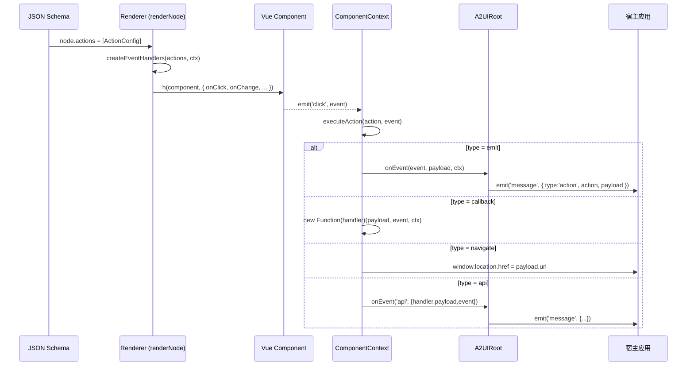
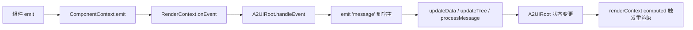

# Action 系统

Action 是 A2UI **协议驱动交互** 的核心机制。它把「用户在组件上的操作」翻译成「协议语义的意图」，并交给 Runtime 与宿主处理。本文档系统整理当前 A2UI 的 Action 体系、生命周期、参数与通知机制，并给出未来扩展方向（含 MCP / AI Agent 支撑思路）。

阅读本文前建议先了解：

- [Runtime 架构设计](/guide/runtime-design)
- [组件开发规范](/guide/component-development)
- [JSON 规范](/guide/json-schema)

---

## Action 的作用

在传统前端开发中，事件与业务逻辑通常直接写在组件里（`@click="handleSubmit"`）。A2UI 的场景是 **服务端 / AI 下发 UI Schema，前端 Runtime 解释执行**——组件不知道也不关心自己被点击后要做什么。**Action 是把「事件」和「行为」解耦的桥梁**。

具体来说，Action 承担四类职责：

- **描述意图**：`{ event: 'click', type: 'emit', payload: { action: 'submit' } }` 说明「点击时，向宿主上抛一个 submit 意图」；协议只声明「要做什么」，不描述「怎么做」。
- **桥接组件与宿主**：把组件内部的 DOM/业务事件转成宿主能识别的 `message`。宿主只订阅 `message` 事件即可接管所有业务逻辑。
- **收敛副作用**：把 `window.location.href = ...`、`fetch(...)`、`open dialog` 等副作用集中在 Action 层，组件层保持纯净。
- **可下发、可回放**：Action 是 JSON 描述而不是代码，因此可以由服务端 / AI 生成，可日志、可回放、可版本化。

当前实现见 [renderNode.ts](file:///d:/work/program/tineco/UI/a2ui-vue-engine/packages/a2ui-vue-engine/src/renderer/renderNode.ts) 中的 `createEventHandlers` 与 `executeAction`。协议定义见 [types/index.ts](file:///d:/work/program/tineco/UI/a2ui-vue-engine/packages/a2ui-vue-engine/src/types/index.ts) 的 `ActionConfig`：

```ts
interface ActionConfig {
  event: string                                     // 触发事件名（如 click / change / rowClick）
  type: 'emit' | 'callback' | 'navigate' | 'api'    // 动作类型
  payload?: Record<string, any>                     // 载荷（意图参数）
  handler?: string                                  // callback / api 的处理器名或函数字符串
}
```

---

## Action 生命周期

Action 从 **Schema 解析** 到 **副作用完成** 的完整生命周期分为 6 个阶段：



各阶段说明：

1. **声明**：Schema 中每个节点可携带 `actions: ActionConfig[]`；扁平格式通过 `flatNode.action.event.name` 转成 `{ event: 'click', type: 'emit', payload: { eventName } }`（见 [flatToTree.ts](file:///d:/work/program/tineco/UI/a2ui-vue-engine/packages/a2ui-vue-engine/src/core/flatToTree.ts) 的 `buildActions`）。
2. **编译**：Renderer 遍历 `actions[]`，用 `createEventHandlers` 生成 Vue 的 `on{Event}` 处理器，随 `h(...)` 挂到组件上。
3. **触发**：用户交互，Vue 组件的原生 emit 触发对应处理器。
4. **执行**：处理器调用 `executeAction`，按 `type` 分发到不同的执行分支。
5. **通知**：`emit / api` 走 `ComponentContext.emit → RenderContext.onEvent → A2UIRoot.handleEvent → emit('message')`；`navigate / callback` 就地执行。
6. **反馈**：宿主收到 `message` 后可修改状态、发请求，然后通过 `updateData / updateTree / processMessage` 反过来驱动 Runtime 重新渲染，形成闭环。

Action 生命周期是 **单向 + 幂等** 的：同一个 Action 多次触发不会产生副作用泄露，因为它不持有状态。

---

## Action 如何执行

Action 的执行由 [renderNode.ts](file:///d:/work/program/tineco/UI/a2ui-vue-engine/packages/a2ui-vue-engine/src/renderer/renderNode.ts) 中的 `executeAction(action, event, context)` 集中处理。当前支持 4 种 `type`：

### type: `'emit'`（推荐、首选）

把动作作为一个 **意图消息** 上抛给宿主：

```json
{ "event": "click", "type": "emit", "payload": { "action": "submit" } }
```

执行路径：`context.emit(action.event, action.payload)` → `RenderContext.onEvent` → `A2UIRoot.handleEvent`，最终以 `A2Message` 形态 `emit('message', { type: 'action', action, payload })` 上抛。**宿主是唯一的业务逻辑执行者。**

### type: `'callback'`（受控本地处理）

用于 **临时的、纯前端** 的处理逻辑，`handler` 是可以安全求值的函数字符串：

```json
{
  "event": "click",
  "type": "callback",
  "handler": "(payload, event, ctx) => console.log('clicked', payload)",
  "payload": { "id": 123 }
}
```

执行时通过 `new Function('return ' + handler)()` 反解为函数并调用，参数依次为 `(payload, event, ctx)`。**注意**：字符串必须来源可信，避免注入。

### type: `'navigate'`

页面跳转，只需要 `payload.url`：

```json
{ "event": "click", "type": "navigate", "payload": { "url": "/detail", "replace": false } }
```

执行 `window.location.href = url`（或 `.replace(url)`）。

### type: `'api'`

把 API 调用 **委托** 给宿主，Runtime 不做实际请求：

```json
{
  "event": "click",
  "type": "api",
  "handler": "submitForm",
  "payload": { "url": "/api/submit", "method": "POST" }
}
```

执行时 `context.emit('api', { action: handler, payload, event })`，宿主监听 `message` 并识别 `type: 'api'` 做真实请求。

> 设计原则：Runtime 只描述「要发生什么」；副作用一律外化给宿主，除非是纯前端、无网络、无路由变更的最小行为（`navigate` 只处理最简单的 URL 跳转）。

---

## Action 如何传递参数

Action 的参数分为 **协议参数**（`payload`）与 **运行时参数**（`event / context`）两类。

### 协议参数：`payload`

`payload` 是 Schema 静态声明的载荷，随 Action 被序列化下发。所有对宿主的 **意图描述** 都放这里：

```json
{
  "event": "click",
  "type": "emit",
  "payload": {
    "action": "openDetail",
    "userId": 42,
    "source": "list"
  }
}
```

宿主收到的 `message` 结构：

```ts
{
  type: 'action',
  id: 'event-<timestamp>',
  action: 'click',        // 对应 ActionConfig.event
  payload: { action: 'openDetail', userId: 42, source: 'list' }
}
```

### 运行时参数：`event / context`

`event` 是组件触发时的 **原生事件对象**（`MouseEvent / FocusEvent` 等）或 **组件传出的语义值**（例如 `A2Select` 的 change value）。

`context` 是 `ComponentContext`：

```ts
interface ComponentContext {
  node: A2Node                                // 当前节点定义
  data: Record<string, any>                   // 全局 data 引用
  path: string[]                              // 节点在树中的路径
  emit: (event: string, payload?: any) => void
  resolveBinding: (binding: BindingConfig) => any
  executeAction: (action: ActionConfig, event?: Event) => void
}
```

`callback` 类型可以在 handler 中直接使用它读取 `data`、解析 `binding` 或再次触发其它 Action。

### 参数如何从数据流中获取

- **静态参数**：写在 `payload` 中。
- **动态参数**：写在 `bindings`，由 Renderer 在渲染阶段解析为 props，再由组件在 emit 时随事件参数带出。
- **表单数据**：宿主通过 `A2UIRoot.getFormData()` 主动获取，或监听 `formDataChange` 被动接收。

---

## Action 如何通知 Runtime

「通知 Runtime」实际上是 **通知 A2UIRoot**——它是 Runtime 唯一暴露给宿主的接口。链路如下：



### 组件 → Runtime

组件通过 Vue emit，Runtime 会自动捕获两类事件：

1. **`update:modelValue`**：Runtime 会直接 `setPathValue(data, bindingPath, value)`，无需组件感知。
2. **Actions 中声明的事件**：由 `createEventHandlers` 注册的 `on{Event}` 处理器捕获，随后 `executeAction` 处理。

### Runtime → 宿主

`A2UIRoot.handleEvent` 会把事件转成 `A2Message` 并 emit：

```ts
emit('message', {
  type: 'action',
  id: `event-${Date.now()}`,
  action: event,
  payload,
})
```

宿主监听：

```vue
<A2UIRoot @message="onMessage" />
```

### 宿主 → Runtime

宿主处理完业务后，通过 `A2UIRoot` 暴露的命令式 API 反向驱动：

- `updateData(newData)`：更新 `data`，触发依赖 `data` 的绑定重算；
- `updateTree(newTree)`：替换 `tree`，整树重渲染；
- `processMessage(message)`：以协议消息形式驱动，支持 `node / node_update / node_append / node_remove / data / data_update`，**增量** 更新。

至此形成一个完整闭环：**协议描述 → 事件触发 → 通知宿主 → 宿主决策 → 协议驱动 → 重新渲染**。

---

## 未来建议支持的 Action 类型

以下 Action 是 A2UI 后续演进的候选清单。每一项都可以在 **不修改 Runtime 内核**（即 `MessageProcessor / renderTree / A2UIRoot` 主流程）的前提下，通过在 `executeAction` 中新增分支实现。所有新增类型 **必须保留现有 4 种类型不变**，确保向后兼容。

| Action | 场景 | 建议 payload | 建议实现 |
|--------|------|-------------|---------|
| `search` | 触发查询 / 过滤 | `{ keyword, filters, source }` | 上抛 `message`，宿主决定发请求 |
| `submit` | 表单提交 | `{ formId, url?, method? }` | 上抛 `message` + 自动附带 `getFormData()` |
| `reset` | 表单重置 | `{ formId, keepFields?: string[] }` | Runtime 内置：清空 `data.form`，回退默认值 |
| `request` | 通用 HTTP 请求 | `{ url, method, params, body, mapTo }` | 上抛 `message`，宿主执行并可通过 `mapTo` 写回 `data` |
| `dialog` | 打开 / 关闭对话框 | `{ open, target, props? }` | 修改 `data.dialogs[target].visible`，触发 A2Dialog 重渲染 |
| `drawer` | 打开 / 关闭抽屉 | `{ open, target, props? }` | 同 `dialog`，作用于 A2Drawer |
| `navigate` | 页面跳转（已有） | `{ url, replace?, target? }` | 扩展 `target: 'self' \| 'blank'`、支持路由 |
| `download` | 下载文件 | `{ url, filename?, dataUrl? }` | 创建 `<a download>` 或 `Blob` |
| `copy` | 复制到剪贴板 | `{ text }` | `navigator.clipboard.writeText(text)` |
| `refresh` | 局部刷新 | `{ target?, keepScroll? }` | 上抛 `message`，宿主决定重新拉数据 |
| `reload` | 整页刷新 | `{ hard?: boolean }` | `window.location.reload()` |
| `customEvent` | 用户自定义事件（透传） | 任意 | 完全等价于 `emit`，但语义化标注为自定义 |
| `confirm` | 确认弹窗 | `{ title, message, okText, cancelText, then? }` | 内置 confirm；`then` 是另一个 `ActionConfig`（组合动作） |

### 组合动作（Action Chain）

`confirm.then`、`request` 成功后再触发 `dialog.close` 等，都属于「动作链」。未来可通过扩展 `ActionConfig`：

```ts
interface ActionConfig {
  event: string
  type: string
  payload?: Record<string, any>
  handler?: string
  then?: ActionConfig | ActionConfig[]     // 成功后
  catch?: ActionConfig | ActionConfig[]    // 失败后
  finally?: ActionConfig | ActionConfig[]  // 无论成败
}
```

`then / catch / finally` 是可选字段，老 Schema 不出现即完全兼容。

---

## 为什么事件不能写死

「写死」通常指把业务逻辑写在组件的模板或方法里。A2UI 明确禁止这种做法，原因有五点：

1. **协议驱动的场景不允许**：Schema 由服务端 / AI 动态下发，事件目标（下一步动作）事先未知；写死等于把「决策权」从服务端 / AI 抢回前端。
2. **组件复用性**：同一个 `A2Button` 可能在不同页面表达「提交 / 取消 / 打开详情 / 删除」等不同意图，事件写死会让组件退化为业务耦合的私有组件。
3. **可测试性**：写死的事件依赖具体宿主环境，无法在 Playground / 单测中隔离验证。
4. **可回放性**：JSON 是纯数据，可以日志、可以回放；写死后事件行为无法追踪。
5. **多端一致**：同一份 Schema 目标是被跨技术栈的 Runtime 消费；组件写死等于把行为绑死在 Vue 3。

结论：**组件负责触发事件、Runtime 负责路由、宿主 / AI 负责决策**——三者边界必须清晰。

---

## 为什么需要统一 Action

如果没有 Action 抽象，组件将各自定义事件语义：Button 有 click、Table 有 rowClick、Dialog 有 close、Form 有 submit……宿主要为每种组件编写独立的监听逻辑。这带来三个问题：

- **心智负担**：宿主要记住每种组件、每种事件的语义与参数。
- **难以扩展**：新增一个「打开抽屉」这类跨组件行为，需要在每个组件里都实现一次。
- **不可组合**：无法用一个「动作链」串起「打开确认框 → 提交表单 → 关闭对话框」。

统一 Action 带来的收益：

- **一致协议**：所有组件的事件都通过 `ActionConfig` 描述，宿主只需订阅 `A2UIRoot` 的 `message` 事件。
- **可组合**：`then / catch / finally` 允许把动作组合成流程。
- **可扩展**：新增动作类型时，只改一处（`executeAction` 分支），所有组件立即受益。
- **可托管**：Action 是数据，可以被上下游系统（AI / MCP / 服务端）生成、审查、下发。

---

## 未来如何支持 MCP

**MCP（Model Context Protocol）** 是一种让模型访问外部工具与上下文的协议。A2UI 天然与 MCP 契合，因为：

- Action 已经是 **意图声明**，只需在 `type` 层面新增 `mcp` 或让 `api` 承载 MCP 端点即可；
- Runtime 不做实际调用，宿主可以在收到 `message` 后把 payload 直接转发给 MCP client。

未来的接入路径设想（不改变现有协议，只做扩展）：

1. **新增 Action 类型**（可选）：`type: 'mcp'`，payload 结构对齐 MCP 的 `tools/call`：

```json
{
  "event": "click",
  "type": "mcp",
  "payload": {
    "server": "filesystem",
    "tool": "read_file",
    "arguments": { "path": "/tmp/report.md" }
  },
  "then": { "event": "afterRead", "type": "emit", "payload": { "target": "reportPreview" } }
}
```

2. **宿主接管**：宿主监听 `message`，识别 `type: 'mcp'`，通过 MCP client 转发到目标 server，得到结果后通过 `processMessage({ type: 'data_update', path, value })` 把返回值写回 `data`。
3. **AI 读取上下文**：宿主也可以把 `A2UIRoot.getFormData()` / `getData()` 作为 MCP 的 `resources` 暴露给模型，让模型基于当前 UI 状态决策。

关键点：**Runtime 完全不感知 MCP**，MCP 的接入只是「Action 的一种协议目标」，宿主可以自由替换传输层（MCP / GraphQL / REST）。

---

## 未来如何支持 AI Agent

AI Agent 是「让模型控制 UI」，A2UI 的协议驱动特性使其自然适配 Agent 场景。可能的集成方式：

### 1. Agent 生成 Schema

Agent 直接输出 `A2Node` 或 `FlatA2Node[]`，通过 `A2UIRoot.processMessage({ type: 'node', node })` 下发。这就是 **AI-Generated UI**：模型决定这一步要展示什么组件、如何布局、绑定什么数据。

### 2. Agent 生成 Action

Agent 决定「用户下一步的可能操作」并写入 `actions`：

```json
{
  "id": "btnConfirm",
  "type": "a2-button",
  "props": { "text": "创建订单" },
  "actions": [
    { "event": "click", "type": "mcp",
      "payload": { "server": "orders", "tool": "create_order", "arguments": { "userId": 42 } },
      "then": { "event": "afterCreate", "type": "emit", "payload": { "toast": "订单已创建" } }
    }
  ]
}
```

用户点击 → MCP 调用 → 结果写回 `data` → Runtime 重新渲染。**用户 → UI → Agent → 工具 → UI** 的完整闭环。

### 3. Agent 观测状态

Agent 通过宿主暴露的 `getData / getFormData / getTree` 读取当前 UI 状态，用于生成下一轮 Schema。

### 4. Agent 组合动作

`then / catch / finally` 允许 Agent 编排「多步交互」，例如「点击 → 弹确认框 → 提交表单 → 关闭对话框 → 刷新列表」，全部通过一次 Schema 下发。

关键点：Runtime 是 **通用的解释器**，Agent 与 MCP 都是宿主侧的能力。Runtime 只要保证协议稳定，就能同时兼容「人类下发」「服务端下发」「AI 下发」的 Schema。

---

## 向后兼容原则

新增能力必须遵循以下约束：

1. **不移除、不重命名已有 `type`**：`emit / callback / navigate / api` 永久保留。
2. **不修改已有字段的语义**：`event / payload / handler` 的含义不变；老 Schema 无需迁移即可继续运行。
3. **新增字段一律可选**：`then / catch / finally / meta / timeout` 等增量字段必须为可选，缺省行为等同于当前实现。
4. **新增 `type` 只走扩展**：只在 [`executeAction`](file:///d:/work/program/tineco/UI/a2ui-vue-engine/packages/a2ui-vue-engine/src/renderer/renderNode.ts) 的 `switch` 中追加分支，不改动其它分支；未知 `type` 应该 **降级为 `emit`** 并输出 warning，而不是抛出异常。
5. **协议演进走文档**：任何新的 `type` / 字段都必须先更新 [JSON 规范](/guide/json-schema)、[Runtime 架构](/guide/runtime-design)、本页文档，再提交实现。
6. **测试保底**：升级前用现有 Playground 与文档中的示例 JSON 做回归验证，确保老 Schema 渲染与交互结果 **完全一致**。

---

## 参考实现位置

- Action 执行：[renderNode.ts](file:///d:/work/program/tineco/UI/a2ui-vue-engine/packages/a2ui-vue-engine/src/renderer/renderNode.ts)（`createEventHandlers` / `executeAction`）
- Action 协议：[types/index.ts](file:///d:/work/program/tineco/UI/a2ui-vue-engine/packages/a2ui-vue-engine/src/types/index.ts)（`ActionConfig`）
- 扁平适配：[flatToTree.ts](file:///d:/work/program/tineco/UI/a2ui-vue-engine/packages/a2ui-vue-engine/src/core/flatToTree.ts)（`buildActions`）
- 事件桥接：[A2UIRoot.vue](file:///d:/work/program/tineco/UI/a2ui-vue-engine/packages/a2ui-vue-engine/src/root/A2UIRoot.vue)（`handleEvent`）
- 消息路由：[MessageProcessor.ts](file:///d:/work/program/tineco/UI/a2ui-vue-engine/packages/a2ui-vue-engine/src/core/MessageProcessor.ts)（`handleActionMessage`）
