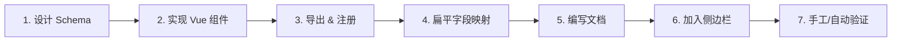

# 组件开发规范

本文档面向未来在 A2UI 中新增组件（如 `Table / Chart / Dialog / Drawer / Timeline / Tree` 等）的开发者。规范来自当前项目的实际实现约定（`packages/a2ui-vue-engine`）与已存在的组件（A2Card / A2Button / A2TextField / A2SelectField / A2ChoicePicker / A2InfoField / …），目的在于保证 **新组件与 Runtime 无缝协作、与现有组件视觉一致、无需修改 Runtime 内核**。

阅读本文前建议先了解：

- [Runtime 架构设计](/guide/runtime-design)
- [JSON 规范](/guide/json-schema)
- 现有组件文档：[组件概览](/components/)

---

## 新增组件流程

新增一个组件的标准流程共 **7 步**。这些步骤覆盖了从「组件实现」到「协议接入」再到「文档发布」的完整闭环。



- **1. 设计 Schema**：先明确协议字段（`type / props / bindings / actions / slots`），再动手写代码。
- **2. 实现 Vue 组件**：放到 `packages/a2ui-vue-engine/src/components/`。
- **3. 导出与注册**：`components/index.ts` 导出组件；`componentMap.ts` 注册 `type → 组件` 的映射。
- **4. 扁平字段映射**（可选）：如果新组件需要支持扁平格式，在 `types/index.ts` 追加字段，在 `core/flatToTree.ts` 的 `buildProps` 里做扁平字段到 `props` 的映射。
- **5. 编写文档**：`packages/a2ui-docs/docs/components/` 下按现有格式新增中英文文档。
- **6. 加入侧边栏**：在 [`.vitepress/config.ts`](file:///d:/work/program/tineco/UI/a2ui-vue-engine/packages/a2ui-docs/docs/.vitepress/config.ts) 的 `sidebar` 中登记。
- **7. 验证**：通过文档中的 `PlaygroundEmbed` 或 Playground 实际渲染 Schema 验证。

> 原则：新增组件时 **不允许** 修改 `MessageProcessor`、`renderer/`、`mapper/binding.ts`、`A2UIRoot.vue`。这些模块只在协议本身演进（新增 `BindingConfig.type` / `ActionConfig.type` / `A2Message.type`）时才需要触碰。

---

## 目录规范

新组件涉及的所有文件位置固定如下，不允许分散到其它目录：

```
packages/
├── a2ui-vue-engine/
│   └── src/
│       ├── components/
│       │   ├── A2Table.vue           # ← 新组件实现
│       │   ├── componentMap.ts       # ← 注册（追加一行）
│       │   └── index.ts              # ← 导出（追加一行）
│       ├── core/
│       │   └── flatToTree.ts         # ← 扁平字段映射（追加分支）
│       ├── types/
│       │   └── index.ts              # ← FlatA2Node 追加字段
│       └── assets/
│           └── icons/                # ← 组件专属图标（如有）
├── a2ui-docs/
│   └── docs/
│       ├── components/
│       │   └── a2-table.md           # ← 中文文档
│       ├── en/components/
│       │   └── a2-table.md           # ← 英文文档
│       └── .vitepress/config.ts      # ← 侧边栏登记
```

**约定**：

- 一个组件一个 `.vue` 文件，不做单文件多组件。
- 组件专属静态资源（图标、图片）放在 `src/assets/icons/`，通过 `import icon from '../assets/icons/xxx.png'` 引入，禁止使用绝对路径或 CDN 硬编码。
- 组件私有的样式必须写在 `<style scoped>` 中，全局样式变量通过 `var(--a2-*)` 引用。

---

## 命名规范

命名是协议驱动的一部分，跨源码、协议、文档必须保持严格一致。

| 场景 | 规则 | 示例 |
|------|------|------|
| Vue 组件文件名 | `A2` + `PascalCase` + `.vue` | `A2Table.vue` |
| Vue 组件 `name` | `A2` + `PascalCase` | `A2Table` |
| 协议 `type`（树形） | `a2-` + `kebab-case` | `a2-table` |
| 协议 `component`（扁平） | `PascalCase` | `Table` |
| 中文文档文件名 | `a2-` + `kebab-case` + `.md` | `a2-table.md` |
| Props 字段 | `camelCase` | `dataSource`, `columns` |
| Emit 事件 | `camelCase`（HTML 属性写作 `on{Pascal}`） | `rowClick`, `pageChange` |
| 数据绑定路径 | `/segment/segment` 或 `segment.segment` | `/form/name`, `list.items` |
| CSS 变量 | `--a2-*` | `--a2-color-primary` |
| CSS 类名 | `a2-` + `kebab-case`，修饰词用 `--` | `.a2-card`, `.a2-card--shadow-hover` |

`normalizeComponentName` 已在 [`flatToTree.ts`](file:///d:/work/program/tineco/UI/a2ui-vue-engine/packages/a2ui-vue-engine/src/core/flatToTree.ts) 中把 `PascalCase` → `kebab-case`，因此 **扁平 `component` 与树形 `type` 必须一一对应**。例如：`Table` ↔ `a2-table`，`OptionCard` ↔ `a2-option-card`。

---

## Schema 规范

新组件应同时支持两种 Schema 格式；协议是新组件与 Runtime 的唯一契约。

### 树形格式（推荐）

```json
{
  "id": "table1",
  "type": "a2-table",
  "props": {
    "columns": [
      { "label": "姓名", "prop": "name" },
      { "label": "部门", "prop": "dept" }
    ]
  },
  "bindings": {
    "dataSource": { "type": "path", "value": "form.tableData" }
  },
  "actions": [
    { "event": "rowClick", "type": "emit", "payload": { "action": "openDetail" } }
  ]
}
```

### 扁平格式

```json
[
  { "id": "root", "component": "Card", "child": "table1" },
  {
    "id": "table1",
    "component": "Table",
    "columns": [
      { "label": "姓名", "prop": "name" },
      { "label": "部门", "prop": "dept" }
    ],
    "value": { "path": "/form/tableData" }
  }
]
```

### 硬性约束

- `id` 必填、唯一，节点重名会在 `MessageProcessor` 中造成 `nodeMap` 冲突。
- `type` / `component` 必须已在 `componentMap` 中注册；未注册会被 Renderer 降级为 `renderFallback`。
- 扁平格式的容器组件通过 `child`（单个）或 `children`（数组）引用其它节点的 `id`，不允许内嵌节点对象。
- 数据绑定统一走 `bindings`（树形）或 `value.path`（扁平），禁止把绑定字符串直接塞进 `props`。

---

## Props 规范

组件的 Props 是协议中 `props` 与 `bindings` 解析后合并的结果（见 [`renderNode.ts`](file:///d:/work/program/tineco/UI/a2ui-vue-engine/packages/a2ui-vue-engine/src/renderer/renderNode.ts) 中的 `resolveProps`）。因此 Props 定义必须满足：

- **必须使用 `defineProps<...>()` + `withDefaults(...)`** 的 TypeScript 写法。
- **所有可选 prop 必须显式给默认值**，避免运行时 `undefined` 触发 Vue 警告。
- **v-model 值统一命名为 `modelValue`**，类型跟 Vue 3 惯例一致，Runtime 会自动把 `bindings.modelValue` 桥接到 `update:modelValue`。
- **禁止在 Props 中做副作用**（HTTP 请求、全局状态修改）。

### 标准 Props 分类

| 类别 | 命名建议 | 示例 |
|------|---------|------|
| 数据类 | `modelValue`, `dataSource`, `options`, `columns` | `dataSource: Row[]` |
| 展示类 | `title`, `label`, `placeholder`, `content`, `icon`, `text` | `title: string` |
| 尺寸/布局 | `width`, `height`, `size`, `gap`, `align`, `justify` | `width: 'xs' \| 'sm' \| ...` |
| 状态 | `disabled`, `loading`, `required`, `readonly`, `visible` | `disabled: boolean` |
| 样式 | `bgColor`, `borderColor`, `color`, `variant`, `shadow` | `variant: 'default' \| 'chips'` |
| 容器专用 | `children`, `slots`, `context` | 见下文 |
| 组件专属 | 视组件而定 | Table 的 `pagination`, Chart 的 `chartType` |

### 容器组件的三个特殊 Prop

如果新组件是容器（需要渲染子节点），必须在 Props 中声明如下三个字段，并将 `type` 加入 [`renderNode.ts`](file:///d:/work/program/tineco/UI/a2ui-vue-engine/packages/a2ui-vue-engine/src/renderer/renderNode.ts#L6-L14) 的 `SELF_RENDER_CHILDREN_TYPES` 列表：

```ts
interface A2XxxProps {
  // ...其它 props
  children?: A2Node[]
  slots?: Record<string, A2Node[]>
  context?: RenderContext
}
```

并在模板中通过工具函数递归渲染子节点：

```ts
import { renderNode } from '../renderer/renderNode'

function renderChild(node: A2Node) {
  if (!props.context) return null
  return defineComponent({
    name: 'A2XxxChild',
    setup: () => () => renderNode(node, props.context!),
  })
}
```

如果组件 **不需要** 自渲染子节点，则不要加入 `SELF_RENDER_CHILDREN_TYPES`，Runtime 会自动把 `children` 作为默认 slot 传入。

---

## 事件规范

事件在 A2UI 中承担 **「组件 → 宿主」** 通信的职责。所有交互事件最终都要通过 `A2UIRoot` 的 `message` emit 上抛给宿主。

### 组件层约定

- **v-model 值同步**：`emit('update:modelValue', value)`——Runtime 会自动写回 `data[bindingPath]`。
- **业务事件**：使用简明动词的 `camelCase`，如 `click`、`change`、`focus`、`blur`、`input`、`rowClick`、`pageChange`、`open`、`close`。
- **透传原始事件**：DOM 事件（`click / focus / blur`）第一个参数应为原始 `Event` 或组件语义值。
- **同时 emit 一个 `action` 事件（兼容约定）**：现有组件普遍 `emit('action', { type, ...payload })`；新组件建议延续此约定，方便宿主统一订阅。

### 声明方式

```ts
const emit = defineEmits<{
  (e: 'update:modelValue', value: RowData[]): void
  (e: 'rowClick', row: RowData, index: number): void
  (e: 'pageChange', page: number): void
  (e: 'action', payload: any): void
}>()
```

### 事件到协议的转换

组件不需要感知 `A2UIRoot`。Runtime 会根据 `node.actions` 自动把事件转成 `message`：

```json
{
  "actions": [
    { "event": "rowClick", "type": "emit", "payload": { "action": "openDetail" } }
  ]
}
```

上例中，`rowClick` 触发后，宿主会收到一个 `message` 事件，`payload` 中含有 `{ action: "openDetail" }`。

---

## Slots 规范

组件的插槽用于 **协议之外的宿主自定义** 与 **子节点展开**。约定如下：

- **默认 slot**：非 `SELF_RENDER_CHILDREN_TYPES` 中的组件，Runtime 会把 `children` 编译为默认 slot 传入。因此展示型组件（Text / Icon / InfoField 等）可以直接 `<slot />`。
- **命名 slot**：容器组件（Card / Row / Column 等）如果需要头部/底部等区域，可通过 `props.slots` 接收 `Record<string, A2Node[]>`，并在模板里显式渲染，例如 [A2Card](file:///d:/work/program/tineco/UI/a2ui-vue-engine/packages/a2ui-vue-engine/src/components/A2Card.vue#L32-L40) 的 footer 处理。
- **命名 slot 的协议表达**：

```json
{
  "id": "card1",
  "type": "a2-card",
  "slots": {
    "footer": [
      { "id": "btn1", "type": "a2-button", "props": { "text": "提交" } }
    ]
  },
  "children": [ /* ... */ ]
}
```

- **不要**发明和现有组件不一致的插槽名，保持 `default / header / footer / extra` 等语义化名字。
- **不要**在组件内直接读取协议树，Slots 必须通过 `props.slots + props.context + renderNode` 三件套渲染。

---

## Actions 规范

`ActionConfig` 描述 **事件语义**，由 Renderer 编译为 Vue 事件监听（见 [`renderNode.ts`](file:///d:/work/program/tineco/UI/a2ui-vue-engine/packages/a2ui-vue-engine/src/renderer/renderNode.ts) 的 `createEventHandlers` / `executeAction`）。新组件遵循以下约定：

- **不要**在组件内直接调用 `window.location`、`fetch`、路由等副作用；这些必须通过 `ActionConfig` 声明：
  - `type: 'emit'`：把事件上抛给宿主，宿主接收 `message` 后处理。**首选。**
  - `type: 'callback'`：临时性、纯前端的处理逻辑（`handler` 是可安全求值的函数字符串）。
  - `type: 'navigate'`：跳转链接，`payload.url`、`payload.replace`。
  - `type: 'api'`：API 调用，宿主统一订阅 `message` 中 `type: 'api'` 处理。
- **事件名与 `event` 一致**：`event: 'click'` 会绑定到 `onClick`；`event: 'rowClick'` 绑定到 `onRowClick`。
- **不新增 `type`**：如果需要新的动作类型，请走「协议演进」流程（改 [`renderNode.ts`](file:///d:/work/program/tineco/UI/a2ui-vue-engine/packages/a2ui-vue-engine/src/renderer/renderNode.ts) 的 `executeAction`），单个组件不允许绕过。

示例：

```json
{
  "id": "table1",
  "type": "a2-table",
  "actions": [
    { "event": "rowClick", "type": "emit", "payload": { "action": "viewDetail" } },
    { "event": "pageChange", "type": "emit", "payload": { "action": "loadPage" } }
  ]
}
```

---

## Bindings 规范

数据绑定描述 **数据 → props** 的映射（见 [`mapper/binding.ts`](file:///d:/work/program/tineco/UI/a2ui-vue-engine/packages/a2ui-vue-engine/src/mapper/binding.ts)），由 Runtime 在渲染前解析后合并到组件 props。

- **v-model 类字段**：约定为 `modelValue`，与组件的 `defineEmits<'update:modelValue'>()` 配套，实现双向绑定。
- **非 v-model 数据**：使用任意 prop 名，例如 Table 的 `dataSource`：

```json
{
  "bindings": {
    "dataSource": { "type": "path", "value": "form.tableData" }
  }
}
```

- **支持三种 `type`**：
  - `literal`：字面量，`value` 就是最终值；
  - `path`：从 `data` 中按 `a.b.c` / `items[0].name` 取值；
  - `expression`：`new Function` 安全求值（谨慎使用，只处理纯计算）。
- **`transform` 可选**：`uppercase / lowercase / trim / number / string / boolean / json / parse` 已内置；如需新增请扩展 `mapper/binding.ts` 的 `transforms` 字典。
- **反向写入**：`update:modelValue` 由 Runtime 通过 `setPathValue(data, bindingPath, value)` 自动写回，组件层无需处理。
- **组件不要自己读 `context.data`**：所有取值都应经过 `bindings` 声明式解析。

### 扁平格式的等价写法

扁平格式统一用 `value.path`（可选 `value.default`），会被 [`flatToTree.ts`](file:///d:/work/program/tineco/UI/a2ui-vue-engine/packages/a2ui-vue-engine/src/core/flatToTree.ts#L329-L348) 的 `buildBindings` 转成 `bindings.modelValue`：

```json
{ "id": "f1", "component": "TextField", "value": { "path": "/form/name", "default": "张三" } }
```

如果新组件在扁平格式下需要 **多个绑定**（例如 Table 同时绑 `dataSource` 与 `pagination`），需要在 `flatToTree.ts` 中扩展 `buildBindings` 支持额外字段（例如新增 `flatNode.dataSource: { path }`）。

---

## 文档规范

组件文档统一放在 [`packages/a2ui-docs/docs/components/`](file:///d:/work/program/tineco/UI/a2ui-vue-engine/packages/a2ui-docs/docs/components)（中文）与 `docs/en/components/`（英文），使用 VitePress + `PlaygroundEmbed` 渲染。

### 模板

```markdown
# A2Xxx

一句话说明组件用途。

## 属性

| 属性 | 类型 | 默认值 | 说明 |
|------|------|--------|------|
| `prop1` | `string` | `-` | ... |

## 事件

| 事件 | 参数 | 说明 |
|------|------|------|
| `click` | `MouseEvent` | 点击时触发 |

## Slots（若有）

| 名称 | 说明 |
|------|------|
| default | 默认内容 |
| footer | 底部区域 |

## 基础示例

<PlaygroundEmbed
  title="基础用法"
  :json-example='{
  "id": "xxx1",
  "type": "a2-xxx",
  "props": { }
}'
/>

## 进阶示例（可选）

## JSON Schema

\`\`\`json
{ ... }
\`\`\`
```

### 硬性要求

- **必须**同时提供中文（`components/`）与英文（`en/components/`）文档。
- **必须**至少一个 `PlaygroundEmbed` 示例；示例 JSON 必须能真实渲染。
- **必须**包含「属性表」，字段名与源码 Props 一一对应。
- 交互组件必须包含「事件表」；容器组件必须包含「Slots 表」。
- 结尾提供一段 `JSON Schema` 代码块，展示完整字段。

### 侧边栏登记

在 [`.vitepress/config.ts`](file:///d:/work/program/tineco/UI/a2ui-vue-engine/packages/a2ui-docs/docs/.vitepress/config.ts) 的 `sidebar` 中按分类（布局 / 表单 / 展示 / 操作 / 高级）追加条目，中英文双份。

---

## Playground 规范

Playground 是 A2UI 的活文档。新组件必须在两个地方可用：

1. **文档内嵌 Playground**：通过 [`PlaygroundEmbed`](file:///d:/work/program/tineco/UI/a2ui-vue-engine/packages/a2ui-docs/docs/.vitepress/theme/components/PlaygroundEmbed.vue) 组件，`json-example` 传入示例 JSON。
2. **独立 Playground（`/playground`）**：只要组件已在 `componentMap` 中注册即可，无需额外接入代码。

### 编写 `json-example` 的注意点

- 使用 **单引号** 包裹整个 JSON（`:json-example='{...}'`），JSON 内部使用双引号，避免转义。
- 示例应尽量 **可交互**：如果是表单组件，至少包含一个 `value.path` 或 `props.prop`，让 Form Data 面板显示效果。
- **同时提供扁平和树形两种示例**（可拆成多个 `PlaygroundEmbed`），验证协议双通道。
- 保持每个示例 **精简聚焦**：一个示例展示一个能力，避免堆叠导致难读。

---

## 测试规范

当前项目未强制单元测试，但新组件应满足以下 **验证清单**，作为最低质量门槛：

1. **手工在 Playground 渲染**：把文档中的所有 `PlaygroundEmbed` 示例 JSON 复制到 `/playground` 页面，确认渲染无异常、无控制台报错、无 `renderFallback` 提示。
2. **数据绑定往返验证**：交互后，`formData` 面板应实时更新；`A2UIRoot.getData()` 应返回预期结构。
3. **事件上抛验证**：宿主监听 `message` 事件，确认自定义 `action` 能收到。
4. **扁平/树形双通道验证**：两种协议格式渲染结果一致。
5. **`node_update` 增量更新**：通过 `processMessage({ type: 'node_update', node })` 触发局部更新，确认组件正确重渲染而不是整树重建。
6. **异常输入验证**：缺失必要字段（如 Table 无 `columns`）时组件应有兜底渲染或明确日志，不允许白屏。
7. **视觉一致性**：与现有组件对比，间距、圆角、颜色是否符合 [STYLE_GUIDE](file:///d:/work/program/tineco/UI/a2ui-vue-engine/packages/a2ui-vue-engine/STYLE_GUIDE.md)（`--a2-*` CSS 变量）。

如后续引入自动化测试（推荐 Vitest + `@vue/test-utils`），测试文件建议按 `A2Table.spec.ts` 平铺放置于 `packages/a2ui-vue-engine/src/components/__tests__/`。

---

## 导出规范

组件必须通过 **两个入口** 暴露，缺一不可。

### 1. 直接导出（供宿主按需引入）

在 [`components/index.ts`](file:///d:/work/program/tineco/UI/a2ui-vue-engine/packages/a2ui-vue-engine/src/components/index.ts) 追加：

```ts
export { default as A2Table } from './A2Table.vue'
```

宿主可通过 `import { A2Table } from 'a2ui-vue-engine'` 使用（`packages/a2ui-vue-engine/src/index.ts` 已 `export * from './components'`）。

### 2. 注册到 componentMap（供 Runtime 按 `type` 渲染）

在 [`componentMap.ts`](file:///d:/work/program/tineco/UI/a2ui-vue-engine/packages/a2ui-vue-engine/src/components/componentMap.ts) 的 `defaultComponentMap` 追加：

```ts
import A2Table from './A2Table.vue'

export const defaultComponentMap: ComponentMapper = {
  // ...
  'a2-table': A2Table,
}
```

### 3. 类型导出（如有组件专属类型）

如果新组件引入了对外类型（例如 `TableColumn`），在同名 `.vue` 文件外部再建 `types/table.ts`，并在 `types/index.ts` 中 `export *`。

**禁止**：

- 在组件内定义类型后不导出（宿主无法约束协议）。
- 只导出 `A2Table.vue` 而不注册到 `componentMap`（协议无法识别）。
- 直接修改 `defaultComponentMap`（应在源码里追加，而不是运行时打补丁；运行时打补丁请使用 `registerComponent`）。

---

## 新组件开发 Checklist

新增一个组件后，逐条对照下表确认。**全部通过后**方可提交合并。

### 一、协议与命名

- [ ] 已确定组件 `type`（如 `a2-table`）与扁平 `component`（如 `Table`），两者符合 `PascalCase ↔ a2-kebab-case` 对应规则
- [ ] Props 命名符合 `camelCase`，与协议 `props` 字段一致
- [ ] 事件命名符合 `camelCase`，v-model 值统一为 `modelValue`
- [ ] 未新增 `BindingConfig.type` / `ActionConfig.type` / `A2Message.type`（如需扩展，走协议演进流程）

### 二、组件实现

- [ ] 文件放在 `packages/a2ui-vue-engine/src/components/A2Xxx.vue`
- [ ] 使用 `<script setup lang="ts">` + `defineProps<...>()` + `withDefaults(...)`
- [ ] `defineEmits<...>()` 显式声明所有事件
- [ ] `<script lang="ts">export default { name: 'A2Xxx' }</script>` 已声明组件名
- [ ] 若为容器组件，声明 `children / slots / context` 并使用 `renderNode` 渲染子节点
- [ ] 若为容器组件，`type` 已加入 [`SELF_RENDER_CHILDREN_TYPES`](file:///d:/work/program/tineco/UI/a2ui-vue-engine/packages/a2ui-vue-engine/src/renderer/renderNode.ts#L6-L14)
- [ ] 组件内无 `fetch` / `location` / 全局状态修改等副作用
- [ ] 样式使用 `<style scoped>` 与 `--a2-*` CSS 变量

### 三、协议适配

- [ ] 已在 [`components/index.ts`](file:///d:/work/program/tineco/UI/a2ui-vue-engine/packages/a2ui-vue-engine/src/components/index.ts) 导出
- [ ] 已在 [`componentMap.ts`](file:///d:/work/program/tineco/UI/a2ui-vue-engine/packages/a2ui-vue-engine/src/components/componentMap.ts) 注册 `type → 组件`
- [ ] 已在 [`types/index.ts`](file:///d:/work/program/tineco/UI/a2ui-vue-engine/packages/a2ui-vue-engine/src/types/index.ts) 的 `FlatA2Node` 追加扁平字段
- [ ] 已在 [`flatToTree.ts`](file:///d:/work/program/tineco/UI/a2ui-vue-engine/packages/a2ui-vue-engine/src/core/flatToTree.ts) 的 `buildProps` 补充扁平字段到 `props` 的映射
- [ ] 若组件参与表单值提取，已在 [`A2UIRoot.vue`](file:///d:/work/program/tineco/UI/a2ui-vue-engine/packages/a2ui-vue-engine/src/root/A2UIRoot.vue) 的 `generateFormDataFromTree` 中处理

### 四、文档

- [ ] `docs/components/a2-xxx.md` 中文文档已创建（含属性表 / 事件表 / Slots 表 / 至少一个 PlaygroundEmbed / JSON Schema 段）
- [ ] `docs/en/components/a2-xxx.md` 英文文档已创建
- [ ] `docs/components/index.md` 与 `docs/en/components/index.md` 已列入新组件
- [ ] [`.vitepress/config.ts`](file:///d:/work/program/tineco/UI/a2ui-vue-engine/packages/a2ui-docs/docs/.vitepress/config.ts) 的中英文 sidebar 已登记

### 五、Playground 与验证

- [ ] 文档中每个 `PlaygroundEmbed` 示例可正常渲染，无控制台错误
- [ ] 独立 Playground（`/playground`）能识别新 `type`
- [ ] 数据绑定往返验证：交互后 `formData` 更新符合预期
- [ ] 扁平格式与树形格式渲染结果一致
- [ ] `node_update` 增量更新可正常工作
- [ ] 视觉与现有组件一致，遵循 [STYLE_GUIDE](file:///d:/work/program/tineco/UI/a2ui-vue-engine/packages/a2ui-vue-engine/STYLE_GUIDE.md)

### 六、发布前

- [ ] 未修改 `MessageProcessor.ts` / `renderer/` / `mapper/binding.ts` / `A2UIRoot.vue` 主流程（若修改需附协议演进说明）
- [ ] 提交信息说明了 **新组件名称、协议字段、扩展点**，便于后续检索

---

## 参考实现位置

- 组件目录：[packages/a2ui-vue-engine/src/components](file:///d:/work/program/tineco/UI/a2ui-vue-engine/packages/a2ui-vue-engine/src/components)
- 组件注册：[componentMap.ts](file:///d:/work/program/tineco/UI/a2ui-vue-engine/packages/a2ui-vue-engine/src/components/componentMap.ts)
- 组件导出：[components/index.ts](file:///d:/work/program/tineco/UI/a2ui-vue-engine/packages/a2ui-vue-engine/src/components/index.ts)
- 扁平适配：[flatToTree.ts](file:///d:/work/program/tineco/UI/a2ui-vue-engine/packages/a2ui-vue-engine/src/core/flatToTree.ts)
- 类型定义：[types/index.ts](file:///d:/work/program/tineco/UI/a2ui-vue-engine/packages/a2ui-vue-engine/src/types/index.ts)
- 文档目录：[packages/a2ui-docs/docs/components](file:///d:/work/program/tineco/UI/a2ui-vue-engine/packages/a2ui-docs/docs/components)
- 文档配置：[.vitepress/config.ts](file:///d:/work/program/tineco/UI/a2ui-vue-engine/packages/a2ui-docs/docs/.vitepress/config.ts)
- 样式规范：[STYLE_GUIDE.md](file:///d:/work/program/tineco/UI/a2ui-vue-engine/packages/a2ui-vue-engine/STYLE_GUIDE.md)
- Runtime 设计：[runtime-design.md](file:///d:/work/program/tineco/UI/a2ui-vue-engine/packages/a2ui-docs/docs/guide/runtime-design.md)
