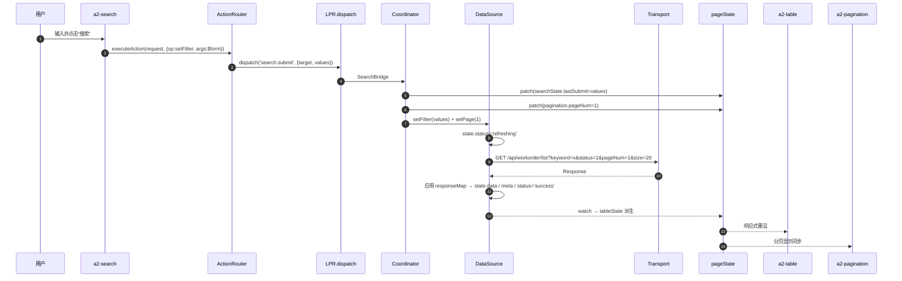
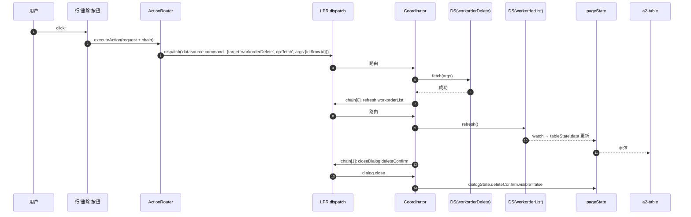
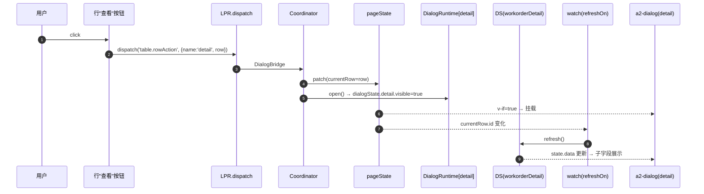
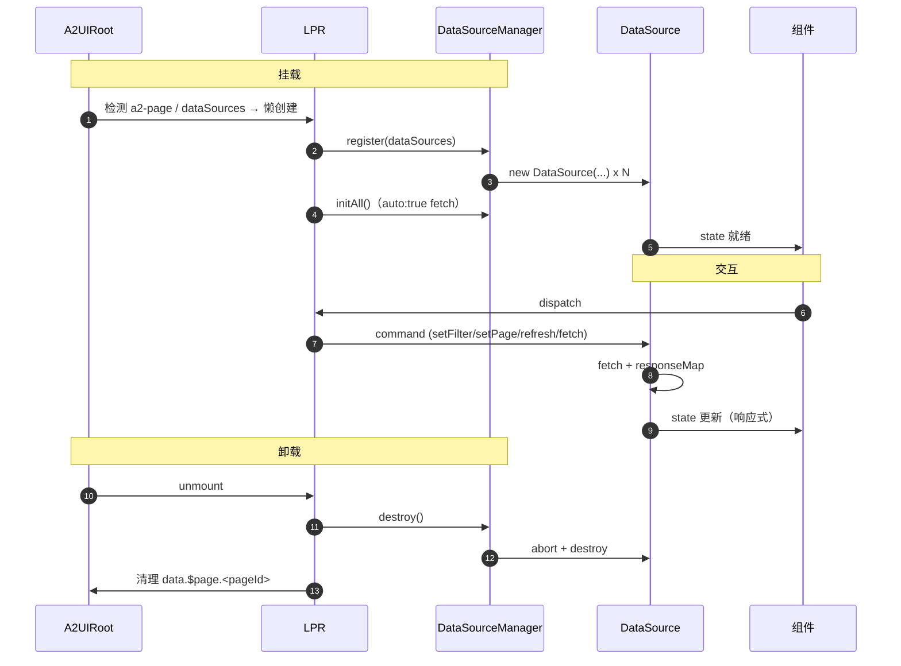

# DataSource API Binding 设计

> 本文档定义 A2UI 在 Light Page Runtime（LPR）语境下的 **DataSource API Binding** 机制：如何在 Schema 中声明数据源、绑定组件、映射参数、映射响应、驱动 Action，让 Search / Table / Pagination / Dialog / Drawer / Delete / Refresh 全部走统一的运行时数据通道。
>
> 前置阅读：
> - [Light Page Runtime 设计](/architecture/runtime-design)
> - [PageState 模型设计](/architecture/page-state)
> - [DataSource 设计](/architecture/datasource)
> - [Action System 执行机制](/architecture/action-system)
> - [A2Table × A2Search 联动设计](/architecture/table-design)
> - [Dialog / Drawer 管理机制](/architecture/dialog-runtime)
>
> 本文档不涉及任何代码实现，也不修改现有 Runtime。

---

## 1. 定位与硬性约束

### 1.1 定位

DataSource API Binding 是 A2UI 从"静态数据"迈向"动态数据"的**唯一通道**：

> **所有组件不直接调用 API；所有请求通过 Schema 声明 → LPR 调度 → DataSource 执行。**

### 1.2 硬性约束

- ❌ 组件不 `fetch(...)`；不 `axios(...)`；不 `XMLHttpRequest`；
- ❌ 组件不感知 URL、method、headers；
- ❌ 组件不管理 loading / error / total 的私有 ref；
- ❌ Dialog / Drawer 不自建数据源；如需数据，走内嵌 DataSource；
- ✅ 所有远程数据通过 **DataSource 声明 + Runtime 调度** 完成；
- ✅ 参数、响应映射均在 Schema 声明；
- ✅ Action 与 DataSource 通过 `target/op/args` 三元组关联。

### 1.3 一句话

> Schema 里写 URL；Coordinator 决定何时打；DataSource 承担一切请求治理；组件只消费响应式 state。

---

## 2. DataSource Binding 总览

Binding 由 4 层组成：

```
┌─────────────────────────────────────────────────────────────┐
│  1. 声明层：dataSources (Schema)                            │
│     一份 URL / method / paramsMap / responseMap             │
└────────────────────────────┬────────────────────────────────┘
                             ▼
┌─────────────────────────────────────────────────────────────┐
│  2. 注册层：DataSourceManager                                │
│     LPR 挂载时按声明创建实例                                  │
└────────────────────────────┬────────────────────────────────┘
                             ▼
┌─────────────────────────────────────────────────────────────┐
│  3. 消费层：组件 bindings.dataSource                         │
│     Table / Pagination / Chart 读 state 显示                 │
└────────────────────────────┬────────────────────────────────┘
                             ▼
┌─────────────────────────────────────────────────────────────┐
│  4. 触发层：Action `request/refresh/delete`                  │
│     Search / 按钮 / 命令式 API 调 DataSource 命令              │
└─────────────────────────────────────────────────────────────┘
```

四层完全**声明式**，宿主端不写胶水。

---

## 3. DataSource Schema 设计（① DataSource Schema）

### 3.1 最小声明

```jsonc
{
  "dataSources": {
    "workorderList": {
      "url":    "/api/workorder/list",
      "method": "GET"
    }
  }
}
```

### 3.2 完整声明

```jsonc
{
  "dataSources": {
    "workorderList": {
      "kind":    "http",
      "request": {
        "url":     "/api/workorder/list",
        "method":  "GET",
        "headers": { "X-Client": "a2ui" },
        "paramsMap": {
          "page":     "pageNum",
          "pageSize": "size",
          "search":   "keyword",
          "sort":     "sortBy",
          "filter":   "$flatten"
        },
        "responseMap": {
          "list":  "data.list",
          "total": "data.total",
          "error": "message"
        }
      },
      "pagination": { "enabled": true, "mode": "page", "pageSize": 20, "initialPage": 1 },
      "cache":      { "enabled": true, "ttl": 60000, "maxSize": 32 },
      "retry":      { "count": 2, "backoff": 2, "delay": 300 },
      "debounce":   300,
      "auto":       true,
      "refreshOn":  ["detail.id"]
    },
    "workorderDetail": {
      "kind":    "http",
      "request": {
        "url": "/api/workorder/detail", "method": "GET",
        "paramsMap": { "id": "id" }
      },
      "auto": false
    },
    "workorderDelete": {
      "kind":    "http",
      "request": {
        "url": "/api/workorder/delete", "method": "DELETE",
        "paramsMap": { "id": "id" }
      },
      "auto": false
    }
  }
}
```

### 3.3 字段职责

| 字段 | 说明 |
| --- | --- |
| `kind` | 数据源种类：`http / static / graphql / mcp / sse / ws` |
| `request` | URL / method / headers / paramsMap / responseMap |
| `pagination` | 分页模式与初始值 |
| `cache` | 缓存策略 |
| `retry` | 重试策略 |
| `debounce` | 参数合并窗口（ms） |
| `auto` | 首屏是否自动拉取 |
| `refreshOn` | 声明式依赖字段路径列表 |

**纯数据、可序列化、可回放。**

### 3.4 一个 page 多个 DataSource

一份 Schema 可声明多个数据源，组成主从/字典/删除等组合：

```jsonc
"dataSources": {
  "workorderList":    { /* 列表 */ },
  "workorderDetail":  { /* 详情，refreshOn: ["$page.p.currentRow.id"] */ },
  "categoryOptions":  { /* 字典，长 TTL cache */ },
  "workorderDelete":  { /* 删除，auto:false */ }
}
```

---

## 4. Search Binding（② Search → DataSource）

### 4.1 Schema 声明

```jsonc
{
  "type": "a2-search",
  "props": {
    "dataSourceId": "workorderList",
    "fields": [
      { "id": "keyword",  "type": "a2-input",  "label": "关键字" },
      { "id": "status",   "type": "a2-select", "label": "状态" },
      { "id": "priority", "type": "a2-select", "label": "优先级" }
    ]
  },
  "actions": [
    { "event": "submit", "type": "request",
      "payload": { "target": "workorderList", "op": "setFilter", "args": "$form" } },
    { "event": "reset",  "type": "page", "payload": { "op": "reset" } }
  ]
}
```

### 4.2 触发链路

```
用户点击"搜索"
        ▼
a2-search emit 'submit' + 当前 values
        ▼
PayloadResolver: 把 $form 替换为 searchState.values
        ▼
ActionRouter → LPR.dispatch('search.submit', {target, values})
        ▼
Coordinator
   ├─ patch(searchState.lastSubmit = values)
   ├─ patch(tableState.pagination.pageNum = 1)
   ├─ DataSource.setFilter(values)
   └─ DataSource.setPage(1)
        ▼
DataSource → fetch → state.data / meta 更新
        ▼
watch → tableState.data / loading / total 派生
        ▼
a2-table / a2-pagination 响应式重渲
```

**Search 只 emit，不 fetch、不感知 URL。**

---

## 5. Table Binding（③ Table → DataSource）

### 5.1 Schema 声明

```jsonc
{
  "type": "a2-table",
  "bindings": { "dataSource": { "type": "datasource", "value": "workorderList" } },
  "props": {
    "rowKey": "id",
    "columns": [
      { "key": "orderNo", "title": "订单号" },
      { "key": "status",  "title": "状态" },
      { "key": "amount",  "title": "金额", "sortable": true }
    ]
  },
  "actions": [
    { "event": "sortChange", "type": "request",
      "payload": { "target": "workorderList", "op": "setSort", "args": "$event" } }
  ]
}
```

Table 通过 `bindings.dataSource` 拿到响应式引用，`state.data / status / meta` 自动映射到 UI。

### 5.2 Table 是否应该直接请求？为什么不？

**不应该。** 6 条理由：

- **联动一致性**：Search / Pagination / Table 若各自请求，三方 params 不同步；
- **请求爆炸**：`watch(props) → fetch` 会与 Search submit 冲撞；
- **状态漂移**：`Table.data` 与全局 store 谁是真源？
- **无法回放 / 调试**：闭包里的 fetch 无法从外部观测；
- **破坏协议驱动**：Schema 描述数据；组件里 fetch 让 URL 隐藏在代码；
- **无法被 AI 生成**：AI 只能生成 Schema，不能改组件源码。

**结论**：Table 是消费者；请求是 Coordinator + DataSource 的职责。

### 5.3 Pagination Binding

与 Table 共享同一 `dataSourceId`：

```jsonc
{
  "type": "a2-pagination",
  "bindings": { "dataSource": { "type": "datasource", "value": "workorderList" } },
  "actions": [
    { "event": "pageChange",     "type": "request",
      "payload": { "target": "workorderList", "op": "setPage",     "args": "$event" } },
    { "event": "pageSizeChange", "type": "request",
      "payload": { "target": "workorderList", "op": "setPageSize", "args": "$event" } }
  ]
}
```

一切一致性由 DataSource 单一真源兜底。

---

## 6. 参数绑定（④ Search Form → 请求参数）

### 6.1 自动拼装

Search 字段 `id` 即参数名：

```
fields: keyword / status / priority
  ↓
filter = { keyword, status, priority }
```

DataSource `paramsMap` 决定 filter 如何进入 URL / body：

- `paramsMap.filter = "$flatten"`：展开到 query（如 `?keyword=x&status=1`）；
- `paramsMap.filter = "condition"`：整个 filter 放到 `condition` 字段；
- 缺省 = `$flatten`。

### 6.2 最终 params

DataSource fetch 时生成：

```
{
  keyword,      // ← searchState.values
  status,
  priority,
  pageNum,       // ← tableState.pagination.pageNum
  pageSize,      // ← tableState.pagination.pageSize
  sortBy?        // ← tableState.sort
}
```

**映射示例**：

- `paramsMap.page = "pageNumber"` → 输出用 `pageNumber` 键；
- `paramsMap.pageSize = "size"` → 输出用 `size` 键；
- `paramsMap.sort = { key: "sortField", order: "sortOrder" }` → 拆两键。

### 6.3 filterKey（字段级映射）

```jsonc
{ "id": "keyword", "filterKey": "q", "type": "a2-input" }
```

生成 `{ q: <value> }`——局部映射，不影响其他数据源。

### 6.4 空值处理

- `""` / `null` / `undefined` / `[]` 视为未填，从 params 剔除；
- 需显式传 `null` 时用 `filterEmpty:"keep"`；
- Pagination / Sort 由 DataSource 内置管理，不受空值规则影响。

### 6.5 GET vs POST

- GET：query string；
- POST / PUT：body JSON；
- DELETE：query（或 body，视 `bodyStyle`）；
- 由 Transport 承担，Schema 无感知。

---

## 7. 响应数据映射（⑤ API 返回 → state）

### 7.1 常见后端结构

```json
{
  "code": 0,
  "message": "ok",
  "data": {
    "list":  [ { "id": 1, "orderNo": "..." }, ... ],
    "total": 100
  }
}
```

### 7.2 responseMap 声明

```jsonc
"responseMap": {
  "list":       "data.list",
  "total":      "data.total",
  "error":      "message",
  "code":       "code",
  "hasMore":    "data.hasMore",
  "cursor":     "data.cursor",
  "nextCursor": "data.nextCursor"
}
```

### 7.3 自动映射

| Target | 来源 |
| --- | --- |
| `state.data` | `responseMap.list`（数组）或 `responseMap.data`（单对象） |
| `state.meta.total` | `responseMap.total` |
| `state.meta.hasMore/cursor/nextCursor` | 同名字段 |
| `state.status` | 成功→`success`；失败→`error` |
| `state.error` | `{ code, message, retriable }` |

### 7.4 派生到 pageState（自动）

LPR 内部 watcher 单向同步：

| DataSource | pageState |
| --- | --- |
| `state.data` | `tableState.data` |
| `state.status` loading/refreshing | `tableState.loading` |
| `state.meta.total` | `tableState.pagination.total` |
| `state.error` | `tableState.error` |

组件在 Schema 层任选一端消费（推荐 `bindings.dataSource`）。

### 7.5 错误约定

- HTTP 2xx 但业务失败（`code !== 0`）→ `state.error = { code, message }`；
- HTTP 非 2xx → `state.error = { code:'HTTP_<status>', retriable }`；
- 网络错误 → `state.error = { code:'NETWORK', retriable:true }`；
- 主动取消 → `ABORTED` 静默；
- 组件只判 `state.error !== null` 展示错误态。

### 7.6 定制转换（可选）

```jsonc
"responseMap": {
  "list": "data.items",
  "transform": { "list": "flattenTree" }
}
```

只接受**声明式命名转换**，不接受任意 JS 表达式。

---

## 8. Dialog Binding（⑥ Dialog / Drawer 获取详情 / 编辑数据）

### 8.1 场景 A：仅消费 currentRow（无请求）

```jsonc
{
  "type": "a2-dialog",
  "props": { "name": "detail" },
  "bindings": { "visible": { "type": "pageState", "value": "dialogState.detail.visible" } },
  "child": [
    { "type": "a2-info-field", "props": { "label": "订单号" },
      "bindings": { "value": { "type": "path", "value": "$page.p.currentRow.orderNo" } } }
  ]
}
```

**最轻**：不发请求。

### 8.2 场景 B：Dialog 拉取详情（内嵌 DataSource）

```jsonc
{
  "type": "a2-dialog",
  "props": { "name": "detail", "destroyOnClose": false },
  "dataSources": {
    "workorderDetail": {
      "kind": "http",
      "request": { "url": "/api/workorder/detail", "method": "GET",
                   "paramsMap": { "id": "id" } },
      "auto": false,
      "refreshOn": ["$page.p.currentRow.id"]
    }
  },
  "bindings": { "visible": { "type": "pageState", "value": "dialogState.detail.visible" } },
  "child": [
    { "type": "a2-info-field", "props": { "label": "客户" },
      "bindings": { "value": { "type": "datasource",
                                "value": "workorderDetail.data.customerName" } } }
  ]
}
```

- `refreshOn` 声明"当 currentRow.id 变化时自动拉"；
- Dialog 关闭 `destroyOnClose=true` 时内嵌 DataSource 一起销毁。

### 8.3 场景 C：Drawer 获取编辑数据

```jsonc
{
  "type": "a2-drawer",
  "props": { "name": "edit", "destroyOnClose": true,
             "footer": [{ "preset": "cancel" }, { "preset": "submit" }] },
  "dataSources": {
    "workorderEdit": {
      "kind": "http",
      "request": { "url": "/api/workorder/detail", "method": "GET",
                   "paramsMap": { "id": "id" } },
      "auto": false,
      "refreshOn": ["$page.p.currentRow.id"]
    }
  },
  "bindings": {
    "visible": { "type": "pageState", "value": "drawerState.edit.visible" },
    "loading": { "type": "pageState", "value": "drawerState.edit.loading" }
  },
  "child": [
    { "type": "a2-text-field", "props": { "label": "备注" },
      "bindings": { "modelValue": { "type": "path", "value": "form.remark" } } }
  ]
}
```

编辑表单使用 `data.form.*`；提交走 Dialog submit 流程。

---

## 9. Action Binding（⑥ 查看 / 编辑 / 删除 / 刷新）

### 9.1 查看 → 打开 Dialog

```jsonc
{ "event": "click", "type": "openDialog",
  "payload": { "name": "detail", "row": "$row" } }
```

### 9.2 编辑 → 打开 Drawer

```jsonc
{ "event": "click", "type": "openDrawer",
  "payload": { "name": "edit", "row": "$row" } }
```

### 9.3 删除 → 请求 API

```jsonc
{
  "event": "click",
  "type":  "request",
  "payload": {
    "target": "workorderDelete",
    "op":     "fetch",
    "args":   { "id": "$row.id" }
  }
}
```

### 9.4 刷新 → 重发当前条件

```jsonc
{ "event": "click", "type": "refresh",
  "payload": { "target": "workorderList" } }
```

### 9.5 链式 Action

对"删除后刷新 + 关闭确认框"这类组合：

```jsonc
{
  "event": "click",
  "type":  "request",
  "payload": {
    "target": "workorderDelete",
    "op":     "fetch",
    "args":   { "id": "$row.id" }
  },
  "chain": [
    { "type": "refresh",     "payload": { "target": "workorderList" } },
    { "type": "closeDialog", "payload": { "name":   "deleteConfirm" } }
  ]
}
```

`chain` 只允许**声明式动作数组**，不允许脚本或条件分支。

### 9.6 Action 元数据

| 字段 | 含义 |
| --- | --- |
| `type` | `openDialog / closeDialog / openDrawer / closeDrawer / request / refresh / page / custom / emit / api / navigate` |
| `payload.target` | DataSource id |
| `payload.op` | `fetch/refresh/setPage/setPageSize/setFilter/setSort/setSearch/setExtra/invalidateCache` |
| `payload.args` | 命令参数（可含 `$row / $form / $state / $event` 占位符） |
| `payload.name` | 对话框 / 抽屉 name |
| `payload.row` | Row Action 携带 |
| `payload.context` | 打开时的额外上下文 |
| `chain` | 顺序执行的后续 Action 列表 |

**不接受**条件、循环、并行、异步 saga。

---

## 10. Runtime 调度流程（⑦ 完整流程）

### 10.1 主流程 Mermaid

```mermaid
flowchart TD
    U["用户交互（Search 提交）"]
    Cmp["a2-search"]
    Res["PayloadResolver<br/>$row / $form / $state / $event"]
    Rt["ActionRouter"]
    LPR["LPR.dispatch"]
    Coord["Coordinator"]
    PS["pageState"]
    DS["DataSource(workorderList)"]
    Cache["Cache Check"]
    Retry["Retry (backoff)"]
    Trans["Transport (fetch / axios / MCP / SSE)"]
    Resp["Response"]
    Map["responseMap 解析"]
    State["DataSource.state 更新"]
    Watch["watch(DataSource.state)"]
    Table["a2-table"]
    Pager["a2-pagination"]

    U --> Cmp
    Cmp -->|emit 'submit'| Res
    Res --> Rt
    Rt -->|executeAction request| LPR
    LPR --> Coord
    Coord -->|patch| PS
    Coord -->|setFilter+setPage(1)| DS
    DS --> Cache
    Cache -->|miss| Retry
    Retry --> Trans
    Trans --> Resp
    Resp --> Map
    Map --> State
    Cache -->|hit| State
    State --> Watch
    Watch --> PS
    PS --> Table
    PS --> Pager
```

### 10.2 典型交互序列（Search → Table）



### 10.3 删除 → 刷新链式序列



### 10.4 详情 Dialog refreshOn 触发



---

## 11. 完整 Schema 示例（含 7 项能力）

```jsonc
{
  "id":   "workorderPage",
  "type": "a2-page",

  "dataSources": {
    "workorderList": {
      "kind":    "http",
      "request": {
        "url":    "/api/workorder/list",
        "method": "GET",
        "paramsMap": {
          "page":     "pageNum",
          "pageSize": "size",
          "filter":   "$flatten",
          "sort":     "sortBy"
        },
        "responseMap": { "list": "data.list", "total": "data.total", "error": "message" }
      },
      "pagination": { "enabled": true, "pageSize": 20 },
      "cache":      { "enabled": true, "ttl": 60000 },
      "debounce":   300,
      "auto":       true
    },
    "workorderDetail": {
      "kind":    "http",
      "request": {
        "url": "/api/workorder/detail", "method": "GET",
        "paramsMap":   { "id": "id" },
        "responseMap": { "data": "data" }
      },
      "auto":      false,
      "refreshOn": ["$page.workorderPage.currentRow.id"]
    },
    "workorderDelete": {
      "kind":    "http",
      "request": {
        "url": "/api/workorder/delete", "method": "DELETE",
        "paramsMap": { "id": "id" }
      },
      "auto": false
    }
  },

  "child": [
    { "type": "a2-search",
      "props": {
        "dataSourceId": "workorderList",
        "fields": [
          { "id": "keyword",  "type": "a2-input",  "label": "关键字" },
          { "id": "status",   "type": "a2-select", "label": "状态" },
          { "id": "priority", "type": "a2-select", "label": "优先级" }
        ]
      },
      "actions": [
        { "event": "submit", "type": "request",
          "payload": { "target": "workorderList", "op": "setFilter", "args": "$form" } },
        { "event": "reset",  "type": "page", "payload": { "op": "reset" } }
      ]
    },

    { "type": "a2-toolbar",
      "child": [
        { "type": "a2-button", "props": { "text": "刷新" },
          "actions": [{ "event": "click", "type": "refresh",
                        "payload": { "target": "workorderList" } }] }
      ]
    },

    { "type": "a2-table",
      "bindings": { "dataSource": { "type": "datasource", "value": "workorderList" } },
      "props": {
        "rowKey": "id",
        "columns": [
          { "key": "orderNo",  "title": "订单号" },
          { "key": "status",   "title": "状态" },
          { "key": "priority", "title": "优先级" },
          { "key": "_actions", "type": "actions", "buttons": [
              { "text": "查看", "actions": [
                  { "event": "click", "type": "openDialog",
                    "payload": { "name": "detail", "row": "$row" } }
                ] },
              { "text": "编辑", "actions": [
                  { "event": "click", "type": "openDrawer",
                    "payload": { "name": "edit", "row": "$row" } }
                ] },
              { "text": "删除", "actions": [
                  { "event": "click", "type": "openDialog",
                    "payload": { "name": "deleteConfirm", "row": "$row" } }
                ] }
            ] }
        ]
      },
      "actions": [
        { "event": "sortChange", "type": "request",
          "payload": { "target": "workorderList", "op": "setSort", "args": "$event" } }
      ]
    },

    { "type": "a2-pagination",
      "bindings": { "dataSource": { "type": "datasource", "value": "workorderList" } },
      "actions": [
        { "event": "pageChange",     "type": "request",
          "payload": { "target": "workorderList", "op": "setPage",     "args": "$event" } },
        { "event": "pageSizeChange", "type": "request",
          "payload": { "target": "workorderList", "op": "setPageSize", "args": "$event" } }
      ]
    },

    { "type": "a2-dialog",
      "props": { "name": "detail", "title": "订单详情", "destroyOnClose": false,
                 "footer": [{ "preset": "close" }] },
      "bindings": { "visible": { "type": "pageState", "value": "dialogState.detail.visible" } },
      "child": [
        { "type": "a2-info-field", "props": { "label": "客户" },
          "bindings": { "value": { "type": "datasource",
                                    "value": "workorderDetail.data.customerName" } } }
      ]
    },

    { "type": "a2-drawer",
      "props": { "name": "edit", "title": "编辑订单", "destroyOnClose": true,
                 "footer": [{ "preset": "cancel" }, { "preset": "submit" }] },
      "bindings": {
        "visible": { "type": "pageState", "value": "drawerState.edit.visible" },
        "loading": { "type": "pageState", "value": "drawerState.edit.loading" }
      },
      "child": [
        { "type": "a2-text-field", "props": { "label": "备注" },
          "bindings": { "modelValue": { "type": "path", "value": "form.remark" } } }
      ]
    },

    { "type": "a2-dialog",
      "props": { "name": "deleteConfirm", "title": "确认删除？", "destroyOnClose": true,
                 "footer": [
                   { "preset": "cancel" },
                   { "preset": "submit", "props": { "text": "删除", "type": "danger" },
                     "actions": [
                       {
                         "event":   "click",
                         "type":    "request",
                         "payload": {
                           "target": "workorderDelete",
                           "op":     "fetch",
                           "args":   { "id": "$state.currentRow.id" }
                         },
                         "chain": [
                           { "type": "refresh",     "payload": { "target": "workorderList" } },
                           { "type": "closeDialog", "payload": { "name":   "deleteConfirm" } }
                         ]
                       }
                     ] }
                 ] },
      "bindings": { "visible": { "type": "pageState", "value": "dialogState.deleteConfirm.visible" } },
      "child": [
        { "type": "a2-text",
          "bindings": { "text": { "type": "path", "value": "$page.workorderPage.currentRow.orderNo" } } }
      ]
    }
  ]
}
```

宿主端**零代码**（仅编辑保存业务 API 需要两行胶水：`await api.save(form); pageRuntime.refresh('workorderList'); pageRuntime.closeDrawer('edit')`）。

---

## 12. API 生命周期

### 12.1 挂载

1. A2UIRoot mount → MessageProcessor 交付 tree；
2. 检测 `a2-page / dataSources` → 懒创建 LPR；
3. `DataSourceManager.register(dataSources)`；
4. 对 `auto:true` 的实例调 `init()` → 首屏 fetch；
5. `RenderContext.pageRuntime` 挂上 → Renderer 渲染 → 组件从 `bindings.dataSource` 拿响应式引用。

### 12.2 交互

- **Search submit** → `setFilter + setPage(1)` → fetch；
- **Pagination change** → `setPage / setPageSize`；
- **Sort change** → `setSort`；
- **Row Action** → `patch(currentRow)` + `DialogRuntime.open` + 内嵌 DataSource（`refreshOn`）自动 refresh；
- **Delete / API 操作** → `DataSource.fetch(args)` → chain 中的 refresh；
- **Refresh 按钮** → `DataSource.refresh()`；
- **refreshOn 依赖** → 自动 refresh。

### 12.3 卸载

- Dialog / Drawer 关闭 + `destroyOnClose=true`：内嵌 DataSource abort inflight + clear cache + destroy；
- `a2-page` unmount → `DataSourceManager.destroy()`；
- A2UIRoot unmount → LPR 一并销毁；`data.$page.<pageId>` 清空。

### 12.4 生命周期时序



---

## 13. 扩展能力（⑨ GraphQL / MCP / Streaming）

`kind` 字段是扩展点。协议 additive，新增 Transport 分支即可支持新类型。

### 13.1 GraphQL

```jsonc
"userList": {
  "kind": "graphql",
  "request": {
    "url":   "/graphql",
    "query": "query($page:Int,$size:Int,$keyword:String){ users(page:$page,size:$size,keyword:$keyword){ list{ id name } total }}",
    "variablesMap": { "page": "page", "pageSize": "size", "search": "keyword" },
    "responseMap":  { "list": "data.users.list", "total": "data.users.total" }
  }
}
```

- Transport 层 `graphql` 分支：POST `query + variables`；
- paramsMap / responseMap 规则一致；
- 复用 cache / retry / debounce。

### 13.2 MCP Tool（模型上下文协议）

```jsonc
"askAgent": {
  "kind": "mcp",
  "request": {
    "server":  "trae-agent",
    "tool":    "list_workorders",
    "argsMap": { "filter": "$flatten", "page": "page" },
    "responseMap": { "list": "content", "total": "total" }
  }
}
```

- Transport 层 `mcp` 分支：走 MCP client；
- 参数封装到 tool.args；
- 响应仍映射到 `state.data / meta`。

### 13.3 Streaming（SSE / WebSocket）

```jsonc
"logStream": {
  "kind": "sse",
  "request": {
    "url": "/api/logs/stream",
    "responseMap": { "append": "line" }
  },
  "auto": true,
  "streaming": { "appendMode": "list", "limit": 1000 }
}
```

- Transport 层 `sse` / `ws` 分支：长连接；
- `responseMap.append` 指定单帧路径；
- state 采用 append 模式（数组 push + 上限截断）；
- 关闭 / 断线由 DataSource 内建。

### 13.4 静态数据 / Mock

```jsonc
"cityOptions": {
  "kind": "static",
  "data": [ { "id": 1, "name": "北京" }, { "id": 2, "name": "上海" } ]
}
```

- 无 Transport；`state.data` 即 `data`；
- 适合字典、Playground、Mock。

### 13.5 扩展原则

- **协议 additive**：新 `kind` 不影响现有字段；
- **contract 不变**：仍是 `state.status / data / meta / error`；
- **组件零感知**：Table / Chart 不知道背后是 HTTP、GraphQL、SSE 或 MCP；
- **Transport 可插拔**：宿主可注入自定义 Transport 覆盖默认；
- **可组合**：多种 kind 的 DataSource 可在同一 page 共存。

---

## 14. 反模式清单

| ❌ 反模式 | ✅ 正确做法 |
| --- | --- |
| Table 内 `mounted() { await fetch(url) }` | 声明 dataSources + bindings.dataSource |
| Search submit 后 emit 让宿主 fetch | 用 `type:request / op:setFilter` |
| Dialog 里 `watch(id) → fetch` | Dialog 内嵌 DataSource + `refreshOn` |
| Pagination 自持 total | 只读 `state.meta.total` |
| API 返回结构与组件耦合（每个组件写映射） | 用 `responseMap` 声明 |
| 删除后手写 `tableRef.reload()` | `chain: [{type:refresh}]` |
| 组件内 `axios.interceptors.push(...)` 加权限头 | 声明 `request.headers` 或 Transport 层统一 |
| 每个数据源自建 loading ref | 消费 `state.status` |
| 请求逻辑埋在 `.vue` 文件 | 请求逻辑存在于 Schema |

---

## 15. 设计原则回顾

- **协议驱动**：所有 API 交互靠 Schema 描述；
- **唯一网关**：DataSource 是所有请求的唯一执行者；
- **单一调度**：LPR Coordinator 是唯一司机；
- **声明式参数映射**：paramsMap；
- **声明式响应映射**：responseMap；
- **声明式依赖**：refreshOn；
- **声明式链式**：chain（枚举而非脚本）；
- **五态明确**：idle / loading / refreshing / success / error；
- **协议 additive**：新增 `kind / op / dispatch / 字段` 都是可选新分支；
- **未来兼容**：GraphQL / MCP / SSE / WebSocket / Static 通过 kind 统一表达；
- **组件禁令**：组件永远不 fetch，只消费 state。

---

## 16. 落地锚点（不修改现有 Runtime）

以下为已有代码，供未来实现时参考，本文档不要求任何代码改动：

- 现有 DataSource：[DataSource.ts](file:///d:/work/program/tineco/UI/a2ui-vue-engine/packages/a2ui-vue-engine/src/data-source/DataSource.ts)
- 现有 Manager：[DataSourceManager.ts](file:///d:/work/program/tineco/UI/a2ui-vue-engine/packages/a2ui-vue-engine/src/data-source/DataSourceManager.ts)
- Transport：[transport.ts](file:///d:/work/program/tineco/UI/a2ui-vue-engine/packages/a2ui-vue-engine/src/data-source/transport.ts)
- Cache：[cache.ts](file:///d:/work/program/tineco/UI/a2ui-vue-engine/packages/a2ui-vue-engine/src/data-source/cache.ts)
- 类型：[types.ts](file:///d:/work/program/tineco/UI/a2ui-vue-engine/packages/a2ui-vue-engine/src/data-source/types.ts)
- 现有 A2Table：[A2Table.vue](file:///d:/work/program/tineco/UI/a2ui-vue-engine/packages/a2ui-vue-engine/src/components/A2Table.vue)
- 现有 A2Search：[A2Search.vue](file:///d:/work/program/tineco/UI/a2ui-vue-engine/packages/a2ui-vue-engine/src/components/A2Search.vue)
- 现有 A2Dialog：[A2Dialog.vue](file:///d:/work/program/tineco/UI/a2ui-vue-engine/packages/a2ui-vue-engine/src/components/A2Dialog.vue)

未来 LPR 落地时，只需 additive 扩展 `resolveBinding / executeAction / DataSourceManager` 三处；本文描述的即"落地后的对外契约"。

---

_本文档仅为设计文档；不包含任何代码；不修改现有 Runtime 主干；一切扩展均遵循 additive 原则。_
