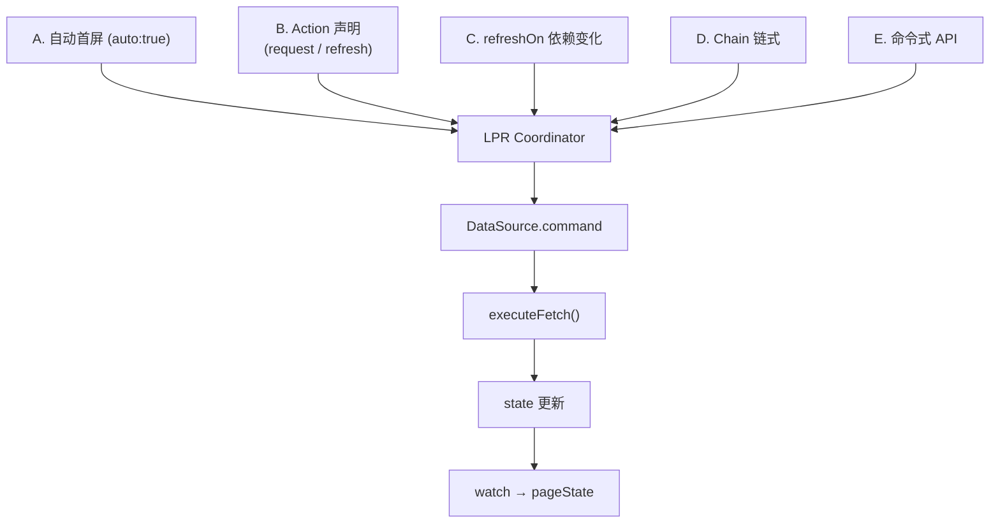
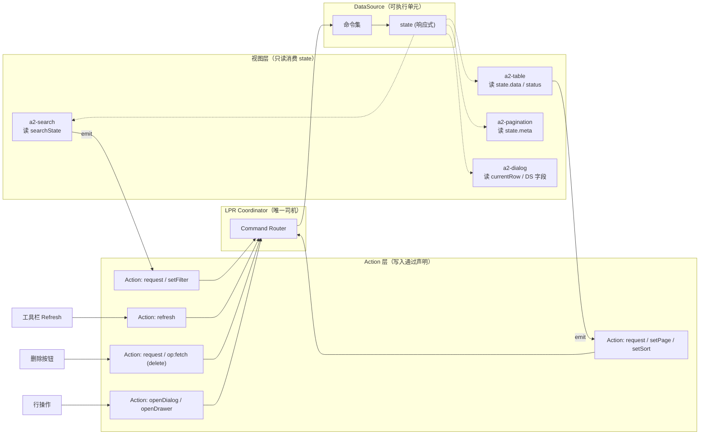
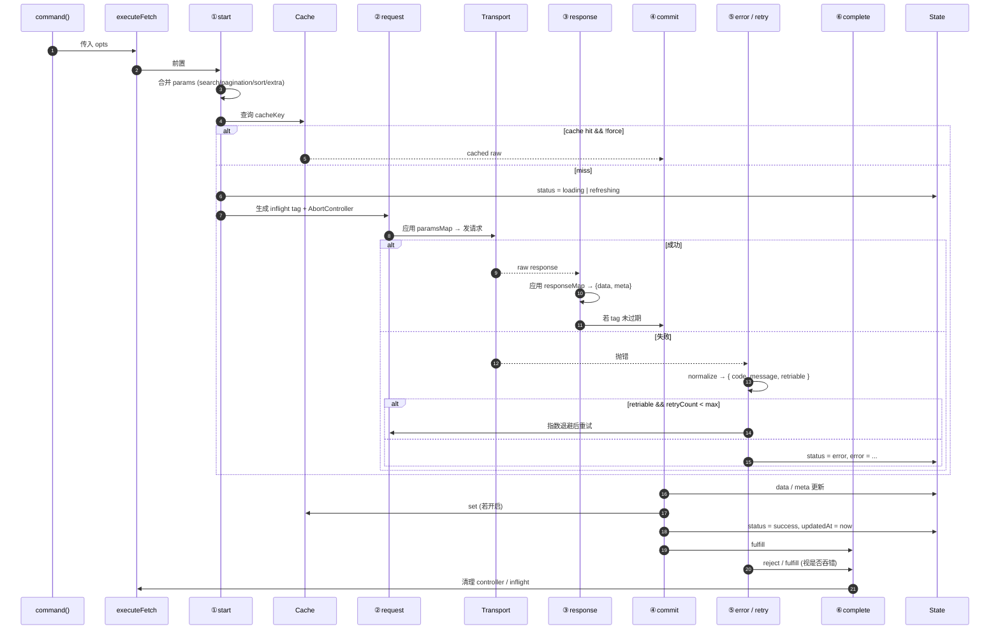
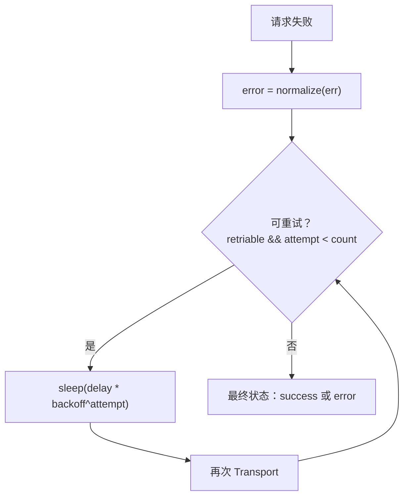
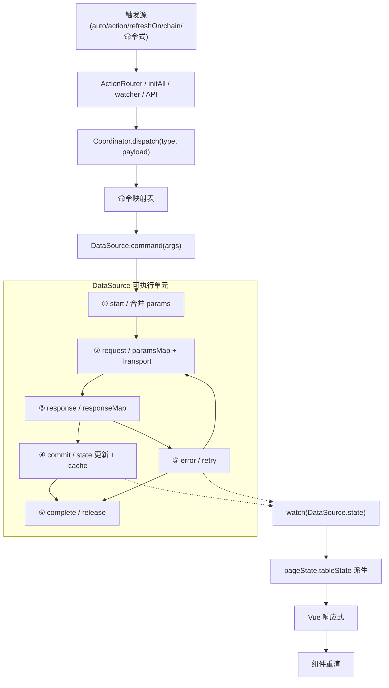
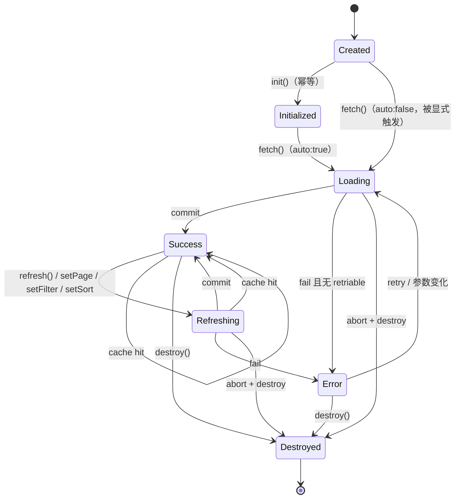
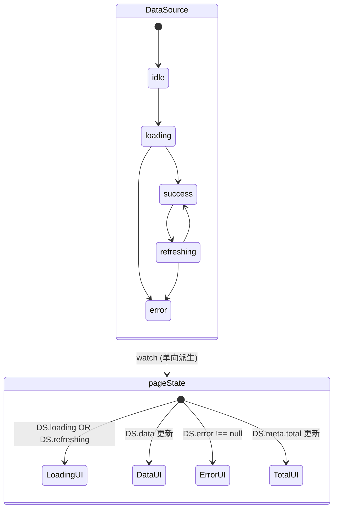
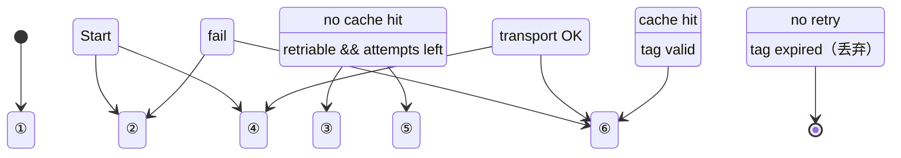
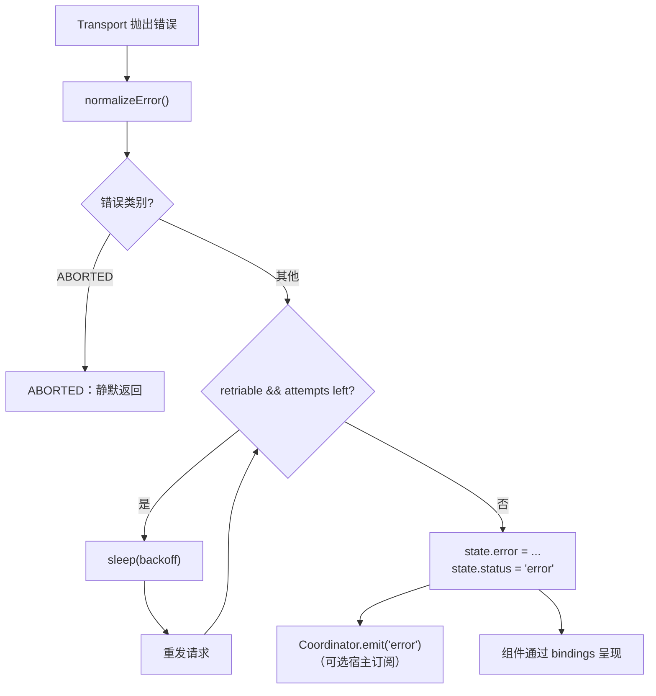

# DataSource 执行规范（Runtime Execution Spec）

> 本文档是 [DataSource API Binding 设计](/architecture/datasource-binding) 的**实现规范**——把"如何声明"落成"运行时如何执行"。
>
> 核心命题：
>
> > **DataSource 不是配置，而是 Runtime 可执行单元。**
>
> 每一个 DataSource 声明都会在 LPR 挂载时物化为一个具备**状态、命令、生命周期、错误处理**的活对象；Coordinator / Action / Search / Table / Dialog 都以调用命令的方式驱动它。
>
> 本文档面向 A2UI Runtime 核心开发者，用于评审、对齐、单测断言的依据。**不写代码**，只写执行规范。
>
> 前置阅读：
> - [DataSource API Binding 设计](/architecture/datasource-binding)
> - [Light Page Runtime 设计](/architecture/runtime-design)
> - [PageState 模型设计](/architecture/page-state)
> - [Action System 执行机制](/architecture/action-system)

---

## 1. DataSource 是 Runtime 可执行单元

### 1.1 定义

一个 DataSource 实例满足以下 5 条契约：

1. **拥有响应式 state**：`status / data / meta / error / params / updatedAt`；
2. **暴露命令集**：`init / fetch / refresh / setPage / setPageSize / setSort / setFilter / setSearch / setExtra / setCursor / invalidateCache / abort / destroy`；
3. **有明确生命周期**：`created → initialized → active → destroyed`；
4. **可被 Coordinator 调度**：外部**不可**直接读写 state，只能调命令；
5. **响应式外泄**：state 变化通过 Vue 响应式与 `watch(DataSource.state)` 向 pageState 派生。

### 1.2 与"配置"的差异

| 维度 | 配置（Schema JSON） | 可执行单元（Runtime） |
| --- | --- | --- |
| 存在形式 | 纯 JSON | 带 state + 命令 + 生命周期的对象 |
| 可变性 | 不可变 | 内部可变（受控） |
| 触发方式 | 不能触发 | 由 Coordinator 调命令触发 |
| 观测方式 | 静态 | `state.status/error/params` 可 watch |
| 生命周期 | 无 | 与所在 scope 同步（page / dialog / drawer） |
| 幂等语义 | 无 | `init()` 幂等，`refresh()` 可取消上一次 |

**关键结论**：DataSource 的"可执行"体现在——它是响应式状态机 + 命令队列 + 请求管道的组合体，而非一份传给 fetch 的参数包。

---

## 2. DataSource 执行入口（谁触发）

DataSource 的所有触发通道**收敛到唯一入口**：`Coordinator → DataSource.command(...)`。以下是**允许**的触发来源。

### 2.1 触发通道全集

| 通道 | 来源 | 途径 | 举例 |
| --- | --- | --- | --- |
| **A. 自动首屏** | LPR 挂载 | `DataSourceManager.initAll()` | `auto: true` 的 DataSource 首屏拉取 |
| **B. Action 声明** | 用户交互 → Schema Actions | ActionRouter → dispatch → Coordinator | Search submit / Pagination change / Refresh 按钮 |
| **C. 依赖变化** | pageState 字段变化 | 内部 `watch(refreshOn)` → Coordinator | Dialog 打开时 `currentRow.id` 变化 |
| **D. Chain 链式** | 上一个 Action 完成 | Coordinator 执行 `chain[]` | 删除成功后 `chain:[refresh]` |
| **E. 命令式 API** | 宿主代码 | `pageRuntime.refresh(id)` → Coordinator | 编辑保存后宿主主动 refresh |

**禁止**的触发方式：

- ❌ 组件内 `import` DataSource 并调 `.fetch()`；
- ❌ 组件通过 `bindings.dataSource` 拿到实例后调命令；
- ❌ 宿主直接改 `DataSource.state.*`；
- ❌ Transport 层被外部裸调（必须经 DataSource.fetch 包裹）。

### 2.2 五种触发通道汇聚图



**所有通道的最终收敛点相同**——这是"单一调度"的物理保证。

---

## 3. PageRuntime 如何调用 DataSource

### 3.1 Coordinator 命令映射表

LPR Coordinator 内部持有一张**固定映射表**（枚举而非 DSL）：

| dispatch 类型 | 调用的 DataSource 命令 | 附加动作 |
| --- | --- | --- |
| `search.submit` | `setFilter(payload.values)` + `setPage(1)` | `patch(searchState.lastSubmit = values)` |
| `search.reset` | `setFilter({})` + `setPage(1)` | `SearchRuntime.reset()` |
| `table.pageChange` | `setPage(payload.pageNum)` | `patch(pagination.pageNum = pageNum)` |
| `table.pageSizeChange` | `setPageSize(payload.pageSize)` | `patch(pagination.pageSize = ...)` |
| `table.sortChange` | `setSort(payload.sort)` | `patch(tableState.sort = ...)` |
| `datasource.command` | `<target>.<op>(args)` | 视 op 而定 |
| `page.refresh` | `refresh()`（可指定 target） | `refreshTrigger++` |
| `page.reset` | `setFilter({}) + setPage(1)` | 相当于 search.reset + refresh |

### 3.2 dispatch → 命令调用规范

```
Coordinator.dispatch(type, payload) {
  1. 验证 payload.target（若涉及 DataSource）是否已注册；
     若未注册 → 抛出 CONFIG_MISSING 错误，state.status 保持不变；
  2. 按上表调用 DataSource 命令；
  3. 若声明了 chain，等待 command 的 Promise resolve 后依次执行；
  4. 若 command reject（含 ABORTED 之外的错误），chain 中断并记录 audit。
}
```

**关键不变量**：

- Coordinator 只调"1 到 3 个命令"，不写 fetch；
- 命令映射表可枚举，可单测；
- 未知 dispatch 类型必须 warn，不静默。

### 3.3 命令幂等 / 合并语义

| 命令 | 幂等？ | 合并策略 |
| --- | --- | --- |
| `init()` | ✅ 是 | 已 inited 则 no-op |
| `refresh()` | ❌ 不幂等 | 同参 in-flight 时复用 Promise（dedupe） |
| `fetch(args)` | ❌ 不幂等 | 走 debounce（若声明）；否则立即执行 |
| `setFilter / setSearch / setSort` | ❌ | 走 debounce 合并连续调用 |
| `setPage / setPageSize / setCursor / setExtra` | ❌ | 立即执行，不 debounce |
| `abort()` | ✅ | 无 in-flight 则 no-op |
| `invalidateCache()` | ✅ | 无副作用 |
| `destroy()` | ✅ | 二次调用 no-op |

---

## 4. Search / Table / Dialog / Action 统一调用规范

**同一份 DataSource 实例**被以下四方**只读消费 + 命令写入**共享。

### 4.1 统一调用图



### 4.2 四方分工

| 参与方 | 允许的操作 | 禁止的操作 |
| --- | --- | --- |
| **a2-search** | 通过 Action 触发 `search.submit / search.reset`；读 `searchState.values` | 不 fetch、不改 `tableState.data` |
| **a2-table** | 通过 Action 触发 `sortChange / rowAction`；读 `DataSource.state.data / status / error` | 不 fetch、不算 total、不 setState |
| **a2-pagination** | 通过 Action 触发 `pageChange / pageSizeChange`；读 `state.meta` | 不 fetch、不持 total |
| **a2-dialog / a2-drawer** | 通过 `visible / loading / currentRow / 内嵌 DataSource` 展示 | 不自建 DataSource（除内嵌声明）；不 fetch |
| **Action 声明** | 描述"什么事件触发什么命令" | 不包含 JS 逻辑；不发请求 |

### 4.3 同一 DataSource 的多消费方一致性

- **共享 params**：Search 改 `filter`、Pagination 改 `page`、Table 改 `sort`——都是同一个 `state.params`；
- **共享 state**：三方读同一份 `state.data / meta / status`；
- **共享请求**：任意维度变化都触发**同一个** DataSource 重发（含 debounce + inflight dedupe + AbortController）。

这三条保证："**看到的 = 状态里的 = DataSource 里的**"——物理消除不一致。

---

## 5. 请求生命周期（start → request → success → fail）

DataSource 的**每一次**请求都走同一个 6 阶段流水线。任何触发通道进入都必须**按顺序**完成这 6 步。

### 5.1 6 阶段定义

| 阶段 | 步骤 | 关键副作用 | 状态跳转 |
| --- | --- | --- | --- |
| **① start** | 前置检查、参数合并、cache 查询、决定要不要发请求 | 无 | idle/success/error → loading/refreshing |
| **② request** | 应用 paramsMap、发起 Transport 请求、注册 AbortController | 生成 inflight tag | loading/refreshing 保持 |
| **③ response** | 解析原始响应、应用 responseMap、组装 data/meta | 无外部副作用 | 保持 loading/refreshing |
| **④ commit** | 若非过期响应 → 写入 state；写 cache；updatedAt | state.data / meta 更新 | → success |
| **⑤ error**（可选） | 归一化错误、判断可重试、执行 retry 或写 error | 无外部副作用 | → error（或回 request） |
| **⑥ complete** | 释放 inflight；触发 audit；返回 Promise resolve | 清理 controller | 保持 success/error |

### 5.2 生命周期 Mermaid



### 5.3 状态跳转规则（**必须遵守**）

- 无旧数据时：`idle → loading → success | error`；
- 有旧数据时：`success → refreshing → success | error`；
- 主动 abort 属于 `ABORTED`，静默：**不改 status**、**不写 error**；
- 过期响应（`tag != inflightTag`）：**丢弃**结果，**不写 state**；
- Cache 命中：直接 `→ success`（不经 loading）；
- 失败后重试期间：保持 `loading/refreshing`，直到最终成功或耗尽 retry；
- `destroy()` 之后：**拒绝**任何新的 command，`status = destroyed`。

### 5.4 并发与竞争

- 同一 DataSource 同时只有 **一次** in-flight 请求；
- 新命令到来时：`abort()` 旧请求 + 生成新 tag；
- 旧请求的 response 若晚到，`tag` 校验丢弃；
- Cache write 只在 `tag` 命中当前时执行，避免污染缓存。

---

## 6. 参数合并规则（search + pagination + action params）

DataSource 内部维护 `state.params`，其构成有严格的**优先级 + 合并顺序**。

### 6.1 params 层次

`state.params` 是四层叠加的结果：

```
1. request.params      （Schema 声明的 constant 参数，最低优先级）
2. searchState 过滤    （Search submit 写入的 filter）
3. tableState 元信息   （page / pageSize / sort）
4. Action args         （单次调用附带的 extra，最高优先级）
```

合并顺序（**后写覆盖先写**）：

```
final = { ...constants, ...filter, ...pagination, ...sort, ...extra }
```

### 6.2 参数来源映射

| 参数 | 来源 | 命令 | 说明 |
| --- | --- | --- | --- |
| `filter` | `searchState.values` | `setFilter(values)` | Search submit 写入 |
| `page` | `tableState.pagination.pageNum` | `setPage(n)` | Pagination change / Search 回到首页 |
| `pageSize` | `tableState.pagination.pageSize` | `setPageSize(n)` | Pagination change |
| `sort` | `tableState.sort` | `setSort(s)` | Table sortChange |
| `search` | 独立的 `state.params.search` | `setSearch(str)` | 未使用完整 form 的场景 |
| `cursor` | `state.params.cursor` | `setCursor(c)` | cursor 分页模式 |
| `extra` | Action.payload.args | `setExtra(obj)` | 单次调用附带（如 delete 的 id） |

### 6.3 合并示例

假设：

- Schema `dataSources.workorderList.request.params = { tenant: "acme" }`；
- `searchState.values = { keyword: "abc", status: 1 }`；
- `tableState.pagination = { pageNum: 2, pageSize: 20 }`；
- `tableState.sort = { key: "amount", order: "desc" }`；
- Action 附带 `args = { role: "admin" }`。

合并后 `state.params`：

```
{
  tenant: "acme",
  keyword: "abc",
  status: 1,
  page: 2,
  pageSize: 20,
  sort: { key: "amount", order: "desc" },
  extra: { role: "admin" }
}
```

### 6.4 paramsMap 应用

`state.params` 是**内部标准形**；发请求前通过 `request.paramsMap` 转换成后端要的键：

```
paramsMap:
  page       → pageNum
  pageSize   → size
  filter     → $flatten
  sort       → sortBy

发送：
  ?pageNum=2&size=20&keyword=abc&status=1&sortBy=amount:desc&tenant=acme&role=admin
```

### 6.5 参数合并的时机

- `setFilter / setSearch` 触发时：先 merge，再走 debounce，再 fetch；
- `setPage / setPageSize / setSort / setCursor / setExtra` 触发时：先 merge，立即 fetch；
- 无参数变化的 `refresh()`：跳过 merge，直接用 `snapshotParams(state.params)`。

### 6.6 空值处理

- `""` / `null` / `undefined` / `[]` 从 params 中剔除；
- 需要显式保留 null 时，Schema 声明 `filterEmpty: "keep"`；
- Pagination / Sort / Cursor / Extra 不受空值规则影响。

---

## 7. Response Mapping 规则

原始响应通过 `responseMap` 声明变成 `state.data / meta / error`。**这是一次纯函数式转换**。

### 7.1 responseMap 字段

| responseMap key | 目标字段 | 语义 |
| --- | --- | --- |
| `list` | `state.data`（数组） | 列表数据的路径 |
| `data` | `state.data`（单对象） | 详情数据的路径 |
| `total` | `state.meta.total` | 总条数 |
| `hasMore` | `state.meta.hasMore` | 游标模式：是否还有更多 |
| `cursor` | `state.meta.cursor` | 当前游标 |
| `nextCursor` | `state.meta.nextCursor` | 下一游标 |
| `error` | 错误消息路径（用于 `error.message`） | 业务失败的原因 |
| `code` | `state.error.code` 判定依据 | 业务状态码 |
| `transform` | 命名转换字典 | 声明式转换（如 `flattenTree`） |

### 7.2 映射流程

```
raw response
   │
   ▼
1. 应用 responseMap.list / data / total / cursor / ...
   │
   ▼
2. transform（若声明）
   │
   ▼
3. 组装 { data, meta, error }
   │
   ▼
4. 写入 state（在 ④ commit 阶段）
```

### 7.3 List / Single 判定

- `responseMap.list` 存在 → `state.data` = 数组；
- 只声明 `responseMap.data` → `state.data` = 单对象；
- 都未声明 → 自动嗅探（`raw.list / raw.data / raw.items / raw`）；
- 优先级：显式 map > 嗅探。

### 7.4 hasMore / cursor 语义

- **page 模式**：`hasMore = page * pageSize < total`；
- **cursor 模式**：`hasMore` 来自 responseMap 或 `!!nextCursor`；
- 未匹配到时降级为 `false`；
- Pagination 组件按 `meta.mode` 自适应展示（组件层决定）。

### 7.5 错误响应映射

- HTTP 2xx + `code !== 0` → **业务失败**，写 `error = { code, message: pickPath(raw, responseMap.error), retriable: false }`；
- HTTP 非 2xx → **传输失败**，写 `error = { code: "HTTP_<status>", ..., retriable: true }`；
- 网络中断 → `error = { code: "NETWORK", retriable: true }`；
- 超时 → `error = { code: "TIMEOUT", retriable: true }`；
- 主动中断 → `error = { code: "ABORTED" }`；**不写 status = error**。

### 7.6 数据一致性

- responseMap 是**幂等**的：同样 raw + 同样 responseMap → 同样 `{ data, meta, error }`；
- 不允许 responseMap 执行任意 JS 表达式；
- `transform` 只允许**声明式命名转换**（如内建的 `flattenTree / groupBy`），由 Runtime 白名单化。

---

## 8. loading / error 状态如何进入 PageState

DataSource 的状态**单向派生**到 pageState；组件通过 pageState 感知。

### 8.1 派生映射表

| DataSource | pageState 字段 | 类型 |
| --- | --- | --- |
| `state.status === 'loading' \|\| 'refreshing'` | `tableState.loading` | boolean |
| `state.data` | `tableState.data` | Array / Object |
| `state.meta.total` | `tableState.pagination.total` | number |
| `state.meta.page` | `tableState.pagination.pageNum`（若 DS 主动改动） | number |
| `state.meta.pageSize` | `tableState.pagination.pageSize`（若 DS 主动改动） | number |
| `state.error` | `tableState.error` | object / null |

### 8.2 派生规则

- **单向**：`DataSource.state → pageState`；反向必须走 Coordinator 命令；
- **只读投影**：pageState 中的这些字段**禁止**外部写；
- **响应式**：由 `watch(DataSource.state)` 实现，Vue 3 深度追踪；
- **同 tick 内合并**：多字段变化在一次 watcher 中批量 patch，避免中间态泄漏；
- **组件消费**：既可 `bindings.dataSource`（直接读 DS）；也可 `bindings.pageState`（读派生字段）——两者等价。

### 8.3 Dialog / Drawer 的 loading

- Dialog / Drawer 的 `loading` 由 DialogRuntime 在 submit 期间自动 patch，与 DataSource 无关；
- 内嵌 DataSource 的 loading（如"打开详情时正在加载"）通过 `state.status` 表达，Dialog 子组件按需展示。

### 8.4 Error 状态的 UI 呈现

组件通过 `state.error !== null` 决定错误态：

- Table：显示错误占位 + "重试"按钮（触发 `refresh` Action）；
- Dialog：header 或 body 显示错误消息；
- Toast：宿主可选订阅 `emit('error')` 全局提示；
- 组件不解析 error 结构，只做展示映射。

---

## 9. 缓存策略（是否需要）

### 9.1 结论

**需要**，但**默认关闭**，声明式开启，按数据源粒度独立。

### 9.2 缓存的价值

- 减少往返请求（翻页 / 切 filter 回退）；
- 降低首屏延迟；
- 支持"Agent 反复查询"这类高频访问；
- 便于回放（同一 key 命中同一份数据）。

### 9.3 Cache Key 组合

```
cacheKey = stableStringify({
  id:     dataSource.id,
  url:    request.url,
  method: request.method,
  params: {
    page, pageSize, cursor, sort, filter, search, extra
  }
})
```

- **参数变化 = key 变化**；不同 filter/page 天然隔离；
- key 计算是**同步纯函数**，可日志、可比对。

### 9.4 失效方式（四类）

- **TTL 到期**：被动，下次访问触发新请求；
- **主动 invalidate**：`DataSource.invalidateCache()`（命令式 / Action `op:invalidateCache`）；
- **force refresh**：`refresh({ force: true })` 本次绕过 cache（仍写回）；
- **依赖失效**：`refreshOn` 命中的字段变化 → 自动 refresh，可视为 cache 联动失效。

### 9.5 LRU 策略

- `cache.maxSize` 控制上限；
- 每次 write 时若超限 → 淘汰最久未使用 key；
- 淘汰不影响正在 in-flight 的请求。

### 9.6 缓存与状态的一致性

- Cache 命中：`status` 直接 `→ success`，`data / meta` 取自 cache；
- 若"已有旧数据 + 声明 cache 命中"同时发生：优先使用命中值（同一份，忽略旧数据）；
- Cache 未命中或 stale：走完整 6 阶段生命周期。

---

## 10. 重试机制（retry / refresh）

### 10.1 retry（自动重试）

由声明触发：

```jsonc
"retry": {
  "count":   2,
  "backoff": 2,
  "delay":   300,
  "isRetryable": "default"
}
```

- 次数：最多 `count` 次；
- 延迟：`delay * backoff^attempt`（指数退避）；
- 可重试判定：默认为 `error.retriable === true`（网络 / 5xx / 超时）；
- 主动 abort、业务错误（`code !== 0`）**不重试**。

### 10.2 retry 执行流



### 10.3 refresh（手动/声明式刷新）

三种触发通道：

- **Action**：`{ type: 'refresh', payload: { target } }`；
- **命令式**：`pageRuntime.refresh(id)`；
- **声明式**：`refreshOn: ["path.x"]` 命中字段变化。

行为规范：

- 保留当前 params；
- 若已有 `state.data` → `status = refreshing`；否则 `status = loading`；
- 命中 cache 且 `force !== true` → 直接使用 cache；
- 完成后 `refreshTrigger++`（pageState 层面）。

### 10.4 retry 与 refresh 的区别

| 维度 | retry | refresh |
| --- | --- | --- |
| 触发时机 | 请求失败后自动 | 用户 / Action / 依赖变化 |
| 参数 | 保持当前 | 保持当前 |
| 计数 | 有 count 上限 | 无 |
| 幂等 | 单次流水线内 | 每次都是新流水线 |
| 状态 | 保持 loading/refreshing 至最终态 | 走完整生命周期 |
| 可绕过 cache | 否 | 可 `{ force:true }` |

### 10.5 请求合并（in-flight dedupe）

多次同参 `refresh()` 并发时：

- 第一次进入生成 in-flight controller 与 tag；
- 后续同参调用**复用 Promise**（Coordinator 层），不发第二次；
- 参数不同的 refresh 触发 `abort()` + 新请求；
- 结果只写回给"最后一次 tag"，其他丢弃。

---

## 11. Runtime 调用链路（完整链）

### 11.1 全链 Mermaid



### 11.2 端到端典型场景

**场景：用户搜索订单**

```
1. 用户在 a2-search 输入 keyword 并点击"搜索"
2. a2-search emit 'submit'
3. ActionRouter 找到 actions: [{ type:'request', op:'setFilter', args:'$form' }]
4. PayloadResolver 把 $form 替换为 searchState.values
5. LPR.dispatch('search.submit', { target, values })
6. Coordinator 查表：
     - patch(searchState.lastSubmit = values)
     - patch(tableState.pagination.pageNum = 1)
     - call DS.setFilter(values)
     - call DS.setPage(1)
7. DataSource 内部：
     ① start: 合并 params
     ② request: paramsMap → GET /api/xx?keyword=&pageNum=1&size=20
     ③ response: responseMap → { data: [...], meta:{ total:100 } }
     ④ commit: state.data / meta 更新；status=success
     ⑤ error: (跳过)
     ⑥ complete: 释放 controller
8. watch(DS.state) 检测变化 → patch pageState.tableState.{data,loading,total}
9. Vue 响应式 → a2-table / a2-pagination 重渲
```

---

## 12. 状态流转图

### 12.1 DataSource 单实例状态机



### 12.2 状态与 pageState 派生



### 12.3 请求生命周期状态机



---

## 13. 错误处理机制

### 13.1 错误分类

| 类别 | code | retriable | 典型情形 |
| --- | --- | --- | --- |
| **传输错误** | `NETWORK / TIMEOUT` | ✅ | 断网、DNS 失败、超时 |
| **HTTP 错误** | `HTTP_<status>` | 视情况 | 5xx 可重试，4xx 通常不 |
| **业务错误** | 由 responseMap.code 映射 | ❌ | `code !== 0`，如 "无权限" |
| **配置错误** | `CONFIG_MISSING_URL / CONFIG_INVALID` | ❌ | Schema 缺 URL、映射错 |
| **主动中断** | `ABORTED` | ❌ | `abort()`、参数变化中断 |
| **响应解析失败** | `PARSE_ERROR` | ❌ | responseMap 命中路径不存在 |
| **未知** | `UNKNOWN` | ❌ | 兜底 |

### 13.2 错误对象结构

```
{
  code:      "HTTP_500" | "NETWORK" | "TIMEOUT" | ...,
  message:   "服务器繁忙",
  retriable: true | false,
  status?:   500,           // HTTP status（若适用）
  cause?:    <原始错误>,     // 原始错误（调试用）
  raw?:      <原始响应>      // 业务错误时可保留
}
```

### 13.3 错误处理规则

- **归一化**：所有错误在进入 state 前必须转成上述结构；
- **retriable 判定**：`error.retriable !== false` 视为可重试（默认可重试）；
- **业务错误不重试**：`code` 来自 responseMap.code 且非 0 时，`retriable = false`；
- **主动 abort 静默**：`ABORTED` 不写 `error`，不改 `status`；
- **过期响应丢弃**：`tag` 校验不过时**既不写 data 也不写 error**；
- **destroy 后拒绝**：destroy 之后所有 command 直接 reject `DESTROYED`，**不改 state**。

### 13.4 错误通知路径

```
DataSource.state.error 更新
        │
        ▼
watch → pageState.tableState.error
        │
        ▼
组件通过 bindings 呈现（Toast / Empty / Overlay 由组件决定）
        │
        ▼
可选：Coordinator emit('error') 供宿主全局订阅
```

### 13.5 错误处理 Mermaid



### 13.6 错误恢复路径

- 用户点击"重试"按钮 → `refresh` Action → 重走生命周期；
- Search 换参数 → `setFilter` 生成新 in-flight → 覆盖 error 状态；
- 依赖字段变化 → refreshOn 自动 refresh；
- Cache TTL 到期后下次访问自动 fetch。

**重要**：错误状态不是终态——任何一次成功的 fetch / cache 命中都会把 `status → success` 并清空 `error`。

---

## 14. 执行契约总表

以下是本文档规定的 **12 条执行契约**，实现方须逐条满足。可作为单测断言项、评审 checklist：

| # | 契约 | 检验点 |
| --- | --- | --- |
| 1 | DataSource 是响应式可执行单元 | state 可被 watch，命令通过 API 触发 |
| 2 | 只有 Coordinator 能触发命令 | 组件无法直接拿到 DataSource 引用调用命令 |
| 3 | 请求走 6 阶段生命周期 | 每次请求可通过日志/audit 观察到 6 阶段 |
| 4 | params 四层叠加合并 | `state.params` 是 constants + filter + pagination + extra 的合并 |
| 5 | paramsMap 转换在 request 阶段 | Transport 收到的是转换后的键 |
| 6 | responseMap 是纯函数 | 相同 raw + responseMap 得相同 data/meta/error |
| 7 | 五态明确 + 单向派生 | pageState 只有 loading/data/total/error 从 DS 派生 |
| 8 | Cache Key 由参数生成 | 换参必然换 key |
| 9 | retry 指数退避 + retriable 判定 | 业务错误不重试；网络错误重试 |
| 10 | 主动 abort 静默 | ABORTED 不写 error / status |
| 11 | 过期响应丢弃 | tag 校验保护 state 不被污染 |
| 12 | destroy 后拒绝新命令 | destroy 幂等，之后 command 立即 reject |

---

## 15. 与既有实现对齐（不修改）

以下已有代码可作为契约的落地参考，本文档不要求代码改动：

- 实例：[DataSource.ts](file:///d:/work/program/tineco/UI/a2ui-vue-engine/packages/a2ui-vue-engine/src/data-source/DataSource.ts)
- 管理器：[DataSourceManager.ts](file:///d:/work/program/tineco/UI/a2ui-vue-engine/packages/a2ui-vue-engine/src/data-source/DataSourceManager.ts)
- Transport：[transport.ts](file:///d:/work/program/tineco/UI/a2ui-vue-engine/packages/a2ui-vue-engine/src/data-source/transport.ts)
- Cache：[cache.ts](file:///d:/work/program/tineco/UI/a2ui-vue-engine/packages/a2ui-vue-engine/src/data-source/cache.ts)
- 类型：[types.ts](file:///d:/work/program/tineco/UI/a2ui-vue-engine/packages/a2ui-vue-engine/src/data-source/types.ts)

未来 LPR 落地时，Coordinator / ActionRouter / PayloadResolver 需按本文档规定的契约实现。

---

## 16. 一句话总结

> **DataSource 是可执行单元，而非配置。**
>
> - 一份 Schema 声明 → 一个响应式状态机 + 命令集 + 请求管道；
> - 触发通道五路收敛到 Coordinator；
> - 每次请求走 6 阶段生命周期；
> - 参数四层叠加，响应映射纯函数；
> - 状态单向派生到 pageState；
> - 缓存 / 重试 / 中断 / 幂等 全部由 Runtime 保证；
> - 错误归一化 + 静默 abort + 过期丢弃 三条兜底。

---

_本文档为执行规范；不含任何代码；不修改现有 Runtime；描述的是"落地实现必须满足的契约"。_
