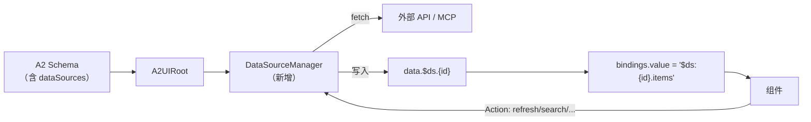
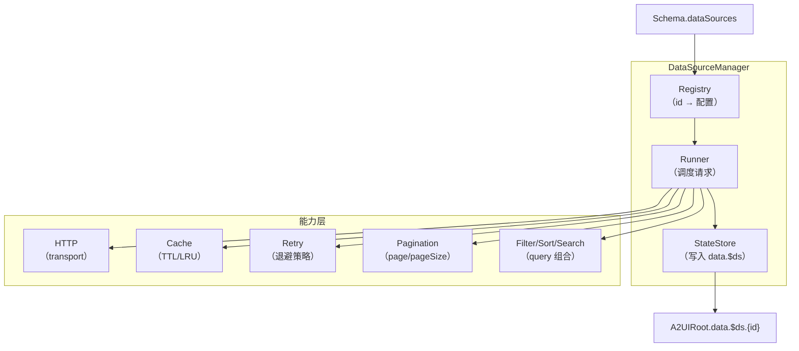
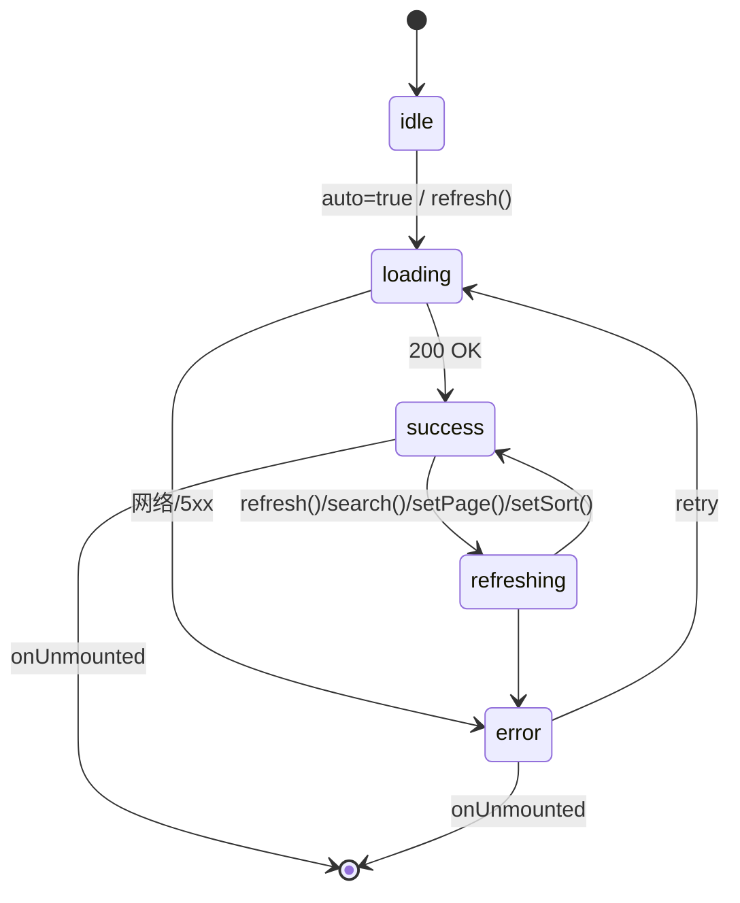

# DataSource 设计

本文档设计 A2UI 未来的 **DataSource（数据源）** 能力。DataSource 是一个 **可选的、协议驱动的** 新能力，用于统一管理组件的数据获取、加载状态、错误处理、分页、缓存、重试、刷新、搜索、排序、过滤。

**注意**：本文档是设计文档而非实现文档，目的在于说明「为什么这样设计」以及「未来如何演进」。当前 Runtime 保持不变，DataSource 作为独立能力叠加，遵循 [Runtime 架构设计](/guide/runtime-design) 中的「对扩展开放、对修改封闭」原则。

阅读本文前建议先了解：

- [架构设计](/guide/architecture)
- [Runtime 架构设计](/guide/runtime-design)
- [Action 系统](/guide/action-system)

---

## 目前 Runtime 如何管理数据

在动手设计 DataSource 之前，先梳理当前 Runtime 的数据管理机制。

### 现状

当前 A2UI Runtime 采用 **单一状态源 + 声明式绑定** 模型（见 [Runtime 架构设计](/guide/runtime-design) 的数据流章节）：

- **状态中心**：`A2UIRoot` 持有 `data: ref<Record<string, any>>`，是全局唯一的数据源。
- **写入路径**：宿主通过 `updateData()` 或 `processMessage({ type: 'data' | 'data_update', path, value })` 主动写入；`update:modelValue` 由 Renderer 通过 `setPathValue` 自动写回。
- **读取路径**：组件不直接读 `data`，而是声明 `bindings: { propKey: { type: 'path', value: 'form.name' } }`，Runtime 在渲染前用 [`resolveBinding`](file:///d:/work/program/tineco/UI/a2ui-vue-engine/packages/a2ui-vue-engine/src/mapper/binding.ts) 解析后合并到 props。
- **响应式**：`data` 变化通过 `renderContext` computed 触发整棵 VNode 重算，由 Vue 3 patch。

### 局限

现有模型对 **表单场景** 完备，但对以下场景缺失：

- **HTTP 数据获取**：Runtime 不知道如何发请求；宿主必须先拿到数据再 `updateData`，组件无法自描述「我要什么数据」。
- **异步状态**：没有统一的 `loading / error / empty / success` 语义，组件必须自己维护。
- **分页 / 排序 / 过滤**：都是 UI 组件（Table / List / Chart）反复实现的能力，缺乏统一抽象。
- **缓存与重试**：宿主要为每种业务写一遍。
- **搜索联动**：Search 框、Filter 面板、Table 数据之间要靠宿主手动串联。

**结论**：把「数据的获取与治理」上升为协议一等公民，可以让 Table / Tree / Chart / Description 等未来组件复用同一套能力，不必各自造轮子。这就是 DataSource。

---

## DataSource 是什么

**DataSource 是一个协议对象**，声明「一份数据从哪里来、如何加载、如何治理」。它不是一个组件、不是一个 Vue 组合式函数、也不是一个 store——它是 Schema 的一部分，Runtime 侧存在一个 **DataSourceManager** 负责根据 Schema 定义驱动实际的 fetch、状态与缓存。

用一句话概括：

> **DataSource = 一份可被多个组件消费的、具备完整生命周期与治理能力的数据资源声明。**

### 与现有 Runtime 的关系



关键设计：

- **DataSource 数据落到 `data.$ds.<id>`**：不打破当前「data 是唯一状态源」的模型。所有组件依旧通过 `bindings` 消费，只是路径带了 `$ds` 前缀（或通过新增 `bindings.type = 'datasource'` 显式声明）。
- **DataSourceManager 挂在 A2UIRoot**：作为 A2UIRoot 内部的一个 shallowRef，生命周期与 A2UIRoot 一致；对外通过命令式 API 暴露 `refresh / search / setPage / setSort / setFilter` 等能力。
- **组件通过 Action 操纵 DataSource**：`{ event: 'search', type: 'datasource', payload: { target: 'orderList', keyword: '...' } }`——不引入新的编程接口，全部走协议。

---

## Schema 设计

DataSource 在协议层的表达如下（**建议格式**，最终版本发布时会进入 [JSON 规范](/guide/json-schema)）：

### 顶层声明

```json
{
  "id": "root",
  "type": "a2-page",
  "dataSources": {
    "orderList": {
      "kind": "http",
      "request": {
        "url": "/api/orders",
        "method": "GET",
        "params": { "status": "active" }
      },
      "pagination": { "enabled": true, "pageSize": 20 },
      "cache": { "enabled": true, "ttl": 60000 },
      "retry": { "count": 3, "backoff": "exponential" },
      "auto": true,
      "responseMap": {
        "items": "data.list",
        "total": "data.total"
      }
    }
  },
  "children": [ ]
}
```

**说明**：

- `dataSources` 是一个字典，key 为 DataSource 的 id，value 为 DataSource 配置。
- 声明位置可以是根节点、任意容器节点；同一 id 在同一作用域内唯一，采用「就近查找」（组件消费时先在祖先节点找，找不到再到根节点找）。
- 每个 DataSource 是一个 **可独立生命周期管理** 的资源。

### 组件消费

组件通过 `bindings` 引用 DataSource，Runtime 解析后写入 props：

```json
{
  "id": "orderTable",
  "type": "a2-table",
  "bindings": {
    "dataSource": { "type": "datasource", "value": "orderList" }
  },
  "actions": [
    { "event": "pageChange", "type": "datasource", "payload": { "target": "orderList", "op": "setPage" } },
    { "event": "sortChange", "type": "datasource", "payload": { "target": "orderList", "op": "setSort" } }
  ]
}
```

`bindings.type: 'datasource'` 是新增的 `BindingConfig.type`（走 [向后兼容原则](/guide/action-system#向后兼容原则)——`literal / path / expression` 保持不变）。Runtime 解析后，组件收到的 `dataSource` 是一个 **响应式对象**：

```ts
interface DataSourceState<T = any> {
  status: 'idle' | 'loading' | 'success' | 'error' | 'refreshing'
  data: T | null           // 主数据（items / row）
  meta: {
    total?: number
    page?: number
    pageSize?: number
    hasMore?: boolean
  }
  error: Error | null
  lastFetchedAt: number | null
}
```

组件只需要 `dataSource.data` 渲染、`dataSource.status` 展示 loading / error，不再关心「什么时候发请求」「怎么处理错误」。

---

## 职责划分

DataSource 由以下模块协作组成，每个模块单一职责：



### DataSourceManager

- 维护所有 DataSource 的注册表（id → 配置 + 运行时状态）；
- 提供 `refresh / search / setPage / setSort / setFilter / reset` 等命令式 API；
- 生命周期与 `A2UIRoot` 一致，`onMounted` 中根据 `auto: true` 的配置自动首屏拉取。

### Transport（HTTP）

- 唯一的实际请求执行者，默认使用 `fetch`；
- 可扩展为宿主注入的 transport（axios / MCP client / GraphQL）——**Runtime 不绑定具体传输层**；
- 请求描述统一为 `RequestConfig { url, method, headers, params, body, timeout }`。

### Cache

- key 由 `{ id, params, body, page, sort, filter }` 组合；
- 支持 TTL（`cache.ttl` 毫秒）与 LRU 上限；
- 命中缓存直接写入状态并跳过 Transport。

### Retry

- 声明式：`retry: { count, backoff: 'linear' | 'exponential', delay: 500 }`；
- 只对 **可重试错误**（网络错误、5xx）生效；4xx 不重试。

### Pagination

- 两种模式：
  - `page`（页码 + 页大小）：`page, pageSize, total`；
  - `cursor`（游标）：`cursor, nextCursor, hasMore`；
- 分页参数以约定字段合入 `params`（可通过 `paramsMap` 定制）。

### Filter / Sort / Search

- 三者本质相同：都是 **query 参数的组合**；
- 声明字段：`filter: Record<string, any>`、`sort: { field, order }`、`search: { keyword, fields }`；
- 变更时 **合并** 到 `params` 并触发一次 `refresh`。

---

## 生命周期

DataSource 从 **加载** 到 **销毁** 有完整的生命周期：



### 各状态语义

| 状态 | 含义 | 组件如何展示 |
|------|------|-------------|
| `idle` | 未加载（如未设置 `auto: true`） | 空状态或触发按钮 |
| `loading` | 首次加载中 | 骨架屏 / spinner |
| `refreshing` | 有旧数据的重新加载 | 保留旧数据 + 顶部进度条 |
| `success` | 成功且有数据 | 正常渲染 |
| `error` | 加载失败 | 错误提示 + Retry 按钮 |

**约定**：组件对状态的展示是「开放的、有默认的」——DataSource 只负责给出状态，展示形态由组件自行决定，同时提供默认插槽（`slots.loading / slots.error / slots.empty`）。

---

## 各能力设计

### HTTP

- **请求描述** 是纯 JSON，可以被 AI 生成、可以被日志：`{ url, method, headers, params, body, timeout }`；
- **响应映射** 通过 `responseMap` 声明式把服务端字段映射到标准 `{ items, total, meta }`；
- **拦截器** 由宿主注入，DataSourceManager 不内置具体的 auth / trace 逻辑（关注点分离）。

### Loading

- 首次加载与刷新使用 `loading / refreshing` 两个状态区分，组件可以选择「首次骨架屏 / 刷新时进度条」；
- **强一致性**：`status` 是唯一真理来源，宿主与组件都不允许绕过它设置 loading。

### Error

- Error 是一等状态，携带 `error: Error | null` 与 `errorContext: { url, statusCode, retryCount }`；
- 支持声明 `onError`（Action Chain 中的一个动作），例如「弹 Toast + 记日志 + 重试」；
- 未处理的 error 通过 `A2UIRoot.emit('error')` 上抛给宿主。

### Pagination

两种模式并存，通过 `pagination.mode: 'page' | 'cursor'` 声明：

```json
{
  "pagination": {
    "enabled": true,
    "mode": "page",
    "pageSize": 20,
    "paramsMap": { "page": "pageNum", "pageSize": "size" }
  }
}
```

组件通过 Action 触发翻页：

```json
{ "event": "pageChange", "type": "datasource",
  "payload": { "target": "orderList", "op": "setPage", "page": 3 } }
```

### Cache

- 声明：`cache: { enabled: true, ttl: 60000, key?: string[] }`；
- key 组合默认使用 `{ id, params, body }`，可以通过 `key` 数组自定义参与 key 的字段；
- Cache 与 Pagination 天然协作：不同页有不同 key，翻回已访问过的页可直接命中。

### Retry

- 声明：`retry: { count: 3, backoff: 'exponential', delay: 500, maxDelay: 8000 }`；
- 超过 `count` 后进入 `error` 状态并停止；
- 组件也可以通过 Action 主动重试：`{ event: 'retry', type: 'datasource', payload: { target: 'orderList', op: 'refresh' } }`。

### Refresh

- 三种触发：
  - 组件 Action：`{ op: 'refresh' }`；
  - 宿主命令式：`a2uiRoot.refreshDataSource('orderList')`；
  - 声明式：`refreshOn: ['form.filter']`，当依赖字段变化时自动刷新。

### Search / 排序 / 过滤

统一以 **query 变更 + refresh** 建模：

```json
{ "event": "input", "type": "datasource",
  "payload": { "target": "orderList", "op": "setSearch", "keyword": "abc" } }

{ "event": "sortChange", "type": "datasource",
  "payload": { "target": "orderList", "op": "setSort", "field": "createdAt", "order": "desc" } }

{ "event": "change", "type": "datasource",
  "payload": { "target": "orderList", "op": "setFilter", "filter": { "status": "active" } } }
```

DataSourceManager 内部对连续的变更做 **debounce**（默认 300ms），避免抖动导致的请求风暴。

---

## 组件消费模式

未来的 `Table / Tree / Chart / Description` 均遵循同一模式：

### Table

```json
{
  "id": "orderTable",
  "type": "a2-table",
  "props": { "columns": [{"label":"订单号","prop":"id"}, {"label":"状态","prop":"status"}] },
  "bindings": {
    "dataSource": { "type": "datasource", "value": "orderList" }
  },
  "actions": [
    { "event": "pageChange", "type": "datasource", "payload": {"target":"orderList","op":"setPage"} },
    { "event": "sortChange", "type": "datasource", "payload": {"target":"orderList","op":"setSort"} },
    { "event": "rowClick", "type": "emit", "payload": {"action":"openDetail"} }
  ]
}
```

组件内部只关心：`dataSource.data.items` 渲染行、`dataSource.status` 决定 loading / error UI、`dataSource.meta.total` 决定分页 UI。

### Tree

Tree 的层级加载可以按需实现为「多个 DataSource + `parentId` 参数」，也可以在单个 DataSource 中通过 `params.parentId` 拉取子级——由 Schema 声明，不改 Runtime。

### Chart

Chart 只消费 `dataSource.data`，通过 `responseMap` 把服务端结构映射为图表需要的 `series / xAxis / yAxis`。

### Description（详情页）

Description 消费 **单条数据** 的 DataSource：

```json
{
  "dataSources": {
    "orderDetail": {
      "kind": "http",
      "request": { "url": "/api/orders/:id", "params": { "id": "$route.id" } },
      "auto": true
    }
  }
}
```

`$route.id` 是宿主注入的上下文变量（另一个可选扩展点）。

**关键**：4 种组件都通过同一个 `bindings.type: 'datasource'` + Action 协议消费，不再各自实现请求 / 分页 / 缓存。

---

## 与现有 Runtime 的对接

DataSource 是 **增量能力**，接入点如下（**建议实现路径**，不影响现有 Runtime）：

1. **新增 `BindingConfig.type: 'datasource'`**：在 [`mapper/binding.ts`](file:///d:/work/program/tineco/UI/a2ui-vue-engine/packages/a2ui-vue-engine/src/mapper/binding.ts) 的 `resolveBinding` 中追加分支，从 `data.$ds.<id>` 读取状态对象。
2. **新增 `ActionConfig.type: 'datasource'`**：在 [`renderer/renderNode.ts`](file:///d:/work/program/tineco/UI/a2ui-vue-engine/packages/a2ui-vue-engine/src/renderer/renderNode.ts) 的 `executeAction` 中追加分支，把 op 转发到 DataSourceManager。
3. **A2UIRoot 集成**：`onMounted` 时扫描 `tree.dataSources`（含子节点声明），构造 DataSourceManager 并触发 `auto: true` 的首屏拉取；`onUnmounted` 时销毁。
4. **状态挂载**：DataSourceManager 把每份状态写入 `data.$ds.<id>`——完全复用现有响应式系统，不引入新的状态容器。
5. **命令式 API**：`A2UIRoot` 通过 `defineExpose` 追加 `refreshDataSource / getDataSourceState` 等方法。

**注意**：以上都是「新增分支 / 新增字段 / 新增方法」，不修改任何已有代码的行为。老 Schema（未声明 `dataSources`）在新 Runtime 上运行结果与旧 Runtime 完全一致。

---

## 向后兼容原则

DataSource 上线时必须满足：

1. **协议层**：
   - `BindingConfig.type` 保留 `literal / path / expression`，新增 `datasource` 是可选值；
   - `ActionConfig.type` 保留 `emit / callback / navigate / api`，新增 `datasource` 是可选值；
   - `A2Node` 上的 `dataSources` 是新增可选字段，缺省即无 DataSource。
2. **Runtime 层**：
   - 未声明 `dataSources` 的 Schema 不启动 DataSourceManager，无额外开销；
   - 未使用 `type: 'datasource'` 的绑定 / 动作走原逻辑；
   - 组件不感知 DataSource 是否存在——只要 `bindings.dataSource` 存在就渲染，否则 fallback 到 props。
3. **组件层**：
   - 新组件 API 兼容「直接传 data」与「通过 dataSource 传状态对象」两种方式；
   - 老组件（Card / Button 等）完全不受影响。
4. **测试保底**：所有当前文档中的 `PlaygroundEmbed` 示例在启用 DataSource 后必须 **渲染与交互结果完全一致**。

---

## 设计原则

- **协议驱动**：DataSource 是 Schema 描述，不是编程 API；宿主 / AI 都可以生成它。
- **数据单源**：DataSource 的状态最终写入 `data.$ds.<id>`，保持「A2UIRoot 是唯一状态源」不变。
- **声明式治理**：分页 / 缓存 / 重试 / 排序 / 过滤 / 搜索都通过配置字段声明，不下放到业务代码。
- **传输解耦**：默认 `fetch`，允许宿主注入 axios / MCP / GraphQL client——DataSourceManager 不绑定具体协议。
- **组件无关**：Table / Tree / Chart / Description 消费同一 `DataSourceState` 接口。
- **状态可见**：`status / error / meta` 是一等公民，组件对 loading / error / empty 有统一处理入口。
- **可组合**：DataSource 之间可以通过 `dependsOn / refreshOn` 建立依赖关系（例如 `orderDetail` 依赖 `route.id` 变化）。
- **可回放**：DataSource 的每一次请求、状态变迁都可日志、可回放，便于调试 AI 生成的 Schema。
- **对扩展开放**：新增 `kind`（`http / graphql / mcp / websocket / static`）时只扩展 Transport，不改 Manager 主干。

---

## 未来的扩展方向

- **`kind: 'mcp'`**：DataSource 的 Transport 直接对接 MCP server 的 `tools/call`，AI Agent 可以通过声明 DataSource 让 UI 消费任意 MCP 工具的返回值。见 [Action 系统 - 未来如何支持 MCP](/guide/action-system#未来如何支持-mcp)。
- **`kind: 'websocket'`**：订阅式 DataSource，服务端推流写入 `data.$ds.<id>.items`，Runtime 自动增量渲染。
- **`kind: 'static'`**：内联静态数据，无需请求；便于 Demo 与测试。
- **依赖图**：当多个 DataSource 有依赖时，DataSourceManager 建立拓扑图，只在依赖变化时重新拉取。
- **本地持久化**：`persist: { storage: 'localStorage', key: 'orderListCache' }`，跨会话缓存。
- **乐观更新**：Action 提交后先本地写入 `data.$ds.<id>`，请求成功后确认、失败后回滚。

---

## 参考实现位置（未来实现时的落地点）

以下是 DataSource 落地时预计涉及的文件（当前尚未新增，仅作为落地锚点）：

- **新增**：`packages/a2ui-vue-engine/src/datasource/DataSourceManager.ts`
- **新增**：`packages/a2ui-vue-engine/src/datasource/transport/http.ts`
- **新增**：`packages/a2ui-vue-engine/src/datasource/types.ts`
- **扩展**：[types/index.ts](file:///d:/work/program/tineco/UI/a2ui-vue-engine/packages/a2ui-vue-engine/src/types/index.ts) 追加 `BindingConfig.type` 与 `ActionConfig.type` 的字面量、追加 `A2Node.dataSources`。
- **扩展**：[mapper/binding.ts](file:///d:/work/program/tineco/UI/a2ui-vue-engine/packages/a2ui-vue-engine/src/mapper/binding.ts) 新增 `datasource` 分支。
- **扩展**：[renderer/renderNode.ts](file:///d:/work/program/tineco/UI/a2ui-vue-engine/packages/a2ui-vue-engine/src/renderer/renderNode.ts) 新增 `datasource` 动作分支。
- **扩展**：[root/A2UIRoot.vue](file:///d:/work/program/tineco/UI/a2ui-vue-engine/packages/a2ui-vue-engine/src/root/A2UIRoot.vue) 生命周期挂载与 `defineExpose` API。

以上路径均为 **新增或扩展**，不会替换或删除任何已有代码。
