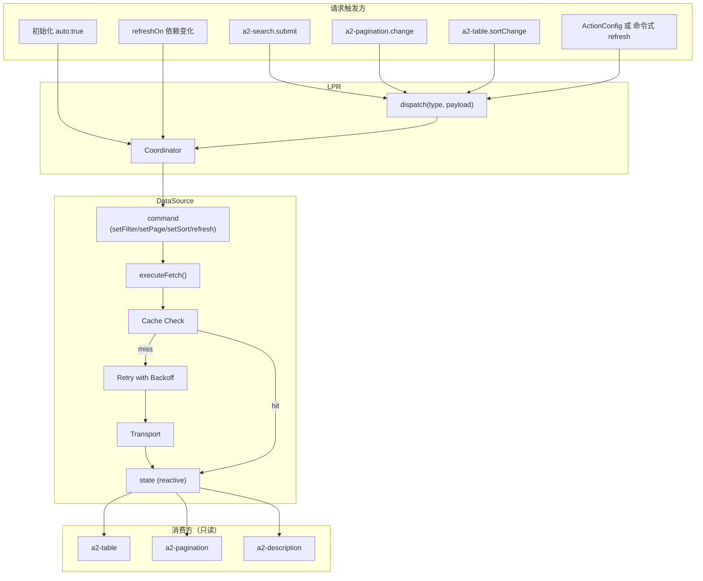
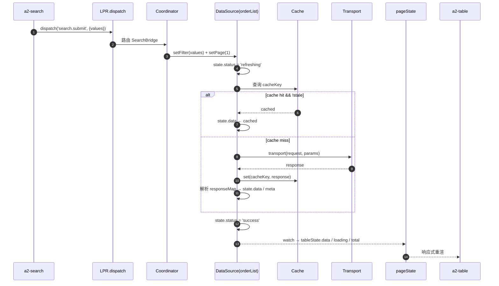
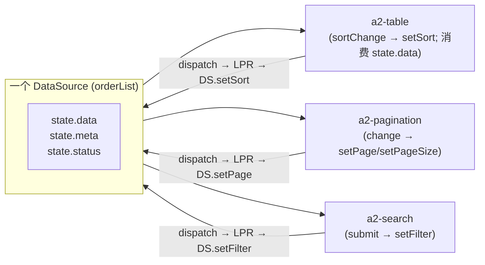

# DataSource 设计（Light Page Runtime 视角）

> 本文档定义 Light Page Runtime（LPR）中 **DataSource** 的职责边界、调用协议、生命周期与治理能力。
>
> DataSource 必须 **独立于** Table / Search / Dialog 等消费方，作为唯一的 API 网关服务于整个页面运行时。
>
> 前置阅读：
> - [Light Page Runtime 设计](/architecture/runtime-design)
> - [PageState 模型设计](/architecture/page-state)
> - [Action 系统](/architecture/action-system)
>
> 本文档不包含任何代码实现，仅描述结构与协作规则。

---

## 1. 定位与硬性约束

### 1.1 定位

在 LPR 中，DataSource 承担一个 **唯一职责**：

> **DataSource 是页面运行时里所有 HTTP / 远程数据请求的唯一执行者与状态承载者。**

- **协议对象**：Schema 中以 `dataSources` 字段声明；本身不含 JS 逻辑；
- **运行时实例**：由 `DataSourceManager` 创建、缓存、销毁；具备响应式 `state`；
- **面向多方消费**：Table / Pagination / Description / Chart / Tree 等一切"消费数据的组件"都通过 `bindings.dataSource` 只读消费；
- **面向单一调度**：写入侧只有一条路径 —— **LPR Coordinator → DataSource 命令**。

### 1.2 硬性约束（必须遵守）

- ❌ **不允许 Table 直接请求 API**。Table 只读 `DataSource.state`。
- ❌ **不允许 Search 直接请求 API**。Search submit 后 dispatch，由 LPR 调用 DataSource。
- ❌ **不允许 Pagination 直接请求 API**。翻页事件 dispatch，由 LPR 调用 DataSource。
- ❌ **不允许组件在 setup / mounted / watch 中直接 fetch**。任何组件里的 `fetch(...)` 都是反模式。
- ✅ **所有请求必须经 Page Runtime → DataSource**。这是本设计不可协商的底线。

### 1.3 一句话总结

> Search / Table / Pagination / Dialog 是「视图」，DataSource 是「数据总线」，LPR Coordinator 是「唯一司机」。视图看不到 API，也不该看到。

---

## 2. DataSource 模型设计

DataSource 分两层：**声明模型（Schema）** 与 **运行时模型（Instance）**。

### 2.1 声明模型（Schema）

DataSource 在 Schema 中以纯 JSON 声明，附着于 `a2-page` 或任意容器节点的 `dataSources` 字段：

```jsonc
{
  "id": "orderPage",
  "type": "a2-page",
  "dataSources": {
    "orderList": {
      "kind": "http",                        // "http" | "static"
      "request": {
        "url":    "/api/orders",
        "method": "GET",                     // GET | POST | PUT | DELETE
        "paramsMap": {                        // 运行时参数如何映射到 URL / body
          "page":     "pageNum",
          "pageSize": "size",
          "search":   "keyword",
          "sort":     "sortBy",
          "filter":   "$flatten"              // filter 展开到查询串
        },
        "responseMap": {                      // 响应体如何映射到 state
          "list":  "data.items",
          "total": "data.total"
        },
        "headers": { "X-Client": "a2ui" }
      },
      "pagination": {
        "enabled":    true,
        "mode":       "page",                 // "page" | "cursor"
        "pageSize":   20,
        "initialPage": 1
      },
      "cache": {
        "enabled": true,
        "ttl":     60000,                     // ms
        "maxSize": 32
      },
      "retry": {
        "count":   2,
        "backoff": 2,                         // 指数退避
        "delay":   300
      },
      "debounce":   300,                      // Search / Filter 变更的合并窗口
      "auto":       true,                     // 首屏自动拉取
      "refreshOn":  ["detail.id"],            // 声明式依赖
      "params":     { "extra": "..." }
    }
  }
}
```

关键点：

- **纯数据**：不含函数、不含表达式；协议可序列化、可日志、可回放；
- **多消费方**：一个 DataSource 可被 Table + Pagination + Description 共同消费；
- **id 唯一**：`id` 是 DataSource 的键；跨组件通过 `bindings.dataSource.value = "orderList"` 引用；
- **auto**：`true` 则挂载后自动首屏拉取；`false` 则等待手动 refresh。

### 2.2 运行时模型（Instance）

DataSourceManager 依据声明创建每个 DataSource 实例，实例暴露：

```jsonc
{
  "id":     "orderList",
  "state": {
    "status":    "idle | loading | refreshing | success | error",
    "data":      "T[] | T | null",
    "meta":      {
      "page":       1,
      "pageSize":   20,
      "total":      0,
      "hasMore":    false,
      "cursor":     null,
      "nextCursor": null
    },
    "error":     "null | { code, message, retriable }",
    "params":    {
      "page":     1,
      "pageSize": 20,
      "cursor":   null,
      "sort":     null,
      "filter":   {},
      "search":   "",
      "extra":    {}
    },
    "updatedAt": 0
  },

  "commands": [
    "init()", "refresh()", "fetch()",
    "setPage(n)", "setPageSize(n)", "setCursor(c)",
    "setSort({key, order})", "setSearch(str)", "setFilter(obj)",
    "setExtra(obj)",
    "invalidateCache()", "abort()", "destroy()"
  ]
}
```

要点：

- `state` 为响应式对象（Vue reactive）；
- `commands` 是**唯一**的写入入口；不允许外部直接改 `state`；
- `status`：`loading` 为首次加载，`refreshing` 为已有数据的刷新（避免 UI 闪烁）。

### 2.3 DataSource ≠ Store

不要把 DataSource 当成通用状态管理器：

- ✅ DataSource 承载"远程数据快照 + 请求参数 + 加载状态"
- ❌ DataSource 不承载业务字段（如"用户输入的搜索关键字"——那属于 `pageState.searchState`）
- ❌ DataSource 不承载 UI 状态（如折叠 / 弹窗可见性——那属于 pageState）

---

## 3. 调用流程图

DataSource 的调用路径 **只有一条**：

```
组件事件
   │
   ▼
LPR.dispatch(type, payload)
   │
   ▼
Coordinator
   │
   ▼
DataSource.command(...)
   │
   ▼
Transport (fetch / axios / MCP / GraphQL)
   │
   ▼
DataSource.state 更新
   │
   ▼
watch → pageState.tableState 派生
   │
   ▼
组件通过响应式 bindings 重渲
```

### 3.1 五种触发通道汇聚图



### 3.2 一次完整调用的序列图（Search → Table）



---

## 4. Search / Pagination 如何复用 DataSource

Search 与 Pagination **不持有请求逻辑**——它们通过 dispatch 让 LPR 调用同一个 DataSource 实例。

### 4.1 一个 DataSource，多个消费方



Search / Pagination / Table 通过 **同一个 dataSourceId** 引用同一个实例：

```jsonc
{
  "type": "a2-search",
  "props": { "dataSourceId": "orderList", "fields": [...] }
}
{
  "type": "a2-pagination",
  "bindings": {
    "dataSource": { "type": "datasource", "value": "orderList" }
  }
}
{
  "type": "a2-table",
  "bindings": {
    "dataSource": { "type": "datasource", "value": "orderList" }
  }
}
```

### 4.2 复用的三个维度

- **共享 state**：三个组件读同一份 `state.data / meta / status`；
- **共享 params**：Search 改 `filter`、Pagination 改 `page / pageSize`、Table 改 `sort` —— 都写入同一个 `state.params`；
- **共享请求**：任意一个维度变化都触发 **同一个** DataSource 重发请求（含 debounce / cache / retry）。

### 4.3 Search 与 Pagination 的具体协作

- **Search submit**：
  1. `dispatch('search.submit', {values})`；
  2. Coordinator 调 `DataSource.setFilter(values)` 与 `setPage(1)`（回到首页）；
  3. DataSource 内部合并 debounce 后 fetch；
  4. Pagination 通过 `state.meta.total / page / pageSize` 自动更新总条数与当前页。

- **Pagination change**：
  1. `dispatch('table.pageChange', {pageNum})`；
  2. Coordinator 调 `DataSource.setPage(pageNum)`；
  3. DataSource fetch，Table 数据刷新，Pagination 显示同步。

### 4.4 Search 与 Pagination 之间的隐式一致性

Search 与 Pagination 之间**没有直接通信**：

- Search submit 会自动 `setPage(1)`（Coordinator 承担），Pagination 通过响应式感知到 `pagination.pageNum = 1`；
- Pagination change 不改 filter，Search 保持原状态。

**结论**：视图组件之间零耦合，一致性由 DataSource 兜底。

---

## 5. DataSource 是否需要缓存

### 5.1 结论

**需要**，但缓存是 **声明式、可关闭、按数据源粒度独立**。

### 5.2 为什么需要

- **减少重复请求**：翻页往回时命中缓存，避免"看过的第一页再拉一次"；
- **降低延迟**：搜索后回退到无过滤态时秒开；
- **降级容灾**：临时网络抖动时可返回近端数据（视 TTL 策略）；
- **AI 场景友好**：Agent 反复查询同一 DataSource 时避免高频命中后端。

### 5.3 缓存策略（声明式）

```jsonc
"cache": {
  "enabled": true,      // 默认 false，需要显式开启
  "ttl":     60000,     // TTL（ms）；到期视为 stale
  "maxSize": 32         // LRU 上限
}
```

- **key 组合**：`{ id, method, url, params:{page, pageSize, filter, search, sort, extra} }`；参数变化即换 key，天然隔离。
- **TTL**：到期后下一次请求触发 fetch，成功后写回；
- **LRU 淘汰**：`maxSize` 满时淘汰最久未使用；
- **失效方式**：
  - TTL 到期（被动）
  - `DataSource.invalidateCache()`（主动，命令式或 Action）
  - `refresh({ force: true })`（本次绕过 cache）
  - `refreshOn` 依赖字段变化（联动失效）

### 5.4 不缓存也是合法选择

某些场景显式关闭：`cache.enabled = false`（或省略）。例如实时行情、鉴权敏感、需要严格顺序一致的数据。

---

## 6. DataSource 是否需要 loading / error 状态

### 6.1 结论

**必须需要**，并且是 **统一的、五态明确的、响应式的**。

### 6.2 五态定义

```
idle       -> 未加载（初始）
loading    -> 首次加载中（无旧数据）
refreshing -> 二次刷新中（有旧数据，可避免闪烁）
success    -> 加载成功
error      -> 加载失败
```

分开 `loading` 与 `refreshing` 是为了 **UI 一致性**：

- 首次加载：显示骨架屏 / 空态；
- 刷新：保留旧数据，头部加转圈，避免视觉跳动。

### 6.3 error 结构

```jsonc
{
  "code":      "HTTP_500 | NETWORK | TIMEOUT | ABORTED | ...",
  "message":   "服务器繁忙",
  "retriable": true,
  "cause":     "..."      // 原始错误
}
```

- `retriable` 让 Retry 逻辑与 UI 展示逻辑复用同一份判断；
- 组件只需 `state.error !== null` 即可展示错误态；具体渲染由组件决定（Toast / Empty / Overlay）。

### 6.4 为什么必须由 DataSource 承载

- **一致性**：Table / Description / Chart 消费同一 status，无需重复实现 loading spinner；
- **可预测**：宿主可通过 `state.status` 集中做全局 loading 计数；
- **可测试**：mock DataSource 即可覆盖所有异步态；
- **可回放**：状态转移可日志、可断言。

### 6.5 反例（错误做法）

- ❌ Table 自己维护 `loading` ref，Search submit 时手动 `loading = true`；
- ❌ 每个组件独立捕获错误，导致 UI 表现不一致；
- ❌ 用 promise chain 隐式表达状态，无法响应式展示。

---

## 7. DataSource 与 PageRuntime 的关系

### 7.1 层次

```
                          宿主应用
                              │
                     ┌────────┴────────┐
                     ▼                 ▼
                A2UIRoot          业务代码 / API 处理
                     │
              ┌──────┴──────┐
              ▼             ▼
         Renderer      Light Page Runtime
                            │
                 ┌──────────┼──────────┐
                 ▼          ▼          ▼
              Coordinator  pageState  DataSourceManager
                            │           │
                            │           ├─ DataSource(orderList)
                            │           ├─ DataSource(orderDetail)
                            │           └─ DataSource(...)
                            │
                     组件 ← 响应式绑定
```

### 7.2 谁负责什么

| 角色 | 职责 | 不做的事 |
| --- | --- | --- |
| 视图组件 | dispatch 事件；读取 state | 不 fetch、不改 state |
| LPR Coordinator | 路由 dispatch；决定调用哪个 DataSource 命令 | 不发请求 |
| DataSourceManager | 创建 / 缓存 / 销毁 DataSource 实例 | 不处理业务语义 |
| DataSource | 发请求；维护 state；处理 cache / retry / debounce | 不知道谁在消费自己 |
| Transport | 实际发 HTTP | 不做任何治理 |
| 宿主 | 业务 API（如提交表单）；命令式 `refresh` | 不直接改 DataSource.state |

### 7.3 LPR 如何调用 DataSource

LPR Coordinator 内部有一个"命令映射表"：

```
dispatch('search.submit')     → DS.setFilter(payload.values) + setPage(1)
dispatch('search.reset')      → DS.setFilter({}) + setPage(1)
dispatch('table.pageChange')  → DS.setPage(payload.pageNum)
dispatch('table.pageSizeChange') → DS.setPageSize(payload.pageSize)
dispatch('table.sortChange')  → DS.setSort(payload.sort)
dispatch('page.refresh')      → DS.refresh()
Action(type='datasource', op='invalidate') → DS.invalidateCache()
```

**唯一的入口 = 唯一的调用者 = 唯一的行为**。这就是"所有请求必须通过 Page Runtime → DataSource"的物理保证。

### 7.4 生命周期同步

- `a2-page` mount → `DataSourceManager.register(dataSources)` → `initAll()`（`auto:true` 的立即拉取）；
- `a2-page` unmount → `DataSourceManager.destroy()`（abort inflight + clear cache + 停 watch）；
- 嵌套 page 拥有独立 `DataSourceManager`，互不干扰。

---

## 8. DataSource 与 Action System 的关系

DataSource 通过 **新增可选 Action 类型 `datasource`** 与 Action 系统对接，不修改现有 `emit / callback / navigate / api` 四种分支。

### 8.1 datasource 类型 Action

```jsonc
{
  "event":   "click",
  "type":    "datasource",
  "payload": {
    "target": "orderList",             // DataSource id
    "op":     "refresh",               // refresh | invalidate | setPage | setFilter | ...
    "args":   { }                       // 命令参数
  }
}
```

`executeAction` 在 `datasource` 分支内查表调用：

```
target = payload.target
ds = pageRuntime.getDataSource(target)
ds[payload.op](payload.args)
```

### 8.2 与 `api` 类型的区别

已有 `type: 'api'` 是**宿主级 API 调用**（走 `emit('message', ...)` 交给宿主）；
新增 `type: 'datasource'` 是**页面级数据源命令**（就地调用 DataSource）。

| 维度 | `api` | `datasource` |
| --- | --- | --- |
| 谁执行 | 宿主 | DataSource（LPR 内部） |
| 谁维护状态 | 宿主 | DataSource.state |
| 谁 dedupe / retry | 宿主 | DataSource 内建 |
| 谁做 loading | 宿主 | DataSource.state.status |
| 何时用 | 提交表单 / 触发工作流 | 列表刷新 / 分页 / 过滤 |

**规则**：只要是「面向列表 / 详情 / 图表的数据加载」，一律用 `datasource`；只有「触发业务副作用」才用 `api`。

### 8.3 声明式 refresh 依赖

DataSource 支持 `refreshOn` 声明式依赖：

```jsonc
"refreshOn": ["form.status", "$page.orderPage.searchState.lastSubmit.category"]
```

被依赖字段变化 → LPR 内部 watch 触发 → `DataSource.refresh()`。这是 Action 系统之外的**声明式驱动方式**，避免每次都要手写 Action。

### 8.4 兼容 emit 模式

如果宿主希望自己接管数据请求，可继续用 `type: 'emit'` 上抛 message，然后自己走 `fetch`。DataSource 与 emit 模式**共存**，Schema 作者按需选择。

---

## 9. 为什么不能让组件直接请求 API

这是本设计文档最重要的一节。以下 8 个理由说明「组件直接 fetch」为何被禁止。

### 9.1 联动一致性无法保证

若 Table 自己 fetch，Search / Pagination 也各自 fetch：
- 三方 params 不同步（Search 提交后 Table 用的还是旧 filter）；
- 三方 loading 不一致（Search 已完成 Pagination 还在转圈）；
- Cursor 分页时 nextCursor 在哪一方？谁写谁读？

统一由 DataSource 承载，三方共享同一份 params 与 state，物理消除不一致。

### 9.2 请求爆炸

- Table `watch(props)` 触发 fetch，Search `submit` 触发 fetch，Pagination 变化触发 fetch → 同一次搜索可能触发 3 次请求；
- DataSource 通过 debounce + inflight 合并 + AbortController 只发 1 次；
- 组件级 fetch 无法感知同伴的请求。

### 9.3 状态漂移与真源模糊

- Table 内部 `data = ref([])` vs 全局 `data.orders`——两份数据谁是真源？
- 用户翻页后再打开 Dialog，Dialog 拿到的 row 是从哪份状态取的？
- DataSource 是唯一真源，`state.data` 就是那份数据，无歧义。

### 9.4 无法回放 / 无法调试

- 组件里的 `fetch(url)` 无法从外部观测：调用时机、参数、失败原因埋在组件闭包里；
- DataSource 的所有请求都通过 Transport 中间层，可日志、可 mock、可回放；
- 调试时看 `state.status` 与 `state.error` 就能定位问题。

### 9.5 无法复用治理能力

- 每个组件都要自己实现 loading / error / retry / cache / debounce → N 份重复代码；
- 每个业务都可能实现得略有不同 → UI 一致性崩塌；
- DataSource 一次实现，所有组件受益。

### 9.6 破坏协议驱动

- A2UI 的核心承诺是「Schema 描述一切」。组件里写死 `fetch('/api/xxx')`，Schema 就不再是唯一真源；
- 服务端 / AI 生成的 Schema 无法控制组件的请求行为；
- 组件应该"只知道自己在渲染数据"，不知道数据来自何方。

### 9.7 无法被服务端 / Agent 生成

- AI 生成的是 Schema，不能生成组件源码；
- 若请求逻辑埋在组件里，AI 无法在运行时动态改变数据来源；
- 请求逻辑必须是 Schema 可表达的一部分——这就是 `dataSources` 声明存在的意义。

### 9.8 违反职责单一

- 视图组件的职责是"呈现数据"；数据获取是完全不同的职责；
- 混合两种职责会让组件难以测试、难以复用、难以在不同上下文中挂载；
- LPR + DataSource 的存在正是为了强制这两种职责分离。

### 9.9 一句话

> 让组件直接请求 API，就等于让 A2UI 从「协议驱动」滑向「组件驱动」——短期方便、长期崩塌。**DataSource 的独立性不是设计品味，是架构底线。**

---

## 10. 治理能力汇总

DataSource 内建 6 项运行时治理能力，全部由声明触发，无需宿主编写代码：

| 能力 | 声明字段 | 作用 |
| --- | --- | --- |
| **分页** | `pagination.enabled/mode/pageSize` | 页码 / 游标两种模式 |
| **缓存** | `cache.enabled/ttl/maxSize` | 参数键 + TTL + LRU |
| **重试** | `retry.count/backoff/delay` | 指数退避 + 可重试判定 |
| **防抖** | `debounce` | Search / Filter 合并请求 |
| **依赖** | `refreshOn` | 声明式字段监听 |
| **中断** | 内建 AbortController | 参数变化时取消上一次 |

外加**过期响应过滤**（inflight tag）——即使上一次请求返回晚了也不会污染 state。

---

## 11. 与 PageState 的分工

| 数据类型 | 归属 | 例子 |
| --- | --- | --- |
| 远程原始数据 | `DataSource.state.data` | 订单列表 raw |
| 分页元信息 | `DataSource.state.meta` | total / hasMore / cursor |
| 请求参数 | `DataSource.state.params` | page / filter / sort |
| 请求状态 | `DataSource.state.status/error` | loading / error |
| Table 视图字段 | `pageState.tableState` | data / loading（DataSource 的反投影） |
| Search 表单值 | `pageState.searchState.values` | 用户输入中的值 |
| 弹窗可见性 | `pageState.dialogState[name].visible` | 打开状态 |
| 当前行 | `pageState.currentRow` | Row Action 携带 |
| 刷新信号 | `pageState.refreshTrigger` | 递增 tick |

分工原则：**DataSource 管"远程数据 + 请求参数 + 加载状态"，pageState 管"UI 协调 + 视图投影 + 用户输入"。**

---

## 12. 可扩展性

DataSource 的扩展遵循「新增字段 / 新增命令 / 新增 Transport」原则，不引入 DSL 或插件系统。

### 12.1 允许

- 新 kind：如 `sse` / `websocket` / `mcp` / `graphql` —— 只在 Transport 层加分支；
- 新命令：如 `setGroup` / `setPivot` —— 加一个方法即可；
- 新治理能力：如 `throttle` / `polling` —— 声明式追加字段；
- 新响应结构：通过 `responseMap` 描述路径映射，无需改代码。

### 12.2 不允许

- ❌ 组件内直接 mutate `DataSource.state`；
- ❌ 引入表达式 / 脚本作为请求参数计算逻辑；
- ❌ 支持多 DataSource 联合查询（如需，走多个 DataSource + `refreshOn`）；
- ❌ 引入订阅粒度 API（响应式已足够）。

---

## 13. 落地锚点（未来实现）

已有代码位置（供参考，非本文档要求的改动）：

- 实例：[DataSource.ts](file:///d:/work/program/tineco/UI/a2ui-vue-engine/packages/a2ui-vue-engine/src/data-source/DataSource.ts)
- 管理器：[DataSourceManager.ts](file:///d:/work/program/tineco/UI/a2ui-vue-engine/packages/a2ui-vue-engine/src/data-source/DataSourceManager.ts)
- Transport：[transport.ts](file:///d:/work/program/tineco/UI/a2ui-vue-engine/packages/a2ui-vue-engine/src/data-source/transport.ts)
- Cache：[cache.ts](file:///d:/work/program/tineco/UI/a2ui-vue-engine/packages/a2ui-vue-engine/src/data-source/cache.ts)
- 类型：[types.ts](file:///d:/work/program/tineco/UI/a2ui-vue-engine/packages/a2ui-vue-engine/src/data-source/types.ts)

未来 LPR 落地时需要接入的锚点：

- 新增 `binding.ts` 的 `datasource` 分支；
- 新增 `renderNode.ts` `executeAction` 的 `datasource` 分支；
- 新增 `A2UIRoot` 内 LPR 懒创建逻辑，把 `DataSourceManager` 挂在 `RenderContext.pageRuntime`。

---

## 14. 设计原则回顾

- **独立性**：DataSource 与 Table / Search / Dialog 完全解耦；
- **唯一网关**：所有远程数据请求必须走 DataSource；
- **单一司机**：LPR Coordinator 是唯一调用者；
- **声明式**：所有治理能力靠 Schema 声明；
- **五态明确**：idle / loading / refreshing / success / error；
- **可复用**：一个 DataSource 服务多个消费方；
- **可回放**：所有状态变化可日志可 mock；
- **协议驱动**：请求逻辑存在于 Schema 而非组件；
- **可拆除**：未声明 dataSources 的 Schema 完全不激活 DataSourceManager。

---

_本文档仅为设计文档；不包含任何代码；不改变现有 Runtime 主干；组件必须遵守"禁止直接 fetch"的底线约束。_
