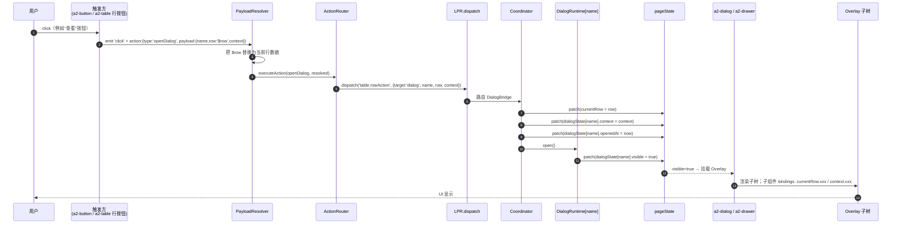
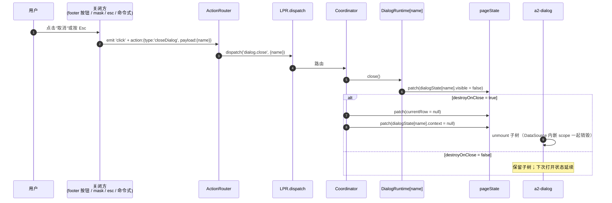
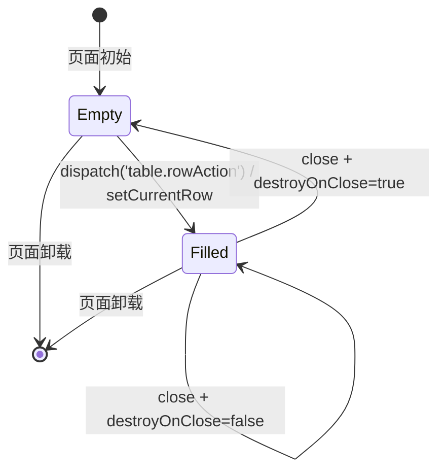
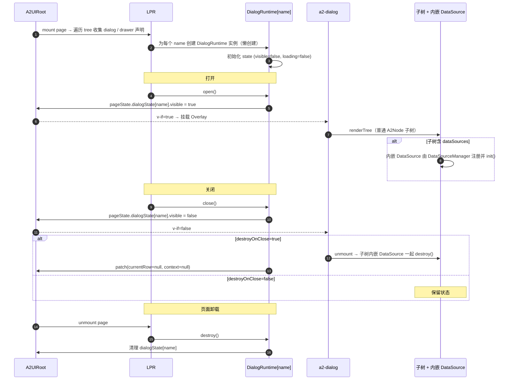
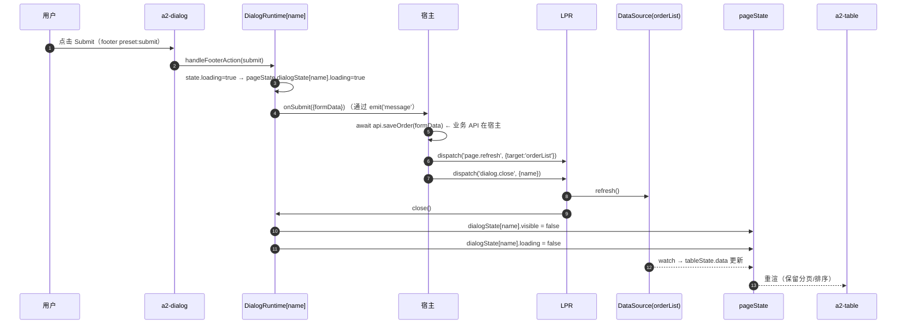
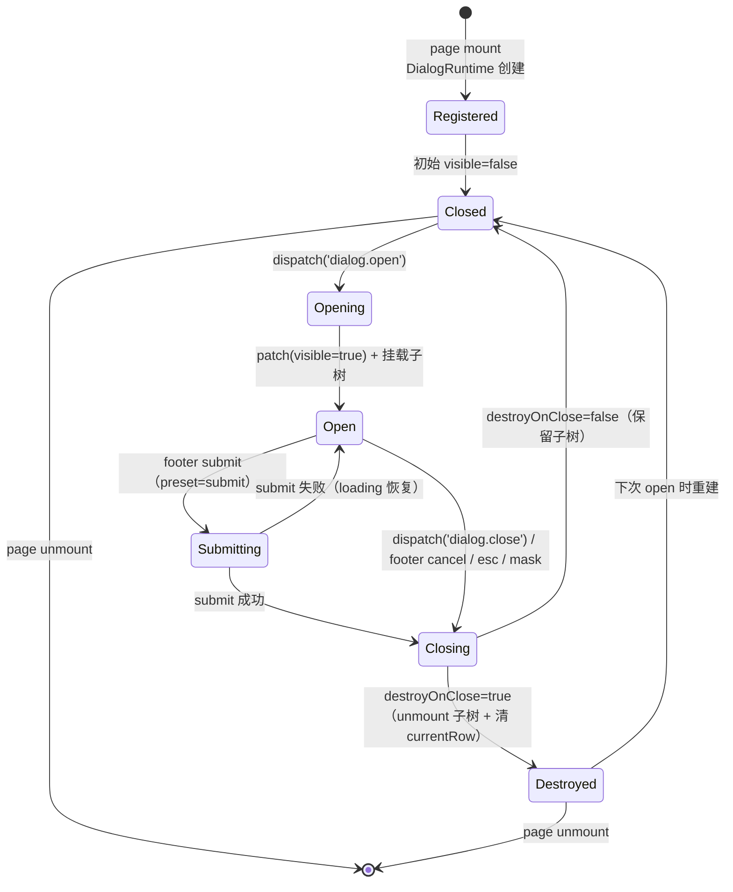
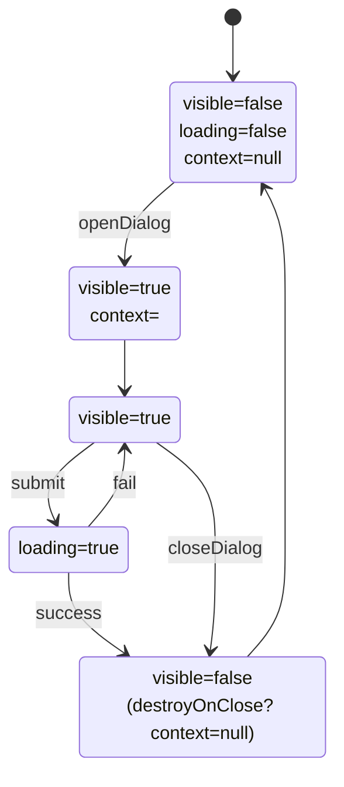
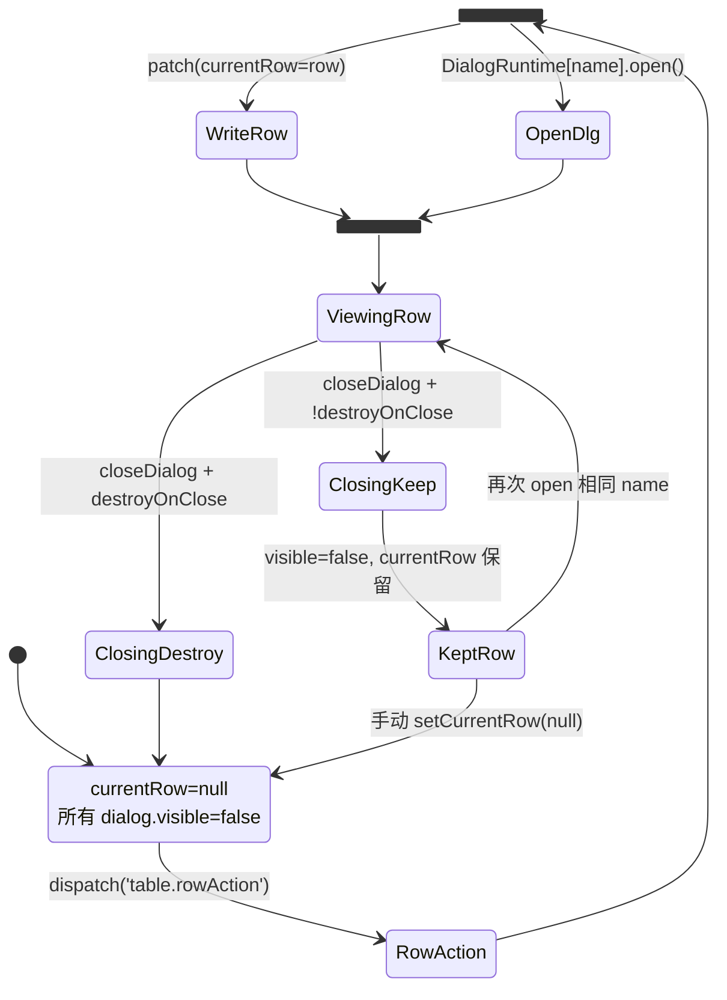
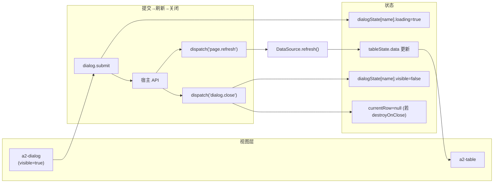

# Dialog / Drawer 管理机制（Light Page Runtime）

> 本文档定义 Light Page Runtime（LPR）中 `a2-dialog` 与 `a2-drawer` 的管理机制：状态模型、打开 / 关闭流程、`currentRow` 绑定、与 PageState / Table 的联动。
>
> 目标：让"点击行 → 打开 Dialog / 编辑 → 打开 Drawer / Dialog 绑定当前行 / 关闭后刷新 Table"这些场景在 Schema 中零胶水表达。
>
> 前置阅读：
> - [Light Page Runtime 设计](/architecture/runtime-design)
> - [PageState 模型设计](/architecture/page-state)
> - [Action System 执行机制](/architecture/action-system)
> - [A2Table × A2Search 联动设计](/architecture/table-design)
>
> 本文档不涉及任何代码实现。

---

## 1. 定位与硬性约束

### 1.1 定位

Dialog / Drawer 在 LPR 中被统一视为 **Overlay 组件**：

> **Overlay 只负责展示；可见性、上下文、生命周期由 LPR 统一管理。**

- Dialog 与 Drawer 走同一套状态模型与调度机制，只有外观（居中弹窗 vs. 侧滑抽屉）不同；
- Overlay 内部子树是普通 A2Node 子树，由 Renderer 正常渲染；
- Overlay 通过 `pageState.currentRow` 与 `dialogState[name].context` 消费"打开时的上下文"。

### 1.2 硬性约束

- ❌ **Dialog / Drawer 不允许自己请求 API**（如需数据，走 DataSource + `refreshOn` 或宿主 dispatch）；
- ❌ **Dialog / Drawer 不允许管理数据源**（不能持有独立 DataSourceManager）；
- ❌ **Dialog / Drawer 不允许直接改 `dialogState.visible`**（只能走 Action / dispatch）；
- ✅ **Dialog / Drawer 只负责展示**：headline / footer / 子树；
- ✅ **可见性由 pageState 单一持有**；
- ✅ **打开 / 关闭走 Action Router → LPR dispatch**。

### 1.3 一句话

> Dialog / Drawer 是「一次性 UI 舞台」：LPR 决定何时开、开时携带哪些道具（`currentRow / context`）、何时关；组件本身只演绎剧本。

---

## 2. DialogState / DrawerState 设计

### 2.1 结构定义

Dialog 与 Drawer 的状态存放于 `pageState.dialogState` / `pageState.drawerState`，均按 `name` 索引：

```jsonc
// pageState.dialogState
{
  "create": {
    "visible":  false,          // 显隐
    "loading":  false,          // 提交中（由 DialogRuntime 自动写入）
    "context":  null,           // 打开时携带的额外上下文
    "openedAt": 0               // 打开时间戳（可选，用于调试与埋点）
  },
  "detail": {
    "visible":  true,
    "loading":  false,
    "context":  { "mode": "view", "source": "row-action" },
    "openedAt": 1725000000000
  }
}

// pageState.drawerState 结构完全对称
{
  "edit": {
    "visible":  false,
    "loading":  false,
    "context":  null,
    "openedAt": 0
  }
}
```

### 2.2 字段职责

| 字段 | 类型 | 谁能写 | 说明 |
| --- | --- | --- | --- |
| `visible` | boolean | Coordinator（dispatch dialog.open/close） | 唯一可见性控制字段；组件禁写 |
| `loading` | boolean | DialogRuntime（submit 期间自动） | 供 footer 按钮显示加载态 |
| `context` | any \| null | Coordinator（open 时写入 payload.context） | 上下文包裹对象；可存 mode / source / extra |
| `openedAt` | number | Coordinator | 打开时的时间戳，用于调试/审计（可选） |

### 2.3 与 currentRow 的分工

- `currentRow` **不放** 到 dialogState 内，而是放在 pageState **顶层**：
  - 好处：跨 Dialog 复用（当同一行同时可被 Detail / Edit 消费时无需重复）；
  - 单一生命周期：Row Action 时写入，`destroyOnClose=true` 关闭时清空；
  - Dialog / Drawer 内部子组件通过 `bindings: $page.<pageId>.currentRow.*` 直接读取。

### 2.4 命名规则

- `name` 是 Schema 里对 Dialog / Drawer 的稳定标识（如 `create / detail / edit`）；
- 同一 page scope 内 dialog name 唯一；drawer name 唯一（两者可同名，因为分属不同命名空间）；
- 若 Dialog 与 Drawer 表达同一意图（如"编辑"既可 Dialog 又可 Drawer），Schema 选择其一即可。

### 2.5 为什么不用一个 boolean 变量

有人会问："为什么不直接 `data.dialogVisible = true`？"

- `dialogState` 是 **以 name 索引的对象**，避免命名冲突；一页可能同时存在多个 Dialog；
- `context` / `loading` 字段与可见性绑定，避免"打开 detail 时另一个 dialog 的 loading 被误改"；
- `openedAt` 是**为调试和审计留出的锚点**——出问题时可从时间线定位。

---

## 3. 打开 / 关闭流程

Dialog 与 Drawer 的打开 / 关闭都通过 LPR 统一调度。核心是 4 类 Action：`openDialog / closeDialog / openDrawer / closeDrawer`。

### 3.1 打开流程（Mermaid）



### 3.2 关闭流程（Mermaid）



### 3.3 三种打开表达方式

Schema 作者可任选其一：

**A. 声明式（推荐）**

```jsonc
{
  "event": "click",
  "type":  "openDialog",
  "payload": {
    "name":    "detail",
    "row":     "$row",
    "context": { "mode": "view" }
  }
}
```

**B. 命令式（宿主）**

```
a2uiRoot.pageRuntime.openDialog('detail', { row, context })
```

**C. emit 兼容模式**

```jsonc
{ "event": "click", "type": "emit", "payload": { "action": "openDetail", "row": "$row" } }
```

宿主收到 message 后调命令式 API。**推荐 A**，最少胶水。

### 3.4 三种关闭表达方式

- **A. Action**：`{ "type": "closeDialog", "payload": { "name": "detail" } }`；
- **B. 命令式**：`a2uiRoot.pageRuntime.closeDialog('detail')`；
- **C. 内建关闭**：Dialog footer 的 preset `cancel/close` 按钮由 DialogRuntime 自动映射到 close。

### 3.5 destroyOnClose 语义

在 Schema 中通过 `props.destroyOnClose` 声明：

| 值 | 关闭时行为 | 适用场景 |
| --- | --- | --- |
| `true`（默认推荐用于新建/编辑） | 子树 unmount；`currentRow / context` 清空；子树内嵌 DataSource（若有）随之销毁 | 新建工单、编辑表单——每次都要新表单 |
| `false` | 子树保留；`currentRow / context` 保留；下次打开状态延续 | 详情预览、只读浏览——保持滚动位置 |

---

## 4. currentRow 绑定机制

`currentRow` 是 Row Action 触发时携带的**行数据快照**，供 Overlay 子树消费。

### 4.1 写入时机

只有以下情况会写 `currentRow`：

| 触发方 | 何时 | 写入内容 |
| --- | --- | --- |
| `openDialog / openDrawer` 的 payload 含 `row` | 打开时 | `payload.row`（经过 `$row` 占位符解析） |
| `page` Action `op:setCurrentRow` | 显式设置 | payload.row |
| 命令式 `pageRuntime.setCurrentRow(row)` | 宿主主动 | 传入的 row |

### 4.2 清空时机

- `closeDialog / closeDrawer` + `destroyOnClose = true`；
- `dispatch('page.setCurrentRow', null)` 显式清空；
- `a2-page` unmount。

`destroyOnClose = false` 的 Dialog 关闭时**不清空** currentRow，保留供下次打开继续使用。

### 4.3 Overlay 子组件如何消费

**方式一：路径绑定（推荐）**

```jsonc
{
  "type": "a2-text-field",
  "props": { "label": "订单号" },
  "bindings": {
    "value": { "type": "path", "value": "$page.orderPage.currentRow.orderNo" }
  }
}
```

**方式二：pageState 绑定（等价，更明确）**

```jsonc
{
  "type": "a2-text",
  "bindings": {
    "text": { "type": "pageState", "value": "currentRow.customerName" }
  }
}
```

**方式三：整体注入 form**

Overlay 打开时把 `currentRow` 拷贝到 `data.form`，让内部字段用普通表单绑定：

```jsonc
{
  "event": "click",
  "type":  "openDialog",
  "payload": {
    "name": "edit",
    "row":  "$row",
    "context": { "mode": "edit" },
    "prefillForm": true              // Coordinator 打开时执行 form <- row
  }
}
```

（`prefillForm` 是 openDialog 载荷的一个可选便利字段。）

### 4.4 currentRow 与并发弹窗

一个 page 只维护 **一个** `currentRow`：

- 若同时打开 Detail 与 Edit（罕见），两者共享同一 `currentRow`；
- 需要区分时用 `dialogState[name].context` 独立携带；
- 不建议同时打开多个"依赖行"的 Overlay。

### 4.5 快照 vs 引用

`currentRow` 是**行数据的浅拷贝快照**：

- 好处：Overlay 期间即使 DataSource 刷新，用户看到的仍是打开时的数据；
- 需要"跟随最新"时，改为 `bindings: pageState.tableState.data[<id>]` 或用 `refreshOn`；
- 若数据结构较大，可以用 `context.rowId` + 直接从 DataSource 查最新（不推荐，牺牲一致性）。

### 4.6 currentRow 生命周期图



---

## 5. Dialog / Drawer 与 PageState 的关系

### 5.1 数据位置

```
pageState (data.$page.<pageId>)
├─ ...
├─ currentRow                     ← Row Action 触发时快照
├─ dialogState
│   ├─ <name-A>.visible/loading/context/openedAt
│   ├─ <name-B>.visible/loading/context/openedAt
│   └─ ...
└─ drawerState
    ├─ <name-C>.visible/loading/context/openedAt
    └─ ...
```

### 5.2 谁读 / 谁写

| 字段 | 读方 | 写方 |
| --- | --- | --- |
| `currentRow` | Overlay 子组件（bindings） | Coordinator（dispatch） |
| `dialogState[n].visible` | a2-dialog 自身（v-if / v-model） | Coordinator（dispatch）→ DialogRuntime.open/close |
| `dialogState[n].loading` | a2-dialog footer 按钮 | DialogRuntime submit 期间自动 |
| `dialogState[n].context` | Overlay 子组件（bindings） | Coordinator（open 时写入） |
| `drawerState[n].*` | a2-drawer / 子组件 | 同上 |

### 5.3 与 tableState / searchState 的关系

- Dialog 常见联动：打开 → 消费 currentRow → 提交 → 关闭 → refresh Table；
- Dialog 内部子表单的 `data.form` 与 pageState 各自独立命名空间，不相互覆盖；
- Dialog 关闭后**Table 保持当前分页 / 排序 / 滚动位置**（除非显式 `page.reset`）。

---

## 6. Dialog / Drawer 生命周期



---

## 7. Dialog 关闭后刷新 Table

这是最常见的联动场景，需要 **提交业务 API → 关闭 Dialog → 刷新 Table** 三步一体。

### 7.1 推荐流程



### 7.2 Schema 声明

```jsonc
{
  "type": "a2-dialog",
  "props": {
    "name":           "create",
    "title":          "新建工单",
    "destroyOnClose": true,
    "footer": [
      { "preset": "cancel" },
      { "preset": "submit",  "props": { "text": "保存" } }
    ]
  },
  "bindings": {
    "visible": { "type": "pageState", "value": "dialogState.create.visible" },
    "loading": { "type": "pageState", "value": "dialogState.create.loading" }
  },
  "child": [
    /* 子表单，用 data.form.* 或 pageState.currentRow.* 绑定 */
  ]
}
```

Dialog footer preset `submit` 会走 DialogRuntime.submit → emit `message` 给宿主。宿主收到 `message.action === 'submit'` 后：

```
await api.saveOrder(payload.formData)
a2uiRoot.pageRuntime.refresh('orderList')
a2uiRoot.pageRuntime.closeDialog('create')
```

**宿主的两行胶水**是不可避免的（因为业务 API 归业务），但除此之外全部由 LPR 承担。

### 7.3 无宿主胶水的变体：使用 submitApi

如果宿主希望**连 API 都由 DataSource 层承载**（简单 CRUD 场景），可用 `submitApi`：

```jsonc
"submitApi": {
  "url":     "/api/orders",
  "method":  "POST",
  "payloadFrom": "formData",
  "onSuccess": {
    "refresh":     "orderList",
    "closeDialog": "create"
  }
}
```

DialogRuntime 调 Transport 提交，成功后 dispatch `page.refresh` + `dialog.close`。这是**完全零胶水**的写法，但仅推荐在轻量 CRUD 中使用。

### 7.4 关闭策略选择表

| 场景 | destroyOnClose | 提交后刷新 |
| --- | --- | --- |
| 新建 | `true` | ✅ refresh |
| 编辑 | `true` | ✅ refresh |
| 详情预览（只读） | `false` | ❌ 无需 refresh |
| 批量删除确认 | `true` | ✅ refresh + clearSelection |

---

## 8. Mermaid 状态流转图

### 8.1 Dialog / Drawer 单实例状态机



### 8.2 pageState.dialogState[name] 字段随状态变化



### 8.3 currentRow 与 Dialog 的联合状态



### 8.4 Dialog 关闭后刷新 Table 的完整状态流



---

## 9. Dialog / Drawer 编排完整 Schema 例子

包含"查看"（Dialog）+"编辑"（Drawer）+"新建"（Dialog）+ 关闭后刷新：

```jsonc
{
  "id": "orderPage",
  "type": "a2-page",
  "dataSources": {
    "orderList": {
      "kind": "http",
      "request": { "url": "/api/orders", "method": "GET" },
      "pagination": { "enabled": true, "pageSize": 20 },
      "auto": true
    }
  },
  "child": [
    {
      "type": "a2-toolbar",
      "child": [
        {
          "type": "a2-button",
          "props": { "text": "新建", "type": "primary" },
          "actions": [
            {
              "event": "click",
              "type":  "openDialog",
              "payload": { "name": "create", "context": { "mode": "create" } }
            }
          ]
        }
      ]
    },
    {
      "type": "a2-table",
      "bindings": {
        "dataSource": { "type": "datasource", "value": "orderList" }
      },
      "props": {
        "columns": [
          { "key": "orderNo", "title": "订单号" },
          {
            "key":   "_actions",
            "title": "操作",
            "type":  "actions",
            "buttons": [
              {
                "text":    "查看",
                "actions": [
                  {
                    "event": "click",
                    "type":  "openDialog",
                    "payload": { "name": "detail", "row": "$row" }
                  }
                ]
              },
              {
                "text":    "编辑",
                "actions": [
                  {
                    "event": "click",
                    "type":  "openDrawer",
                    "payload": { "name": "edit", "row": "$row" }
                  }
                ]
              }
            ]
          }
        ]
      }
    },
    {
      "type": "a2-dialog",
      "props": {
        "name":  "detail",
        "title": "订单详情",
        "destroyOnClose": false,
        "footer": [ { "preset": "close" } ]
      },
      "bindings": {
        "visible": { "type": "pageState", "value": "dialogState.detail.visible" }
      },
      "child": [
        {
          "type": "a2-info-field",
          "props": { "label": "订单号" },
          "bindings": {
            "value": { "type": "path", "value": "$page.orderPage.currentRow.orderNo" }
          }
        },
        {
          "type": "a2-info-field",
          "props": { "label": "客户" },
          "bindings": {
            "value": { "type": "path", "value": "$page.orderPage.currentRow.customerName" }
          }
        }
      ]
    },
    {
      "type": "a2-drawer",
      "props": {
        "name":  "edit",
        "title": "编辑订单",
        "placement": "right",
        "destroyOnClose": true,
        "footer": [
          { "preset": "cancel" },
          { "preset": "submit",  "props": { "text": "保存" } }
        ]
      },
      "bindings": {
        "visible": { "type": "pageState", "value": "drawerState.edit.visible" },
        "loading": { "type": "pageState", "value": "drawerState.edit.loading" }
      },
      "child": [
        {
          "type": "a2-text-field",
          "props": { "label": "订单号", "readonly": true },
          "bindings": {
            "value": { "type": "path", "value": "$page.orderPage.currentRow.orderNo" }
          }
        },
        {
          "type": "a2-text-field",
          "props": { "label": "备注" },
          "bindings": {
            "modelValue": { "type": "path", "value": "form.remark" }
          }
        }
      ]
    },
    {
      "type": "a2-dialog",
      "props": {
        "name":  "create",
        "title": "新建订单",
        "destroyOnClose": true,
        "footer": [
          { "preset": "cancel" },
          { "preset": "submit" }
        ]
      },
      "bindings": {
        "visible": { "type": "pageState", "value": "dialogState.create.visible" }
      },
      "child": [
        /* 表单字段（略） */
      ]
    }
  ]
}
```

宿主端只需两处：

```
onMessage(msg) {
  if (msg.action === 'submit' && msg.preset === 'submit') {
    await api.saveOrder(msg.formData)
    a2uiRoot.pageRuntime.refresh('orderList')
    // 关闭对应 overlay（可从 msg.overlay 或 dialogState.*.visible 推断）
    a2uiRoot.pageRuntime.closeDialog(msg.name) // 或 closeDrawer
  }
}
```

其他行为**零胶水**。

---

## 10. 命令式 API（宿主）

Dialog / Drawer 相关的 pageRuntime 命令式 API：

```
pageRuntime.openDialog(name, { row?, context? })
pageRuntime.closeDialog(name)
pageRuntime.toggleDialog(name)
pageRuntime.setDialogLoading(name, boolean)
pageRuntime.getDialogState(name)         → DialogStateShape

pageRuntime.openDrawer(name, { row?, context? })
pageRuntime.closeDrawer(name)
pageRuntime.toggleDrawer(name)
pageRuntime.setDrawerLoading(name, boolean)
pageRuntime.getDrawerState(name)         → DrawerStateShape

pageRuntime.setCurrentRow(row)           // 不打开任何 overlay，仅写入
pageRuntime.getCurrentRow()              → any
```

命令式 API 与 Action 走同一 Coordinator，两条路径行为一致。

---

## 11. Dialog 内嵌 DataSource 的支持

Overlay 内部子树可以自持 DataSource（用于"编辑弹窗需要拉取字典数据"这类场景）：

```jsonc
{
  "type": "a2-dialog",
  "props": { "name": "create" },
  "dataSources": {
    "categoryOptions": {
      "kind": "http",
      "request": { "url": "/api/categories", "method": "GET" },
      "cache": { "enabled": true, "ttl": 300000 }
    }
  },
  "child": [
    {
      "type": "a2-select",
      "bindings": {
        "options": { "type": "datasource", "value": "categoryOptions" }
      }
    }
  ]
}
```

规则：

- 内嵌 DataSource 属于 Dialog 子树 scope；
- `destroyOnClose = true` 时 Dialog 关闭同时销毁；
- `destroyOnClose = false` 时保留，避免每次重新拉取；
- 内嵌 DataSource 不允许跨 Dialog / 父 page 引用（保持隔离）。

**这里"Dialog 不允许自己请求 API"的约束仍然成立**——请求由 DataSource 负责，Dialog 只是 DataSource 的载体作用域。

---

## 12. 反模式清单

| ❌ 反模式 | ✅ 正确做法 |
| --- | --- |
| Dialog 内 `mounted() { fetch(url) }` | 用 `dataSources` 声明，DataSource 负责 |
| Dialog 内 `data.dialogVisible = true` 直接改 | 走 `openDialog` Action |
| Row Action emit → 宿主写 `dialogVisible=true` + 保存 row | 用 `openDialog` + `row:$row`，零胶水 |
| Dialog `v-model:visible` 绑到 `data.someFlag` | 绑到 `pageState.dialogState[name].visible` |
| 多个 Dialog 共用一个 `visible` ref | 每个 Dialog 独占 `dialogState[name]` |
| Dialog 提交后组件里直接 `tableRef.reload()` | 通过 `dispatch('page.refresh')` |
| currentRow 硬编码或从 window 挂载 | 用 `openDialog` payload.row `$row` |

---

## 13. 与既有实现对接

现有代码可作为落地参考（本文档不要求任何代码改动）：

- DialogRuntime（visible / loading / footer preset / submit）：[DialogRuntime.ts](file:///d:/work/program/tineco/UI/a2ui-vue-engine/packages/a2ui-vue-engine/src/dialog-runtime/DialogRuntime.ts)
- Dialog 组件：[A2Dialog.vue](file:///d:/work/program/tineco/UI/a2ui-vue-engine/packages/a2ui-vue-engine/src/components/A2Dialog.vue)
- Drawer 组件：[A2Drawer.vue](file:///d:/work/program/tineco/UI/a2ui-vue-engine/packages/a2ui-vue-engine/src/components/A2Drawer.vue)
- Overlay 底层：[A2Overlay.vue](file:///d:/work/program/tineco/UI/a2ui-vue-engine/packages/a2ui-vue-engine/src/components/A2Overlay.vue)

LPR 落地后，DialogRuntime 实例由 LPR 管理，`visible` 由 `pageState.dialogState[name].visible` 承载；本文档描述的是**收敛之后**的模型。

---

## 14. 设计原则回顾

- **只做展示**：Dialog / Drawer 不 fetch、不管数据源；
- **唯一可见性来源**：`pageState.dialogState[name].visible`；
- **currentRow 快照**：Row Action 打开时快照，避免受后续数据刷新影响；
- **destroyOnClose 语义分离**：新建/编辑用 `true`，只读预览用 `false`；
- **零胶水开关**：`openDialog / closeDialog / openDrawer / closeDrawer` 覆盖 95% 场景；
- **提交后刷新明确**：submit 走宿主业务 API → 宿主 dispatch refresh + close；
- **可回放**：所有开关都走 dispatch，可日志、可 mock；
- **可拆除**：未使用 Dialog / Drawer 的 Schema 完全不激活 DialogRuntime。

---

_本文档仅为设计文档；不包含任何代码；Dialog / Drawer 的所有联动通过 LPR 与 pageState 完成；组件层只负责展示。_
