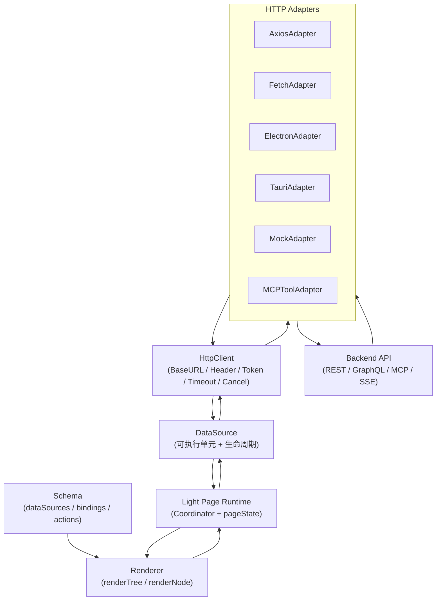
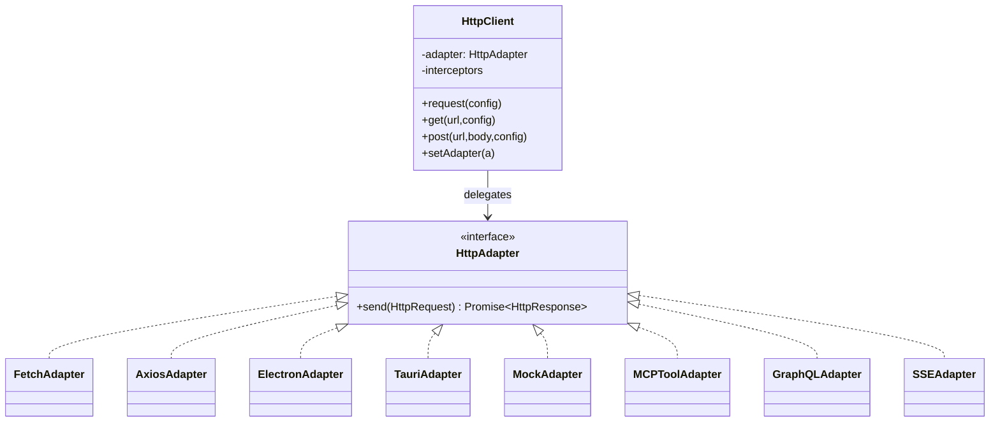
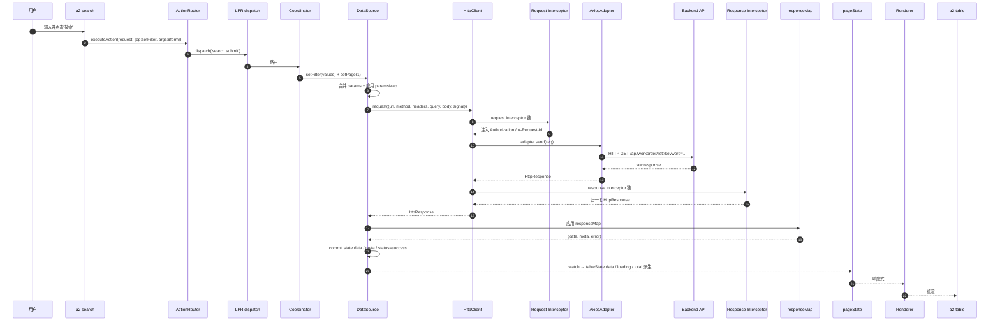
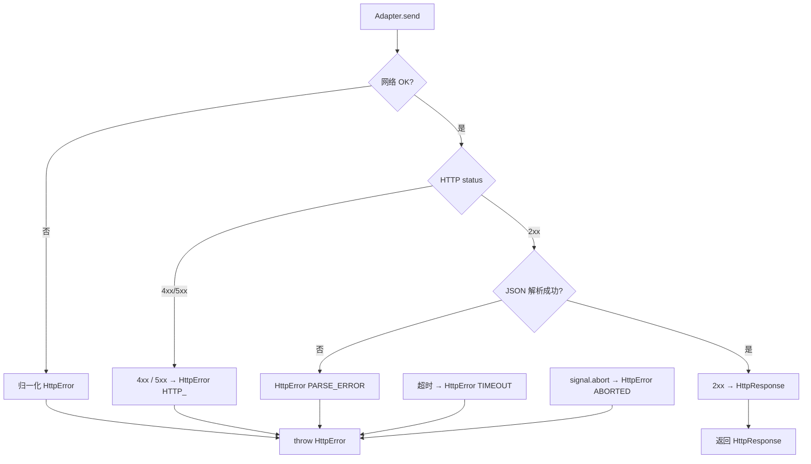
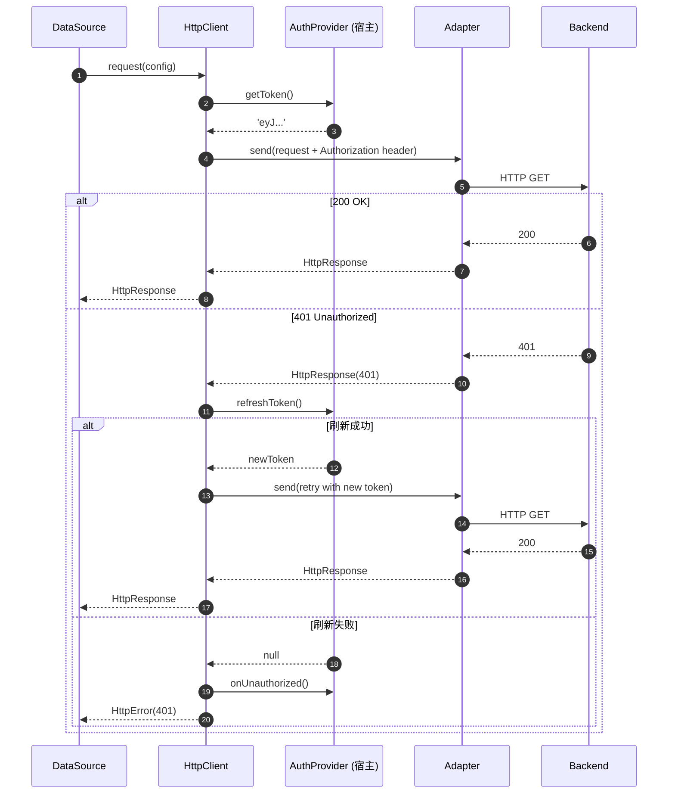
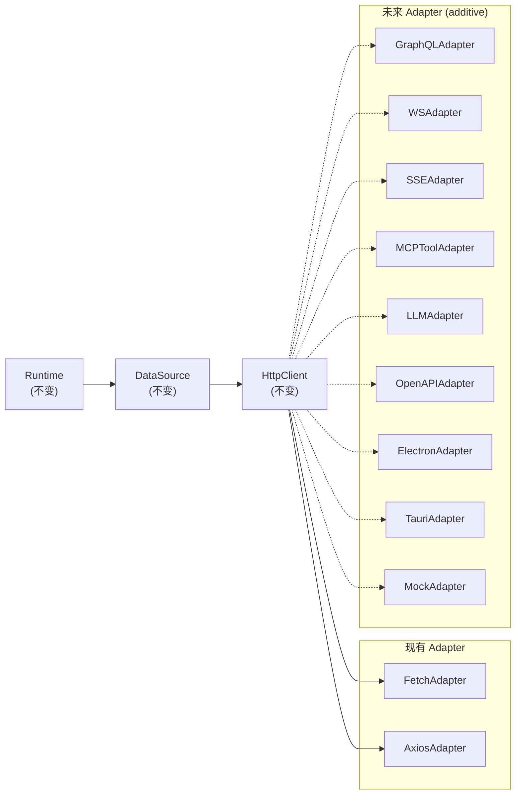

# HttpClient 抽象层设计

> 本文档定义 A2UI Runtime 的 **HttpClient 抽象层**：为 DataSource 与具体网络库（axios / fetch / Electron IPC / Tauri / MCP）之间提供一层可替换、可测试、可扩展的解耦层。
>
> 前置阅读：
> - [Light Page Runtime 设计](/architecture/runtime-design)
> - [DataSource 设计](/architecture/datasource)
> - [DataSource API Binding 设计](/architecture/datasource-binding)
> - [DataSource 执行规范](/architecture/datasource-execution)
> - [Action System 执行机制](/architecture/action-system)
>
> 本文档不写业务代码；不出现 axios / fetch 的使用教程；只描述架构位置、职责、契约与演进策略。

---

## 1. 定位与硬性约束

### 1.1 定位

> **HttpClient 是 DataSource 与网络库之间的抽象层。它决定"怎么发"，但不决定"发什么"。**

- **DataSource** 决定："发什么"（url / method / params / responseMap）、"何时发"（生命周期）、"如何治理"（cache / retry / debounce）；
- **HttpClient** 决定："怎么发"（BaseURL / Header / Token / Timeout / Cancel / Upload / Download）、"用什么发"（Adapter 选择）；
- **Adapter** 决定："底层网络原语"（axios instance / fetch / IPC / MCP client）。

三层职责严格分离，任何一层可独立替换、独立测试。

### 1.2 硬性约束

- ❌ Runtime 不 `import axios`；
- ❌ Runtime 不 `fetch(...)`；
- ❌ DataSource 不直接持有 Adapter；
- ❌ HttpClient 不解析响应结构（`responseMap` 是 DataSource 的事）；
- ❌ HttpClient 不做缓存 / 重试 / 分页（都是 DataSource 的事）；
- ✅ HttpClient 只做"传输治理"；
- ✅ Adapter 只做"具体协议原语"；
- ✅ 所有网络请求经由 `HttpClient.request(...)` 统一入口。

### 1.3 一句话

> DataSource 说"要什么"，HttpClient 说"怎么送"，Adapter 说"用什么送"。三层各司其职，Runtime 与网络实现完全解耦。

---

## 2. 为什么需要 HttpClient

### 2.1 Runtime 为什么不能直接调用 axios

如果 Runtime 直接依赖 axios：

- **强耦合**：升级 axios 大版本、切换到 undici / ky 都要动 Runtime 主干；
- **不可测试**：单测里要 stub 全局 axios，测试双向污染；
- **平台锁死**：axios 在 Node / Electron / WeChat 小程序 / RN 表现不一，跨端难；
- **不可扩展**：想接 MCP / GraphQL / SSE 时必须"再挂一套 client"；
- **协议驱动被破坏**：`import axios` 本质是让 Runtime 感知具体网络库，违反"Runtime 只解释 Schema"。

### 2.2 DataSource 为什么不能直接请求 API

DataSource 是**可执行单元**（见 [datasource-execution.md](/architecture/datasource-execution)），承担的是：

- 请求生命周期（6 阶段）；
- 参数合并、responseMap 应用；
- Cache / Retry / Debounce / Inflight dedupe；
- 五态状态机。

这些都是**业务无关的运行时治理**。如果 DataSource 里再夹带 `axios.create({...})`：

- **职责漂移**：DataSource 变成了"半个 axios 封装"；
- **可替换性丧失**：想切换到 fetch 就得重写 DataSource；
- **配置分散**：BaseURL / 拦截器散落在 DataSource 与 Transport 层；
- **难以 mock**：单测无法在不改 DataSource 的情况下替换 transport。

### 2.3 为什么需要统一网络抽象层

统一 HttpClient 提供 4 项**架构收益**：

1. **可替换**：切换底层库不改 Runtime；
2. **可测试**：Adapter 可换成 MockAdapter，单测无需网络；
3. **一致治理**：Header / Token / Timeout / Cancel 一处配置，全局生效；
4. **面向未来**：GraphQL / WebSocket / SSE / MCP / OpenAPI SDK 都可作为 Adapter 挂载。

### 2.4 HttpClient 在整个 Runtime 中的职责

一句话：**HttpClient 是"请求治理 + Adapter 选择"层，不是"业务客户端"**。

具体：

- 承接 DataSource 的 request 请求；
- 应用全局配置（BaseURL / Header / Token / Timeout）；
- 委派给指定 Adapter 发送；
- 归一化响应格式（返回统一 `HttpResponse` 结构）；
- 归一化错误（返回统一 `HttpError` 结构）；
- 提供 CancelToken / Upload / Download 通用能力；
- **不解析业务字段**（如 `data.list / code`——那是 responseMap 的职责）。

---

## 3. HttpClient 在架构中的位置

### 3.1 分层图



### 3.2 每层职责

| 层 | 职责 | 不做的事 |
| --- | --- | --- |
| **Schema** | 描述"要什么" | 不含 JS 逻辑 |
| **Renderer** | 树 → VNode（纯函数） | 不发请求 |
| **Page Runtime** | 事件路由、pageState、Coordinator | 不发请求 |
| **DataSource** | 生命周期、参数合并、responseMap、cache/retry/debounce | 不选择底层库、不管 header |
| **HttpClient** | BaseURL / Header / Token / Timeout / Cancel / Upload / Download | 不做业务映射、不做重试语义、不解析 status/data |
| **Adapter** | 特定协议 / 库的原语调用 | 不做配置合并、不做鉴权 |
| **Backend API** | 真实服务端 | —— |

### 3.3 三条明确的边界

- **Schema ↔ DataSource**：通过 `dataSources / bindings / actions` 声明；
- **DataSource ↔ HttpClient**：通过 `HttpRequest / HttpResponse / HttpError` 契约；
- **HttpClient ↔ Adapter**：通过 `HttpAdapter` 接口（`send(request) → Promise<HttpResponse>`）。

任何一层跨越边界（例如 Renderer 里 `import HttpClient`）都视为架构违规。

---

## 4. HttpClient 职责清单

### 4.1 核心方法

| 方法 | 说明 |
| --- | --- |
| `request(config)` | 统一入口，所有 HTTP 请求最终走它 |
| `get(url, config?)` | `request({ method:'GET', url, ... })` 的语义糖 |
| `post(url, body?, config?)` | POST |
| `put(url, body?, config?)` | PUT |
| `patch(url, body?, config?)` | PATCH |
| `delete(url, config?)` | DELETE |
| `head / options` | 语义糖（可选） |
| `upload(url, form, config?)` | 上传 |
| `download(url, config?)` | 下载（返回 blob / stream） |

**所有语义糖最终委托给 `request(...)`**——单一入口原则。

### 4.2 统一处理的能力

| 能力 | 说明 |
| --- | --- |
| **BaseURL** | 全局前缀（如 `/api`），也可按 tag 分组（如 `apiA / apiB`） |
| **Header** | 全局默认 header（如 `Content-Type / Accept`） |
| **Token / Authorization** | 由 authProvider 注入 `Authorization: Bearer ...` |
| **Cookie** | withCredentials 配置；跨域时的 SameSite 策略仅由环境决定 |
| **Timeout** | 全局默认 + 单请求覆盖 |
| **CancelToken / AbortSignal** | 与 DataSource 的 AbortController 打通 |
| **Retry**（传输层） | 仅针对**幂等**方法与网络级错误；业务重试在 DataSource 层 |
| **Interceptors**（受控） | Request / Response / Error 三类拦截器；HttpClient 内建、可注入 |
| **Upload / Download** | 进度事件、断点续传（可选）、大文件分片（可选） |
| **Serialization** | 请求 body / query 序列化；响应 JSON / text / blob / stream 解析 |
| **Logging / Audit** | 请求 ID、耗时、结果类别的可选埋点 |

### 4.3 不属于 HttpClient 的能力

以下能力**明确不属于** HttpClient：

- ❌ 响应字段映射（`data.list / total`）——那是 DataSource `responseMap`；
- ❌ Cache（含 TTL / LRU）——DataSource `cache`；
- ❌ Debounce / Inflight dedupe——DataSource 内建；
- ❌ 分页 / 排序 / 过滤 params 合并——DataSource `paramsMap`；
- ❌ 业务错误重试（`code !== 0`）——DataSource `retry`；
- ❌ 状态派生到 pageState——LPR watcher；
- ❌ UI 展示 loading——组件绑定 `state.status`；
- ❌ 跨域实施——运行环境（见 §7）；
- ❌ 全局请求编排 / 并发调度——业务或 DataSource。

**HttpClient 只负责一件事：把一个请求描述可靠地发出去、把响应可靠地拿回来。**

### 4.4 请求 / 响应契约

**HttpClient 层的对内契约**（DataSource ↔ HttpClient）：

```
HttpRequest {
  url:          string
  method:       'GET' | 'POST' | 'PUT' | 'PATCH' | 'DELETE' | ...
  headers?:     Record<string, string>
  query?:       Record<string, any>
  body?:        any
  timeout?:     number
  signal?:      AbortSignal
  responseType?:'json' | 'text' | 'blob' | 'stream'
  meta?:        { source: 'datasource:<id>', op: 'fetch' | 'refresh' | ... }
  onUploadProgress?:   Function
  onDownloadProgress?: Function
}

HttpResponse {
  status:       number
  ok:           boolean
  headers:      Record<string, string>
  data:         any            // 原始 body 反序列化后（JSON/text/blob/stream）
  raw?:         unknown        // Adapter 原始响应（可选）
  request:      HttpRequest    // 回填便于日志
  meta?:        Record<string, any>
}

HttpError {
  code:      'NETWORK' | 'TIMEOUT' | 'ABORTED' | 'HTTP_<status>' | 'PARSE_ERROR' | 'UNKNOWN'
  message:   string
  status?:   number
  retriable: boolean
  cause?:    unknown
  request?:  HttpRequest
  response?: HttpResponse
}
```

**这份契约是 HttpClient 的公开合约**——所有 Adapter 必须遵守。

---

## 5. Adapter 设计

### 5.1 为什么采用 Adapter Pattern

Adapter Pattern（适配器模式）的价值：

- **依赖倒置**：HttpClient 依赖抽象接口 `HttpAdapter`，而非具体库；
- **可替换**：切换 axios → fetch → IPC 仅换 Adapter 实例；
- **可组合**：多个 Adapter 可按规则组合（如域名前缀路由到不同 Adapter）；
- **可测试**：MockAdapter 在单测环境替换掉网络；
- **可演进**：新增 GraphQL / MCP / SSE 都是新增 Adapter，不改 HttpClient；
- **单一职责**：Adapter 只关心具体协议的原语转换，与治理无关。

### 5.2 Adapter 契约

**唯一方法**：

```
HttpAdapter.send(request: HttpRequest): Promise<HttpResponse>
```

- 收到 `HttpRequest`；
- 返回 `HttpResponse`（成功）或抛出 `HttpError`（失败）；
- 支持 `request.signal` 中断；
- 不解析业务字段；
- 不修改 request（如需修改用 Interceptor，不在 Adapter 内）。

### 5.3 内建 Adapter 清单

| Adapter | 场景 | 说明 |
| --- | --- | --- |
| **FetchAdapter** | 浏览器默认 / SSR / Edge / Worker | 用原生 fetch；零依赖；跨端最兼容 |
| **AxiosAdapter** | 需要 axios 特性（如已有拦截链 / 自动 JSON / 大量老代码） | 通过 `axios.create` 单例封装 |
| **ElectronAdapter** | 桌面 App | 走主进程 IPC，绕过跨域，可访问文件系统 |
| **TauriAdapter** | 桌面 App | 走 Tauri 命令，天然 CORS 豁免 |
| **MockAdapter** | 单测 / Playground / Storybook | 从内存 fixtures 返回 |
| **MCPToolAdapter**（未来） | MCP Tool 调用 | 把 request 转成 tool.args；response 从 tool.content 归一 |
| **GraphQLAdapter**（未来） | GraphQL 查询 | 把 request.body 转成 `query + variables`；顶部 error 归一化 |
| **SSEAdapter / WSAdapter**（未来） | 长连接 | 单次 `send` 建立连接，返回一个 append-only 数据流 |

### 5.4 Adapter 关系图



### 5.5 Adapter 选择策略

HttpClient 支持三种 Adapter 选择方式：

- **单一 Adapter**：全局配置默认；
- **前缀路由**：按 `baseURL` 前缀选择（如 `/api/*` → AxiosAdapter，`/mcp/*` → MCPToolAdapter）；
- **元信息路由**：按 `request.meta.kind` 选择（如 `kind:'sse'` → SSEAdapter）。

**路由策略只影响 Adapter 选择，不影响 request/response 契约。**

### 5.6 Adapter 演进原则

- 新增 Adapter：不改 HttpClient / Runtime / DataSource；
- 修改 Adapter：不能破坏 HttpAdapter 接口契约；
- 替换 Adapter：外部通过 `httpClient.setAdapter(a)` 或初始化配置注入。

---

## 6. Runtime 调用流程

### 6.1 完整链路 Mermaid



### 6.2 六段边界清晰

沿着调用链自顶向下的**六段边界**：

1. **Schema → Renderer**：声明 → VNode；
2. **Renderer → LPR**：交互 → dispatch；
3. **LPR → DataSource**：dispatch → command；
4. **DataSource → HttpClient**：command → request；
5. **HttpClient → Adapter**：request → send；
6. **Adapter → Backend**：send → 真实网络。

**从任一层往下看，只感知直接下游一层的契约**——这是"依赖倒置 + 契约驱动"的直接体现。

### 6.3 请求接力对照

| 环节 | 输入 | 输出 | 谁负责 |
| --- | --- | --- | --- |
| Search submit | 表单值 | Action + payload | 组件 emit |
| ActionRouter | Action | dispatch | Router |
| Coordinator | dispatch | DS 命令 | 命令映射表 |
| DataSource | 命令 + args | `HttpRequest` | 参数合并 + paramsMap |
| HttpClient | `HttpRequest` | `HttpResponse` | 全局配置 + Interceptor + Adapter |
| Adapter | `HttpRequest` | 底层 send | 具体网络库 |
| DataSource | `HttpResponse` | `state.data/meta` | responseMap + commit |
| watch | `state` 变化 | `pageState` 派生 | LPR watcher |
| Vue | `pageState` 变化 | DOM patch | Vue 响应式 |

---

## 7. 错误处理

HttpClient 是错误归一化的**唯一入口**。DataSource 拿到的永远是**结构化的 `HttpResponse` 或 `HttpError`**，不是 axios / fetch 各自的怪异结构。

### 7.1 错误来源分类

| 分类 | 典型情形 | HttpClient 处理 |
| --- | --- | --- |
| **HTTP 错误** | 4xx / 5xx | 归一化 `HttpError { code:'HTTP_<status>', status, retriable }` |
| **业务错误** | 2xx + `code !== 0` | HttpClient **不判断**，作为成功响应交给 DataSource；由 DataSource 依 responseMap.code 决定 |
| **网络错误** | 断网 / DNS / 连接拒绝 | `HttpError { code:'NETWORK', retriable:true }` |
| **超时** | 达到 timeout | `HttpError { code:'TIMEOUT', retriable:true }` |
| **主动中断** | signal.abort() | `HttpError { code:'ABORTED', retriable:false }`；DataSource 静默 |
| **解析错误** | JSON 解析失败 / responseType 不匹配 | `HttpError { code:'PARSE_ERROR', retriable:false }` |
| **未知** | 其他 | `HttpError { code:'UNKNOWN', retriable:false }` |

### 7.2 分工

- **HttpClient**：归一化传输层错误 → 返回 `HttpError`；不做重试；
- **DataSource**：拿到 `HttpError` 后按 `retry` 声明决定是否重试；把 error 写入 `state.error`；
- **LPR watcher**：把 `state.error` 派生到 `pageState.tableState.error`；
- **组件**：`state.error !== null` → 展示错误态。

**HttpClient 不写 pageState，不 emit UI 事件**——错误只走返回值。

### 7.3 重试（Retry）分层

- **HttpClient 的传输层重试**：可选、默认关闭；仅覆盖幂等方法（GET / HEAD / OPTIONS）+ 网络级错误；避免与 DataSource 重试语义重复；
- **DataSource 的业务级重试**：由 `retry` 声明，指数退避；覆盖网络 + 传输 + 业务错误的 `retriable` 判定；
- **两者互补**：HttpClient 处理 TCP / DNS 抖动；DataSource 处理"要不要再试"的语义决策。

### 7.4 Loading / Error 状态如何返回

**HttpClient 层无状态**。所有"状态"都由 DataSource 承担：

- 发起前：DataSource 把 `state.status` 置 `loading / refreshing`；
- 成功：DataSource commit `state.data / meta / status=success`；
- 失败：DataSource 写 `state.error / status=error`；
- 主动中断：DataSource **不改状态**；
- 一切派生到 pageState 由 LPR watcher 完成。

**HttpClient 只是"函数"——请求进、响应出**。

### 7.5 错误路径 Mermaid



---

## 8. 跨域（CORS）

### 8.1 HttpClient 是否负责跨域？

**否。**

CORS 是浏览器 + 服务端 + 部署环境三方共同决定的**运行时约束**，不是应用层协议。HttpClient 无法在 Runtime 内"实现跨域"——它只能：

- 声明 `withCredentials` 配合服务端 `Access-Control-Allow-Credentials`；
- 由 Interceptor 附加 `Origin` 相关 header（浏览器会自动处理，Runtime 通常无需干预）。

任何试图在 Runtime 内"绕开 CORS"的做法都会引入更大的架构负债。

### 8.2 Runtime 是否需要关心跨域？

**不需要。**

Runtime 的职责边界到 HttpClient 为止；HttpClient 的下游是 Adapter；Adapter 在浏览器语境里由浏览器处理 CORS。Runtime 层面看到的只有"请求成功 / 失败"。

### 8.3 推荐方案（按环境）

| 环境 | 推荐方案 | 说明 |
| --- | --- | --- |
| **开发环境** | Vite Proxy | `server.proxy: { '/api': target }`；同源；开发调试便利 |
| **生产环境** | Nginx / 网关反向代理 | 前后端同域；网关做 CORS / 鉴权 / 限流 |
| **Electron** | 主进程 IPC | 走 `ElectronAdapter`，直连后端，绕过 CORS |
| **Tauri** | Tauri Command | 走 `TauriAdapter`，同 Electron |
| **测试环境** | MockAdapter | 无网络，完全绕过 CORS 讨论 |

**跨域属于运行环境，不属于 Runtime。**

### 8.4 若确需在浏览器直连三方域名

- 服务端配 CORS（`Access-Control-Allow-Origin` 等 header）；
- HttpClient 层配 `withCredentials: true`（仅在需要 Cookie 时）；
- 无 CORS 时不要在 HttpClient 里做"跨域降级"（如 iframe / JSONP）——那些属于兼容层，不属于 Runtime。

---

## 9. 认证机制

### 9.1 认证由 HttpClient 统一处理

**认证是"传输治理"**，属于 HttpClient。DataSource / Renderer / 组件不感知任何 token / cookie。

### 9.2 支持的认证形态

| 类型 | 处理方式 | 说明 |
| --- | --- | --- |
| **Bearer Token / JWT** | Request Interceptor 附加 `Authorization: Bearer <token>` | 最常见 |
| **Cookie / Session** | 设置 `withCredentials: true` | 依赖同源或 CORS 允许凭证 |
| **API Key** | Interceptor 附加自定义 header | 如 `X-API-Key: ...` |
| **HMAC / 签名** | Interceptor 计算签名后附加 header | 如金融场景 |
| **Refresh Token** | Response Interceptor 检测 401 → 刷新 → 重试原请求 | 由 HttpClient 内建或宿主注入 |
| **OAuth2 flow** | 由宿主实现 auth flow；HttpClient 只消费 token | HttpClient 不做 OAuth 流程 |

### 9.3 AuthProvider 抽象

HttpClient 内部接受一个**可选的** `AuthProvider`：

```
AuthProvider {
  getToken(): Promise<string | null>
  refreshToken(): Promise<string | null>
  onUnauthorized(): void         // 401 时的钩子
}
```

- HttpClient 在 request interceptor 里调 `getToken` 获取当前凭证；
- 401 时调 `refreshToken`；成功则重放原请求；失败则调 `onUnauthorized`；
- **AuthProvider 由宿主注入**，具体实现（Vuex / Pinia / cookie 读取）与 Runtime 无关。

### 9.4 Runtime 与认证的边界

- ❌ Runtime 不知道 token 是什么；
- ❌ Runtime 不解析 JWT payload；
- ❌ Runtime 不写 `document.cookie`；
- ✅ Runtime 只调用 HttpClient；
- ✅ HttpClient 只调用 AuthProvider；
- ✅ AuthProvider 由宿主实现，与业务耦合。

### 9.5 认证流程 Mermaid



**Runtime 完全不知道以上流程的细节——它只知道请求成功或失败。**

---

## 10. 未来扩展能力

HttpClient + Adapter 架构的 **可扩展性核心** 在于：新协议 / 新数据源不修改 Runtime 与 DataSource 主干，只增加 Adapter 与 Adapter 选择规则。

### 10.1 GraphQL

- 新增 `GraphQLAdapter`：把 `HttpRequest.body` 视为 `{ query, variables }`；
- DataSource 声明 `kind:'graphql'` + `variablesMap`；
- HttpClient 完全无感知（Adapter 转换）；
- Runtime 完全无感知。

### 10.2 WebSocket / SSE

- 新增 `WSAdapter / SSEAdapter`：`send(request)` 建立长连接并暴露 append-only 数据流；
- DataSource 声明 `kind:'ws' / 'sse'` + `streaming.appendMode`；
- `state.data` 按 append 模式增长；
- 组件通过 `bindings.dataSource` 消费。

### 10.3 MCP Tool

- 新增 `MCPToolAdapter`：把 `HttpRequest` 转成 MCP `tool.call`；
- DataSource 声明 `kind:'mcp'`；
- Runtime 依旧只看到 `HttpResponse`；
- 便利之处：Coordinator 可对 MCP tool 使用同样的 refresh / cache / retry。

### 10.4 AI Service

- 大模型推理 API 通常是 SSE 或流式 chunked；
- 通过 `SSEAdapter` 或自定义 `LLMAdapter` 接入；
- 支持 tokens 计费 header、模型切换、流式 append 都在 Adapter 层内聚。

### 10.5 OpenAPI SDK

- 若某个后端有官方 SDK，可包装为 `OpenAPIAdapter`，把 `HttpRequest` 转成 SDK 方法调用；
- Runtime 依旧不变；
- 好处：类型安全、自动化 SDK 更新。

### 10.6 扩展的四个约束

1. **契约不变**：新 Adapter 仍返回 `HttpResponse` / 抛 `HttpError`；
2. **Runtime 零改动**：DataSource / HttpClient / Renderer / LPR 主干不动；
3. **配置在 Schema**：Adapter 特有配置通过 `dataSources.<id>.request.*` 声明；
4. **选择由路由**：HttpClient 通过前缀 / meta 路由到相应 Adapter。

### 10.7 扩展生态图



---

## 11. 设计原则

HttpClient 抽象层严格遵循以下原则：

- **高内聚**：BaseURL / Header / Token / Timeout / Cancel 集中在 HttpClient；
- **低耦合**：Runtime / DataSource / Renderer / 组件均不依赖具体网络库；
- **Adapter Pattern**：HttpClient 依赖抽象 `HttpAdapter`，具体实现可替换；
- **Dependency Inversion**：高层模块（Runtime）不依赖低层实现（axios），只依赖抽象；
- **可替换**：切换底层库通过 `httpClient.setAdapter(...)` 一步完成；
- **可测试**：MockAdapter 覆盖所有单测场景，无需网络；
- **与 Runtime 解耦**：Runtime 通过契约（`HttpRequest / HttpResponse / HttpError`）与网络层通信，Runtime 主干不引入任何具体库；
- **单一入口**：所有请求最终经 `HttpClient.request(...)`；
- **契约稳定**：Adapter 契约 `send(HttpRequest) → Promise<HttpResponse>` 是唯一扩展点；
- **零业务映射**：HttpClient 不解析业务字段，不管 `code / list / total`；
- **零状态**：HttpClient 层无 pageState / 无 loading ref / 无缓存。

---

## 12. Architecture Decision Record（ADR）

### ADR: 引入 HttpClient 抽象层作为 A2UI Runtime 的网络门面

**Status**: Accepted（设计文档）

**Context**：

当前 A2UI Runtime 中，DataSource 已经具备生命周期与治理能力，但底层网络实现仍以 fetch 直连方式存在，未来将面临：

- 需要支持 Electron / Tauri 等桌面环境（浏览器 API 表现不一致、需要 IPC）；
- 需要接入 MCP Tool / GraphQL / SSE / WebSocket / LLM 等异构协议；
- 需要统一的鉴权、超时、取消、上传下载能力；
- 需要在单测中无网络运行；
- 需要跨平台一致的错误归一化。

如果每种新协议都在 DataSource 内部叠加分支，会造成 DataSource 职责膨胀、可维护性下降。

**Decision**：

在 DataSource 与网络库之间引入 **HttpClient 抽象层 + Adapter Pattern**。

- HttpClient 承担：BaseURL / Header / Token / Timeout / Cancel / Interceptor / Upload / Download / Error 归一化；
- Adapter 承担：具体协议原语（axios / fetch / Electron / Tauri / MCP / GraphQL / SSE / Mock）；
- DataSource 只知道 `HttpClient.request(...)`，不知道底层是什么。

**Consequences**：

**正向**：

- Runtime 主干与具体网络库解耦；
- 新协议以 Adapter 形式增量扩展，Runtime / DataSource 零改动；
- 单元测试可用 MockAdapter；
- 认证 / 鉴权 / 超时 / 取消一处配置全局生效；
- Runtime 可跨浏览器 / Node / Electron / Tauri / SSR / Worker 多环境运行。

**负向**：

- 引入一层间接调用；
- 需要维护 HttpAdapter 契约稳定；
- 需要引导 API 使用者尊重"不要在 Runtime 里直接调 axios / fetch"的约束。

**Alternatives Considered**：

1. **直接在 DataSource 里叠加协议分支**（继续在 transport.ts 内加 if/else）
   - 优点：短期简单
   - 缺点：DataSource 越来越像"半个 axios"；协议爆炸；不可测；不能跨端。

2. **每个协议单独一个 DataSource kind + 独立 transport**
   - 优点：分文件、代码隔离
   - 缺点：鉴权 / 超时 / 拦截器要重复实现 N 次；单测复杂度高；无法复用。

3. **只封装 axios（不做 Adapter）**
   - 优点：迅速统一
   - 缺点：仍然与 axios 强耦合；无法切到 fetch / MCP；跨端能力受限。

4. **HttpClient + Adapter Pattern（本 ADR）** ← 采纳
   - 优点：见 Consequences 正向
   - 缺点：可控

**Rationale**：

- 依赖倒置：Runtime 依赖抽象而非具体；
- 面向未来：AI / MCP / SSE 等场景是明确的近期需求；
- 演进代价可控：Adapter 是增量新增，不动主干；
- 与其他架构文档一致：本 ADR 与 `runtime-design.md` / `datasource-execution.md` 的"协议驱动 / 单一网关 / additive 扩展"完全对齐。

**Status Note**：

本 ADR 仅为设计文档。落地实现将遵循本文档规定的契约（`HttpRequest / HttpResponse / HttpError / HttpAdapter`）；已有的 [transport.ts](file:///d:/work/program/tineco/UI/a2ui-vue-engine/packages/a2ui-vue-engine/src/data-source/transport.ts) 可作为 FetchAdapter 的雏形，未来演进为标准 Adapter 时**不修改**其现有职责，仅在其之上按契约包裹。

---

## 13. 与 Runtime 契约总表

以下 10 条契约是 HttpClient 层的**外部合约**，实现方需逐条满足：

| # | 契约 | 说明 |
| --- | --- | --- |
| 1 | 单一入口 | 所有请求走 `HttpClient.request(...)` |
| 2 | 契约稳定 | `HttpRequest / HttpResponse / HttpError` 结构不变 |
| 3 | Adapter 可替换 | `httpClient.setAdapter(a)` 一步切换 |
| 4 | 零业务映射 | 不解析 `code / list / total` |
| 5 | 零状态 | 不管 pageState / loading ref |
| 6 | 归一化错误 | 所有失败经 HttpError 结构返回 |
| 7 | 支持中断 | `signal` 生效，`ABORTED` 静默 |
| 8 | 支持全局配置 | BaseURL / Header / Token / Timeout |
| 9 | 支持拦截 | Request / Response / Error 三类 |
| 10 | 认证外置 | AuthProvider 由宿主注入 |

---

## 14. 一句话总结

> **HttpClient = A2UI Runtime 的网络门面。**
>
> - Runtime / DataSource / Renderer / 组件 不 import axios / fetch；
> - HttpClient 统一 BaseURL / Header / Token / Timeout / Cancel / Upload / Download / Error；
> - Adapter Pattern 让新协议（GraphQL / MCP / SSE / WebSocket / LLM / Electron）以增量方式接入；
> - 跨域属于运行环境，认证属于 HttpClient，业务映射属于 DataSource；
> - 一切扩展 additive，Runtime 主干零改动。

---

_本文档为架构设计文档；不包含任何业务代码；不修改现有 Runtime / DataSource；HttpClient 与 Adapter 的落地遵循本文档规定的契约。_
