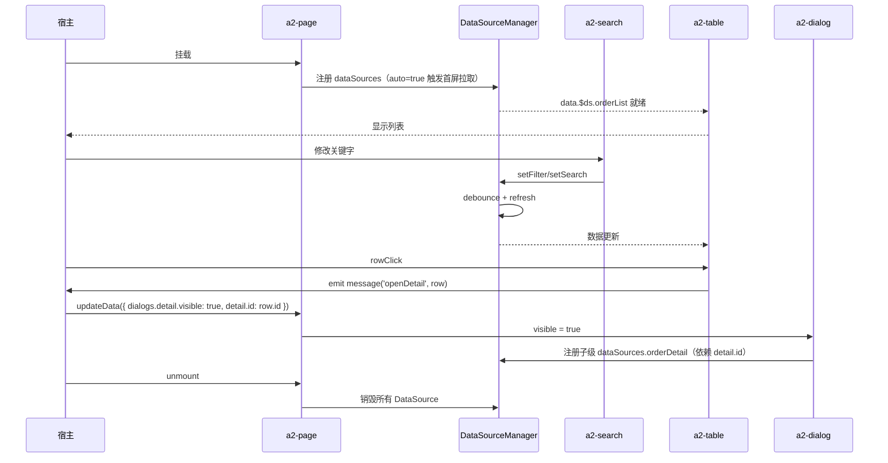

# Page Schema 设计

本文档设计 A2UI 未来的 **Page Schema**——一套用于描述「典型后台页面」的高阶协议。目的在于把常见页面模板（列表页、详情页、管理页等）沉淀为可下发、可复用的一等公民，而不是每次都手工用 Row / Column / Card 拼装。

**重要约束**：

- 本文档 **只做新增**，不修改任何已有 Schema（`a2-card / a2-row / a2-text-field / ...` 全部保持不变）。
- 现有 Form 类 Schema 完全兼容——`a2-page` 及其子模块可以嵌套现有组件，也可以被现有 Card 嵌套。
- Page Schema 是 **组合能力**，其内部模块基于 [组件开发规范](/guide/component-development) 与 [DataSource 设计](/guide/datasource) 实现。

阅读本文前建议先了解：

- [架构设计](/guide/architecture)
- [Runtime 架构设计](/guide/runtime-design)
- [JSON 规范](/guide/json-schema)
- [DataSource 设计](/guide/datasource)
- [Action 系统](/guide/action-system)

---

## 为什么需要 Page Schema

当前 Schema 提供的是「细粒度积木」（Card / Row / Column / TextField / Button 等），能表达任意结构，但下发一个「工单列表页」需要几十个节点手写拼装。这带来三个问题：

- **表达冗长**：AI / 服务端生成 Schema 时噪声高、易出错；
- **缺乏语义**：Runtime 看到的是一堆 Row/Column，不知道这是列表页还是详情页，无法做智能优化；
- **重复实现**：每个业务方都要重复写 Search + Table + Pagination 的组合。

Page Schema 通过引入 **`a2-page` 与页面级模块**（Search / Toolbar / Table / Pagination / Dialog / Drawer / Description / Card / Tabs），把常用页面结构声明化。**它不是新的组件库，而是一层「典型页面模板」的语法糖**——底层依旧走当前 Runtime 的 `renderNode` 与组件注册机制。

---

## 顶层结构

Page Schema 的入口是新增组件 `a2-page`：

```json
{
  "id": "orderPage",
  "type": "a2-page",
  "props": { "title": "工单列表" },
  "dataSources": {
    "orderList": { "kind": "http", "request": { "url": "/api/orders" }, "auto": true }
  },
  "slots": {
    "search":     [ { "id": "search1",  "type": "a2-search",     "props": { } } ],
    "toolbar":    [ { "id": "toolbar1", "type": "a2-toolbar",    "props": { } } ],
    "content":    [ { "id": "table1",   "type": "a2-table",      "props": { } } ],
    "pagination": [ { "id": "page1",    "type": "a2-pagination", "props": { } } ]
  },
  "children": [ ]
}
```

**要点**：

- `a2-page` 是一个 **容器 + 布局** 组件，内部有若干具名 slot：`header / search / toolbar / content / pagination / footer`；
- `a2-page` 可以承载 `dataSources`（继承 [DataSource 设计](/guide/datasource) 的能力）；
- 未使用的 slot 自动隐藏；
- `children` 与 `slots` 可以并存——`children` 用于 slot 无法覆盖的自由内容。

Page Schema 中的所有模块（Search / Toolbar / Table / …）都是普通 A2UI 组件，遵循 [组件开发规范](/guide/component-development)。

---

## 通用模块规范

以下按「职责 / Schema / Props / Children / Actions / Bindings / 生命周期」六个维度描述每个模块。

### a2-page

- **职责**：作为页面容器，提供 `header / search / toolbar / content / pagination / footer` 六个具名 slot 的布局与间距；承载页面级 `dataSources`。
- **Schema**：
  ```json
  {
    "id": "page1",
    "type": "a2-page",
    "props": { "title": "工单列表", "width": "full" },
    "dataSources": { },
    "slots": {
      "header": [], "search": [], "toolbar": [],
      "content": [], "pagination": [], "footer": []
    }
  }
  ```
- **Props**：
  | 属性 | 类型 | 默认值 | 说明 |
  |------|------|--------|------|
  | `title` | string | - | 页头标题，缺省不展示 header |
  | `width` | `xs\|sm\|md\|lg\|xl\|full\|string` | `full` | 页面最大宽度 |
  | `padding` | `number\|string` | `24` | 页面内边距 |
  | `sticky` | `{ header?, toolbar? }` | - | 顶部区域粘性配置 |
- **Children**：不使用（内容全部通过 slot 承载）。
- **Actions**：无（页面本身不产生业务事件）。
- **Bindings**：可绑 `title` 到 `data.pageTitle`。
- **生命周期**：`onMounted` 时按 `dataSources.auto` 触发首屏拉取；`onUnmounted` 时销毁 DataSource。

### a2-search

- **职责**：查询表单条件区，负责收集查询参数并触发 DataSource 的 `setSearch / setFilter`。
- **Schema**：
  ```json
  {
    "id": "search1",
    "type": "a2-search",
    "props": { "collapsible": true, "defaultCollapsed": false },
    "children": [
      { "id": "kwField", "type": "a2-text-field", "props": { "label": "关键字", "prop": "keyword" } },
      { "id": "stField", "type": "a2-select-field", "props": { "label": "状态", "prop": "status", "options": [] } }
    ],
    "actions": [
      { "event": "submit", "type": "datasource", "payload": { "target": "orderList", "op": "setFilter" } },
      { "event": "reset",  "type": "datasource", "payload": { "target": "orderList", "op": "reset" } }
    ]
  }
  ```
- **Props**：
  | 属性 | 类型 | 默认值 | 说明 |
  |------|------|--------|------|
  | `collapsible` | boolean | true | 是否可折叠 |
  | `defaultCollapsed` | boolean | false | 默认折叠状态 |
  | `columns` | number | 4 | 一行显示的字段数 |
  | `submitText` | string | `查询` | 提交按钮文案 |
  | `resetText` | string | `重置` | 重置按钮文案 |
- **Children**：任意表单类组件（`a2-text-field / a2-select-field / a2-date-picker / ...`），复用现有 Form 能力。
- **Actions**：`submit`、`reset`。
- **Bindings**：字段值绑到 `data.search.*`；`a2-search` 提交时把 `search` 对象一次性传给目标 DataSource。
- **生命周期**：挂载后自动展开或折叠；`reset` 会清空所有字段并派发一次 refresh。

### a2-toolbar

- **职责**：操作栏，通常放置「新建 / 导入 / 导出 / 批量操作」按钮。
- **Schema**：
  ```json
  {
    "id": "toolbar1",
    "type": "a2-toolbar",
    "props": { "justify": "space-between" },
    "children": [
      { "id": "btnNew",    "type": "a2-button", "props": { "text": "新建" }, "actions": [ { "event": "click", "type": "emit", "payload": { "action": "openCreate" } } ] },
      { "id": "btnImport", "type": "a2-button", "props": { "text": "导入" } }
    ]
  }
  ```
- **Props**：
  | 属性 | 类型 | 默认值 | 说明 |
  |------|------|--------|------|
  | `justify` | `start\|end\|space-between\|space-around` | `start` | 主轴分布 |
  | `gap` | number | 8 | 项间距 |
  | `sticky` | boolean | false | 是否粘性顶部 |
- **Children**：按钮、下拉、Search 快捷入口等。
- **Actions**：不含业务动作，由 children 上的 Button 各自声明。
- **Bindings**：可将「批量按钮的 disabled」绑到 `selectedRows.length === 0`。
- **生命周期**：无特殊生命周期，随父节点挂载卸载。

### a2-table

- **职责**：表格渲染 + DataSource 消费；负责单/多选、排序、行操作。
- **Schema**：
  ```json
  {
    "id": "table1",
    "type": "a2-table",
    "props": {
      "columns": [
        { "label": "订单号", "prop": "orderNo", "sortable": true },
        { "label": "状态",   "prop": "status" },
        { "label": "操作",   "prop": "$actions", "actions": [
          { "text": "查看", "event": "view" },
          { "text": "删除", "event": "delete", "type": "danger" }
        ] }
      ],
      "selection": "multiple"
    },
    "bindings": {
      "dataSource": { "type": "datasource", "value": "orderList" },
      "selectedRows": { "type": "path", "value": "selectedRows" }
    },
    "actions": [
      { "event": "sortChange", "type": "datasource", "payload": { "target": "orderList", "op": "setSort" } },
      { "event": "rowClick",   "type": "emit",       "payload": { "action": "openDetail" } },
      { "event": "view",       "type": "emit",       "payload": { "action": "openDetail" } },
      { "event": "delete",     "type": "emit",       "payload": { "action": "deleteRow" } }
    ]
  }
  ```
- **Props**：
  | 属性 | 类型 | 默认值 | 说明 |
  |------|------|--------|------|
  | `columns` | `Column[]` | 必填 | 列定义，`$actions` 是特殊列 |
  | `selection` | `none\|single\|multiple` | `none` | 行选择模式 |
  | `rowKey` | string | `id` | 行唯一键 |
  | `size` | `default\|large\|small` | `default` | 密度 |
- **Children**：不使用（列通过 `columns` 描述）。
- **Actions**：`rowClick / sortChange / selectionChange / view / delete / ...`（`$actions` 列声明的事件会作为 action 触发）。
- **Bindings**：`dataSource` 走 DataSource 协议；`selectedRows` 双向绑定到 `data`。
- **生命周期**：DataSource 首屏 `loading` 显示骨架屏；`error` 显示错误占位；`refreshing` 保留旧数据。

### a2-pagination

- **职责**：分页控件，与目标 DataSource 联动。
- **Schema**：
  ```json
  {
    "id": "page1",
    "type": "a2-pagination",
    "props": { "layout": "total, sizes, prev, pager, next, jumper" },
    "bindings": {
      "dataSource": { "type": "datasource", "value": "orderList" }
    },
    "actions": [
      { "event": "pageChange", "type": "datasource", "payload": { "target": "orderList", "op": "setPage" } },
      { "event": "sizeChange", "type": "datasource", "payload": { "target": "orderList", "op": "setPageSize" } }
    ]
  }
  ```
- **Props**：
  | 属性 | 类型 | 默认值 | 说明 |
  |------|------|--------|------|
  | `layout` | string | Element Plus 风格 | 分页组件布局字符串 |
  | `pageSizes` | `number[]` | `[10,20,50,100]` | 页大小可选值 |
  | `hideOnSinglePage` | boolean | false | 单页时隐藏 |
- **Children**：不使用。
- **Actions**：`pageChange / sizeChange`。
- **Bindings**：`dataSource` 提供 `meta.total / page / pageSize`。
- **生命周期**：DataSource 状态变化自动重算分页数据。

### a2-dialog

- **职责**：模态对话框，用于新建 / 编辑 / 详情弹层。
- **Schema**：
  ```json
  {
    "id": "createDialog",
    "type": "a2-dialog",
    "props": { "title": "新建工单", "width": "sm" },
    "bindings": {
      "visible": { "type": "path", "value": "dialogs.create.visible" }
    },
    "slots": {
      "default": [ { "id": "createForm", "type": "a2-form", "children": [ ] } ],
      "footer":  [
        { "id": "btnCancel",  "type": "a2-button", "props": { "text": "取消" },
          "actions": [ { "event": "click", "type": "emit", "payload": { "action": "closeCreate" } } ] },
        { "id": "btnConfirm", "type": "a2-button", "props": { "text": "确认" },
          "actions": [ { "event": "click", "type": "emit", "payload": { "action": "submitCreate" } } ] }
      ]
    }
  }
  ```
- **Props**：
  | 属性 | 类型 | 默认值 | 说明 |
  |------|------|--------|------|
  | `title` | string | - | 标题 |
  | `width` | `xs\|sm\|md\|lg\|xl\|full\|string` | `md` | 宽度 |
  | `closeOnClickModal` | boolean | true | 点击遮罩关闭 |
  | `destroyOnClose` | boolean | true | 关闭时销毁子树 |
- **Children**：不使用（内容通过 `slots.default / slots.footer`）。
- **Actions**：`open / close / confirm / cancel`（协议侧统一走 `emit`，宿主收到 `message` 后修改 `data.dialogs.*.visible`）。
- **Bindings**：`visible` 双向绑到 `data.dialogs.<name>.visible`。
- **生命周期**：`destroyOnClose = true` 时 `visible=false` 后 unmount 子树；DataSource 依赖该子树时会自动销毁。

### a2-drawer

- **职责**：抽屉，用于详情、批量编辑等占用较大屏幕空间的临时区域。
- **Schema / Props / Children / Actions / Bindings / 生命周期**：与 `a2-dialog` 一致，仅默认 `placement: 'right'`、`width: 'md'`。
  | 附加属性 | 类型 | 默认值 | 说明 |
  |----------|------|--------|------|
  | `placement` | `left\|right\|top\|bottom` | `right` | 抽屉方向 |
  | `mask` | boolean | true | 是否显示遮罩 |

### a2-description

- **职责**：键值对详情展示，通常与单条 DataSource 搭配用于「详情页 / 详情抽屉」。
- **Schema**：
  ```json
  {
    "id": "orderDesc",
    "type": "a2-description",
    "props": {
      "columns": 2,
      "items": [
        { "label": "订单号", "prop": "orderNo" },
        { "label": "状态",   "prop": "status" },
        { "label": "创建时间", "prop": "createdAt", "format": "date" }
      ]
    },
    "bindings": {
      "dataSource": { "type": "datasource", "value": "orderDetail" }
    }
  }
  ```
- **Props**：
  | 属性 | 类型 | 默认值 | 说明 |
  |------|------|--------|------|
  | `columns` | number | 2 | 一行显示的字段数 |
  | `items` | `DescItem[]` | 必填 | 字段定义 |
  | `bordered` | boolean | true | 是否显示边框 |
  | `size` | `default\|large\|small` | `default` | 密度 |
- **Children**：不使用（字段通过 `items`）。
- **Actions**：`itemClick`（可选）。
- **Bindings**：`dataSource` 绑单条数据。
- **生命周期**：`loading` 时显示骨架；`error` 时显示错误占位。

### a2-card

- **职责**：**沿用现有 [`a2-card`](file:///d:/work/program/tineco/UI/a2ui-vue-engine/packages/a2ui-docs/docs/components/a2-card.md)**，用于把 Page 内部划分为多个视觉分组，例如「基本信息卡 / 财务信息卡 / 操作记录卡」。
- **Schema / Props / Children**：完全等同于当前 Card 组件，不做修改。
- **Actions / Bindings**：沿用当前能力。
- **生命周期**：不变。

### a2-tabs

- **职责**：页签容器，用于把详情页或复杂页面拆分为多个内容区。
- **Schema**：
  ```json
  {
    "id": "detailTabs",
    "type": "a2-tabs",
    "props": {
      "activeKey": "basic",
      "items": [
        { "key": "basic",    "label": "基本信息" },
        { "key": "history",  "label": "变更记录" },
        { "key": "attach",   "label": "附件" }
      ]
    },
    "bindings": {
      "activeKey": { "type": "path", "value": "detail.activeTab" }
    },
    "slots": {
      "basic":   [ { "id": "descBasic",   "type": "a2-description", "props": { } } ],
      "history": [ { "id": "tableHistory","type": "a2-table",       "props": { } } ],
      "attach":  [ { "id": "listAttach",  "type": "a2-list",        "props": { } } ]
    }
  }
  ```
- **Props**：
  | 属性 | 类型 | 默认值 | 说明 |
  |------|------|--------|------|
  | `activeKey` | string | - | 当前激活 tab |
  | `items` | `TabItem[]` | 必填 | tab 元数据 |
  | `type` | `line\|card` | `line` | 视觉风格 |
  | `destroyOnHide` | boolean | false | 隐藏时销毁子树 |
- **Children**：不使用（内容通过命名 slot：slot 名 = `items[].key`）。
- **Actions**：`change`（切换）。
- **Bindings**：`activeKey` 双向绑定。
- **生命周期**：默认懒加载首个 tab；`destroyOnHide=true` 时切换 tab 会 unmount 隐藏子树，DataSource 会随之销毁。

---

## Page 生命周期

`a2-page` 的生命周期与内部模块协作：



关键点：

- Page 本身不写死任何业务，只做「布局 + DataSource 生命周期管理」。
- Search / Toolbar / Table / Pagination 通过 **Action + DataSource** 协作，没有隐式耦合。
- Dialog / Drawer 关闭时若 `destroyOnClose=true`，其内部 DataSource 会随子树 unmount 一起销毁。

---

## 示例：工单列表

一个完整的工单列表页，包含 Search / Toolbar / Table / Pagination + 详情 Drawer + 新建 Dialog。

```json
{
  "id": "orderPage",
  "type": "a2-page",
  "props": { "title": "工单列表" },
  "dataSources": {
    "orderList": {
      "kind": "http",
      "request": { "url": "/api/orders" },
      "pagination": { "enabled": true, "pageSize": 20 },
      "auto": true
    },
    "orderDetail": {
      "kind": "http",
      "request": { "url": "/api/orders/:id", "params": { "id": null } },
      "auto": false,
      "refreshOn": ["detail.id"]
    }
  },
  "slots": {
    "search": [
      {
        "id": "orderSearch",
        "type": "a2-search",
        "children": [
          { "id": "kw", "type": "a2-text-field",   "props": { "label": "关键字", "prop": "keyword" } },
          { "id": "st", "type": "a2-select-field", "props": { "label": "状态",   "prop": "status",
              "options": [ {"label":"进行中","value":"active"}, {"label":"已完成","value":"done"} ] } }
        ],
        "actions": [
          { "event": "submit", "type": "datasource", "payload": { "target": "orderList", "op": "setFilter" } },
          { "event": "reset",  "type": "datasource", "payload": { "target": "orderList", "op": "reset" } }
        ]
      }
    ],
    "toolbar": [
      {
        "id": "orderToolbar",
        "type": "a2-toolbar",
        "children": [
          { "id": "btnNew", "type": "a2-button", "props": { "text": "新建工单" },
            "actions": [ { "event": "click", "type": "emit", "payload": { "action": "openCreate" } } ] }
        ]
      }
    ],
    "content": [
      {
        "id": "orderTable",
        "type": "a2-table",
        "props": {
          "columns": [
            { "label": "工单号", "prop": "orderNo", "sortable": true },
            { "label": "标题",   "prop": "title" },
            { "label": "状态",   "prop": "status" },
            { "label": "创建时间", "prop": "createdAt", "sortable": true, "format": "datetime" },
            { "label": "操作", "prop": "$actions", "actions": [
              { "text": "查看", "event": "view" },
              { "text": "删除", "event": "delete", "type": "danger" }
            ] }
          ]
        },
        "bindings": {
          "dataSource": { "type": "datasource", "value": "orderList" }
        },
        "actions": [
          { "event": "sortChange", "type": "datasource", "payload": { "target": "orderList", "op": "setSort" } },
          { "event": "view",       "type": "emit",       "payload": { "action": "openDetail" } },
          { "event": "delete",     "type": "emit",       "payload": { "action": "deleteRow" } }
        ]
      }
    ],
    "pagination": [
      {
        "id": "orderPageBar",
        "type": "a2-pagination",
        "bindings": { "dataSource": { "type": "datasource", "value": "orderList" } },
        "actions": [
          { "event": "pageChange", "type": "datasource", "payload": { "target": "orderList", "op": "setPage" } },
          { "event": "sizeChange", "type": "datasource", "payload": { "target": "orderList", "op": "setPageSize" } }
        ]
      }
    ]
  },
  "children": [
    {
      "id": "detailDrawer",
      "type": "a2-drawer",
      "props": { "title": "工单详情", "width": "lg", "placement": "right", "destroyOnClose": true },
      "bindings": { "visible": { "type": "path", "value": "drawers.detail.visible" } },
      "slots": {
        "default": [
          {
            "id": "orderDesc",
            "type": "a2-description",
            "props": {
              "columns": 2,
              "items": [
                { "label": "工单号", "prop": "orderNo" },
                { "label": "状态",   "prop": "status" },
                { "label": "创建人", "prop": "creator" },
                { "label": "创建时间", "prop": "createdAt", "format": "datetime" }
              ]
            },
            "bindings": { "dataSource": { "type": "datasource", "value": "orderDetail" } }
          }
        ]
      }
    },
    {
      "id": "createDialog",
      "type": "a2-dialog",
      "props": { "title": "新建工单", "width": "sm", "destroyOnClose": true },
      "bindings": { "visible": { "type": "path", "value": "dialogs.create.visible" } },
      "slots": {
        "default": [
          {
            "id": "createForm",
            "type": "a2-card",
            "children": [
              { "id": "fTitle", "type": "a2-text-field",   "props": { "label": "标题", "prop": "title" } },
              { "id": "fDesc",  "type": "a2-text-field",   "props": { "label": "描述", "prop": "desc", "variant": "longText" } }
            ]
          }
        ],
        "footer": [
          { "id": "btnCancel",  "type": "a2-button", "props": { "text": "取消" },
            "actions": [ { "event": "click", "type": "emit", "payload": { "action": "closeCreate" } } ] },
          { "id": "btnConfirm", "type": "a2-button", "props": { "text": "确认" },
            "actions": [ { "event": "click", "type": "emit", "payload": { "action": "submitCreate" } } ] }
        ]
      }
    }
  ]
}
```

宿主逻辑（伪代码）：

```ts
onMessage((msg) => {
  switch (msg.payload?.action) {
    case 'openCreate':  a2ui.updateData({ dialogs: { create: { visible: true } } }); break
    case 'closeCreate': a2ui.updateData({ dialogs: { create: { visible: false } } }); break
    case 'submitCreate': await api.createOrder(a2ui.getFormData()); a2ui.refreshDataSource('orderList'); break
    case 'openDetail':  a2ui.updateData({ drawers: { detail: { visible: true } }, detail: { id: msg.payload.row.id } }); break
    case 'deleteRow':   await api.deleteOrder(msg.payload.row.id); a2ui.refreshDataSource('orderList'); break
  }
})
```

---

## 示例：用户管理

包含 Tabs（用户 / 角色 / 权限），每个 Tab 内部是独立的列表页。

```json
{
  "id": "userMgmt",
  "type": "a2-page",
  "props": { "title": "用户管理" },
  "slots": {
    "content": [
      {
        "id": "tabs",
        "type": "a2-tabs",
        "props": {
          "items": [
            { "key": "users",  "label": "用户" },
            { "key": "roles",  "label": "角色" },
            { "key": "perms",  "label": "权限" }
          ]
        },
        "bindings": { "activeKey": { "type": "path", "value": "ui.activeTab" } },
        "slots": {
          "users": [
            {
              "id": "userPanel",
              "type": "a2-page",
              "dataSources": {
                "userList": { "kind": "http", "request": { "url": "/api/users" }, "pagination": { "enabled": true }, "auto": true }
              },
              "slots": {
                "search": [
                  { "id": "userSearch", "type": "a2-search",
                    "children": [
                      { "id": "kw", "type": "a2-text-field", "props": { "label": "姓名", "prop": "keyword" } }
                    ],
                    "actions": [
                      { "event": "submit", "type": "datasource", "payload": { "target": "userList", "op": "setFilter" } }
                    ]
                  }
                ],
                "content": [
                  { "id": "userTable", "type": "a2-table",
                    "props": { "columns": [
                      { "label": "姓名", "prop": "name" },
                      { "label": "邮箱", "prop": "email" },
                      { "label": "角色", "prop": "role" },
                      { "label": "操作", "prop": "$actions", "actions": [
                        { "text": "编辑", "event": "edit" },
                        { "text": "禁用", "event": "disable", "type": "warning" }
                      ] }
                    ] },
                    "bindings": { "dataSource": { "type": "datasource", "value": "userList" } },
                    "actions": [
                      { "event": "edit",    "type": "emit", "payload": { "action": "editUser" } },
                      { "event": "disable", "type": "emit", "payload": { "action": "disableUser" } }
                    ]
                  }
                ],
                "pagination": [
                  { "id": "userPage", "type": "a2-pagination",
                    "bindings": { "dataSource": { "type": "datasource", "value": "userList" } },
                    "actions": [
                      { "event": "pageChange", "type": "datasource", "payload": { "target": "userList", "op": "setPage" } }
                    ]
                  }
                ]
              }
            }
          ],
          "roles": [
            { "id": "rolePanel", "type": "a2-page",
              "dataSources": { "roleList": { "kind": "http", "request": { "url": "/api/roles" }, "auto": true } },
              "slots": {
                "content": [
                  { "id": "roleTable", "type": "a2-table",
                    "props": { "columns": [
                      { "label": "角色名", "prop": "name" },
                      { "label": "用户数", "prop": "userCount" }
                    ] },
                    "bindings": { "dataSource": { "type": "datasource", "value": "roleList" } }
                  }
                ]
              }
            }
          ],
          "perms": [
            { "id": "permPanel", "type": "a2-page",
              "dataSources": { "permList": { "kind": "http", "request": { "url": "/api/permissions" }, "auto": true } },
              "slots": {
                "content": [
                  { "id": "permDesc", "type": "a2-description",
                    "props": { "columns": 3, "items": [
                      { "label": "读", "prop": "read" }, { "label": "写", "prop": "write" }, { "label": "管理", "prop": "admin" }
                    ] },
                    "bindings": { "dataSource": { "type": "datasource", "value": "permList" } }
                  }
                ]
              }
            }
          ]
        }
      }
    ]
  }
}
```

---

## 示例：商品列表

演示 Card 分组 + Toolbar 批量操作 + 编辑 Dialog（含现有 Form 组件的兼容用法）。

```json
{
  "id": "goodsPage",
  "type": "a2-page",
  "props": { "title": "商品列表" },
  "dataSources": {
    "goodsList": {
      "kind": "http",
      "request": { "url": "/api/goods" },
      "pagination": { "enabled": true, "pageSize": 20 },
      "cache": { "enabled": true, "ttl": 30000 },
      "auto": true
    }
  },
  "slots": {
    "search": [
      { "id": "s1", "type": "a2-search",
        "props": { "columns": 3 },
        "children": [
          { "id": "kw", "type": "a2-text-field",   "props": { "label": "名称", "prop": "keyword" } },
          { "id": "ct", "type": "a2-select-field", "props": { "label": "分类", "prop": "category",
              "options": [ {"label":"食品","value":"food"}, {"label":"日用","value":"life"} ] } },
          { "id": "on", "type": "a2-select-field", "props": { "label": "上架", "prop": "onSale",
              "options": [ {"label":"在售","value":true}, {"label":"下架","value":false} ] } }
        ],
        "actions": [
          { "event": "submit", "type": "datasource", "payload": { "target": "goodsList", "op": "setFilter" } }
        ]
      }
    ],
    "toolbar": [
      { "id": "t1", "type": "a2-toolbar", "props": { "justify": "space-between" },
        "children": [
          { "id": "btnAdd", "type": "a2-button", "props": { "text": "新增商品" },
            "actions": [ { "event": "click", "type": "emit", "payload": { "action": "openEdit" } } ] },
          { "id": "btnBatch", "type": "a2-button", "props": { "text": "批量下架" },
            "bindings": { "disabled": { "type": "expression", "value": "selectedRows.length === 0" } },
            "actions": [ { "event": "click", "type": "emit", "payload": { "action": "batchOffline" } } ] }
        ]
      }
    ],
    "content": [
      { "id": "info", "type": "a2-card",
        "props": { "width": "full", "header": "商品概览" },
        "children": [
          { "id": "summary", "type": "a2-description",
            "props": { "columns": 4, "items": [
              { "label": "在售", "prop": "onSale" },
              { "label": "下架", "prop": "offSale" },
              { "label": "总数", "prop": "total" },
              { "label": "本月新增", "prop": "newThisMonth" }
            ] },
            "bindings": { "dataSource": { "type": "datasource", "value": "goodsList" } }
          }
        ]
      },
      { "id": "table", "type": "a2-table",
        "props": { "selection": "multiple", "columns": [
          { "label": "名称", "prop": "name" },
          { "label": "分类", "prop": "category" },
          { "label": "价格", "prop": "price", "format": "currency" },
          { "label": "状态", "prop": "onSale" },
          { "label": "操作", "prop": "$actions", "actions": [
            { "text": "编辑", "event": "edit" },
            { "text": "下架", "event": "offline", "type": "warning" }
          ] }
        ] },
        "bindings": {
          "dataSource": { "type": "datasource", "value": "goodsList" },
          "selectedRows": { "type": "path", "value": "selectedRows" }
        },
        "actions": [
          { "event": "edit",    "type": "emit", "payload": { "action": "openEdit" } },
          { "event": "offline", "type": "emit", "payload": { "action": "offlineOne" } }
        ]
      }
    ],
    "pagination": [
      { "id": "p1", "type": "a2-pagination",
        "bindings": { "dataSource": { "type": "datasource", "value": "goodsList" } },
        "actions": [
          { "event": "pageChange", "type": "datasource", "payload": { "target": "goodsList", "op": "setPage" } }
        ]
      }
    ]
  },
  "children": [
    { "id": "editDialog", "type": "a2-dialog",
      "props": { "title": "商品编辑", "width": "md", "destroyOnClose": true },
      "bindings": { "visible": { "type": "path", "value": "dialogs.edit.visible" } },
      "slots": {
        "default": [
          {
            "id": "editForm",
            "type": "a2-card",
            "children": [
              { "id": "fName",  "type": "a2-text-field",   "props": { "label": "名称", "prop": "name",  "required": true } },
              { "id": "fCat",   "type": "a2-select-field", "props": { "label": "分类", "prop": "category",
                  "options": [ {"label":"食品","value":"food"}, {"label":"日用","value":"life"} ] } },
              { "id": "fPrice", "type": "a2-text-field",   "props": { "label": "价格", "prop": "price" } },
              { "id": "fDesc",  "type": "a2-text-field",   "props": { "label": "描述", "prop": "desc", "variant": "longText", "rows": 4 } }
            ]
          }
        ],
        "footer": [
          { "id": "bCancel",  "type": "a2-button", "props": { "text": "取消" },
            "actions": [ { "event": "click", "type": "emit", "payload": { "action": "closeEdit" } } ] },
          { "id": "bConfirm", "type": "a2-button", "props": { "text": "保存" },
            "actions": [ { "event": "click", "type": "emit", "payload": { "action": "submitEdit" } } ] }
        ]
      }
    }
  ]
}
```

---

## 兼容现有 Form

Page Schema **完全兼容** 当前 Form 类 Schema，具体表现为：

1. **既有 Card 表单可直接嵌入 Page**：任意 slot（尤其 `content / slots.default of a2-dialog`）都可以放置现有的 `a2-card + a2-column + a2-text-field + ...` 组合。
2. **既有扁平格式可直接下发**：Page 的 `slots` 内部支持内嵌当前扁平格式（会通过 [`convertFlatToTree`](file:///d:/work/program/tineco/UI/a2ui-vue-engine/packages/a2ui-vue-engine/src/core/flatToTree.ts) 转树），无需迁移。
3. **`getFormData` 依旧可用**：`A2UIRoot.getFormData()` 会继续按 `a2-text-field / a2-select-field / a2-date-picker` 等表单组件的 `prop` 抽取表单值——不受 Page 引入影响。
4. **老 Schema 无 Page 也能跑**：`a2-page` 是新增可选组件，未升级的 Schema 完全按现有 Runtime 渲染，行为一致。

**约束**：新 Page 中若使用 `bindings.dataSource`，需 DataSource 能力就绪（见 [DataSource 设计](/guide/datasource)）；否则组件回落到 `props` 传入的静态数据。

---

## 设计原则

- **只做新增**：`a2-page / a2-search / a2-toolbar / a2-table / a2-pagination / a2-dialog / a2-drawer / a2-description / a2-tabs` 均为新增组件；现有组件、协议字段、Runtime 主流程一律不改。
- **组合优先**：Page Schema 是「典型页面的组合模板」，模块之间通过 Action + DataSource 松耦合，不引入新的隐式依赖。
- **协议驱动**：所有交互与数据获取都通过 Schema 声明，不引入命令式 API。
- **单向数据流**：Page 内部依旧遵循 `data → props → 事件 → 宿主 → data` 的闭环，与当前 Runtime 一致。
- **可嵌套**：`a2-page` 可以作为子节点出现在 `a2-tabs / a2-dialog / a2-drawer` 内部，天然支持嵌套页面。
- **向后兼容**：Page Schema 与当前 Form Schema 完全并存，老 Schema 不需要迁移。

---

## 参考实现落地点（未来实现时）

以下为未来落地时预计涉及的新增组件，当前不存在，仅作锚点：

- `packages/a2ui-vue-engine/src/components/A2Page.vue`
- `packages/a2ui-vue-engine/src/components/A2Search.vue`
- `packages/a2ui-vue-engine/src/components/A2Toolbar.vue`
- `packages/a2ui-vue-engine/src/components/A2Table.vue`
- `packages/a2ui-vue-engine/src/components/A2Pagination.vue`
- `packages/a2ui-vue-engine/src/components/A2Dialog.vue`
- `packages/a2ui-vue-engine/src/components/A2Drawer.vue`
- `packages/a2ui-vue-engine/src/components/A2Description.vue`
- `packages/a2ui-vue-engine/src/components/A2Tabs.vue`

以上组件走 [组件开发规范](/guide/component-development) 中的标准流程：`components/index.ts` 导出 + `componentMap.ts` 注册 + `flatToTree.ts` 扁平字段映射（可选）+ 文档 + 侧边栏登记。
