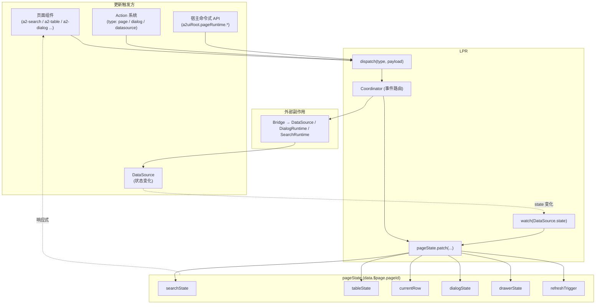
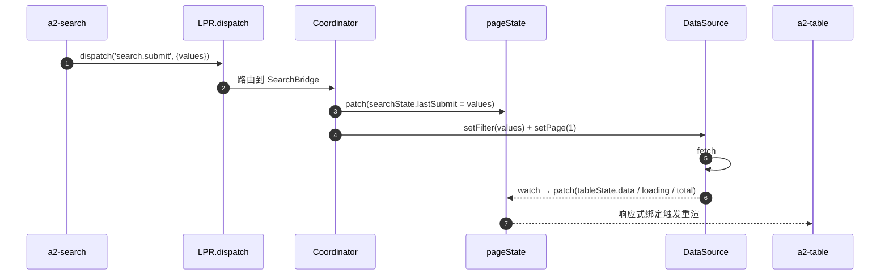
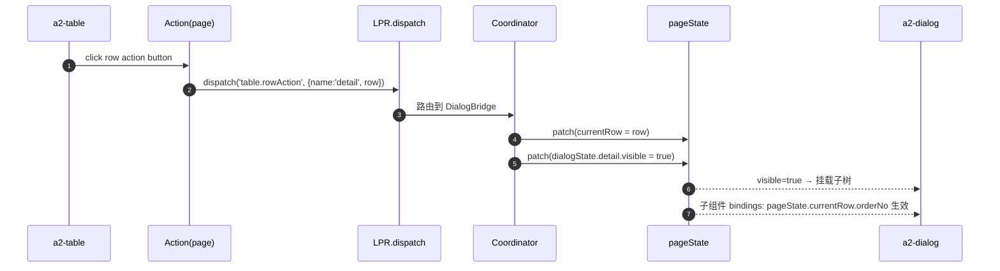
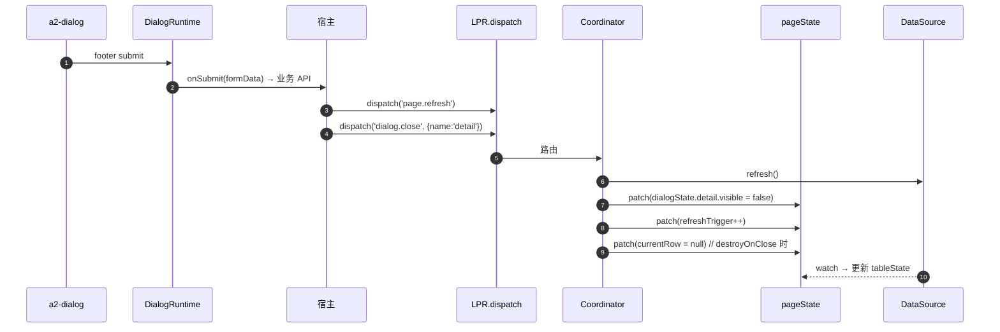
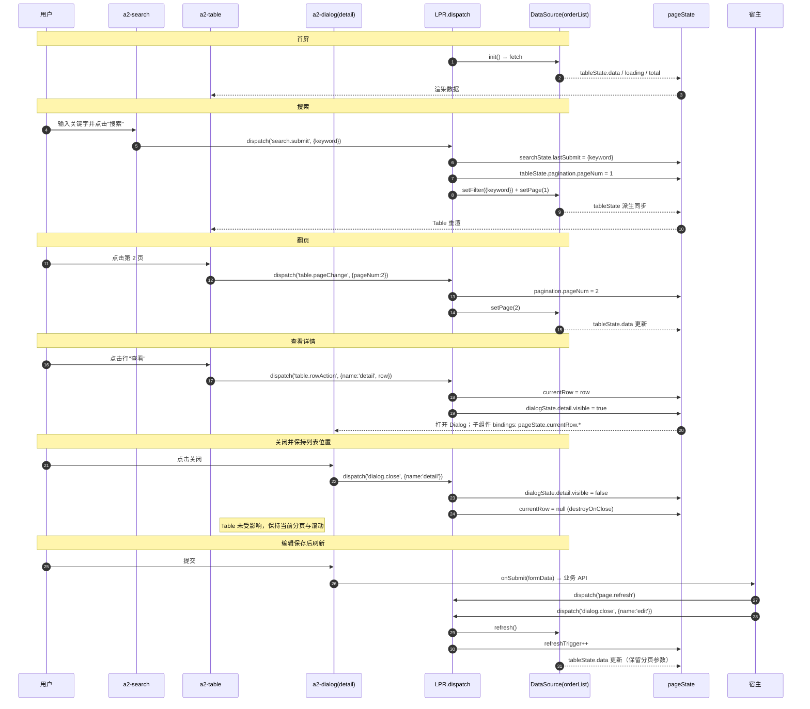

# PageState 模型设计

> 本文档定义 Light Page Runtime（LPR）的 **唯一状态中心** —— `pageState`。
>
> 前置阅读：[Light Page Runtime 设计](/architecture/runtime-design)
>
> 本文档不涉及任何代码实现，仅描述结构、更新规则与协调用例。

---

## 1. 定位

`pageState` 是 LPR 运行时的 **唯一状态中心**。它承担三个角色：

- **协调中枢**：Search / Table / Pagination / Dialog / Drawer 之间的联动都通过 `pageState` 传递；
- **视图投影**：把 `DataSource` 的响应式 `state` 反投影为 Table / Pagination 可直接消费的字段；
- **上下文通道**：Row Action 触发时，把当前行数据放入 `currentRow`，供 Dialog / Drawer 子树消费。

一句话：**pageState 只保存"页面模块之间协调所必需的中间量"，不做业务数据仓库。**

`pageState` 的物理存放位置：`A2UIRoot.data.$page.<pageId>`。这样与既有 A2UIRoot 的响应式数据体系无缝对接，无需第二套响应式容器。

---

## 2. PageState 结构（JSON）

以下是 `data.$page.<pageId>` 的完整概念模型。字段全部为可选：LPR 在初始化 `a2-page` 时按需填充。

```jsonc
{
  // ------------------------------------------------------------------
  // 1. 搜索栏状态
  // ------------------------------------------------------------------
  "searchState": {
    "values":     { "keyword": "", "status": "all" },  // 当前输入框内的值（未提交）
    "lastSubmit": { "keyword": "", "status": "all" },  // 上一次实际提交给 DataSource 的过滤条件
    "collapsed":  true,                                // 折叠状态（可选）
    "dirty":      false                                // values !== lastSubmit 时为 true（派生）
  },

  // ------------------------------------------------------------------
  // 2. 表格状态
  // ------------------------------------------------------------------
  "tableState": {
    "dataSourceId": "orderList",                        // 关联的 DataSource id
    "data":         [],                                 // 只读投影：DataSource.state.data
    "loading":      false,                              // 只读投影：DataSource.state.status
    "pagination": {
      "pageNum":  1,                                    // 当前页
      "pageSize": 20,                                   // 每页条数
      "total":    0                                     // 总条数（DataSource 响应回填）
    },
    "sort":            null,                            // { key, order } | null
    "selectedRowKeys": [],                              // 选中行主键列表（若启用行选择）
    "error":           null                             // 只读投影：DataSource.state.error
  },

  // ------------------------------------------------------------------
  // 3. 当前操作行
  // ------------------------------------------------------------------
  "currentRow": null,                                   // Row Action 触发时的行数据快照

  // ------------------------------------------------------------------
  // 4. Dialog 状态（按 name 索引）
  // ------------------------------------------------------------------
  "dialogState": {
    "create": {
      "visible": false,
      "loading": false,
      "context": null                                   // 打开时携带的额外上下文
    },
    "detail": {
      "visible": false,
      "loading": false,
      "context": null
    }
  },

  // ------------------------------------------------------------------
  // 5. Drawer 状态（结构与 Dialog 一致，按 name 索引）
  // ------------------------------------------------------------------
  "drawerState": {
    "edit": {
      "visible": false,
      "loading": false,
      "context": null
    }
  },

  // ------------------------------------------------------------------
  // 6. 刷新信号
  // ------------------------------------------------------------------
  "refreshTrigger": 0                                   // 单调递增；每次 dispatch('page.refresh') +1
}
```

### 2.1 字段职责一览

| 字段 | 类型 | 是否只读投影 | 用途 |
| --- | --- | --- | --- |
| `searchState.values` | Record | 否 | 表单输入的实时值 |
| `searchState.lastSubmit` | Record | 否 | 已提交给 DataSource 的过滤条件 |
| `searchState.collapsed` | boolean | 否 | 搜索栏折叠状态 |
| `searchState.dirty` | boolean | 派生 | 是否有未提交的变更 |
| `tableState.dataSourceId` | string | 否 | Table 绑定的 DataSource |
| `tableState.data` | Array | ✅ 是 | 从 `DataSource.state.data` 反投影 |
| `tableState.loading` | boolean | ✅ 是 | 从 `DataSource.state.status` 反投影 |
| `tableState.pagination.pageNum` | number | 否 | 当前页 |
| `tableState.pagination.pageSize` | number | 否 | 每页条数 |
| `tableState.pagination.total` | number | ✅ 是 | 从 `DataSource.state.meta.total` 反投影 |
| `tableState.sort` | `{key,order}\|null` | 否 | 当前排序 |
| `tableState.selectedRowKeys` | Array | 否 | 选中行 |
| `tableState.error` | Error \| null | ✅ 是 | 从 `DataSource.state.error` 反投影 |
| `currentRow` | Record \| null | 否 | 当前 Row Action 携带的行数据 |
| `dialogState[name].visible` | boolean | 否 | Dialog 可见性 |
| `dialogState[name].loading` | boolean | 否 | Dialog 提交 Loading |
| `dialogState[name].context` | any | 否 | 打开 Dialog 时携带的上下文 |
| `drawerState[name].*` | 同 Dialog | 同 Dialog | 与 Dialog 结构一致 |
| `refreshTrigger` | number | 否 | 刷新信号 |

### 2.2 反投影字段（只读）说明

「反投影」意味着这些字段由 LPR 内部通过 `watch(DataSource.state)` 单向同步，**不允许**外部（组件 / 宿主 / Action）直接写。这样做的原因是：

- 保证 Table 的 `data / loading / total` 与 DataSource 永远一致；
- 避免多套真源导致的数据漂移；
- 组件只需 `bindings: pageState.tableState.data` 即可，无需感知 DataSource 存在。

如需强制刷新，走 `dispatch('page.refresh')`（会触发 DataSource.refresh，进而重新投影）。

---

## 3. 状态更新流程图

pageState 的更新走 **单一入口**：`pageRuntime.dispatch(type, payload)`。任何组件、Action、宿主都通过此入口，不允许直接赋值。

### 3.1 总览图



### 3.2 三条典型更新链路

#### 链路 A：Search → Table 联动



#### 链路 B：Row Action → Dialog（携带当前行数据）



#### 链路 C：Dialog 提交 → 表格刷新



---

## 4. State 更新规则（谁可以改什么）

pageState 的**核心纪律**：所有更新必须由 Coordinator 完成；组件、Action、宿主只能通过 `dispatch` 表达意图。

### 4.1 更新矩阵

| 字段 | 可写方（通过 dispatch） | 允许的 dispatch 类型 | 说明 |
| --- | --- | --- | --- |
| `searchState.values` | `a2-search` | `search.change` / `search.setValues` | 输入过程中的临时值 |
| `searchState.lastSubmit` | Coordinator（内部） | `search.submit` | submit 时由 Coordinator 拷贝 values |
| `searchState.collapsed` | `a2-search` | `search.toggleCollapse` | 折叠切换 |
| `searchState.dirty` | 派生 | —— | `values !== lastSubmit` 时自动为 true |
| `tableState.dataSourceId` | LPR 初始化 | 无（配置时确定） | Schema 声明后不变 |
| `tableState.data` | ❌ 只读投影 | 由 `watch(DataSource.state.data)` | 组件 / 宿主不可写 |
| `tableState.loading` | ❌ 只读投影 | 由 `watch(DataSource.state.status)` | 组件 / 宿主不可写 |
| `tableState.pagination.pageNum` | `a2-pagination`、`a2-search` | `table.pageChange` / `search.submit`（回到首页） | 变更后同步 DataSource.setPage |
| `tableState.pagination.pageSize` | `a2-pagination` | `table.pageSizeChange` | 变更后 DataSource.setPageSize |
| `tableState.pagination.total` | ❌ 只读投影 | 由 `watch(DataSource.state.meta.total)` | 组件 / 宿主不可写 |
| `tableState.sort` | `a2-table` | `table.sortChange` | 变更后 DataSource.setSort |
| `tableState.selectedRowKeys` | `a2-table` | `table.selectionChange` | |
| `tableState.error` | ❌ 只读投影 | 由 `watch(DataSource.state.error)` | 组件 / 宿主不可写 |
| `currentRow` | `a2-table`、宿主 | `table.rowAction` / `page.setCurrentRow` | Dialog / Drawer 打开前必须先写；关闭时按需清空 |
| `dialogState[name].visible` | `a2-*`、宿主 | `dialog.open` / `dialog.close` / `dialog.toggle` | |
| `dialogState[name].loading` | `DialogRuntime` | 由 DialogRuntime submit 期间自动写 | |
| `dialogState[name].context` | 触发方 | `dialog.open` payload 携带 | |
| `drawerState[name].*` | 同 dialog | `drawer.*` | 与 dialog 对称 |
| `refreshTrigger` | 任意方 | `page.refresh` | 单调递增 |

### 4.2 三条铁律

1. **只读投影字段禁止外部写**：`tableState.data / loading / total / error` 由 LPR 内部 watcher 独占。
2. **一切写入走 dispatch**：不允许通过 `bindings: { type: 'path', value: '$page.orderPage.dialogState.detail.visible' }` 反向双向绑定 v-model 直接写。若某个组件确实需要"内部值"，那属于 `searchState.values` 类字段——它已在矩阵中开放。
3. **currentRow 单一生命周期**：Row Action 触发时写入 → Dialog 关闭且 `destroyOnClose=true` 时清空；不允许其它场景改动。

### 4.3 dispatch 类型清单（v1）

```
search.change          → 更新 searchState.values
search.setValues       → 覆盖式替换 searchState.values
search.submit          → lastSubmit ← values；同步 DataSource.setFilter + setPage(1)
search.reset           → values ← defaults；DataSource.setFilter({}) + setPage(1)
search.toggleCollapse  → 翻转 searchState.collapsed

table.pageChange       → pagination.pageNum ← n；DataSource.setPage(n)
table.pageSizeChange   → pagination.pageSize ← n；DataSource.setPageSize(n)
table.sortChange       → sort ← next；DataSource.setSort(next)
table.selectionChange  → selectedRowKeys ← next
table.rowAction        → currentRow ← row；同时可携带 dialog/drawer 打开动作

dialog.open            → dialogState[name].visible = true + context 写入
dialog.close           → dialogState[name].visible = false + 视情况清 currentRow
dialog.toggle          → 翻转 dialogState[name].visible
drawer.*               → 与 dialog.* 对称

page.refresh           → refreshTrigger++；触发 DataSource.refresh()
page.reset             → 相当于 search.reset + refresh
page.setCurrentRow     → currentRow ← row（不打开任何 overlay）
```

上述清单是 **枚举而非可扩展 DSL**。新增 dispatch 类型 = 在 Coordinator 中加一个分支，仍属于 additive 演进。

---

## 5. Action 如何更新 State

pageState 与 Action 系统的对接采用 **新增可选 Action 分支**，不修改现有 `emit / callback / navigate / api` 四种分支。

### 5.1 相关 Action 类型

| Action `type` | 语义 | 转成的 dispatch |
| --- | --- | --- |
| `page` | 页面级操作 | 参考 `payload.op`：`refresh / reset / setCurrentRow` |
| `datasource` | 直接操作 DataSource | Coordinator 内部委托到对应 DataSource 命令 |
| `dialog` | 打开 / 关闭 Dialog | `dialog.open / dialog.close / dialog.toggle` |
| `drawer` | 打开 / 关闭 Drawer | `drawer.*` |

### 5.2 Schema 示例

```jsonc
{
  "id": "row-detail-btn",
  "type": "a2-button",
  "props": { "text": "查看" },
  "actions": [
    {
      "event": "click",
      "type":  "page",
      "payload": {
        "op":   "openDialog",
        "name": "detail",
        "row":  "$row"          // 由 a2-table 在渲染行时替换为当前行数据
      }
    }
  ]
}
```

上述 Action 在 Runtime 中经过 `executeAction` 的 `page` 分支被翻译成：

```
pageRuntime.dispatch('table.rowAction', { name: 'detail', row: <当前行> })
```

Coordinator 命中后：

1. `patch(currentRow = row)`
2. `patch(dialogState.detail.visible = true)`
3. （可选）`patch(dialogState.detail.context = { source: 'row' })`

无需宿主编写任何胶水代码。

### 5.3 兼容 `emit` 模式

如果宿主希望自己接管，可仍用 `type: 'emit'` 上抛 message，然后在 `handleMessage` 中调用 `a2uiRoot.pageRuntime.dispatch(...)` 或直接 `updateData` —— 两种模式并存，Schema 作者按需选择。

---

## 6. DataSource 如何触发 State 更新

pageState 中 `tableState` 的 **数据字段** 全部来自 DataSource，通过 LPR 内部的 watcher 单向同步。

### 6.1 同步映射

| DataSource 字段 | 同步到 pageState 字段 |
| --- | --- |
| `state.data` | `tableState.data` |
| `state.status === 'loading' \|\| 'refreshing'` | `tableState.loading` |
| `state.meta.total` | `tableState.pagination.total` |
| `state.meta.page` | `tableState.pagination.pageNum`（首次同步或 DataSource 主动改动时） |
| `state.meta.pageSize` | `tableState.pagination.pageSize`（同上） |
| `state.error` | `tableState.error` |

### 6.2 触发时机

- 首屏：LPR 初始化时调用 `DataSource.init()` → 触发 fetch → watch 回写 pageState；
- 交互：任何 dispatch 命中 DataSource 命令（setFilter / setPage / setSort / refresh）→ 请求成功 → watch 回写；
- 外部数据推送：`MessageProcessor` 收到 `data_update` 消息落到 `data.$ds.<id>` → DataSource 感知 → watch 回写。

### 6.3 单向性

- DataSource → pageState：**允许**（LPR 内部 watcher）；
- pageState → DataSource：**必须通过 Coordinator**（不允许直接 `DataSource.state.data = ...`）。

这保证 DataSource 始终是 **数据源的真源**，pageState 只是它面向 UI 的一层投影。

---

## 7. Table + Search + Dialog 联动的完整例子

以「订单列表页」为例，走完一遍最典型的 CRUD 联动：



所有交互都由 `pageState` 集中协调，宿主只在业务 API 前后调用两次 `dispatch`——这就是"零胶水"。

---

## 8. 为什么必须统一状态中心

假设没有统一的 `pageState`，让每个组件自持状态、通过 emit 上抛给宿主管理，就会遇到以下 6 个真实问题。这也是 LPR 采用统一状态中心的根本理由。

### 8.1 联动路径爆炸（N × M 问题）

- 一个页面 5 个模块（Search / Table / Pagination / Dialog / Drawer），任意两两联动就要 20 条方向；
- 增加一个 Tabs 就变 30 条；
- 有了 `pageState` 之后，只需要 5 条「模块 ↔ pageState」的边——从 N×N 降到 N。

### 8.2 状态漂移

- Search 提交的 filter 与 DataSource 实际 filter 不一致；
- Pagination 显示第 2 页但 Table 数据仍是第 1 页；
- Dialog 关闭了但 `currentRow` 残留；
- 单一状态中心保证「视图看到的 = 状态里的 = DataSource 里的」。

### 8.3 打开 Dialog 时携带数据的样板代码

传统写法：
1. Table 行按钮 emit `openDetail` + 载荷 row；
2. 宿主 handler 保存 row 到某处（Vuex / props / ref）；
3. 宿主写 `dialogVisible.value = true`；
4. Dialog 内部子组件通过 props 或 store 消费 row。

`pageState` 方案：`dispatch('table.rowAction', {row, name})` 一步完成——`currentRow` 与 `dialogState[name].visible` 是同一份状态中心的两个字段，联动天然一致。

### 8.4 Action / DataSource / 命令式 API 三种来源的合流

- **Action**：`{type:'page', op:'refresh'}` 来自 Schema；
- **DataSource**：`refreshOn: ['detail.id']` 声明式依赖变化；
- **命令式**：宿主 `a2uiRoot.pageRuntime.refresh()`。

如果没有统一入口，三条路径会各自实现一套「刷新触发链」，出现"某种方式能刷新，另一种不能"的诡异问题。

统一状态中心 + `dispatch` 单一入口意味着：三条路径都汇聚到同一个 Coordinator，同一段代码处理，行为绝对一致。

### 8.5 可观测 / 可回放

- pageState 是纯数据，可打日志、可快照、可 diff、可回放；
- `dispatch` 是描述性事件，可导出为审计流；
- 出问题时先看 pageState 是否与预期一致，再看是不是 dispatch 没发；调试路径极短。

### 8.6 与响应式复用

- pageState 挂在 `A2UIRoot.data.$page.<pageId>` 之下，直接复用 A2UIRoot 已有的 Vue `ref`；
- 组件绑定走既有的 `bindings.type = 'path'` 或新增可选的 `bindings.type = 'pageState'`；
- 不引入第二个响应式容器（不 pinia、不 vuex、不 zustand），零迁移成本。

### 8.7 一句话

> 「统一状态中心」不是为了显得"高级"，而是**降低协调复杂度**、**消除样板代码**、**保证行为一致**、**支持回放调试**——每一条都是 CRUD 页面真实痛点。若拒绝这一层，`Search / Table / Dialog` 的联动就永远要在宿主里手写胶水。

---

## 9. 可扩展性但不复杂化

pageState 的扩展策略：**新增顶层字段 或 新增 dispatch 分支**，不引入子系统。

### 9.1 允许的扩展方式

- **新增顶层字段**：例如未来加入 `tabState`（Tabs 联动）：只需在 `data.$page.<pageId>` 之下追加 `tabState`，Coordinator 追加 `tab.change` 分支即可。
- **新增 dispatch 类型**：Coordinator 内部加一个 case，行为在文档中明确记录。
- **新增只读投影字段**：如果未来 DataSource 增加了新字段（如 `state.meta.aggregations`），可在 pageState 内追加只读投影字段。
- **命名子空间**：如 `dialogState.<name>` 已按 name 索引；若一个页面有多张 Table，可扩展为 `tableState.<tableId>`——保留结构风格。

### 9.2 明确不允许的扩展方式

- ❌ 引入自定义 reducer / middleware / plugin 机制（保持简单）；
- ❌ 引入表达式 DSL（如 `dispatch('a && b')`）；
- ❌ 引入订阅粒度控制（Vue 响应式已经足够精细）；
- ❌ 支持任意嵌套的动态命名空间（`$page.<pageId>` 只一层）；
- ❌ 允许业务字段直接挂 pageState（业务数据请走 DataSource / `data.form`）。

### 9.3 演进检查表

新增能力时，用以下三个问题自检：

1. 这个字段是「模块之间协调所需的」还是「业务数据」？——只有前者才该进 pageState。
2. 更新它需要新增一种 dispatch 类型吗？如果需要，能否用已有类型的 payload 表达？
3. 它会破坏「单一入口」原则吗？如果需要多个入口，说明设计有问题。

---

## 10. 与其他文档的关系

- 结构与协调用例：本文（page-state.md）。
- Runtime 定位与整体架构：[runtime-design.md](/architecture/runtime-design)。
- DataSource 生命周期、cache/retry：[datasource.md](/architecture/datasource)。
- Action 生命周期与 `type` 扩展：[action-system.md](/architecture/action-system)。
- 页面级 Schema 表达（`a2-page / a2-search / a2-table / ...`）：[page-schema.md](/architecture/page-schema)。

---

## 11. 设计原则回顾

- **唯一状态中心**：`data.$page.<pageId>` 是页面协调的唯一真源；
- **单一变更入口**：所有写走 `dispatch`；
- **只读投影**：`tableState.data / loading / total` 反投影自 DataSource，不允许外部写；
- **枚举式 dispatch**：更新语义靠枚举而非 DSL，可预测；
- **响应式复用**：不引入第二个响应式容器；
- **扩展 additive**：新增字段与 dispatch 类型即可扩展，不破坏既有；
- **反低代码**：不接受表达式 / 脚本 / 编排——pageState 是"协调数据"，不是"编排引擎"。

---

_本文档仅为设计文档；不包含任何代码；不改变现有 Runtime 主干；所有落地锚点见 [page-runtime-design.md §14](/architecture/page-runtime-design)。_
