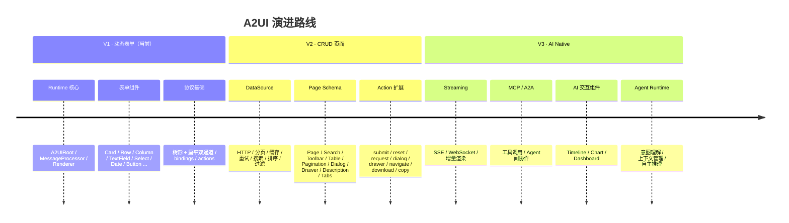

# 演进路线 Roadmap

本文档规划 A2UI 的未来演进路线，按 **V1 / V2 / V3** 三个大版本组织。规划基于当前项目实际能力（`packages/a2ui-vue-engine`）与前置设计文档：

- [Runtime 架构设计](/guide/runtime-design)
- [组件开发规范](/guide/component-development)
- [Action 系统](/guide/action-system)
- [DataSource 设计](/guide/datasource)
- [Page Schema 设计](/guide/page-schema)

演进遵循两个原则：**（1）向后兼容**——每一版都必须保证旧 Schema 在新 Runtime 上行为一致；**（2）协议先行**——所有能力先在协议层描述清楚，再落地实现。

---

## 版本总览

---

## V1 · 动态表单（当前基线）

V1 的目标是「让服务端 / AI 能下发一份 JSON，前端 Runtime 渲染成一个可交互的表单」。这是 A2UI 已经实现的能力，也是后续所有版本的基石。

### 核心能力

- **Runtime 三件套**：
  - [A2UIRoot](file:///d:/work/program/tineco/UI/a2ui-vue-engine/packages/a2ui-vue-engine/src/root/A2UIRoot.vue)：状态中心与命令式 API 入口；
  - [MessageProcessor](file:///d:/work/program/tineco/UI/a2ui-vue-engine/packages/a2ui-vue-engine/src/core/MessageProcessor.ts)：JSONL 流协议解析；
  - [Renderer](file:///d:/work/program/tineco/UI/a2ui-vue-engine/packages/a2ui-vue-engine/src/renderer/renderNode.ts)：`A2Node → VNode` 的纯函数式渲染。
- **协议双通道**：树形（`children` 内嵌）与扁平（`child/children` 引用）；扁平通过 [`flatToTree`](file:///d:/work/program/tineco/UI/a2ui-vue-engine/packages/a2ui-vue-engine/src/core/flatToTree.ts) 统一到 `A2Node`。
- **数据绑定**：`bindings` 支持 `literal / path / expression` 三种类型，`transform` 提供常用值转换。
- **动作系统**：`ActionConfig` 支持 `emit / callback / navigate / api`，事件通过 `A2UIRoot.emit('message')` 上抛给宿主。
- **组件库**：16 个开箱即用组件（Card / Row / Column / List / TextField / Input / Select / SelectField / DatePicker / DateTimeInput / ChoicePicker / OptionCard / Text / Icon / InfoField / Button）。
- **表单能力**：`generateFormDataFromTree`、`extractFormDataPaths`、`getFormData`、`formDataChange` 事件——表单值提取一次到位。
- **文档与 Playground**：VitePress 文档站 + 内嵌 `PlaygroundEmbed` 实时预览。

### 边界

- 只能表达 **单页面表单**；跨页面、跨模块、异步数据获取需要宿主自行编排；
- 组件之间通过 `data` 松耦合，缺乏「资源」概念；
- 不支持流式增量渲染（虽然 `MessageProcessor` 有 JSONL 处理，但生产端未联动）。

V1 的完整能力见文档站 [组件](/components/) 与 [快速开始](/guide/getting-started)。

---

## V2 · CRUD 页面

V2 的目标是 **让 A2UI 能直接下发「一个完整的后台页面」**——包含数据源、查询、列表、分页、详情、编辑弹窗等所有常规 CRUD 元素。

### 关键能力

#### 1. DataSource（协议一等公民）

参见 [DataSource 设计](/guide/datasource)。

- 顶层与容器节点支持 `dataSources: Record<string, DataSourceConfig>`；
- 支持 `kind: 'http' | 'static'`（V3 再扩 `mcp / websocket / graphql`）；
- 声明式治理：`pagination / cache / retry / refreshOn`；
- 状态挂载在 `data.$ds.<id>`，通过 `bindings.type: 'datasource'` 消费；
- 通过 `ActionConfig.type: 'datasource'` 触发 `refresh / setPage / setSort / setFilter / setSearch / reset`。

#### 2. Page Schema

参见 [Page Schema 设计](/guide/page-schema)。

新增 9 个 Page 级组件，全部作为「新增」注入 `componentMap`：

- `a2-page`：页面容器（header/search/toolbar/content/pagination/footer 六个 slot）
- `a2-search`：查询表单
- `a2-toolbar`：操作栏
- `a2-table`：表格（列定义 + 选择 + 排序 + 行操作）
- `a2-pagination`：分页
- `a2-dialog`：对话框
- `a2-drawer`：抽屉
- `a2-description`：详情键值展示
- `a2-tabs`：页签

#### 3. Action 扩展

新增（不改已有 4 种）：

- `submit / reset`：与 `a2-search / a2-form` 联动；
- `request`：通用 HTTP，可通过 `mapTo` 将结果写回 `data`；
- `dialog / drawer`：控制弹层可见性；
- `download / copy / refresh / reload / confirm`：常用交互；
- 组合动作：`then / catch / finally` 支持动作链。

见 [Action 系统 · 未来建议支持的类型](/guide/action-system#未来建议支持的-action-类型)。

#### 4. 增量协议

`MessageProcessor` 已支持 `node_update / node_append / node_remove / data_update`，V2 将在生产侧联动这些能力，允许服务端 **只推送变化的节点**（例如列表页只推 Table 的新一页数据）。

### V2 里程碑

| 阶段 | 目标 | 主要交付 |
|------|------|---------|
| V2.0 | DataSource MVP | `http` transport、pagination、`data.$ds.*` 状态、`ActionConfig.type: 'datasource'` |
| V2.1 | Table + Pagination | `a2-table / a2-pagination` 组件 + 文档 + Playground |
| V2.2 | Search + Toolbar | `a2-search / a2-toolbar` + 与 DataSource 联动 |
| V2.3 | Dialog + Drawer + Description + Tabs | 补齐 Page 级模块 |
| V2.4 | `a2-page` 容器 + 三个官方模板 | 工单列表 / 用户管理 / 商品列表 |
| V2.5 | Cache / Retry / debounce 稳定化 | 生产可用 |

### 兼容性

- V1 老 Schema 无需修改即可运行；
- 未启用 DataSource 的组件走原有 `props / bindings` 逻辑；
- 现有 Form / Card / Row / Column 全部作为 Page 内部的合法子节点。

---

## V3 · AI Native

V3 的目标是让 A2UI 成为 **AI Agent 的界面渲染层**——模型能直接生成 Schema、调用工具、驱动 UI 变化，用户与 UI、UI 与 Agent、Agent 与 Agent 之间形成完整闭环。

### 关键能力

#### 1. Streaming（流式渲染）

- **SSE / WebSocket**：`A2UIRoot.streamUrl` 已支持 fetch stream；V3 扩展 EventSource 与 WebSocket transport；
- **节点级增量**：模型逐步吐出 `node_append / node_update / data_update` 消息，Runtime 实时渲染，用户能看到「UI 一点一点长出来」；
- **回退机制**：连接中断、消息乱序、超时的健壮处理；
- **状态可视**：暴露 `stream: { status, connected, lastPingAt }` 供组件展示流状态。

#### 2. MCP（Model Context Protocol）

- **`kind: 'mcp'` DataSource**：DataSource 的 transport 直接对接 MCP server 的 `tools/call`；
- **`type: 'mcp'` Action**：Action 直接调用 MCP tool，返回值写回 `data`；
- **资源暴露**：宿主可把 `A2UIRoot.getData() / getFormData() / getTree()` 作为 MCP resources 暴露给模型；
- **权限模型**：宿主决定哪些 MCP server / tool 可见，Runtime 只做转发。

见 [Action 系统 · 未来如何支持 MCP](/guide/action-system#未来如何支持-mcp)。

#### 3. A2A（Agent-to-Agent）

- **Agent 编排 UI**：一个 Agent 输出 Schema，另一个 Agent 消费其中的 Action 结果；
- **Schema 作为消息**：Schema + Data 本身就是 Agent 间可传递的 payload；
- **Runtime 作为观测器**：多个 Agent 可以共享一个 A2UIRoot 实例作为「共享白板」，通过 `data` 交换中间状态；
- **协议扩展**：`A2Message` 新增 `agent / conversation / turn` 元数据（可选字段，不影响老消息）。

#### 4. Agent Runtime

- **意图理解**：宿主注入意图分类器，把用户输入路由到 Agent；
- **上下文管理**：`A2UIRoot` 暴露 `getContext()` 返回可序列化上下文（tree / data / formData / history），供 Agent 作为输入；
- **自主推理**：Agent 输出 `plan` → 生成 Schema → 用户交互 → 收集反馈 → 循环；
- **工具（Tool）**：Agent 可用的 Tool 就是 MCP tool + 内置能力（`refreshDataSource / updateData / openDialog / ...`）。

#### 5. AI 交互组件

新增（仍走 [组件开发规范](/guide/component-development)）：

- `a2-timeline`：时间轴，用于 Agent 推理链、操作历史、消息回放；
- `a2-chart`：图表（ECharts / Vega-Lite），通过 `bindings.dataSource` 直接消费 DataSource；
- `a2-dashboard`：仪表盘，由多个 Card + Chart + Description 组合而成，支持网格布局；
- `a2-chat`：（可选）对话组件，把 Agent 的响应流式渲染为消息列表；
- `a2-tree`：树形结构，用于文件树 / 组织架构 / 分类等。

### V3 里程碑

| 阶段 | 目标 | 主要交付 |
|------|------|---------|
| V3.0 | Streaming 稳定化 | SSE / WebSocket transport + 增量渲染回归测试 |
| V3.1 | MCP 接入 | `kind: 'mcp'` DataSource + `type: 'mcp'` Action + 示例 |
| V3.2 | AI 交互组件 | Timeline / Chart / Dashboard / Tree |
| V3.3 | Agent Runtime | `getContext / plan / feedback` API 与官方 Agent 模板 |
| V3.4 | A2A 协议 | 多 Agent 编排示例、`A2Message` 元数据扩展 |

### 兼容性

- V1 / V2 的 Schema 在 V3 Runtime 上完全兼容；
- MCP / Agent 都是「可选目标」，未启用时 Runtime 表现与 V2 一致；
- 新增字段（`agent / conversation / turn`）全部可选。

---

## 未来组件规划

按能力域分类整理未来 12 个月的组件蓝图（V2 与 V3 的组件全部作为 **新增**，不替换现有组件）：

### 布局与结构

| 组件 | 版本 | 说明 |
|------|------|------|
| `a2-page` | V2 | 页面容器 + 命名 slot |
| `a2-tabs` | V2 | 页签容器 |
| `a2-dashboard` | V3 | 网格仪表盘 |
| `a2-split` | V3（候选） | 可拖拽分栏 |

### 数据展示

| 组件 | 版本 | 说明 |
|------|------|------|
| `a2-table` | V2 | 表格 |
| `a2-description` | V2 | 键值详情 |
| `a2-pagination` | V2 | 分页 |
| `a2-tree` | V3 | 树 |
| `a2-timeline` | V3 | 时间轴 |
| `a2-chart` | V3 | 图表 |
| `a2-stat` | V3（候选） | 统计卡片 |

### 交互与浮层

| 组件 | 版本 | 说明 |
|------|------|------|
| `a2-dialog` | V2 | 对话框 |
| `a2-drawer` | V2 | 抽屉 |
| `a2-toast` | V2（候选） | 消息提示 |
| `a2-confirm` | V2（候选） | 确认框（可能作为 Action 内建） |
| `a2-popover` | V3（候选） | 弹出层 |
| `a2-chat` | V3 | 对话消息流 |

### 表单进阶

| 组件 | 版本 | 说明 |
|------|------|------|
| `a2-search` | V2 | 查询表单 |
| `a2-toolbar` | V2 | 操作栏 |
| `a2-upload` | V2（候选） | 文件上传 |
| `a2-rich-editor` | V3（候选） | 富文本编辑 |
| `a2-code-editor` | V3（候选） | 代码编辑 |

---

## 未来 Runtime 规划

Runtime 的演进遵循「对扩展开放、对修改封闭」，主干（[A2UIRoot](file:///d:/work/program/tineco/UI/a2ui-vue-engine/packages/a2ui-vue-engine/src/root/A2UIRoot.vue) / [MessageProcessor](file:///d:/work/program/tineco/UI/a2ui-vue-engine/packages/a2ui-vue-engine/src/core/MessageProcessor.ts) / [Renderer](file:///d:/work/program/tineco/UI/a2ui-vue-engine/packages/a2ui-vue-engine/src/renderer/renderNode.ts)）保持稳定，能力通过新增模块加入。

### V2 新增模块

- `src/datasource/DataSourceManager.ts`：DataSource 生命周期管理
- `src/datasource/transport/http.ts`：默认 HTTP transport（`fetch`）
- `src/datasource/cache.ts` / `retry.ts` / `pagination.ts`：治理能力
- `src/mapper/binding.ts` 扩展：新增 `datasource` 分支
- `src/renderer/renderNode.ts` 扩展：新增 `datasource` 动作分支、新增组合动作 `then/catch/finally` 支持

### V3 新增模块

- `src/streaming/`：SSE / WebSocket transport
- `src/datasource/transport/mcp.ts`：MCP transport
- `src/agent/`：Agent Runtime 集成层（`getContext / plan / feedback`）
- `src/telemetry/`：Runtime 观测（事件、错误、性能）——支撑 Agent 反馈闭环

### 稳定性 & 性能

- **虚拟化**：`a2-list / a2-table` 长列表虚拟滚动；
- **SSR / SSG**：Renderer 是纯函数式的，V3 可选加入 SSR；
- **代码分割**：`componentMap` 支持 `() => import(...)` 惰性加载（`ComponentMapper` 类型已预留）；
- **快照 / 时间旅行**：`data / tree` 可序列化，V3 提供录制回放能力用于调试 Agent；
- **多实例**：一个页面里可以承载多个 `A2UIRoot`，共享全局 `componentMap`、独立 `data`。

### 观测性

- `A2UIRoot` 补充 `emit('debug', { phase, payload })` 事件；
- 提供开发者面板（Playground 内嵌）：Tree 树 / Data 面板 / DataSource 状态 / Message 时间线；
- 与浏览器 Devtools 集成。

---

## 未来协议规划

协议演进的红线：**已有字段与语义永不改动，只做增量扩展；未知字段与未知类型必须优雅降级。**

### 现有协议（V1）

- `A2Node`：`id / type / props / children / bindings / actions / slots`
- `FlatA2Node`：扁平字段 + `child / children / value`
- `BindingConfig.type`：`literal | path | expression`
- `ActionConfig.type`：`emit | callback | navigate | api`
- `A2Message.type`：`node | node_update | node_append | node_remove | data | data_update | action | error | complete`

### V2 增量

- `A2Node.dataSources`：可选，`Record<string, DataSourceConfig>`；
- `BindingConfig.type` 新增：`datasource`；
- `ActionConfig.type` 新增：`datasource`；
- `ActionConfig` 追加可选字段：`then / catch / finally`；
- 新增组件 `type`：`a2-page / a2-search / a2-toolbar / a2-table / a2-pagination / a2-dialog / a2-drawer / a2-description / a2-tabs`；
- `FlatA2Node` 追加对应扁平字段（`columns / dataSource / placement / ...`）。

### V3 增量

- `DataSourceConfig.kind` 新增：`mcp | websocket | graphql`；
- `ActionConfig.type` 新增：`mcp`；
- `A2Message` 追加可选元数据：`agent?: { id, role }`、`conversation?: string`、`turn?: number`；
- 新增 `A2Message.type`：`stream_start / stream_delta / stream_end / plan / feedback`（作为可选扩展类型，未启用 Agent 时不会出现）；
- 新增组件 `type`：`a2-timeline / a2-chart / a2-dashboard / a2-tree / a2-chat`。

### 协议治理

- **JSON Schema 版本化**：`a2ui.version: '1.0' | '2.0' | '3.0'`（可选顶层字段，缺省视为最新）；
- **协议校验器**：官方发布 `@a2ui/schema-validator`，服务端 / AI 生成 Schema 时可先做静态校验；
- **协议注册中心**：允许业务扩展自有 `type`，通过 `namespace:type` 命名规避冲突（如 `hr:employee-card`）。

---

## 未来 AI 能力规划

A2UI 的最终目标是成为「AI 与人协作的通用 UI 层」。AI 能力按 **感知 → 推理 → 表达 → 反馈** 四个阶段规划。

### 感知（Perception）

Agent 需要读取 UI 的当前状态：

- `A2UIRoot.getContext()`：返回 `{ tree, data, formData, history, dataSources }`；
- `A2UIRoot.on('debug', ...)`：让 Agent 观测每一次事件、每一次渲染；
- 快照 API：`snapshot()` / `restore(snapshot)`——支持 Agent 回溯与试错。

### 推理（Reasoning）

Agent 通过工具（Tool）决定下一步：

- MCP tools（V3.1）；
- 内置 Tool：
  - `renderSchema(schema)`：让 Agent 直接下发 Schema；
  - `updateData(patch)`：让 Agent 修改 `data`；
  - `refreshDataSource(id)`：让 Agent 触发数据刷新；
  - `emitMessage(msg)`：让 Agent 主动上抛消息给宿主。
- 计划表达：`type: 'plan'` 消息声明推理步骤（可选、可视化到 `a2-timeline`）。

### 表达（Generation）

Agent 生成 Schema：

- **模板化**：先在 Page Schema 层生成（Search + Table + Dialog），减少 token；
- **组件化**：通过 `namespace:type` 引用业务组件；
- **流式**：借助 V3 的 Streaming 能力，边推理边渲染；
- **可校验**：Schema 校验器帮助模型自我修正。

### 反馈（Feedback）

Agent 从用户交互中学习：

- `A2Message` 携带 `agent / conversation / turn` 元数据，宿主可将其反馈给训练管道；
- `type: 'feedback'` 消息（V3.4）：允许用户对 Agent 的输出打分 / 修正；
- Runtime 观测数据（错误率、放弃率、完成率）汇总给 Agent 作为强化学习信号。

### AI Native 场景

V3 的目标场景：

- **AI 表单填写辅助**：Agent 观察表单 → 自动补全 → 用户确认；
- **对话式操作**：用户说「查上周北京地区的订单」，Agent 生成一个包含 Search + Table 的 Page Schema，附带预填过滤条件；
- **多 Agent 协作**：分类 Agent + 检索 Agent + 汇总 Agent，各自贡献 Schema 的一部分，Runtime 作为共享白板；
- **可解释 UI**：Agent 通过 `a2-timeline` 展示推理链，用户可点击每步查看依据。

---

## 里程碑总览

| 版本 | 主题 | 核心交付 | 状态 |
|------|------|---------|------|
| V1 | 动态表单 | Runtime 内核 + 16 个表单组件 + 双通道协议 + Playground | 已完成 |
| V2.0 | DataSource MVP | DataSourceManager + HTTP transport + pagination | 规划中 |
| V2.1-2.3 | Page 级组件 | Table / Pagination / Search / Toolbar / Dialog / Drawer / Description / Tabs | 规划中 |
| V2.4-2.5 | Page 容器 & 官方模板 | `a2-page` + 三个示例 + 稳定化 | 规划中 |
| V3.0 | Streaming | SSE / WebSocket + 增量渲染 | 规划中 |
| V3.1 | MCP 接入 | `kind: mcp` / `type: mcp` | 规划中 |
| V3.2 | AI 交互组件 | Timeline / Chart / Dashboard / Tree | 规划中 |
| V3.3 | Agent Runtime | `getContext / plan / feedback` | 规划中 |
| V3.4 | A2A 协议 | 多 Agent 编排 + `A2Message` 元数据 | 规划中 |

---

## 演进原则回顾

- **协议先行**：任何新能力先在 [JSON 规范](/guide/json-schema) 与本 Roadmap 中描述清楚，再动手实现；
- **向后兼容**：V1 Schema 在 V3 Runtime 上必须行为一致；旧字段永不移除或改语义；
- **对扩展开放**：Runtime 主干模块（A2UIRoot / MessageProcessor / Renderer / mapper）只做「新增分支」；
- **纯函数与可回放**：Renderer / Bindings / flatToTree 保持纯函数，Data 与 Tree 可序列化，支持快照与录制；
- **组件即协议**：所有 UI 能力通过组件 + Schema 表达，不引入命令式的、非协议的接口；
- **降级即成功**：未知 `type` 用 fallback 提示，未知 `BindingConfig.type` 视为 `literal`，未知 `ActionConfig.type` 视为 `emit`——保证任何版本的 Runtime 至少能「看到」新 Schema，不至于白屏。
