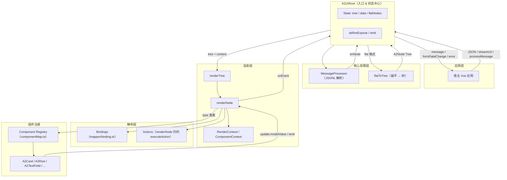
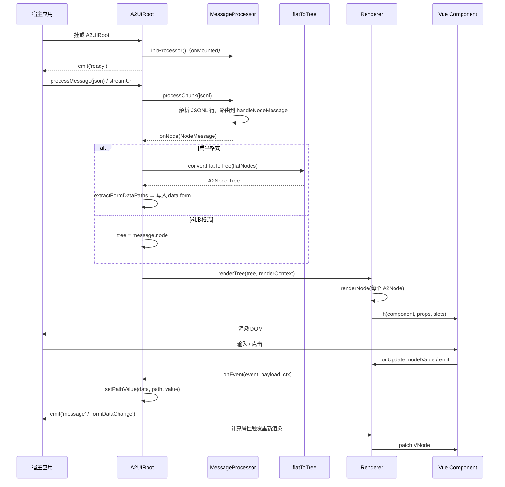
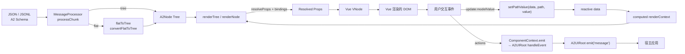

# Runtime 架构设计

本文档描述 A2UI Vue Engine 的 Runtime 架构、生命周期、职责边界、数据流以及未来的扩展方式。目的在于说明 **为什么这样设计**，而不是罗列 API。文档基于当前项目的实际实现（`packages/a2ui-vue-engine`）整理，不涉及新的功能规划与协议修改。

---

## Runtime 总体架构

A2UI Runtime 是一个 **协议驱动、组件注册** 的 Vue 3 渲染引擎。它接收符合 A2UI 协议的 JSON Schema，将其转换为可渲染的组件树，并在运行时完成数据绑定、事件分发与状态同步。

Runtime 由若干职责单一的模块协作组成：

- **A2UIRoot**：Runtime 的对外入口 Vue 组件，负责聚合状态、驱动生命周期、暴露命令式 API 与 Emits。
- **MessageProcessor**：JSONL 流协议处理器，负责解析、路由消息（node / data / action / error / complete）。
- **flatToTree**：扁平协议到树形协议的适配层，屏蔽两种 Schema 表达方式的差异。
- **Renderer**：把 `A2Node` 树递归编译为 Vue VNode。
- **Component Registry**：`type → Vue Component` 的映射表，是协议与实现的解耦点。
- **Bindings（mapper）**：解析 `path / literal / expression` 类型的绑定，读取 / 写入 `data`。
- **Actions**：解析 `emit / callback / navigate / api` 类型的动作，把 DOM 事件转成协议事件。
- **Context**：`RenderContext / ComponentContext`，在渲染树中传递 `data`、`componentMap`、`onEvent`。

模块关系如下：

---

## Runtime 生命周期

Runtime 的运行是一个 **单向、可重入** 的循环。任意时刻，`tree` 与 `data` 都是完整可渲染的状态。

关键节点说明：

1. **页面初始化**：`A2UIRoot` 挂载，`onMounted` 中创建 `MessageProcessor`，emit `ready`。
2. **接收 JSON**：宿主通过 `processMessage(msg)` 或 `streamUrl` 传入 JSONL。
3. **解析 Schema**：`MessageProcessor.processChunk` 按行解析并分发到 `onNode / onData / onError / onComplete`。
4. **生成 Tree**：若消息节点是扁平数组（`[{id, component, child}]`），通过 `convertFlatToTree` 转成 `A2Node` 树；否则直接使用 `message.node`。
5. **Renderer**：`renderTree → renderNode` 递归遍历 `A2Node`，通过 `componentMap[type]` 查到 Vue 组件，用 `h(...)` 构造 VNode。
6. **Vue Component**：组件层由 Vue 3 完成 DOM 挂载与生命周期。
7. **事件**：用户交互触发组件事件；`renderNode` 已经把 `update:modelValue` 与 `actions` 转换成 Vue 的事件处理器。
8. **数据更新**：`update:modelValue` 会通过 `setPathValue(data, path, value)` 写回 `data`，同时 `onEvent('dataUpdate', ...)` 通知外层。
9. **重新渲染**：`renderContext` 是 `computed`，依赖 `data.value`，其变化自动触发 `renderContent` 计算属性重算并 patch。

`onUnmounted` 中调用 `processor.reset()`，清理缓冲区、`tree`、`nodeMap` 等状态，保证可重复挂载。

---

## Runtime 职责划分

Runtime 的模块划分遵循 **单一职责** 原则，每个模块只解决一类问题，避免职责漂移。下面的表述来自当前源码的实际实现。

### A2UIRoot

- **对外入口**：以 Vue 组件形式暴露 `initialTree / initialData / streamUrl / componentMap` 等 props 与 `message / error / ready / complete / formDataChange` 等 emits。
- **状态中心**：持有 `tree`（`shallowRef<A2Node>`）、`data`（`ref<Record>`）、`flatNodes`（`shallowRef<FlatA2Node[]>`）等运行时状态。
- **生命周期驱动**：`onMounted` 里初始化 `MessageProcessor`，`onUnmounted` 里重置。
- **表单能力**：通过 `generateFormDataFromTree` / `extractFormDataPaths` 派生 `formData`，并在变化时 emit `formDataChange`。
- **命令式 API**：`defineExpose` 出 `updateData / updateTree / getData / getTree / getFormData / processMessage / processStream`。
- **上下文提供**：通过 `provide('a2uiData' / 'a2uiTree' / 'a2uiUpdateData' / 'a2uiUpdateTree')` 让 Runtime 内的自定义组件也能读写全局状态。

A2UIRoot **不解析协议、不构造 VNode**——它只做「聚合」。

### Renderer

- **树到 VNode 的映射**：`renderTree` 遍历 `A2Node[] | A2Node`，`renderNode` 生成单个 VNode。
- **组件查表**：通过 `context.componentMap[node.type]` 查找目标 Vue 组件；找不到时降级为 `renderFallback`。
- **Slots / Children 策略**：`SELF_RENDER_CHILDREN_TYPES` 列表中的组件（Card / Row / Column / List / TextField / Button / OptionCard）通过 `props.children + props.context` 自行递归，其它组件则通过 Vue slots 承接。
- **事件桥接**：`createEventHandlers` 把 `actions[]` 编译成 Vue 的 `on{Event}`；`node.bindings.modelValue` 存在时自动附加 `onUpdate:modelValue`。

Renderer **不持有状态**，是纯函数式模块——同样的 `tree + context` 得到同样的 VNode。

### MessageProcessor

- **协议解析**：接收 JSONL 字符串 chunk，按 `\n` 拆分为消息，容忍不完整行（`buffer` 缓存）。
- **消息路由**：按 `type` 分发到 `handleNodeMessage / handleDataMessage / handleActionMessage / handleErrorMessage / handleCompleteMessage`。
- **节点索引**：维护 `nodeMap`（`id → A2Node`），支持 `node / node_update / node_append / node_remove` 的增量更新。
- **流式接入**：`processStream(response)` 从 `Response.body.getReader()` 读取字节，边解码边解析。
- **回调外化**：所有副作用（`tree` 更新、事件通知）通过构造时注入的 `options.onNode / onData / onAction / onError / onComplete` 上抛，Processor 自身不感知 Vue。

MessageProcessor **只处理协议**，不接触渲染。

### Component Registry

- **协议与实现的解耦点**：以 `{ 'a2-card': A2Card, ... }` 的形式把协议中的 `type` 字符串映射到 Vue 组件。
- **合并策略**：`createComponentMap(custom)` 用 `{ ...defaultComponentMap, ...customComponents }` 合并，宿主可以按 `type` 覆盖默认实现。
- **注册方式**：模块级导出的 `registerComponent / registerComponents / resetComponentMap` 支持运行时动态注册。

组件注册表 **只做映射**，不参与协议解析和 VNode 构造。

### Bindings

- **绑定解析**：`resolveBinding` 支持 `literal`（字面量）、`path`（`user.profile.name` 形式的路径）、`expression`（安全求值的表达式）三种类型。
- **Prop 合并**：`resolveProps(props, bindings, data)` 把静态 props 与绑定结果合并成最终传给组件的对象。
- **值转换**：`transformValue` 支持 `uppercase / lowercase / trim / number / string / boolean / json / parse` 等预定义转换。
- **反向写入**：写入侧不在此模块，由 `renderNode` 中的 `setPathValue` 完成，保证读写路径的对称。

Bindings **只是纯映射函数**，无副作用。

### Actions

- **事件到协议的映射**：`ActionConfig` 描述了「什么事件、什么类型、什么载荷」；`renderNode` 在渲染时把它编译成 Vue 的事件监听。
- **动作类型**：
  - `emit` → 通过 `ComponentContext.emit` 上抛，最终由 `A2UIRoot` 的 `handleEvent` 转成 `message` 事件；
  - `callback` → 用 `new Function` 安全构造处理函数并调用；
  - `navigate` → 修改 `window.location`；
  - `api` → 以 `emit('api', ...)` 委托给宿主处理。
- **载体**：Actions 的执行发生在 Renderer 层，但它 **只描述行为、不承载业务逻辑**，业务逻辑始终由宿主接收 `message` 后处理。

### Context

- **RenderContext**：`{ data, componentMap, globalProps?, onEvent? }`，贯穿整个渲染树；由 `A2UIRoot` 用 `computed` 构造，`data` 变化自动触发下游重算。
- **ComponentContext**：每个 `A2Node` 渲染时生成一份 `{ node, data, path, emit, resolveBinding, executeAction }`，供 Actions 使用。
- **Vue provide/inject**：`A2UIRoot` 还通过 `provide` 暴露 `a2uiData / a2uiTree / a2uiUpdateData / a2uiUpdateTree`，供自定义 Vue 组件（未通过 Renderer 挂载的部分）读取。

Context 层 **只做上下文透传**，不做协议解析、不做渲染。

> 职责边界原则：`A2UIRoot` 是状态入口、`MessageProcessor` 是协议入口、`Renderer` 是渲染入口、`Component Registry` 是实现入口。四个「入口」之间用 `Context` 和 `Bindings/Actions` 作为纯函数式桥梁。

---

## 数据流

Runtime 的数据流是 **单向 + 反馈闭环** 的：Schema 单向流向 DOM，用户输入通过事件闭环回到状态并驱动下一次渲染。

各阶段职责：

- **JSON → Tree**：MessageProcessor 保证解析的健壮性；flatToTree 保证协议表达的多样性（扁平 / 树形都能统一到 `A2Node`）。
- **Tree → VNode**：Renderer 保证结构的纯函数式转换；Bindings 在这一步把 `path` 类型绑定解析成实际值。
- **VNode → Vue → DOM**：完全交给 Vue 3 的 patch 机制，Runtime 不重复造轮子。
- **Event → Message**：DOM 事件通过 Actions 转成协议语义的 `message`，向宿主上抛。
- **Message → State**：`update:modelValue` 通过 `setPathValue` 就地写入 `data`，无需再走一遍协议。
- **State → 重新渲染**：`data` 是 `ref`，被 `renderContext`（computed）依赖，因此 Vue 会自动触发 `renderContent` 重算，进入下一轮渲染。

---

## 为什么采用协议驱动

Runtime 采用 **JSON 协议 + 运行时解析 + 组件注册** 的组合而非直接使用 Vue Template，是基于 A2UI 的目标场景做出的显式权衡。

### 为什么不用 Vue Template

- Vue Template 需要 **编译时**（`vue-loader` / `@vitejs/plugin-vue` / `compile()`），依赖构建工具链和源码；A2UI 的场景是「服务端下发页面结构、前端实时渲染」，编译时不可用。
- Vue Template 与实现强耦合，跨端、跨框架无法直接复用；A2UI 希望协议本身跨技术栈（同一份 Schema 也可以被其它框架实现的 Runtime 消费）。
- Template 内嵌任意表达式会带来安全与运行时求值成本；A2UI 用受控的 `bindings` / `actions` 描述语义，可控性和可静态校验性更好。

### 为什么使用 JSON

- **可传输**：JSON 天然可以通过 HTTP、SSE、WebSocket、JSONL 流增量下发，契合 AI 场景（模型逐步吐出结构）。
- **可增量**：协议中 `node / node_update / node_append / node_remove / data / data_update` 允许**部分更新**，无需整树重建。
- **无副作用**：JSON 是纯数据，天然安全，便于日志、回放、快照、diff。
- **易生成**：AI 或服务端很容易产出 JSON，比模板字符串更结构化。

### 为什么使用 Runtime

- **热更新界面**：不发版即可下发新 UI 结构。
- **服务端驱动**：把「渲染什么」的决定权交给服务端 / 模型。
- **一致性**：所有 UI 通过同一段 Runtime 代码渲染，行为一致、可观测、可控。
- **可组合**：`A2UIRoot` 可以在任意 Vue 应用里被多次实例化，与业务组件混用。

### 为什么采用组件注册

- **协议与实现解耦**：协议只谈 `type: "a2-card"`；具体的 `A2Card.vue` 可以随时替换。
- **可扩展**：宿主通过 `componentMap` 注入新 `type`，不需要修改 Runtime 源码。
- **可主题化**：默认组件可以被覆盖为业务定制的实现，样式和交互都可以差异化。
- **可测性**：Runtime 单元测试可以传入 mock 组件表，聚焦渲染逻辑本身。

---

## 扩展能力

Runtime 被设计成 **对扩展开放、对修改封闭**。绝大多数新组件的接入都不需要改动 `MessageProcessor`、`Renderer`、`A2UIRoot`、`Bindings`、`Actions` 中的任何一行。

以未来新增 `Table / Dialog / Drawer / Chart / Tree / Dashboard / Timeline` 为例，标准扩展步骤是：

1. **新增组件**：在 `packages/a2ui-vue-engine/src/components` 下实现 `A2Table.vue / A2Dialog.vue / ...`，用普通 Vue 3 组件即可，遵循 `v-model / emit` 惯例。
2. **注册组件**：在 [`componentMap.ts`](file:///d:/work/program/tineco/UI/a2ui-vue-engine/packages/a2ui-vue-engine/src/components/componentMap.ts) 增加 `'a2-table': A2Table`，或宿主通过 `A2UIRoot` 的 `componentMap` prop / `registerComponent()` 动态注入。
3. **补充协议**：在 [`types/index.ts`](file:///d:/work/program/tineco/UI/a2ui-vue-engine/packages/a2ui-vue-engine/src/types/index.ts) 的 `FlatA2Node` 上追加该组件用到的字段（如 `columns / dataSource`），并在 [`flatToTree.ts`](file:///d:/work/program/tineco/UI/a2ui-vue-engine/packages/a2ui-vue-engine/src/core/flatToTree.ts) 的 `buildProps` 里做扁平字段到 `props` 的映射。
4. **补充文档**：在 `packages/a2ui-docs/docs/components/` 下新增使用文档。

不需要做的事：

- **不需要改 Renderer**：`renderNode` 通过 `componentMap[node.type]` 查表，只要注册即可。
- **不需要改 MessageProcessor**：协议消息类型不变。
- **不需要改数据流**：`bindings.modelValue` / `actions` 已经覆盖大多数交互需求；如果新组件是纯展示（Chart / Timeline），甚至连绑定都不用改。
- **不需要改 A2UIRoot**：只有当新组件参与「表单值提取」时，才需要在 `generateFormDataFromTree` 中加入相应 `type`；这是唯一的可选变动点。

对于更深度的扩展（例如新增 `Binding` 类型、新增 `Action` 类型、新增协议消息类型），也遵循同样的原则——只在对应模块内部扩展：

- 新的 `BindingConfig.type` → 只改 [`mapper/binding.ts`](file:///d:/work/program/tineco/UI/a2ui-vue-engine/packages/a2ui-vue-engine/src/mapper/binding.ts) 的 `resolveBinding` 分支；
- 新的 `ActionConfig.type` → 只改 [`renderer/renderNode.ts`](file:///d:/work/program/tineco/UI/a2ui-vue-engine/packages/a2ui-vue-engine/src/renderer/renderNode.ts) 的 `executeAction` 分支；
- 新的 `A2Message.type` → 只改 [`core/MessageProcessor.ts`](file:///d:/work/program/tineco/UI/a2ui-vue-engine/packages/a2ui-vue-engine/src/core/MessageProcessor.ts) 的 `handleMessage` 分支。

---

## 设计原则

以下原则贯穿 Runtime 的设计与演进，也是评审新特性时的判断依据。

- **协议驱动**：所有 UI 结构、绑定、行为都由 JSON 协议描述；协议是唯一的真理来源，Runtime 只做解释执行。
- **组件驱动**：具体渲染能力封装在 Vue 组件里，通过 `type` 注册；Runtime 不硬编码任何业务组件。
- **运行时解析**：不依赖编译期模板，所有解析在浏览器运行时完成，支持服务端流式下发与热更新。
- **高内聚**：每个模块（Processor / flatToTree / Renderer / mapper / componentMap）只负责一件事，内部实现自洽。
- **低耦合**：模块之间通过接口（`A2Node / RenderContext / ComponentContext / MessageProcessorOptions`）通信，回调外化，禁止跨模块直接读写状态。
- **纯函数优先**：Renderer、Bindings、flatToTree 都是纯函数（相同输入 → 相同输出），便于测试、缓存与 SSR。
- **单一状态源**：`A2UIRoot` 是唯一状态中心，`tree` 与 `data` 从这里流出；子组件通过事件而不是直接修改状态回写。
- **单向数据流 + 显式回写**：`data → props`（自动）、`event → data`（通过 `setPathValue` 显式写），避免隐式响应导致的调试困难。
- **对扩展开放，对修改封闭**：新增组件只需注册、新增字段只需在协议 / 扁平映射里补齐，不触碰 Runtime 内核。
- **向后兼容**：同时支持扁平格式与树形格式；协议字段增加而非替换；`convertFlatToTree` 是唯一的兼容适配层，隔离协议演进的影响。
- **失败可见**：未知 `type` 由 `renderFallback` 显式提示；JSONL 解析错误、`node_update` 未命中都会 `console.warn/error`，不静默吞掉。

---

## 参考实现位置

以下链接指向本文档描述的具体实现，便于按图索骥：

- 入口组件：[A2UIRoot.vue](file:///d:/work/program/tineco/UI/a2ui-vue-engine/packages/a2ui-vue-engine/src/root/A2UIRoot.vue)
- 消息处理：[MessageProcessor.ts](file:///d:/work/program/tineco/UI/a2ui-vue-engine/packages/a2ui-vue-engine/src/core/MessageProcessor.ts)
- 扁平→树：[flatToTree.ts](file:///d:/work/program/tineco/UI/a2ui-vue-engine/packages/a2ui-vue-engine/src/core/flatToTree.ts)
- 渲染树：[renderTree.ts](file:///d:/work/program/tineco/UI/a2ui-vue-engine/packages/a2ui-vue-engine/src/renderer/renderTree.ts)
- 渲染节点：[renderNode.ts](file:///d:/work/program/tineco/UI/a2ui-vue-engine/packages/a2ui-vue-engine/src/renderer/renderNode.ts)
- 绑定解析：[binding.ts](file:///d:/work/program/tineco/UI/a2ui-vue-engine/packages/a2ui-vue-engine/src/mapper/binding.ts)
- 组件注册：[componentMap.ts](file:///d:/work/program/tineco/UI/a2ui-vue-engine/packages/a2ui-vue-engine/src/components/componentMap.ts)
- 类型定义：[types/index.ts](file:///d:/work/program/tineco/UI/a2ui-vue-engine/packages/a2ui-vue-engine/src/types/index.ts)
