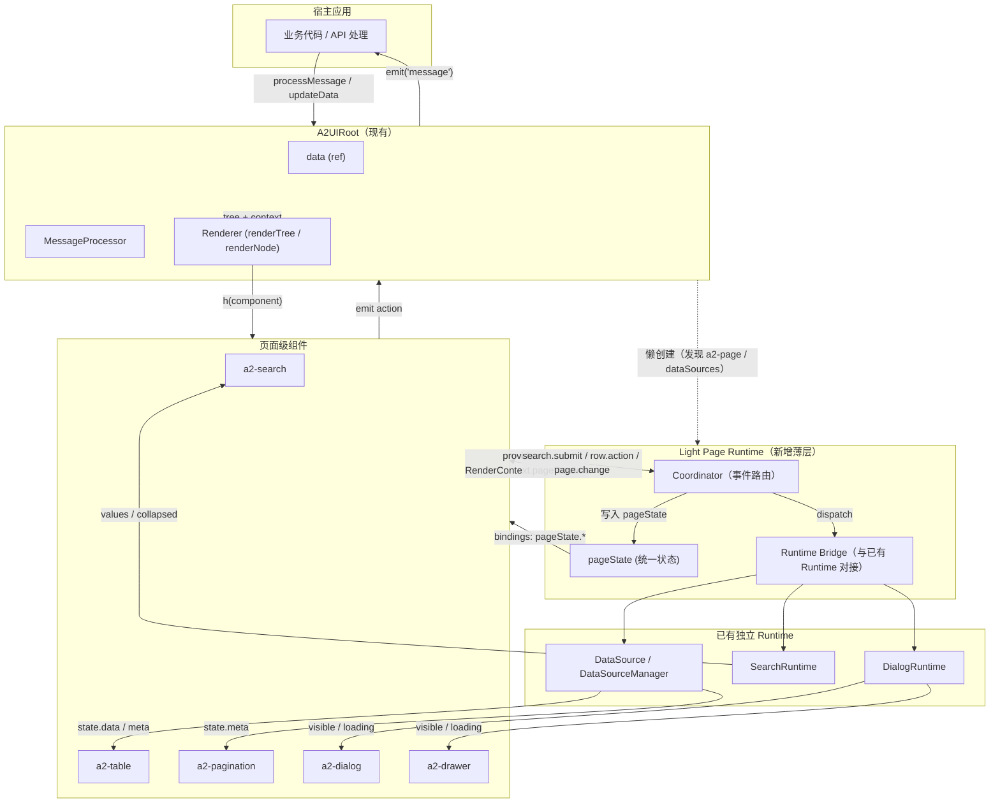
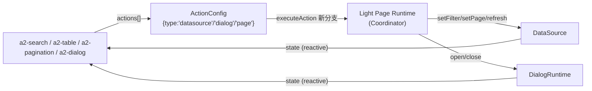
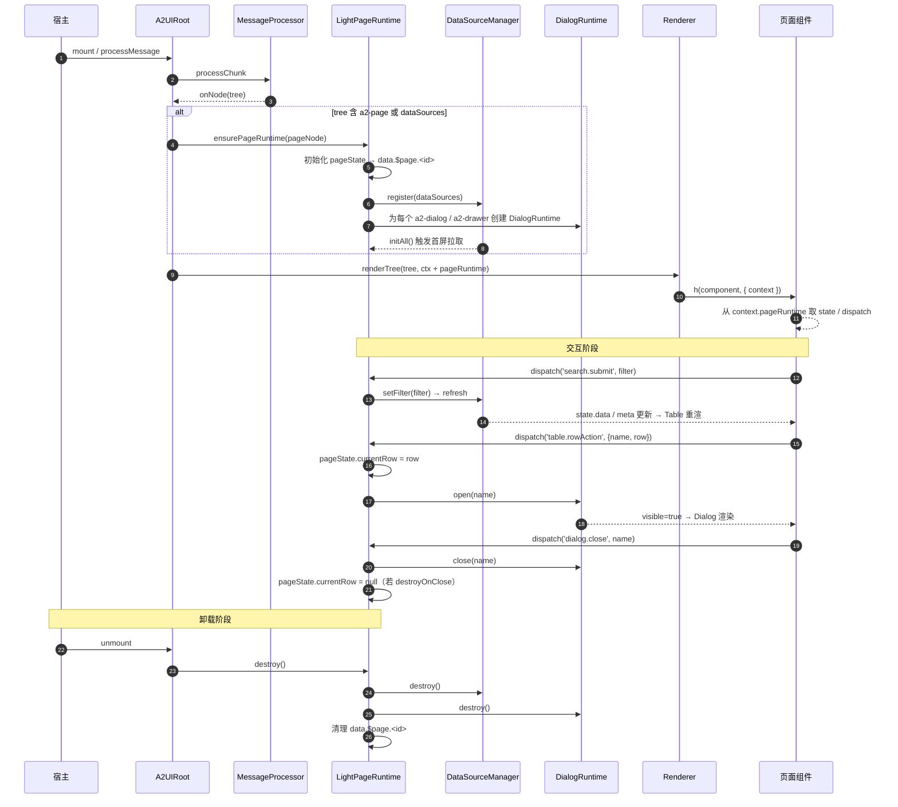

# Light Page Runtime 设计

> 本文档是 **设计文档**，不涉及任何代码实现。
>
> 目标：在既有 A2UI Runtime（Renderer / MessageProcessor / ComponentRegistry / Schema / Action / DataSource）之上，叠加一层 **Light Page Runtime（轻量页面运行时）**，负责 Search / Table / Pagination / Dialog / Drawer 之间的 UI 层状态协调。
>
> 参考：
> - [Page Runtime 设计](/architecture/page-runtime-design)
> - [DataSource 设计](/architecture/datasource)
> - [Action 系统](/architecture/action-system)
> - [Page Schema 设计](/architecture/page-schema)

---

## 1. 背景与定位

A2UI 现有能力已经具备：

- **Renderer**：`renderTree / renderNode` 把 `A2Node` 编译为 VNode，纯函数、不感知业务。
- **MessageProcessor**：JSONL 协议解析与增量应用，`onNode / onData / onAction / onError / onComplete` 事件外化。
- **ComponentRegistry**：`type → Vue Component` 映射，宿主可任意扩展。
- **Schema**：`A2Node` 树 + `bindings` + `actions` 描述结构、数据与行为。
- **Action System**：`emit / callback / navigate / api` 四种统一动作类型。
- **DataSource**：`DataSource / DataSourceManager` 独立可用，涵盖 fetch / cache / retry / pagination / debounce / refreshOn。
- **SearchRuntime / DialogRuntime**：单模块级运行时，已具备 Form / Filter / Visibility 的独立能力。

**缺口**：在「CRUD 页面」场景下，Search → Table → Pagination → Row Action → Dialog / Drawer 之间需要一层 **UI 状态协调者**。当前这份「协调职责」被隐式散布在宿主代码里——每个业务页都在重写「搜索触发列表刷新」「翻页触发列表刷新」「行操作打开弹窗并携带行数据」的样板。

Light Page Runtime（下文简称 **LPR**）就是这一层薄薄的协调层。

**定位**：

- **在 Renderer 之上**：不产 VNode，不感知渲染细节；
- **在 DataSource / Search / Dialog Runtime 之上**：不重造轮子，只把它们串起来；
- **在业务之下**：不承接任何业务逻辑（不做 API 编排、不做工作流、不做权限）。

一句话概括：**LPR 只做 UI 层的状态协调，不做业务编排。**

---

## 2. 目标能力

LPR 必须让下列场景在 Schema 中「零胶水」表达：

1. **Search → API 请求 → 更新 Table**：搜索栏 submit 后触发 DataSource 更新 filter 并 refresh，Table 自动响应。
2. **Table → Pagination 联动 API**：翻页 / 换页大小 / 排序变化触发同一 DataSource 更新 params。
3. **Row Action（查看 / 编辑）→ 打开 Dialog / Drawer**：点击行按钮打开 Overlay，并把当前行数据注入 Overlay 上下文。
4. **Dialog / Drawer 支持绑定当前行数据**：Overlay 通过 `currentRow` 直接消费触发行的数据，无需宿主手动 setState。
5. **Refresh / Reset / Search / PageChange 统一调度**：所有对 Table 的更新走同一入口，保证行为可预测。

---

## 3. 硬性约束

LPR 必须严格遵守：

- **不改变 Renderer**：`renderTree / renderNode` 主流程零改动。
- **不破坏现有组件系统**：`componentMap` 只做增量注册，现有 16 个组件行为不变。
- **不引入复杂工作流引擎**：不做 DAG、不做条件分支、不做状态机。
- **不做业务编排**：不接管 API 调用（业务 API 仍由宿主处理），只调度 UI 状态。
- **只做 UI 层状态协调**：全部职责限定在「页面模块之间的状态传递与命令派发」。

任何超出以上边界的能力（远程数据编排、跨页面通信、离线队列等）不属于 LPR。

---

## 4. 架构总览（Mermaid）



要点：

- LPR 是 A2UIRoot 内部的 **懒创建模块**，只有 Schema 声明 `a2-page` 或含 `dataSources` 时才被激活。
- LPR 内部只有三个协作者：`pageState`（状态）、`Coordinator`（事件路由）、`Bridge`（对接已有 Runtime）。
- LPR 不新建响应式容器，所有状态最终落到 `A2UIRoot.data.$page.<pageId>`。
- 组件通过 `RenderContext.pageRuntime` 拿到 LPR 句柄，仅调用它的 **命令式 API**（`dispatch / getState`），不直接改状态。

---

## 5. 核心职责

LPR 只承担 5 项职责，每项都可以用一句话说清楚。

### 5.1 页面作用域管理

- 为每个 `a2-page` 建立独立的 **PageScope**，落到 `data.$page.<pageId>`；
- Scope 生命周期与节点挂载同步；`a2-page` 卸载时销毁 scope。

### 5.2 事件路由（Coordinator）

- 承接页面级语义事件（`search.submit / search.reset / table.pageChange / table.rowAction / dialog.open / dialog.close / refresh`）；
- 按类型分发到对应的桥接器；
- **不解析业务参数**，只把 payload 透传。

### 5.3 状态协调（PageState）

- 维护 `searchState / tableState / currentRow / dialogState / drawerState / refreshTrigger` 六类字段（详见 [page-state.md](/architecture/page-state)）；
- 状态是 **协调用的中间量**，不是业务数据仓库；
- 状态变更走单一入口：Coordinator 调用 `pageState.patch(...)`。

### 5.4 已有 Runtime 桥接

- 与 `DataSource` 桥接：把 `search.submit` 翻译为 `ds.setFilter`，把 `table.pageChange` 翻译为 `ds.setPage`；
- 与 `DialogRuntime` 桥接：把 `dialog.open(row)` 翻译为 `dialog.setVisible(true)` + 写入 `pageState.currentRow`；
- 与 `SearchRuntime` 桥接：把 `refresh` / `reset` 翻译为 `sr.reset()` 或直接 `sr.submit()`。

### 5.5 命令式 API 与观测点

- 对宿主暴露 `refresh(dsId?) / openDialog(name, row?) / closeDialog(name) / reset(pageId?) / getPageState(pageId)`；
- 对组件暴露 `dispatch(type, payload)` 与 `getState()`；
- 所有 dispatch 可选打上 audit tag，便于回放与调试。

---

## 6. 与 Renderer / Action / DataSource 的关系

LPR 与三个既有子系统只有明确的、单向的接触点。

### 6.1 与 Renderer 的关系

- Renderer **不感知** LPR 存在；`renderNode` 只多读取一个可选字段 `context.pageRuntime`，将其一并放入 `ComponentContext` 供组件使用。
- LPR **不产 VNode**，也不改变 Renderer 的任何行为。
- 唯一交集点是 `RenderContext.pageRuntime?: PageRuntime` —— 一个 additive 可选字段。

### 6.2 与 Action 系统的关系

LPR 通过 **新增 Action 分支** 与现有 Action 系统对接（分支为可选，未使用时行为等价旧版）：

| 新 Action 类型      | 含义                                | 桥接到              |
| --------------- | ----------------------------------- | ------------------- |
| `datasource`    | 触发 DataSource 命令（refresh/setPage/setFilter/setSort） | `DataSource` API    |
| `dialog`        | 打开 / 关闭 Dialog                    | `DialogRuntime`     |
| `drawer`        | 打开 / 关闭 Drawer                    | `DialogRuntime`     |
| `page`          | 页面级操作（search / reset / refresh） | LPR Coordinator     |

现有 `emit / callback / navigate / api` 分支不动。业务方仍可选择用 `emit` 上抛意图由宿主处理——LPR 是「便利分支」而非「唯一分支」。

### 6.3 与 DataSource 的关系

- LPR **不重新实现** fetch / cache / retry / pagination——直接调用 `DataSource` 已有方法；
- LPR 只是「谁调用、什么时候调用」的调度者；
- DataSource 的响应式 `state` 直接被 Table / Pagination 通过 `bindings.dataSource` 消费，LPR 不做中转。

### 6.4 关系图



---

## 7. 生命周期设计（从 Schema 到 UI）

LPR 的生命周期完全嵌入 A2UIRoot 的既有流程，只在关键节点插入若干「有条件的懒执行」。



关键阶段说明：

1. **发现**：MessageProcessor 交付 tree 后，A2UIRoot 检查是否存在 `a2-page` 或 `dataSources`。存在则懒创建 LPR，否则完全跳过（保底：老 Schema 零开销）。
2. **注册**：LPR 遍历 tree，注册 DataSource、创建 DialogRuntime、初始化 pageState。
3. **注入**：LPR 挂在 `RenderContext.pageRuntime`，随渲染上下文向下透传。
4. **消费**：组件在 setup 阶段拿到 `pageRuntime`，读取 state（响应式）、注册事件处理。
5. **调度**：任何 UI 事件通过 `pageRuntime.dispatch(type, payload)` 进入 Coordinator，由 Coordinator 决定改哪块 state / 触发哪个 Runtime。
6. **销毁**：`a2-page` 卸载或 A2UIRoot unmount 时，LPR 逐级销毁：DialogRuntime → DataSource → pageState scope。

---

## 8. 状态模型（pageState 结构）

pageState 是 LPR 的**唯一状态中心**，只保存「协调所需的中间状态」，不重复业务数据。完整规范见 [page-state.md](/architecture/page-state)。

### 8.1 概念模型

```jsonc
// data.$page.<pageId>
{
  "searchState": {
    "values":     { /* 当前搜索字段值 */ },
    "collapsed":  true,
    "lastSubmit": { /* 上一次实际提交给 DataSource 的 filter */ }
  },

  "tableState": {
    "dataSourceId": "orderList",
    "loading":      false,        // 从 DataSource.state.status 派生
    "data":         [],           // 从 DataSource.state.data 派生（引用而非复制）
    "pagination": {
      "pageNum":    1,
      "pageSize":   20,
      "total":      0
    },
    "selectedRowKeys": []          // 若开启行选择
  },

  "currentRow": null,             // 当前触发行操作的行数据（Dialog / Drawer 消费）

  "dialogState": {
    "create":  { "visible": false, "loading": false, "context": null },
    "detail":  { "visible": false, "loading": false, "context": null }
  },

  "drawerState": {
    "edit":    { "visible": false, "loading": false, "context": null }
  },

  "refreshTrigger": 0             // 单调递增；组件 watch 即可强制刷新
}
```

字段职责简述：

- `searchState`：搜索栏"当前值"与"最后提交值"的分离，允许 UI 层保留输入而不立即触发请求。
- `tableState`：Table 关注的三件事——data / loading / pagination；其中 `data` 与 `loading` 是 DataSource 的 **反投影**（视图字段）。
- `currentRow`：Row Action 的传参通道；Dialog / Drawer 内子组件直接 `bindings: pageState.currentRow.xxx` 消费。
- `dialogState / drawerState`：每个 overlay 一份 `{ visible, loading, context }`；`context` 允许携带额外上下文（例如打开 Dialog 时的额外参数）。
- `refreshTrigger`：不是状态，是**信号**——递增即代表"请刷新"。组件 / 宿主可用 `watchEffect` 观测。

### 8.2 更新规则（谁能改什么）

- `searchState` 由 `a2-search` 通过 `dispatch('search.*', ...)` 更新；
- `tableState.pagination` 由 `a2-pagination` 通过 `dispatch('table.pageChange', ...)` 更新，Coordinator 同时触发 DataSource；
- `tableState.data / loading` 是 **只读投影**，由 LPR 内部 `watch(DataSource.state)` 同步；
- `currentRow` 由 `table.rowAction` 派发时写入；`dialog.close({ destroyOnClose: true })` 时清空；
- `dialogState / drawerState` 由 `dialog.*` / `drawer.*` 派发；
- `refreshTrigger` 由 `page.refresh` 递增。

任何直接写 pageState 都被视为反模式——组件与宿主一律走 `dispatch`。

### 8.3 单一入口

pageState 只对外暴露：

- **读**：`pageRuntime.getState()` / `pageRuntime.select(path)` / `bindings.type = 'pageState'`（可选新绑定类型）；
- **写**：`pageRuntime.dispatch(type, payload)`。

**不暴露** 直接 setter。这是 LPR 保持"可预测"的关键。

---

## 9. 五个目标场景的完整数据流

### 9.1 Search → API → Table

```
a2-search  submit
   │  dispatch('search.submit', {values})
   ▼
LPR Coordinator
   │  pageState.searchState.lastSubmit = filter
   │  DataSource.setFilter(filter)   （已内置 debounce）
   ▼
DataSource → transport
   │  state.status = loading → success
   ▼
pageState.tableState.data / loading 派生同步
   │
   ▼
a2-table 通过 bindings.dataSource 自动重渲
```

### 9.2 Table Pagination → API

```
a2-pagination  change(pageNum)
   │  dispatch('table.pageChange', {pageNum})
   ▼
LPR Coordinator
   │  pageState.tableState.pagination.pageNum = pageNum
   │  DataSource.setPage(pageNum)
   ▼
DataSource 请求 → tableState 派生 → 重渲
```

### 9.3 Row Action → Dialog

```
a2-table  按钮点击（第 N 行）
   │  actions: [{ type: 'page', op: 'openDialog', payload: { name: 'detail', row: '$row' } }]
   ▼
Renderer executeAction (page 分支)
   │
   ▼
LPR Coordinator dispatch('table.rowAction', {name, row})
   │  pageState.currentRow = row
   │  DialogRuntime['detail'].open()
   │  pageState.dialogState.detail.visible = true
   ▼
a2-dialog 显示，内部子树 bindings: pageState.currentRow.orderNo 直接生效
```

### 9.4 Dialog 提交 → 刷新 Table

```
a2-dialog  Submit（走 DialogRuntime.handleFooterAction）
   │
   ▼
DialogRuntime.submit → 宿主 onSubmit（业务 API 调用发生在宿主）
   │
   ▼
宿主 API 成功 → a2uiRoot.pageRuntime.refresh('orderList') & closeDialog('detail')
   │
   ▼
LPR
   │  DataSource.refresh()
   │  DialogRuntime.close() → pageState.dialogState.detail.visible = false
   │  destroyOnClose ? currentRow = null : 保留
```

### 9.5 Refresh / Reset 统一调度

```
任何触发方（工具栏按钮 / 快捷键 / 宿主命令式）
   │
   ▼
dispatch('page.refresh')   或   dispatch('page.reset')
   │
   ▼
Coordinator
   ├─ refresh：DataSource.refresh() + refreshTrigger++
   └─ reset：SearchRuntime.reset() + DataSource.setFilter({}) + pagination 归 1
```

---

## 10. 为什么这是"轻量设计"而不是低代码平台

LPR 的每一个设计选择都在**主动拒绝**变成低代码平台。以下是设计与低代码之间的核心差异。

### 10.1 轻量设计的六个特征

| 维度      | Light Page Runtime                          | 低代码平台（对照）                     |
| --------- | ------------------------------------------- | ------------------------------------- |
| 职责范围  | UI 状态协调（5 项固定职责）                 | UI + 数据 + 业务 + 权限 + 部署 + 审批 |
| 状态模型  | 6 个固定字段（page-state.md 定义）          | 任意自定义模型 + 复杂 store           |
| 编排能力  | 无（不做流程 / 不做条件分支 / 不做工作流）  | DAG / 规则引擎 / 流程节点             |
| 执行方式  | 事件路由 + 桥接调用                         | 解释执行 + 脚本 + 表达式引擎           |
| 扩展方式  | 新 Action 分支 / 新组件类型                 | 插件市场 / 编辑器 / IDE                |
| 交付形态  | 一层薄薄的 Runtime 模块                     | 整套后台 + 编辑器 + 运行时             |

### 10.2 轻量的具体体现

- **零编译**：LPR 全部逻辑走 Schema + 内置分支；不引入 DSL、不引入模板编译；
- **零脚本**：pageState 更新走固定 dispatch 分支；不接受用户提供的 JS 片段（`callback` 已在 Action 层限定使用范围）；
- **零编辑器**：Schema 由 AI / 服务端 / 手写产出；LPR 不提供可视化搭建工具；
- **零工作流**：不做条件分支（`if`）、并行（`fork/join`）、事务（`saga`）；如需，仍走宿主业务层；
- **零依赖倒置**：LPR 不侵入 Renderer / MessageProcessor / ComponentRegistry；三者对 LPR 不感知；
- **可拆除**：卸掉 LPR 后（不激活），A2UI 依然能完整跑 Form / 单模块场景，仅失去页面级协调。

### 10.3 边界原则（Anti-Scope）

以下能力**明确不属于** LPR，一旦有需求应在别处解决：

- ❌ 业务 API 编排（应走宿主 `handleMessage` + `refresh`）
- ❌ 跨页面通信（应走宿主 store 或消息总线）
- ❌ 权限 / 鉴权（应走宿主中间件与协议层的 `SecurityConfig`）
- ❌ 数据缓存策略调整（应走 DataSource 的 `cache` 声明）
- ❌ 离线队列 / 网络重试策略（同上，DataSource `retry`）
- ❌ 表单校验（应走组件层 + `validators`，Runtime 不承担）
- ❌ 页面级动画 / 转场（组件层实现）

### 10.4 一句话

> LPR 的价值不在于"能做多少"，而在于"**为什么只做这五件事**"——它是把已有能力粘合起来的最小胶水层，让常见 CRUD 页面的 Schema 表达变得零胶水。

---

## 11. 兼容性与激活策略

- **协议层**：`RenderContext.pageRuntime?`、`ActionConfig.type` 新增 `page / datasource / dialog / drawer`、`BindingConfig.type` 可选新增 `pageState / datasource`——**全部可选，additive**。
- **Runtime 层**：只有 tree 含 `a2-page` 或 `dataSources` 时才创建 LPR；否则 A2UIRoot 表现与旧版完全等价。
- **组件层**：现有 16 个组件不变；新增 `a2-page / a2-pagination` 等按普通组件流程注册。
- **测试保底**：任何未使用 LPR 的 Schema 在开启 LPR 的构建下渲染与交互结果必须与开启前完全一致。

---

## 12. 与文档矩阵的位置

| 文档                                            | 内容                                          |
| ----------------------------------------------- | --------------------------------------------- |
| 本文（runtime-design.md）                       | Light Page Runtime 总体设计（本文）           |
| [page-runtime-design.md](/architecture/page-runtime-design) | Page Runtime 的完整能力设计（DataSource / Scope / 生命周期） |
| [page-state.md](/architecture/page-state)       | pageState 结构、更新规则、协调用例             |
| [datasource.md](/architecture/datasource)       | DataSource 分层、Transport、Cache、Retry       |
| [action-system.md](/architecture/action-system) | Action 生命周期、四类既有动作与扩展点          |
| [page-schema.md](/architecture/page-schema)     | 页面级 Schema（`a2-page / a2-search / a2-table / ...`） |

本文是 **入口文档**：任何要在 A2UI 上做"页面级"能力的读者应先读本文；深入实现细节再进入上表其他文档。

---

## 13. 设计原则回顾

- **叠加而非替换**：LPR 是 A2UI 之上的一层，不动内核；
- **只做状态协调**：不做业务、不做工作流；
- **单一状态中心**：pageState 是唯一入口；
- **单一变更入口**：所有写走 `dispatch`；
- **纯桥接**：LPR 不重造 DataSource / SearchRuntime / DialogRuntime；
- **懒创建**：不用则不激活；
- **协议 additive**：所有扩展均为可选新分支，老 Schema 零感知；
- **可回放**：dispatch 与 DataSource / Dialog 事件全部可日志、可观测；
- **可拆除**：LPR 关闭后 A2UI 仍可用（仅失去页面级协调能力）。

---

_本文档仅为设计文档，不包含任何实现代码；不修改现有 Runtime 主干；所有落地锚点见 [page-runtime-design.md §14](/architecture/page-runtime-design)。_
