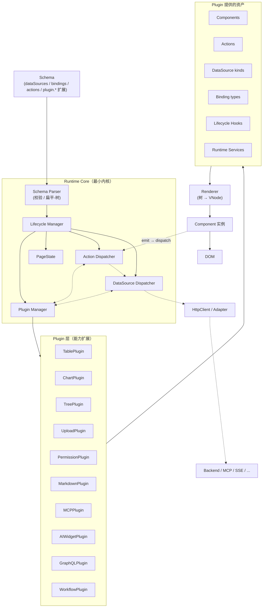
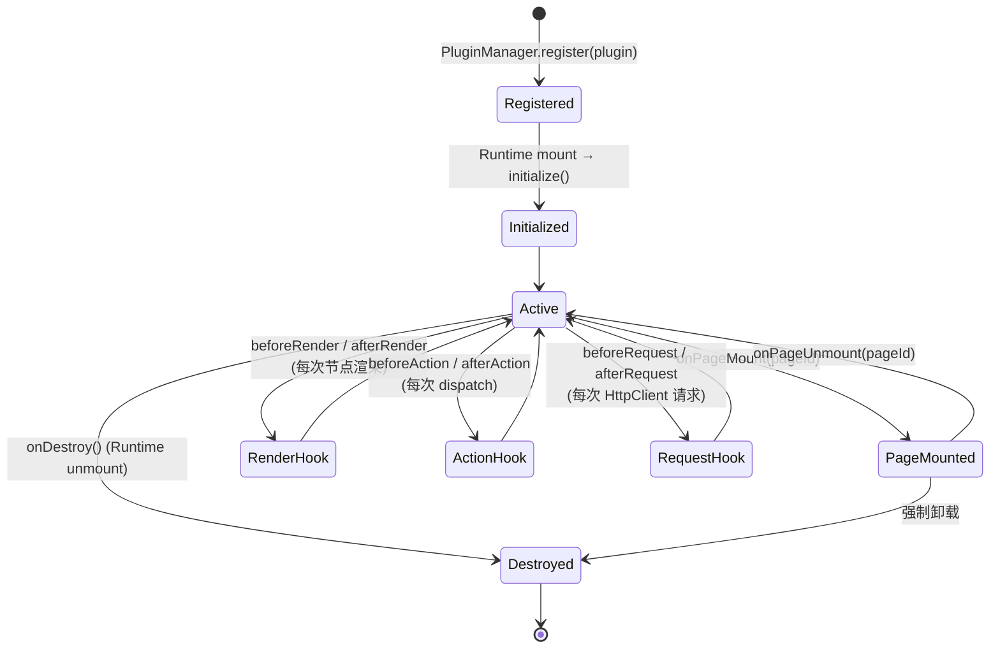
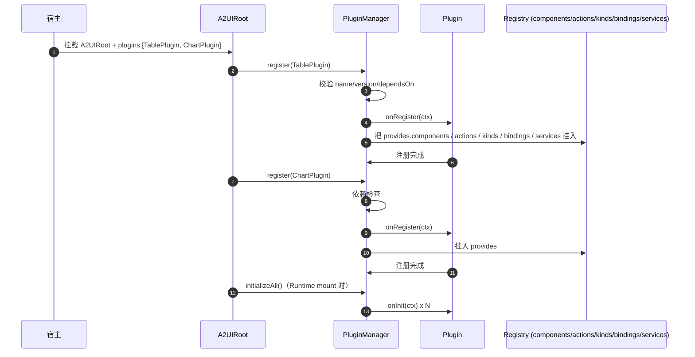
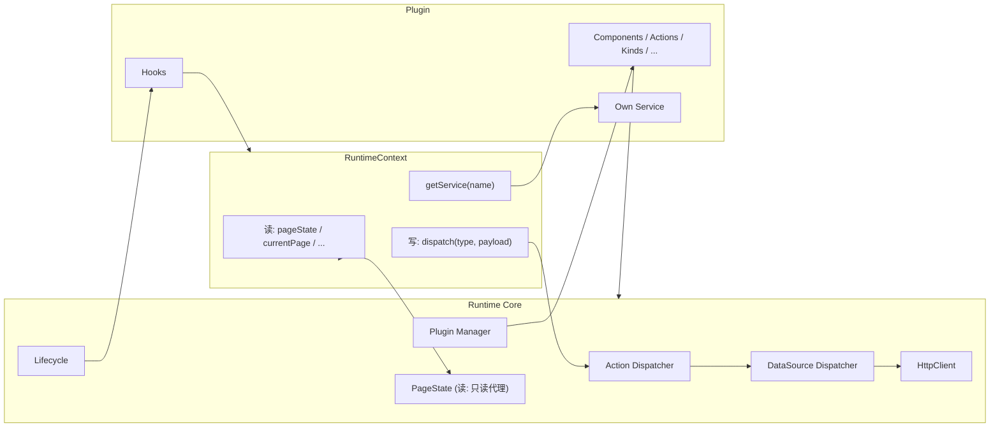
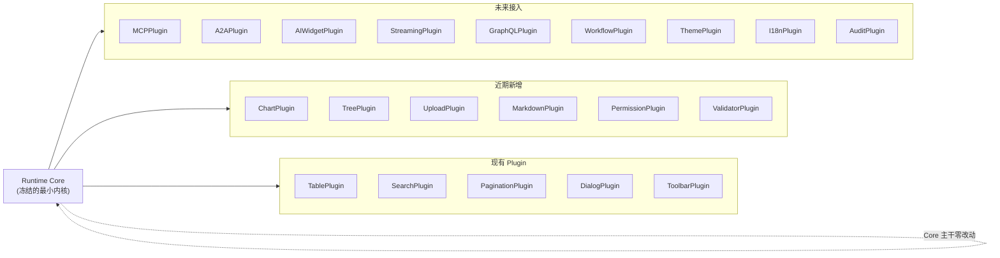

# Runtime Plugin Architecture 设计

> 本文档定义 A2UI Runtime 的 **Plugin 架构**：让 Runtime Core 保持最小内核，所有新增能力（Chart / Tree / Timeline / Markdown / Upload / Permission / MCP / A2A / AI Widget / GraphQL / WebSocket / Workflow / Streaming UI）都以插件形式增量接入，Core 主干零改动。
>
> 前置阅读：
> - [Light Page Runtime 设计](/architecture/runtime-design)
> - [Runtime 总体设计](/architecture/runtime-summary)
> - [PageState 模型设计](/architecture/page-state)
> - [DataSource 设计](/architecture/datasource)
> - [DataSource API Binding](/architecture/datasource-binding)
> - [DataSource 执行规范](/architecture/datasource-execution)
> - [Action System 执行机制](/architecture/action-system)
> - [HttpClient 抽象层](/architecture/http-client)
>
> **重要**：本文档定义的是 **Runtime 内部的能力扩展机制**，不是 npm Plugin、不是 Vue Plugin、不是 Vite Plugin。文档不含任何代码，也不修改现有 Runtime / DataSource。

---

## 1. 为什么 Runtime 必须插件化

### 1.1 Runtime Core 不应该越来越大

Runtime 是一段被所有页面共享、被所有服务端 / AI 下发的 Schema 消费的**基础设施**。它必须具备三个"稳定"属性：

- **接口稳定**：Schema 契约变更代价极高；
- **体积稳定**：越基础越应该越小，避免加载成本随功能爆炸；
- **心智稳定**：核心概念少而清晰（Renderer / Page Runtime / DataSource / Action / HttpClient 已足够多）。

如果每一个新能力（Chart / Tree / Markdown / Upload / Permission / MCP / A2A / Streaming UI …）都直接 patch 到 Runtime Core：

- **Core 变成万物万象**——bundle 体积失控；
- **每次演进要动主干**——回归风险巨大；
- **心智负担持续膨胀**——新贡献者难以理解；
- **可拆除性丧失**——业务不需要的能力仍被强制加载；
- **可替换性丧失**——想换一版 Chart 实现要动内核；
- **协议侵蚀**——协议里出现越来越多"某某能力独有"字段。

### 1.2 新增能力必须走 Plugin

**新增能力应该通过 Plugin 扩展**，理由：

- **Core 保持最小**：Renderer / Coordinator / DataSource / Action / HttpClient 六件套之外一律不进 Core；
- **能力可拆除**：业务按需装配，桌面 / 移动 / 小程序场景差异化打包；
- **能力可替换**：同一能力（如"图表"）允许多个 Plugin 实现，运行时挑选；
- **能力可组合**：Plugin 之间通过 Hook / Extension Point 组合；
- **能力可测试**：单个 Plugin 是独立可测的边界；
- **协议保持简洁**：Plugin 自带 Schema 扩展，不污染核心协议；
- **面向未来**：AI Widget / MCP / A2A 等尚未成型的能力天然作为 Plugin 演进。

### 1.3 一句话

> **Runtime Core 只做"解释与调度"；具体"能力"由 Plugin 承担。** 让 Core 变得**长得慢**、**改得少**、**换得起**。

---

## 2. 整体架构

### 2.1 分层图



### 2.2 五条明确边界

| 边界 | 谁跨越 | 允许方式 |
| --- | --- | --- |
| Schema ↔ Core | Parser | 声明式，纯 JSON |
| Core ↔ Plugin | Plugin Manager | 通过 Plugin 注册契约 |
| Plugin ↔ Renderer | Component / Binding | 通过 componentMap / resolveBinding |
| Plugin ↔ DataSource | DataSource Dispatcher | 通过 dataSource kind / adapter |
| Plugin ↔ Plugin | Runtime Services / Events | 通过 Core 中转，禁止直连 |

### 2.3 Core 与 Plugin 的职责边界

- **Core 决定 "怎么运转"**：解析 Schema、调度 Action、驱动 DataSource、维护 PageState、管理生命周期、加载 Plugin；
- **Plugin 决定 "有什么能力"**：提供组件、DataSource kind、Binding 类型、Action 类型、Lifecycle Hook、Runtime Service；
- **两者通过 Contract 通信**，永远不互相 import 具体实现。

---

## 3. Runtime Core 职责

### 3.1 保留在 Core 的六件套

Runtime Core 只允许保留以下 **6 项能力**：

| 能力 | 说明 |
| --- | --- |
| **Schema Parser** | JSONL / 扁平 / 树形三种协议的解析与统一 |
| **Lifecycle Manager** | mount / unmount / plugin register / plugin destroy |
| **PageState** | 唯一状态中心（`data.$page.<pageId>` + 反投影字段） |
| **Action Dispatcher** | dispatch 类型枚举 + 命令映射；对未知类型委派 Plugin |
| **DataSource Dispatcher** | 命令映射到 DataSource；对未知 kind 委派 Plugin |
| **Plugin Manager** | Plugin 注册 / 发现 / 生命周期 / Hook 分发 |

**Renderer** 保持在既有位置（不改动主干），Core 与 Renderer 之间保持 `RenderContext + componentMap` 接口稳定。

### 3.2 必须移出 Core 的能力

以下能力**不应**存在于 Core，而应作为 Plugin：

| 能力 | 归属 Plugin |
| --- | --- |
| Chart 渲染 | ChartPlugin |
| Tree / Timeline / Kanban | TreePlugin / TimelinePlugin / KanbanPlugin |
| Markdown / RichText | MarkdownPlugin / RichTextPlugin |
| Upload / Download | UploadPlugin |
| Form Validator | ValidatorPlugin |
| Permission / RBAC | PermissionPlugin |
| MCP Tool 接入 | MCPPlugin |
| A2A 协议 | A2APlugin |
| AI Widget（对话 / 建议） | AIWidgetPlugin |
| GraphQL 客户端 | GraphQLPlugin |
| WebSocket / SSE | StreamingPlugin |
| Workflow 编排（仅可选，谨慎使用） | WorkflowPlugin |

### 3.3 判断"是否属于 Core"的三条原则

1. **协议中立**：该能力若与 Schema 协议本身无关（不是"如何解析 / 调度 / 状态化"），则不属于 Core；
2. **可选性**：若可以想象一份 Schema 不使用它，则不属于 Core；
3. **业务色彩**：若与特定业务领域强绑定（如"权限"、"图表"、"IM"），则不属于 Core。

**Core 的六件套之外的一切都应视为 Plugin 候选。**

---

## 4. Plugin 定义

### 4.1 Plugin 的形式

Plugin 是一个**声明式对象**，向 Runtime 描述自己提供哪些资产、订阅哪些 Hook、依赖哪些 Service。

```
Plugin {
  name:           string                   // 唯一 id
  version:        string                   // semver
  dependsOn?:     string[]                 // 依赖的其他 Plugin
  provides?: {
    components?:    Record<string, ...>    // type → 组件
    actionTypes?:   Record<string, ...>    // Action type → executor
    dataSources?:   Record<string, ...>    // kind → Transport / behaviors
    bindings?:      Record<string, ...>    // Binding type → resolver
    services?:      Record<string, ...>    // 供其他 Plugin 使用的 Runtime Service
    schemaExt?:     Record<string, ...>    // Schema 字段扩展（如 permission）
  }
  hooks?: {
    onRegister?:      (ctx) => void
    onInit?:          (ctx) => void
    beforeRender?:    (node, ctx) => void
    afterRender?:     (node, vnode, ctx) => void
    beforeAction?:    (action, ctx) => Action | void
    afterAction?:     (action, result, ctx) => void
    beforeRequest?:   (req, ctx) => HttpRequest | void
    afterRequest?:    (res, ctx) => void
    onPageMount?:     (pageId, ctx) => void
    onPageUnmount?:   (pageId, ctx) => void
    onDestroy?:       (ctx) => void
  }
  meta?:          Record<string, any>      // 描述性元信息，不影响执行
}
```

### 4.2 Plugin 提供的六类能力

| 类别 | 说明 | 典型 |
| --- | --- | --- |
| **Component** | 注册到 componentMap 的 `type` | `a2-chart` / `a2-tree` / `a2-markdown` |
| **Action** | 新的 Action type + executor | `openWorkflow` / `uploadFile` / `askAI` |
| **DataSource 扩展** | 新的 `kind`（对接 Transport） | `graphql` / `mcp` / `sse` |
| **Binding type** | 新的 `bindings.type` 解析器 | `permission` / `i18n` |
| **Lifecycle Hook** | 各生命周期钩子 | `beforeAction` 加权限、`beforeRequest` 加签名 |
| **Runtime Service** | 供其它 Plugin 使用的 API | PermissionPlugin 提供 `hasPermission(code)` |

### 4.3 典型 Plugin 举例

| Plugin | Components | Actions | DataSource kinds | Hooks | Services |
| --- | --- | --- | --- | --- | --- |
| **TablePlugin** | a2-table | sortChange, selectionChange | —— | —— | —— |
| **ChartPlugin** | a2-chart | zoom / drillDown | —— | —— | —— |
| **TreePlugin** | a2-tree | expand / lazyLoad | —— | —— | —— |
| **UploadPlugin** | a2-uploader | uploadFile / cancelUpload | `upload` | beforeRequest（进度） | uploader service |
| **PermissionPlugin** | —— | —— | —— | beforeAction / beforeRender | hasPermission / requirePermission |
| **MarkdownPlugin** | a2-markdown / a2-code | —— | —— | —— | markdown parser service |
| **MCPPlugin** | —— | callTool | `mcp` | —— | mcp client |
| **AIWidgetPlugin** | a2-ai-chat / a2-suggestion | askAI / streamAI | `llm` | —— | ai service |
| **GraphQLPlugin** | —— | —— | `graphql` | —— | gql cache service |
| **WorkflowPlugin** | a2-workflow-step | startFlow / advance | —— | —— | flow service |

### 4.4 Plugin ≠ Component

关键区分：**Plugin 是一个装配单元**，可以只提供 1 个组件，也可以提供 1 组组件 + 若干 Action + 若干 Hook + 若干 Service。组件是 Plugin 提供的**资产之一**，而不是 Plugin 本身。

---

## 5. Plugin 生命周期

### 5.1 生命周期阶段

Plugin 的生命周期与 Runtime 生命周期对齐，共 **10 个阶段**：

| 阶段 | 时机 | 用途 |
| --- | --- | --- |
| **register** | Plugin 加载到 Runtime | 校验元数据、检查依赖、注册资产（未真正启用） |
| **initialize** | Runtime 首次挂载时 | 建立内部资源、订阅服务、准备就绪 |
| **onPageMount** | 每次 `a2-page` 挂载 | 为该 page 建立 plugin scoped 上下文 |
| **beforeRender** | 每个节点渲染前 | 修改 node（如权限过滤、i18n）；可返回替换 node |
| **afterRender** | 每个节点渲染后 | 事后审计、埋点 |
| **beforeAction** | Action 分发前 | 权限校验、参数补全；可 short-circuit |
| **afterAction** | Action 分发后 | 审计、成功/失败通知 |
| **beforeRequest** | HttpClient 发送前 | 加签名、注入 header、埋点 traceId |
| **afterRequest** | HttpClient 收到响应后 | 归一化、日志、指标 |
| **onPageUnmount** | `a2-page` 卸载 | 清理 scoped 资源 |
| **onDestroy** | Runtime 卸载 | 断开长连接、清空内存 |

### 5.2 生命周期图



### 5.3 Hook 调用规则

- **有序**：同一阶段多个 Plugin Hook 按注册顺序执行；
- **可短路**：`beforeAction` / `beforeRender` / `beforeRequest` 可返回 `false` 或替换对象来中止 / 修改；
- **不可逆**：`after*` Hook 不允许改变已发生的事实，仅用于观测；
- **异常隔离**：任一 Hook 抛错，Runtime 记录 audit，不中断整体流水线；
- **同步/异步**：Hook 支持返回 Promise；`beforeAction / beforeRequest` 会 await；`beforeRender / after*` 不 await（保证渲染流畅）；
- **超时保护**：Async Hook 有默认超时（如 200ms），超时视为放行。

### 5.4 生命周期与 Renderer 的关系

Renderer 主干**不感知** Plugin。Plugin 通过 `beforeRender / afterRender` 参与渲染，走的是 Core 与 Renderer 之间的 `RenderContext.onNode` 桥梁（既有 additive 扩展点）。**Renderer 主流程零改动**——这是"不修改现有 Runtime"的物理保证。

---

## 6. Plugin 注册机制

### 6.1 注册路径

Plugin 有 **三种注册途径**（择一即可）：

| 方式 | 场景 | 特点 |
| --- | --- | --- |
| **A. 编译时装配** | 宿主打包时 | 在 A2UIRoot 初始化时通过 `plugins:[...]` 传入 |
| **B. 运行时装配** | 宿主动态加载 | `a2uiRoot.use(plugin)`；支持懒加载 |
| **C. Schema 声明装配** | 服务端 / AI 下发 | Schema 顶层 `plugins:["chart@1", "mcp@2"]` 触发 Runtime 按需装载（依赖宿主已注册） |

三种途径最终都汇聚到 `PluginManager.register(plugin)`。

### 6.2 注册流程



### 6.3 冲突检测与解决

Plugin 注册时 Runtime 强制执行三类冲突检测：

- **name 冲突**：同名 Plugin 不允许注册第二次 → 抛出 `PLUGIN_DUPLICATED`；
- **能力冲突**：两个 Plugin 提供同一 `type / kind / actionType / bindingType` → 按 `precedence` 决定或抛出 `PLUGIN_CONFLICT`；
- **依赖缺失**：`dependsOn` 中的 Plugin 未注册 → 抛出 `PLUGIN_DEPENDENCY_MISSING`；
- **版本不兼容**：`dependsOn` 携带 semver range，不匹配 → 抛出 `PLUGIN_VERSION_MISMATCH`。

### 6.4 Precedence（优先级）

- 后注册覆盖先注册（默认）；
- Plugin 可声明 `precedence: 'high' | 'normal' | 'low'`；
- 声明式装配的 Plugin 优先级最低；
- 宿主编程装配的最高；
- 冲突时按 precedence 排序后覆盖，冲突记录 audit。

### 6.5 声明能力（provides）

Plugin 通过 `provides` 字段**枚举式**声明其提供的资产。Runtime 只信任 `provides` 字段——**Plugin 不允许在 Hook 中随意扩展 Registry**（不接受"运行时偷偷注册"）。

### 6.6 卸载

- `PluginManager.unregister(name)` 卸载单个 Plugin；
- 卸载时调用 `onDestroy`；
- 从 Registry 移除该 Plugin 提供的资产；
- 若已被使用（组件已挂载），先执行 `onPageUnmount`；
- 卸载后依赖它的其他 Plugin 也进入"降级模式"或被级联卸载（策略可选）。

---

## 7. Plugin 能力扩展

### 7.1 允许扩展的内容

Plugin 可扩展 **8 类**内容，全部为 **additive**：

| 扩展点 | 说明 |
| --- | --- |
| **Schema 字段** | 通过 `schemaExt` 声明新的可选字段（如 `permission` / `visibility`） |
| **Components** | 新 `type` 注册到 componentMap |
| **Bindings** | 新 `bindings.type`（如 `permission` / `i18n` / `formula`） |
| **Actions** | 新 Action type + executor |
| **DataSource kinds** | 新 `kind` + Transport 分支 |
| **HttpClient Adapter** | 新 Adapter（如 GraphQL / MCP / SSE / WS） |
| **Lifecycle Hooks** | 订阅 before/after 钩子 |
| **Runtime Services** | 暴露 API 给其他 Plugin |

### 7.2 禁止 Plugin 修改的内容

Plugin **不允许**：

- ❌ 直接改 pageState（只能通过 Action Dispatcher）；
- ❌ 直接改 DataSource.state（只能通过 DataSource 命令）；
- ❌ 修改 Renderer 主流程；
- ❌ 修改 Schema Parser；
- ❌ 修改 Core Dispatcher 的既有 case（只能新增 case）；
- ❌ 修改其他 Plugin 提供的资产；
- ❌ 全局注入 `window.*` 或全局副作用；
- ❌ 跨 Plugin 直接 `import` 内部实现（只能通过 Runtime Service）。

**遵守原则**：**只 add，不 modify**。这是 Open / Closed Principle 的物理约束。

### 7.3 Schema 扩展示例

PermissionPlugin 通过 `schemaExt` 声明 `permission` 字段：

```jsonc
{
  "type": "a2-button",
  "props": { "text": "删除" },
  "permission": "workorder:delete",
  "actions": [ { "event": "click", "type": "openDialog", "payload": { "name": "deleteConfirm" } } ]
}
```

- `permission` 字段仅 PermissionPlugin 解析；
- 未装载 PermissionPlugin 时字段被忽略（向后兼容）；
- Core 不知道 `permission` 是什么。

### 7.4 Action 扩展示例

MCPPlugin 提供 `callTool` Action：

```jsonc
{ "event": "click", "type": "callTool",
  "payload": { "tool": "list_workorders", "args": { "keyword": "$form.keyword" } } }
```

- Action Dispatcher 遇到 `callTool` → 委派 MCPPlugin 执行；
- 执行结果通过 `chain` 或 `emit` 反馈到 Runtime。

### 7.5 DataSource kind 扩展示例

GraphQLPlugin 提供 `graphql` kind：

```jsonc
{
  "dataSources": {
    "userList": {
      "kind": "graphql",
      "request": { "query": "query { users { id name } }" }
    }
  }
}
```

- DataSource Dispatcher 遇 `kind:'graphql'` → 委派 GraphQLPlugin 的 Transport；
- 响应仍归一化为 `state.data / meta / error`。

---

## 8. Plugin 与 Runtime 通信

### 8.1 Runtime Context

Plugin 通过 Hook 拿到 `RuntimeContext`，从中读取运行时环境：

```
RuntimeContext {
  pluginName:   string
  runtimeVersion: string

  currentPage:  { id, schema }
  currentSchema: RootSchema

  pageState:    ReadOnlyProxy       // 只读代理
  dispatch:     (type, payload) => Promise<any>
  getService:   (name) => ServiceHandle
  logger:       Logger

  // 只在特定 Hook 里可用
  currentNode?:   A2Node
  currentAction?: Action
  currentUser?:   UserInfo  // 若 PermissionPlugin 已注入
}
```

### 8.2 Runtime 与 Plugin 通信图



### 8.3 只读读 / 显式写

- **读**：Plugin 通过 `ctx.pageState` 拿到**只读代理**，任何写入都会抛错；
- **写**：Plugin 必须通过 `ctx.dispatch(type, payload)`；
- **Service 通信**：Plugin A 调 `ctx.getService('permission').hasPermission(code)` 使用 Plugin B 的能力，**永远不直接 import**。

### 8.4 Plugin 不允许做的事

- ❌ 直接 mutate `ctx.pageState`；
- ❌ 直接调 `DataSource.state.data = ...`；
- ❌ 直接 `import { pageState }` from Runtime 内部；
- ❌ 修改 `ctx.currentPage.schema`（可 clone 后 dispatch）；
- ❌ 全局注入或订阅 window / document 事件（Runtime 会隔离）；
- ❌ 在 Hook 里做 `Promise.race` 与 Runtime 抢锁。

**通信原则**：**Plugin 与 Runtime 通过契约通信；契约稳定，实现可换。**

---

## 9. 未来扩展

Plugin Architecture 的价值在于：**未来所有新能力都不需要修改 Runtime Core**。

### 9.1 常见扩展路径

| 能力 | 归属 Plugin | Runtime 变更 |
| --- | --- | --- |
| **Chart（ECharts / VChart）** | ChartPlugin | 零 |
| **Tree / Timeline / Kanban** | 各自 Plugin | 零 |
| **Markdown / RichText / Code** | MarkdownPlugin / RichTextPlugin | 零 |
| **Upload / Download** | UploadPlugin（+ Upload Adapter） | 零 |
| **Form Validator** | ValidatorPlugin（+ `bindings.validator`） | 零 |
| **Permission / RBAC** | PermissionPlugin（+ `permission` schemaExt / `beforeAction`） | 零 |
| **MCP Tool** | MCPPlugin（+ MCPToolAdapter） | 零 |
| **A2A 协议** | A2APlugin（+ Transport / Action） | 零 |
| **AI Widget（Chat / Suggest）** | AIWidgetPlugin（+ `a2-ai-chat` 组件 / `askAI` Action / `llm` kind） | 零 |
| **Streaming UI** | StreamingPlugin（+ SSE / WS Adapter + `stream` kind） | 零 |
| **GraphQL** | GraphQLPlugin（+ GraphQL Adapter） | 零 |
| **WebSocket** | 同上 | 零 |
| **Workflow 编排** | WorkflowPlugin（谨慎使用，避免变成低代码） | 零 |
| **I18n** | I18nPlugin（+ `bindings.i18n` / `beforeRender`） | 零 |
| **Theme** | ThemePlugin（+ 全局样式服务） | 零 |
| **Audit / Telemetry** | AuditPlugin（订阅 after* Hook） | 零 |

### 9.2 未来演进图



### 9.3 演进约束

- 新增 Plugin 不允许 patch Core；
- 新增 Plugin 不允许改变既有协议字段语义；
- 新增 Plugin 可携带自己的 Schema 字段（`schemaExt`）；
- 新增 Plugin 通过 Service Registry 与其他 Plugin 松耦合；
- 新增 Plugin 必须自带单测；
- Plugin bundle 应支持按需加载（不装载则零成本）。

---

## 10. 设计原则

Plugin Architecture 严格遵循以下 7 项原则：

### 10.1 Open / Closed Principle（开放/封闭）

- Runtime Core **对扩展开放**（可加 Plugin）；
- Runtime Core **对修改封闭**（Plugin 不能 patch Core）；
- 所有扩展都是 additive。

### 10.2 High Cohesion（高内聚）

- 每个 Plugin 内聚一类能力（Chart 相关都在 ChartPlugin）；
- Plugin 不做与自身职责无关的事情。

### 10.3 Low Coupling（低耦合）

- Plugin ↔ Runtime：通过 Hook / Service / Contract 通信；
- Plugin ↔ Plugin：通过 Runtime Service Registry 通信；
- 严禁直接 import 其他 Plugin 内部模块。

### 10.4 Dependency Injection（依赖注入）

- Plugin 拿到 `RuntimeContext` 才能读取运行时；
- Plugin 通过 `ctx.getService(name)` 拿到其他 Plugin 提供的能力；
- 没有全局单例，没有隐式依赖。

### 10.5 Capability Isolation（能力隔离）

- Plugin 的资产在其命名空间内；
- 权限 / 状态 / 服务 / 事件都有 scope；
- 一个 Plugin 出错不应影响其他 Plugin 正常工作（异常隔离）。

### 10.6 Plugin Sandbox（沙箱）

- Plugin 只能读**只读代理** pageState；
- Plugin 只能通过 dispatch 写；
- Plugin Hook 有超时保护；
- Plugin Hook 抛错被捕获并记录 audit，不炸整个 Runtime。

### 10.7 Single Responsibility（单一职责）

- 一个 Plugin 只做一类事；
- "把所有能力塞一个 Plugin"是反模式；
- Plugin 应按能力域拆分，而非按项目拆分。

---

## 11. Architecture Decision Record（ADR）

### ADR-005：采用 Plugin Architecture 承载 A2UI Runtime 未来能力扩展

**Status**: Accepted（设计文档）

**Context**：

当前 A2UI Runtime 已具备 Renderer / Page Runtime / PageState / DataSource / Action System / HttpClient 六件套。随着场景扩展，未来需要接入：Chart / Tree / Timeline / Markdown / Upload / Permission / MCP / A2A / AI Widget / GraphQL / WebSocket / Streaming UI / Workflow / I18n / Theme / Audit 等能力。

若继续用"直接扩展 Runtime"的方式：

- Core bundle 体积快速膨胀（预计新增能力叠加后翻倍）；
- 每次演进要动 Runtime 主干，回归风险巨大；
- 心智负担持续上升，新贡献者难以理解；
- 业务方无法按需装配，桌面 / 移动 / 小程序场景差异化困难；
- 协议字段被"某某能力独有"的字段污染。

**Decision**：

在 Runtime Core 与业务能力之间引入 **Plugin Architecture**：

- Core 冻结为 **六件套**（Schema Parser / Lifecycle / PageState / Action Dispatcher / DataSource Dispatcher / Plugin Manager），不再新增职责；
- 所有新能力以 **Plugin** 形式承载，通过 `provides / hooks` 声明扩展点；
- Plugin 通过 Contract（RuntimeContext / dispatch / getService）与 Core 通信；
- Runtime 主干**不改**，Plugin **不 patch** Runtime。

**Consequences**：

**正向**：

- Core 保持最小且稳定；
- 新增能力零 Runtime 改动；
- 业务方按需装配（Tree Shaking / 按需加载）；
- 单个 Plugin 是独立测试边界；
- 面向未来（MCP / A2A / AI）天然演进路径；
- 冲突可检测（同名 / 依赖 / 版本）；
- Hook 提供权限 / 审计 / 埋点 / i18n 等横切能力。

**负向**：

- 增加一层"契约设计"负担（RuntimeContext / Hook 签名 / Service Registry）；
- 需要治理 Plugin 生态（版本、冲突、审计）；
- 需要文档与示例覆盖 Plugin 开发指引；
- 需引导社区/内部尊重"不 patch Core"约束。

**Alternatives Considered**：

1. **继续在 Runtime Core 内嵌新能力**
   - 优点：短期简单，无需契约设计
   - 缺点：Bundle 膨胀、回归风险高、可拆除性丧失、协议污染

2. **仅在 componentMap 上扩展新组件**
   - 优点：符合既有 additive 原则
   - 缺点：新能力若需要 Action / DataSource / Hook 支持时无处安放（如 Permission / Audit）

3. **每个能力独立打包 + Runtime 通过 tree shaking 处理**
   - 优点：按需加载
   - 缺点：Plugin 之间的协作（如 AI + Permission + Audit 联动）无契约，无生命周期，无冲突治理

4. **Plugin Architecture（本 ADR）** ← 采纳
   - 优点：见 Consequences 正向
   - 缺点：可控

**Rationale**：

- **Runtime 保持最小**：Core 是所有页面 / 所有 AI 生成 Schema 的公共底座，稳定性优先；
- **面向未来**：AI Widget / MCP / A2A / Streaming 等能力尚在演化，Plugin 化让它们独立演进；
- **契约驱动**：Plugin 通过 Contract 与 Runtime 通信，符合前六份架构文档一致的"additive / 协议驱动 / 单一网关"理念；
- **可测试可回放**：单个 Plugin 是独立测试单元，符合 Runtime 已有的可回放理念；
- **可拆除**：业务不需要的能力不会加载，符合"轻量"约束。

**Status Note**：

- 本 ADR 不修改现有 Runtime；
- Plugin Manager 是 Core 新增的**第七件**基础设施，加入前需评审生命周期、Hook 契约、注册流程；
- 现有能力（Table / Search / Dialog / Pagination）可逐步收敛为 Plugin，也可保留在 Core（视复用范围）；
- Runtime 版本号建议采用 semver，Plugin `dependsOn` 声明版本 range，避免破坏性变更。

---

## 12. 契约总表

以下 10 条契约是 Plugin Architecture 的**核心合约**，实现方须逐条满足：

| # | 契约 | 说明 |
| --- | --- | --- |
| 1 | Core 最小内核 | 六件套之外一律 Plugin |
| 2 | 只 add 不 modify | Plugin 只能新增，不能改 Core / 其他 Plugin |
| 3 | 契约稳定 | RuntimeContext / Hook 签名 / provides 结构冻结 |
| 4 | 只读 pageState | Plugin 只能读，写走 dispatch |
| 5 | Service 中转 | Plugin 之间通过 `ctx.getService` 通信 |
| 6 | 冲突检测 | name / 能力 / 依赖 / 版本四类冲突强制检测 |
| 7 | 异常隔离 | Hook 抛错不炸 Runtime |
| 8 | 超时保护 | Async Hook 有默认超时 |
| 9 | 生命周期对齐 | Plugin 生命周期与 Runtime 挂载 / Page 挂载对齐 |
| 10 | 可卸载 | `unregister` 幂等；`onDestroy` 清理资源 |

---

## 13. 与既有文档矩阵

| 文档 | 关注点 |
| --- | --- |
| [runtime-design.md](/architecture/runtime-design) | LPR 总体设计（Core 定位、协调） |
| [runtime-summary.md](/architecture/runtime-summary) | 整合汇总（Core + 已有子系统） |
| [page-state.md](/architecture/page-state) | pageState 契约（Plugin 读写规则依赖此文） |
| [datasource.md](/architecture/datasource) | DataSource 声明与治理 |
| [datasource-binding.md](/architecture/datasource-binding) | DataSource API Binding |
| [datasource-execution.md](/architecture/datasource-execution) | DataSource 可执行单元契约 |
| [action-system.md](/architecture/action-system) | Action 生命周期（Plugin 通过新增 Action type 扩展） |
| [http-client.md](/architecture/http-client) | 网络门面（Plugin 通过新增 Adapter 扩展） |
| 本文（runtime-plugin.md） | Plugin 架构（能力扩展的最终收敛机制） |

**本文档是 A2UI Runtime 架构演进的"骨架文档"** —— 未来一切新能力接入的门槛与规范都在此。

---

## 14. 一句话总结

> **A2UI Runtime = 冻结的最小内核 + 可组合的 Plugin 生态。**
>
> - Core 只做解释与调度（六件套），永远不长大；
> - Plugin 承担所有具体能力（Chart / Tree / Upload / Permission / MCP / A2A / AI / GraphQL / SSE / …），按需装配、独立测试、可拆除；
> - Plugin 通过 provides / hooks / services 声明扩展；
> - Plugin 通过 RuntimeContext 与 Core 通信，只 add 不 modify；
> - Runtime 未来所有能力扩展都遵循 Plugin Architecture。

---

_本文档为架构设计文档；不包含任何代码；不修改现有 Runtime / DataSource / HttpClient；Plugin Architecture 的落地遵循本文档规定的契约与生命周期。_
