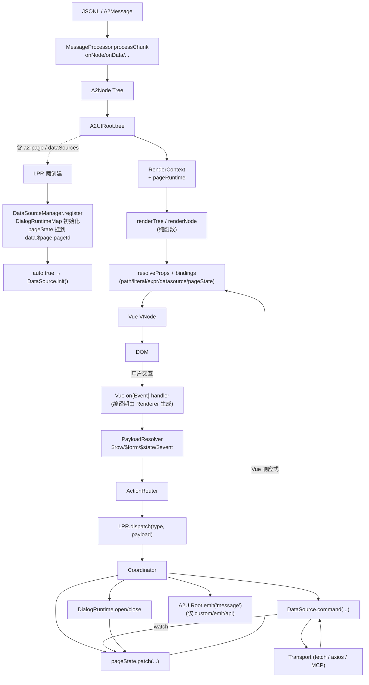
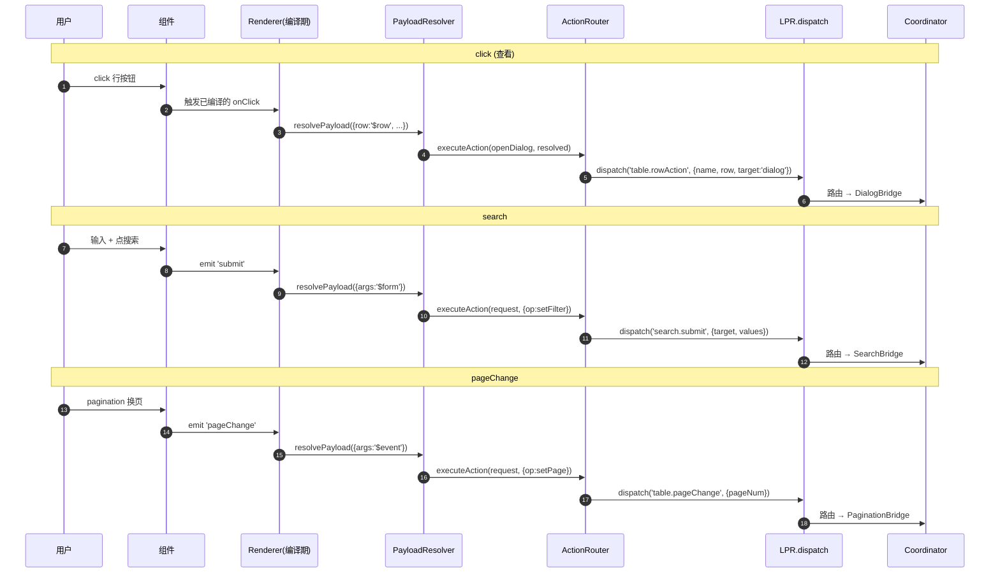
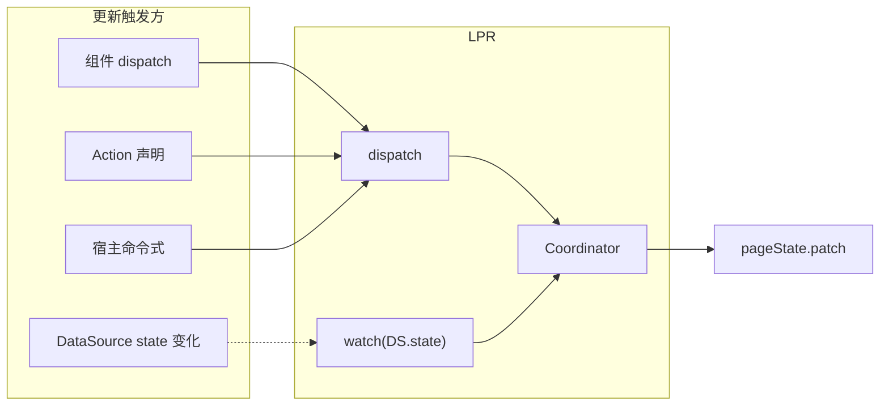
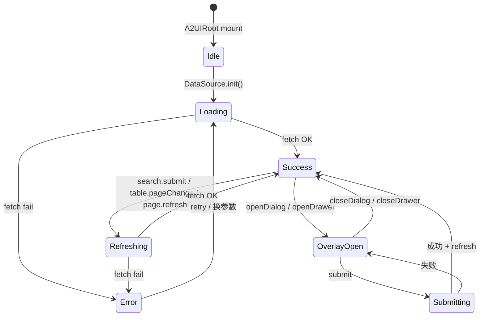
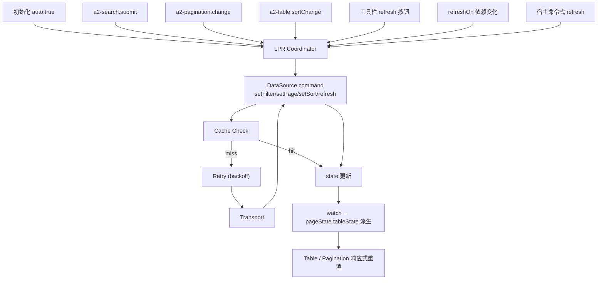
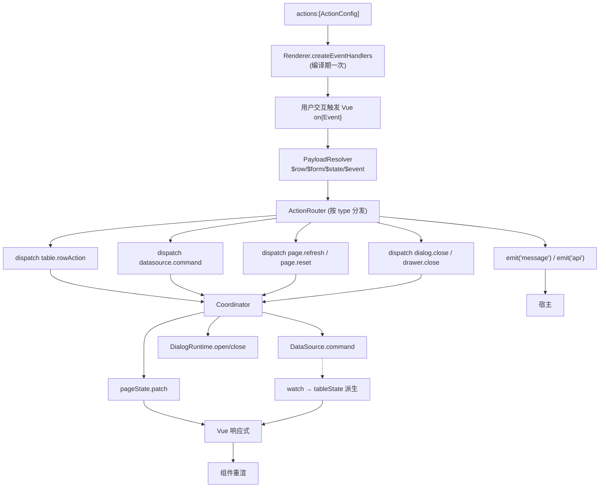
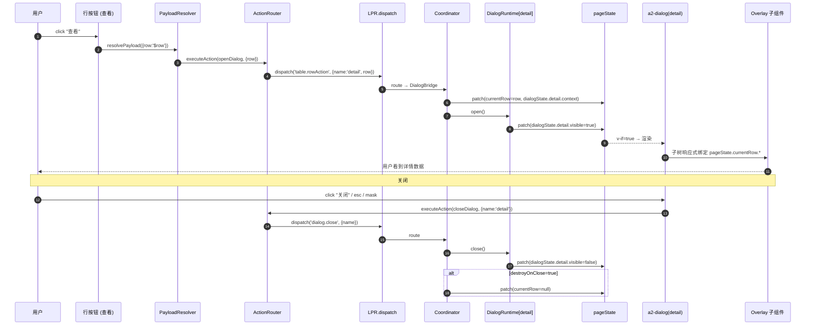
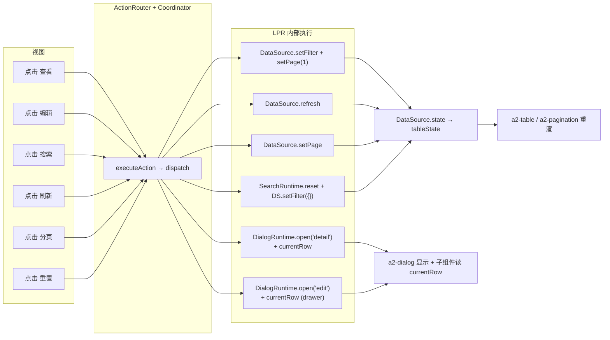

# Light Page Runtime 总体设计（整合汇总）

> 本文档整合 Light Page Runtime（LPR）系列设计的全部内容：
>
> - [LPR 总体设计](/architecture/runtime-design)
> - [PageState 模型设计](/architecture/page-state)
> - [DataSource 设计](/architecture/datasource)
> - [Action System 执行机制](/architecture/action-system)
> - [A2Table × A2Search 联动设计](/architecture/table-design)
> - [Dialog / Drawer 管理机制](/architecture/dialog-runtime)
>
> 目的：提供一份 **单页可读的完整视图**，涵盖架构、数据流、事件流、状态流、API 流、Action 执行流。
>
> 硬性约束贯穿始终：轻量 / 可扩展 / 不改 Renderer / 不做低代码 / 支持未来 Table / Chart / Tree。

---

## 1. Page Runtime 总体架构

### 1.1 分层

LPR 在既有 A2UI 之上叠加一层"页面协调层"。它不改动 Renderer / MessageProcessor / ComponentRegistry 主干，只增加一个懒创建模块。

```
┌────────────────────────────────────────────────────────────────┐
│                       宿主应用（业务）                          │
│   业务 API 处理 / 命令式调用 / 消息监听                          │
└──────────────────────────┬─────────────────────────────────────┘
                           │
┌──────────────────────────▼─────────────────────────────────────┐
│                        A2UIRoot                                 │
│   聚合状态 (data ref) / 生命周期 / defineExpose / emit          │
└──────────┬──────────────┬──────────────┬───────────────────────┘
           │              │              │
           ▼              ▼              ▼
   ┌───────────────┐  ┌────────┐  ┌─────────────────────┐
   │ MessageProc.  │  │Renderer│  │ Light Page Runtime  │
   │ JSONL 协议    │  │ VNode  │  │  (懒创建)            │
   └───────────────┘  └────┬───┘  ├─────────────────────┤
                           │      │ Coordinator         │
                           │      │ pageState           │
                           │      │ DataSourceManager   │
                           │      │ DialogRuntimeMap    │
                           │      │ SearchRuntime       │
                           │      │ ActionRouter        │
                           │      │ PayloadResolver     │
                           │      └──┬──────────────────┘
                           │         │
                           ▼         ▼
                     ┌───────────────────────┐
                     │  组件（a2-search /    │
                     │  a2-table / a2-dialog │
                     │  / a2-drawer / ... ）  │
                     └───────────────────────┘
                              │
                              ▼
                            DOM
```

### 1.2 LPR 内部模块

| 模块 | 职责 |
| --- | --- |
| **Coordinator** | dispatch 路由中心，按类型调用 Bridge |
| **pageState** | 唯一状态中心，落在 `data.$page.<pageId>` |
| **DataSourceManager** | 创建 / 缓存 / 销毁 DataSource 实例 |
| **DialogRuntimeMap** | 每个 dialog / drawer name 一个 DialogRuntime |
| **SearchRuntime** | Search 表单值 / 折叠 / reset |
| **ActionRouter** | 按 Action `type` 分发到对应 dispatch |
| **PayloadResolver** | 把 `$row / $form / $state / $event / $ctx` 替换为运行时值 |
| **Bridges** | SearchBridge / PaginationBridge / DialogBridge / DataSourceBridge，四座桥连接 Coordinator ↔ 已有 Runtime |

### 1.3 硬性约束一览

| 维度 | 约束 |
| --- | --- |
| Renderer | 零改动主流程，仅 additive 挂 `RenderContext.pageRuntime?` |
| MessageProcessor | 零改动，`onNode/onData/...` 保留 |
| ComponentRegistry | 只增量注册新组件（`a2-page / a2-pagination` 等） |
| Schema | `dataSources / a2-page / 新 Action type / 新 Binding type` 全部可选 additive |
| 组件禁令 | 不 fetch、不改 pageState 只读投影、不直接改 dialog.visible |
| LPR 触发 | 仅当 tree 含 `a2-page` 或 `dataSources` 时懒创建 |

**结果**：老 Schema 零感知；新场景零胶水。

---

## 2. 完整数据流（Schema → UI）

从"服务端 / AI / 手写 Schema"到"用户看到的 DOM"，全流程只有 **一条单向路径 + 一条事件回环**。



### 2.1 六个阶段

1. **协议入**：MessageProcessor 解析 JSONL；
2. **懒激活**：A2UIRoot 检测 `a2-page / dataSources`，懒创建 LPR；
3. **注册**：DataSource / DialogRuntime 就位；`auto:true` 首屏拉取；
4. **渲染**：Renderer 递归 → VNode → DOM；
5. **交互**：DOM 事件 → PayloadResolver → ActionRouter → dispatch → Coordinator；
6. **回环**：pageState / DataSource 变化 → Vue 响应式 → 组件重渲。

---

## 3. 事件流（Click / Search / PageChange）

事件流是"用户操作 → LPR"的单向表达；所有事件都要经 ActionRouter 才能到达 Coordinator。



### 3.1 事件 → dispatch 映射汇总

| 组件 event | dispatch |
| --- | --- |
| a2-search / submit | `search.submit` |
| a2-search / reset | `page.reset` |
| a2-table / rowClick / rowAction | `table.rowAction` |
| a2-table / sortChange | `table.sortChange` |
| a2-table / selectionChange | `table.selectionChange` |
| a2-pagination / pageChange | `table.pageChange` |
| a2-pagination / pageSizeChange | `table.pageSizeChange` |
| a2-button (openDialog) | `table.rowAction` (target=dialog) |
| a2-button (openDrawer) | `table.rowAction` (target=drawer) |
| a2-button (refresh) | `page.refresh` |
| a2-button (custom) | `A2UIRoot.emit('message')` |

**统一入口**：无论触发方是谁，都归到 `LPR.dispatch`。

---

## 4. 状态流（PageState）

pageState 是 LPR 的唯一状态中心，落在 `data.$page.<pageId>` 之下。

### 4.1 结构

```jsonc
{
  "searchState": {
    "values":     { },
    "lastSubmit": { },
    "collapsed":  true,
    "dirty":      false
  },
  "tableState": {
    "dataSourceId": "orderList",
    "data":         [],            // 只读投影
    "loading":      false,          // 只读投影
    "pagination":   { "pageNum": 1, "pageSize": 20, "total": 0 },
    "sort":         null,
    "selectedRowKeys": [],
    "error":        null           // 只读投影
  },
  "currentRow": null,
  "dialogState": {
    "detail":  { "visible": false, "loading": false, "context": null, "openedAt": 0 },
    "create":  { "visible": false, "loading": false, "context": null, "openedAt": 0 }
  },
  "drawerState": {
    "edit":    { "visible": false, "loading": false, "context": null, "openedAt": 0 }
  },
  "refreshTrigger": 0
}
```

### 4.2 更新入口



### 4.3 六条更新规则

- `searchState.values / collapsed` ← `a2-search`；
- `searchState.lastSubmit` ← Coordinator（submit 时拷贝）；
- `tableState.pagination.pageNum/pageSize` ← Pagination / Search；
- `tableState.data / loading / total / error` ← **只读投影**，由 `watch(DataSource.state)`；
- `currentRow` ← Row Action（写入）/ closeDialog+destroyOnClose（清空）；
- `dialogState / drawerState / refreshTrigger` ← Coordinator。

### 4.4 状态流全景



---

## 5. API 流（DataSource）

DataSource 是所有远程数据请求的**唯一网关**。组件禁止直接 fetch。

### 5.1 请求触发通道



### 5.2 治理能力

DataSource 内建 6 项能力，均由 Schema 声明触发：

| 能力 | 声明字段 | 作用 |
| --- | --- | --- |
| 分页 | `pagination.mode/pageSize` | page / cursor 双模式 |
| 缓存 | `cache.enabled/ttl/maxSize` | 参数键 + TTL + LRU |
| 重试 | `retry.count/backoff/delay` | 指数退避 |
| 防抖 | `debounce` | 合并连续参数变更 |
| 依赖 | `refreshOn` | 声明式字段监听 |
| 中断 | 内建 AbortController | 参数变化中断上一次 |

### 5.3 五态明确

`idle → loading → success | error`；有旧数据时的刷新用 `refreshing`（避免闪烁）。

---

## 6. Action 执行流

Action 是 Schema 描述用户意图的方式；LPR 统一执行。

### 6.1 Action 类型

| 类型 | 语义 | 落到 |
| --- | --- | --- |
| **openDialog / closeDialog** | 打开 / 关闭 Dialog | dispatch → DialogRuntime |
| **openDrawer / closeDrawer** | 打开 / 关闭 Drawer | dispatch → DialogRuntime |
| **request** | DataSource 命令 | dispatch → DataSource.setFilter/setPage/... |
| **refresh** | 刷新 DataSource / Page | dispatch → DataSource.refresh + refreshTrigger++ |
| **page** | 页面级操作（reset / setCurrentRow / clearSelection） | dispatch → Coordinator |
| **custom / emit** | 宿主接管 | A2UIRoot.emit('message') |
| **api** | 宿主级 API | A2UIRoot.emit('api') |
| **navigate** | 页面跳转 | window.location |
| **callback** | 兜底降级 | 受控 new Function |

### 6.2 执行流水线



### 6.3 参数注入占位符

| 占位符 | 含义 |
| --- | --- |
| `$row` | 当前行数据 |
| `$form` | 当前搜索表单值 |
| `$state` | pageState 快照（可 `$state.tableState.selectedRowKeys`） |
| `$event` | 原生事件对象 |
| `$ctx` | 组件 ComponentContext |
| `$row.orderNo` | 深路径 |

---

## 7. Mermaid 总架构图

### 7.1 静态架构图

```mermaid
flowchart TD
    subgraph Host["宿主应用"]
        Biz["业务代码 / API / 消息监听"]
    end

    subgraph Root["A2UIRoot"]
        Data["data (ref)<br/>form / $page / $ds"]
        MP["MessageProcessor"]
        Renderer["Renderer<br/>renderTree/renderNode"]
    end

    subgraph LPR["Light Page Runtime（懒创建）"]
        subgraph LPRCore["核心"]
            Coord["Coordinator"]
            Router["ActionRouter"]
            Res["PayloadResolver"]
            PS["pageState 挂载"]
        end
        subgraph LPRSubs["子系统"]
            DSMgr["DataSourceManager"]
            DlgMap["DialogRuntimeMap"]
            SR["SearchRuntime"]
        end
        subgraph LPRBridges["桥接"]
            SB["SearchBridge"]
            PgB["PaginationBridge"]
            DB["DialogBridge"]
            DsB["DataSourceBridge"]
        end
    end

    subgraph Comps["页面级组件"]
        S["a2-search"]
        T["a2-table"]
        P["a2-pagination"]
        Dlg["a2-dialog"]
        Drw["a2-drawer"]
        Btn["a2-button / a2-toolbar"]
    end

    Biz -->|processMessage / updateData / 命令式 API| Root
    Root --> MP
    MP --> Root
    Root -->|tree + RenderContext.pageRuntime| Renderer
    Root -. "含 a2-page/dataSources" .-> LPR

    Renderer --> Comps
    Comps -->|actions[]| Router
    Router --> Res
    Res --> Coord
    Coord --> SB
    Coord --> PgB
    Coord --> DB
    Coord --> DsB
    SB --> SR
    PgB --> DSMgr
    DsB --> DSMgr
    DB --> DlgMap

    DSMgr --> DS["DataSource 实例"]
    DS --> Trans["Transport"]
    Trans --> DS
    DS -.->|watch| PS
    DlgMap -.-> PS
    SR -.-> PS
    PS --> Data
    Data --> Renderer
    Coord --> Root
```

### 7.2 一次完整交互：从点击到 UI 更新



### 7.3 五个目标场景汇聚



---

## 8. 一段 Schema，全部能力

以下 Schema 展示 LPR 全部能力，无一行业务代码。宿主只需两处 `dispatch`：Dialog 提交后 refresh + close。

```jsonc
{
  "id": "orderPage",
  "type": "a2-page",
  "dataSources": {
    "orderList": {
      "kind": "http",
      "request": {
        "url": "/api/orders", "method": "GET",
        "responseMap": { "list": "data.items", "total": "data.total" }
      },
      "pagination": { "enabled": true, "pageSize": 20 },
      "cache":      { "enabled": true, "ttl": 60000 },
      "debounce":   300,
      "auto":       true
    }
  },
  "child": [
    { "type": "a2-search",
      "props": {
        "dataSourceId": "orderList",
        "fields": [
          { "id": "keyword", "type": "a2-input",  "label": "关键字" },
          { "id": "status",  "type": "a2-select", "label": "状态" }
        ]
      },
      "actions": [
        { "event": "submit", "type": "request",
          "payload": { "target": "orderList", "op": "setFilter", "args": "$form" } },
        { "event": "reset",  "type": "page",    "payload": { "op": "reset" } }
      ]
    },
    { "type": "a2-toolbar", "child": [
        { "type": "a2-button", "props": { "text": "新建", "type": "primary" },
          "actions": [{ "event": "click", "type": "openDialog",
                        "payload": { "name": "create" } }] },
        { "type": "a2-button", "props": { "text": "刷新" },
          "actions": [{ "event": "click", "type": "refresh",
                        "payload": { "target": "orderList" } }] }
      ]
    },
    { "type": "a2-table",
      "bindings": { "dataSource": { "type": "datasource", "value": "orderList" } },
      "props": {
        "rowKey": "id",
        "columns": [
          { "key": "orderNo", "title": "订单号" },
          { "key": "status",  "title": "状态" },
          { "key": "amount",  "title": "金额", "sortable": true },
          { "key": "_actions", "type": "actions", "buttons": [
              { "text": "查看", "actions": [
                  { "event": "click", "type": "openDialog",
                    "payload": { "name": "detail", "row": "$row" } }
                ] },
              { "text": "编辑", "actions": [
                  { "event": "click", "type": "openDrawer",
                    "payload": { "name": "edit", "row": "$row" } }
                ] }
            ] }
        ]
      },
      "actions": [
        { "event": "sortChange", "type": "request",
          "payload": { "target": "orderList", "op": "setSort", "args": "$event" } }
      ]
    },
    { "type": "a2-pagination",
      "bindings": { "dataSource": { "type": "datasource", "value": "orderList" } },
      "actions": [
        { "event": "pageChange", "type": "request",
          "payload": { "target": "orderList", "op": "setPage", "args": "$event" } },
        { "event": "pageSizeChange", "type": "request",
          "payload": { "target": "orderList", "op": "setPageSize", "args": "$event" } }
      ]
    },
    { "type": "a2-dialog",
      "props": { "name": "detail", "title": "订单详情", "destroyOnClose": false,
                 "footer": [{ "preset": "close" }] },
      "bindings": {
        "visible": { "type": "pageState", "value": "dialogState.detail.visible" }
      },
      "child": [
        { "type": "a2-info-field", "props": { "label": "订单号" },
          "bindings": {
            "value": { "type": "path", "value": "$page.orderPage.currentRow.orderNo" }
          }
        }
      ]
    },
    { "type": "a2-drawer",
      "props": { "name": "edit", "title": "编辑订单", "destroyOnClose": true,
                 "footer": [{ "preset": "cancel" }, { "preset": "submit" }] },
      "bindings": {
        "visible": { "type": "pageState", "value": "drawerState.edit.visible" },
        "loading": { "type": "pageState", "value": "drawerState.edit.loading" }
      },
      "child": [ /* 编辑字段 */ ]
    },
    { "type": "a2-dialog",
      "props": { "name": "create", "title": "新建订单", "destroyOnClose": true,
                 "footer": [{ "preset": "cancel" }, { "preset": "submit" }] },
      "bindings": {
        "visible": { "type": "pageState", "value": "dialogState.create.visible" }
      },
      "child": [ /* 创建字段 */ ]
    }
  ]
}
```

宿主端仅需：

```
onMessage(msg) {
  if (msg.action === 'submit') {
    await api.saveOrder(msg.formData)
    a2uiRoot.pageRuntime.refresh('orderList')
    a2uiRoot.pageRuntime.closeDialog(msg.name) // 或 closeDrawer
  }
}
```

其他全部行为**由 Schema 自身表达**。

---

## 9. 轻量 / 可扩展 / 不破坏 Renderer / 不做低代码 / 面向未来

### 9.1 轻量

- LPR 只做 5 项职责：作用域 / 事件路由 / 状态协调 / Runtime 桥接 / 命令式 API；
- 6 个固定 pageState 字段（枚举而非 DSL）；
- 无编辑器、无脚本、无工作流、无 DSL、无插件市场；
- 卸掉 LPR 后 A2UI 依旧完整（仅失去页面协调能力）。

### 9.2 可扩展

| 扩展方式 | 举例 |
| --- | --- |
| 新 Component | `a2-chart / a2-tree / a2-timeline`，注册到 componentMap 即用 |
| 新 Action type | 加一个 Router 分支 |
| 新 Binding type | 加一个 resolveBinding 分支（如 `pageState`、`datasource`） |
| 新 dispatch 类型 | 加一个 Coordinator case（如 `tab.change`） |
| 新 DataSource kind | 加 Transport 分支（如 `sse / websocket / mcp`） |
| 新 pageState 字段 | 顶层追加（如 `tabState`） |

**所有扩展都是 additive**——不修改既有分支，老 Schema 零感知。

### 9.3 不破坏 Renderer

- Renderer 主流程零改动；
- 只依赖 `RenderContext.pageRuntime?` 这一个可选字段；
- 组件通过 `context.pageRuntime` 拿到 LPR 句柄，Renderer 不感知其内部结构；
- Renderer 保持纯函数式：`renderTree(tree, ctx) → VNode`。

### 9.4 不做低代码平台

| 维度 | LPR | 低代码平台 |
| --- | --- | --- |
| 职责 | UI 状态协调 | UI + 数据 + 业务 + 权限 + 部署 + 编辑器 |
| 状态 | 6 个固定字段 | 任意自定义 |
| 编排 | 无 | DAG + 工作流 |
| 执行 | 事件路由 + 桥接 | 解释执行 + 脚本引擎 |
| 交付 | 一层薄薄 Runtime | 整套平台 |
| 用户 | 需要开发者理解 | 面向业务人员 |

LPR **明确拒绝**：DSL、脚本、可视化编辑器、工作流、条件分支、循环、并行编排。这些都不属于"UI 状态协调"。

### 9.5 支持未来 Table / Chart / Tree

LPR 与具体组件无耦合，任何新的"数据消费型"组件都可以以相同方式接入：

**a2-chart**

```jsonc
{
  "type": "a2-chart",
  "bindings": { "dataSource": { "type": "datasource", "value": "salesTrend" } },
  "props": { "kind": "line" }
}
```

Chart 通过 `state.data` 消费同一份数据；不 fetch、不改状态；DataSource 内建的 loading / error / refresh 天然复用。

**a2-tree**

```jsonc
{
  "type": "a2-tree",
  "bindings": { "dataSource": { "type": "datasource", "value": "orgTree" } },
  "props": { "lazy": true, "childrenKey": "children" }
}
```

懒加载节点时通过 `Action { type:'request', op:'fetch', args:{ parentId:$row.id } }` 触发；LPR 处理其余。

**a2-timeline / a2-kanban / a2-dashboard**：模式相同。

关键结论：**新组件 = 消费 DataSource + 触发 Action，LPR 本身零改动**。

---

## 10. 六个不变量（可粘贴到 PR 检查清单）

1. **组件不写业务逻辑**：无 fetch、无 setState、无业务函数；
2. **LPR 是唯一调度者**：所有交互 dispatch → Coordinator；
3. **DataSource 是唯一 API 网关**：所有远程数据请求走 DataSource；
4. **pageState 是唯一状态中心**：所有跨模块状态位于 `data.$page.<pageId>`；
5. **只读投影不能被外部写**：`tableState.data / loading / total` 只能由 watcher 写；
6. **协议 additive**：所有扩展是可选新分支，老 Schema 零感知。

---

## 11. 文档矩阵

| 文档 | 关注点 |
| --- | --- |
| [runtime-design.md](/architecture/runtime-design) | LPR 总体设计、生命周期 |
| [page-state.md](/architecture/page-state) | pageState 结构与更新规则 |
| [datasource.md](/architecture/datasource) | DataSource 声明、命令、治理 |
| [action-system.md](/architecture/action-system) | Action 类型、执行流水线、占位符 |
| [table-design.md](/architecture/table-design) | Search × Table × Pagination 联动 |
| [dialog-runtime.md](/architecture/dialog-runtime) | Dialog / Drawer 管理、currentRow |
| 本文（runtime-summary.md） | 整合汇总，单页可读 |

---

## 12. 一句话总结

> **Light Page Runtime = 让 A2UI 支持 CRUD 页面的最小胶水层。**
>
> - 不改 Renderer；不做低代码；不写业务；
> - Coordinator 唯一司机、pageState 唯一状态、DataSource 唯一网关、Action 唯一意图源；
> - 五个目标场景（查看 / 编辑 / 搜索 / 刷新 / 分页）在 Schema 里零胶水；
> - 未来 Chart / Tree / Timeline / Kanban 走同一模式接入。

---

_本文档为整合汇总文档，不引入新设计，也不修改现有 Runtime 主干；一切扩展均遵循 additive 原则。_
