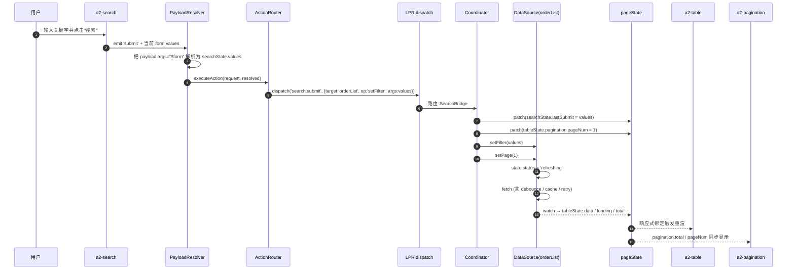
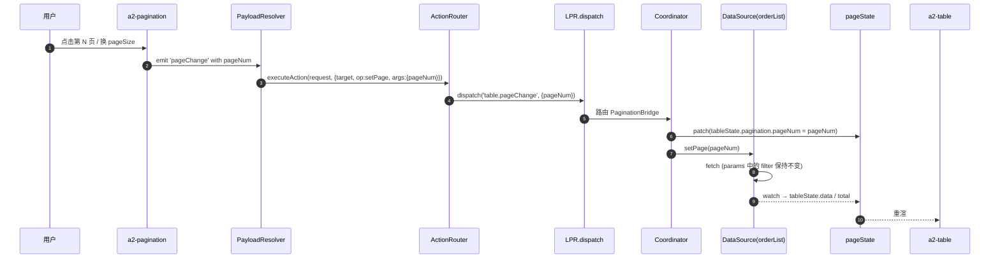
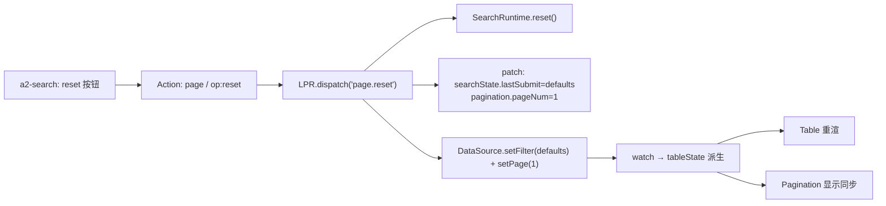
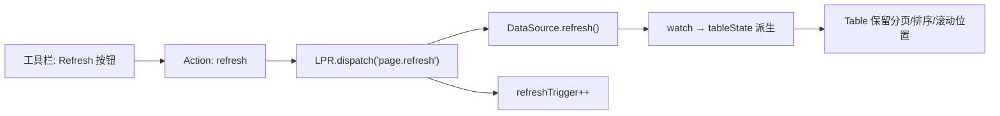
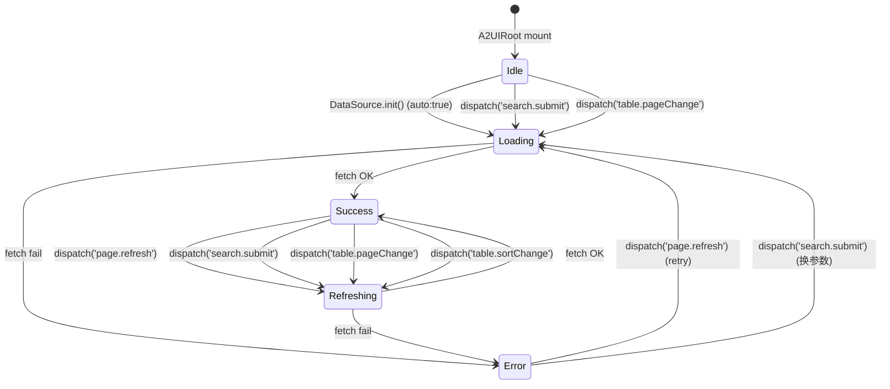
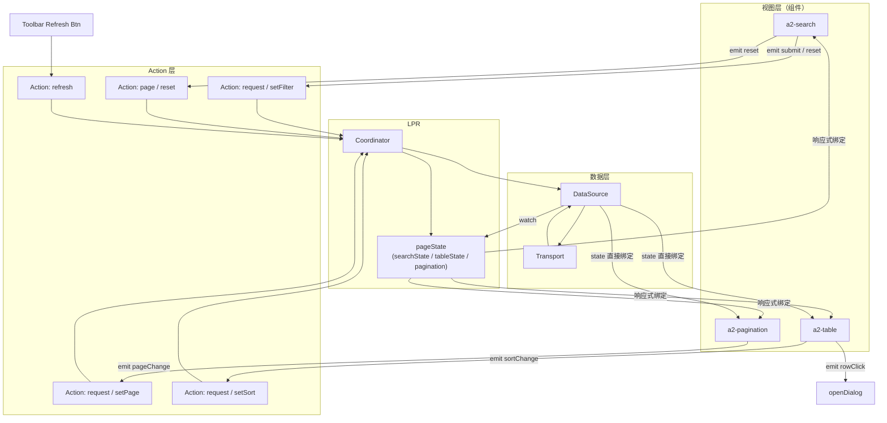

# A2Table × A2Search 联动设计（Light Page Runtime）

> 本文档定义 `a2-search` 与 `a2-table`（配合 `a2-pagination`）在 Light Page Runtime（LPR）下的联动机制。
>
> 目标：让 Schema 声明即完成"Search 触发请求 → Table 自动更新 → Pagination 自动跟随 → Reset / Refresh 统一调度"，视图组件不持有 API 与业务逻辑。
>
> 前置阅读：
> - [Light Page Runtime 设计](/architecture/runtime-design)
> - [PageState 模型设计](/architecture/page-state)
> - [DataSource 设计](/architecture/datasource)
> - [Action System 执行机制](/architecture/action-system)
>
> 本文档不涉及任何代码实现。

---

## 1. 联动目标与硬性约束

### 1.1 目标行为

1. **Search 触发 API 请求**：a2-search submit 后触发一次远程请求；
2. **Table 自动更新数据**：数据到达后 a2-table 无需任何 handler 就自动重渲；
3. **Pagination 自动跟随 API**：total / pageNum / pageSize 与真实响应同步；
4. **Reset 重置 searchState 并刷新 Table**：清空过滤条件并回到首页；
5. **Refresh 重新请求当前条件**：不改变 params，重新拉一次。

### 1.2 硬性约束

- ❌ **Table 不持有业务逻辑**：不 fetch、不算 total、不改 params；
- ❌ **Search 不持有 API 逻辑**：不 fetch、不知道 URL；
- ❌ **Pagination 不持有请求逻辑**：只是 params 的读写窗口；
- ✅ **LPR 是唯一调度者**：所有联动通过 dispatch → Coordinator → DataSource。

### 1.3 一句话

> a2-search、a2-table、a2-pagination 三个组件在 Schema 层通过 **同一个 dataSourceId** 隐式联动；LPR 作为唯一司机，DataSource 作为唯一数据总线，视图组件相互不感知。

---

## 2. 三者的角色分工

### 2.1 分工表

| 组件 | 职责 | 不做的事 |
| --- | --- | --- |
| `a2-search` | 收集表单输入 / 触发 submit / reset / 折叠切换 | 不 fetch、不知道 URL、不改 tableState |
| `a2-table` | 展示 `DataSource.state.data`；触发 rowAction / sortChange / selectionChange | 不 fetch、不算 total、不 setState |
| `a2-pagination` | 展示 `DataSource.state.meta`；触发 pageChange / pageSizeChange | 不 fetch、不持有 total |
| **LPR Coordinator** | 路由 dispatch，调用 DataSource / DialogRuntime / SearchRuntime | 不发请求 |
| **DataSource** | 请求 + params + state + cache + retry | 不知道谁触发 |

### 2.2 三者之间无直接通信

- Search 不 emit 事件给 Table；
- Table 不 emit 事件给 Pagination；
- 联动通过 **同一个 DataSource 实例** 的响应式 state 兜底一致性。

---

## 3. Search → PageRuntime → DataSource 流程

### 3.1 Schema 声明（最小示例）

```jsonc
{
  "id": "orderPage",
  "type": "a2-page",
  "dataSources": {
    "orderList": {
      "kind": "http",
      "request": { "url": "/api/orders", "method": "GET" },
      "pagination": { "enabled": true, "pageSize": 20 },
      "auto": true
    }
  },
  "child": [
    {
      "type": "a2-search",
      "props": {
        "dataSourceId": "orderList",
        "fields": [
          { "id": "keyword", "type": "a2-input",  "label": "关键字" },
          { "id": "status",  "type": "a2-select", "label": "状态" }
        ]
      },
      "actions": [
        {
          "event": "submit",
          "type":  "request",
          "payload": {
            "target": "orderList",
            "op":     "setFilter",
            "args":   "$form"        // ← searchState.values 自动注入
          }
        },
        {
          "event": "reset",
          "type":  "page",
          "payload": { "op": "reset" }
        }
      ]
    }
  ]
}
```

### 3.2 触发流程（Mermaid）



### 3.3 关键动作

| 步骤 | 谁做的 | 做了什么 |
| --- | --- | --- |
| 1 | a2-search | 收集 values 并 emit `submit` |
| 2 | PayloadResolver | 把 `$form` 替换为 `searchState.values` |
| 3 | ActionRouter | 分发到 LPR `search.submit` |
| 4 | Coordinator | 更新 `searchState.lastSubmit` + `pagination.pageNum=1` |
| 5 | Coordinator | 调 `DataSource.setFilter + setPage` |
| 6 | DataSource | 触发 fetch（debounce/cache/retry 已内建） |
| 7 | LPR watcher | 从 `DataSource.state` 派生到 `tableState` |
| 8 | Vue 响应式 | a2-table / a2-pagination 自动重渲 |

**结论**：Search 组件只做「emit submit」，其余全部由 LPR 完成。

---

## 4. Pagination → PageRuntime → DataSource 流程

### 4.1 Schema 声明

```jsonc
{
  "id": "orderPagination",
  "type": "a2-pagination",
  "bindings": {
    "dataSource": { "type": "datasource", "value": "orderList" }
  },
  "actions": [
    {
      "event": "pageChange",
      "type":  "request",
      "payload": { "target": "orderList", "op": "setPage", "args": "$event" }
    },
    {
      "event": "pageSizeChange",
      "type":  "request",
      "payload": { "target": "orderList", "op": "setPageSize", "args": "$event" }
    }
  ]
}
```

### 4.2 流程（Mermaid）



### 4.3 Pagination 与 Search 的隐式一致性

- Search submit 会自动 `setPage(1)` → Pagination 的 `pageNum` 通过响应式感知回到 1；
- Pagination change 不动 filter → Search 输入保持原样；
- **两者之间没有直接通信**，一致性由 DataSource 单一真源兜底。

---

## 5. Table 更新机制

Table 是**纯展示**组件——只从 `DataSource.state` 消费数据，任何变化都通过响应式自动反映到 UI。

### 5.1 Table 消费的数据源

```jsonc
{
  "id": "orderTable",
  "type": "a2-table",
  "bindings": {
    "dataSource": { "type": "datasource", "value": "orderList" }
  },
  "props": {
    "columns": [
      { "key": "orderNo",  "title": "订单号" },
      { "key": "status",   "title": "状态" },
      { "key": "amount",   "title": "金额" }
    ],
    "rowKey": "id"
  },
  "actions": [
    {
      "event": "sortChange",
      "type":  "request",
      "payload": { "target": "orderList", "op": "setSort", "args": "$event" }
    },
    {
      "event": "rowClick",
      "type":  "openDialog",
      "payload": { "name": "detail", "row": "$row" }
    }
  ]
}
```

### 5.2 Table 从哪里拿到数据

Table 通过 `bindings.dataSource` 拿到一个 **响应式引用**，暴露以下字段：

```
dataSource.state.data      → 行数据数组
dataSource.state.status    → loading / refreshing / success / error
dataSource.state.error     → 错误对象或 null
dataSource.state.meta      → { total, page, pageSize, hasMore, cursor }
```

Table 内部无需 `ref([])`、无需 `watch`——Vue 3 响应式系统会在 `DataSource.state` 变化时自动 patch。

### 5.3 反投影（可选便利）

除了直接从 DataSource 消费，Table 也可通过 pageState 的反投影字段消费（若组件更偏好路径绑定）：

```jsonc
{
  "type": "a2-table",
  "bindings": {
    "data":    { "type": "path", "value": "$page.orderPage.tableState.data" },
    "loading": { "type": "path", "value": "$page.orderPage.tableState.loading" }
  }
}
```

两种方式在 UI 层等价（同一响应式源）；差别在于 `pageState` 反投影字段是**只读**的，组件不允许写。

### 5.4 Table 触发的事件

Table 只能触发以下 Action（视图 → 意图），永远不会触发请求：

- `rowClick` → 通常映射 `openDialog / openDrawer`；
- `rowAction`（行内按钮）→ 同上，或 `custom / request`；
- `sortChange` → `request / setSort`；
- `selectionChange` → `page / clearSelection` 或 `custom`。

### 5.5 加载态与错误态

Table 通过 `state.status` 与 `state.error` 展示：

| status | UI 表现建议 |
| --- | --- |
| `idle` | 显示空态或初始占位 |
| `loading` | 显示骨架屏（无旧数据） |
| `refreshing` | 保留旧数据 + 头部转圈 |
| `success` | 正常展示数据（可能是空数组） |
| `error` | 展示错误占位 + 重试按钮（重试通过 `refresh` Action） |

**Table 不实现自己的 loading ref**——组件层只做展示映射。

---

## 6. Reset / Refresh 的统一调度

### 6.1 Reset（重置搜索 + 刷新表格）

Schema 声明：

```jsonc
{
  "event": "reset",
  "type":  "page",
  "payload": { "op": "reset" }
}
```

Coordinator 执行：

1. `SearchRuntime.reset()` → `searchState.values = defaults`，`searchState.collapsed = defaultCollapsed`；
2. `patch(searchState.lastSubmit = defaults)`；
3. `patch(tableState.pagination.pageNum = 1)`；
4. `DataSource.setFilter(defaults)` + `setPage(1)`；
5. DataSource fetch，tableState 派生。



### 6.2 Refresh（当前条件重发）

Schema 声明：

```jsonc
{
  "event": "click",
  "type":  "refresh",
  "payload": { "target": "orderList" }
}
```

Coordinator 执行：

1. `DataSource.refresh()`（保留所有当前 params：filter / page / pageSize / sort）；
2. `patch(refreshTrigger++)`；
3. DataSource fetch → 若已有旧数据，`status = refreshing`（避免闪烁）。



### 6.3 Reset vs Refresh 差异

| 维度 | Reset | Refresh |
| --- | --- | --- |
| 清 filter | ✅ | ❌ |
| 回到首页 | ✅ | ❌（保留） |
| 保留排序 | ❌（清） | ✅ |
| 保留 pageSize | ✅ | ✅ |
| 保留搜索输入 | ❌（清） | ✅ |
| 是否可绕过 cache | 否 | 可 `refresh({force:true})` |
| 触发方 | Search 内的 Reset 按钮 | 工具栏 / 快捷键 / 命令式 |

---

## 7. 状态流转图

以下是 Search × Table × Pagination × DataSource 联动的完整状态流。

### 7.1 高层状态机



### 7.2 数据流全景



### 7.3 Search / Table / Pagination 各自的状态视角

- **a2-search**：读 `searchState.values / collapsed`；写通过 dispatch；
- **a2-table**：读 `DataSource.state.data / status / error`（或反投影字段）；写只有事件；
- **a2-pagination**：读 `DataSource.state.meta / params.page / params.pageSize`；写只有事件。

**没有一个视图组件持有"数据"或"loading"的私有 ref。**

---

## 8. 事件列表设计

以下是 Search × Table × Pagination 三个组件在 LPR 下**应且仅应**触发的事件全集。事件对应的 Action 类型均在 [Action System](/architecture/action-system) 定义。

### 8.1 a2-search 事件

| event | 何时触发 | 建议 Action | 落到 |
| --- | --- | --- | --- |
| `change` | 单个字段值改变 | `page / setSearchValue`（可选，通常不需要） | `searchState.values` |
| `submit` | 点击"搜索"按钮 / 表单回车 | `request` (`op:setFilter, args:$form`) | Coordinator → DataSource.setFilter + setPage(1) |
| `reset` | 点击"重置"按钮 | `page` (`op:reset`) | Coordinator → SearchRuntime.reset + DS.setFilter({}) |
| `toggleCollapse` | 折叠 / 展开 | `page` (`op:setSearchCollapsed`)（可选） | `searchState.collapsed` |

### 8.2 a2-table 事件

| event | 何时触发 | 建议 Action | 落到 |
| --- | --- | --- | --- |
| `rowClick` | 点击整行 | `openDialog / openDrawer` | `currentRow` + overlay visible |
| `rowAction` | 行内按钮（查看 / 编辑 / 删除） | 同上，或 `request` / `custom` | 视 action.type 而定 |
| `sortChange` | 排序变化 | `request` (`op:setSort`) | DataSource.setSort |
| `selectionChange` | 勾选变化 | `page` (`op:setSelection`) 或 `custom` | `tableState.selectedRowKeys` |
| `filterChange` | 列级筛选（可选） | `request` (`op:setFilter`) | DataSource.setFilter |

### 8.3 a2-pagination 事件

| event | 何时触发 | 建议 Action | 落到 |
| --- | --- | --- | --- |
| `pageChange` | 翻页 | `request` (`op:setPage, args:$event`) | DataSource.setPage |
| `pageSizeChange` | 换 pageSize | `request` (`op:setPageSize, args:$event`) | DataSource.setPageSize |
| `sizeOptionsChange` | 换 pageSize 选项集（罕见） | `custom` | 宿主处理 |

### 8.4 工具栏 / 全局事件（挂在 a2-toolbar 等按钮上）

| event | 建议 Action | 落到 |
| --- | --- | --- |
| `click`（Refresh） | `refresh` (`target:orderList`) | DataSource.refresh |
| `click`（Reset） | `page` (`op:reset`) | Coordinator.reset |
| `click`（Export） | `custom / api` | 宿主接管 |
| `click`（Create） | `openDialog / name:create` | overlay 打开 |

### 8.5 事件到 dispatch 类型的映射表

| 事件源 | event 名 | dispatch 类型 |
| --- | --- | --- |
| a2-search | submit | `search.submit` |
| a2-search | reset | `page.reset` |
| a2-search | change | `search.change`（可选） |
| a2-table | rowClick | `table.rowAction` |
| a2-table | rowAction | `table.rowAction` |
| a2-table | sortChange | `table.sortChange` |
| a2-table | selectionChange | `table.selectionChange` |
| a2-pagination | pageChange | `table.pageChange` |
| a2-pagination | pageSizeChange | `table.pageSizeChange` |
| 工具栏 | click(refresh) | `page.refresh` |
| 工具栏 | click(reset) | `page.reset` |

**事件是 Schema 层的语义，dispatch 是 LPR 内部的实现类型；两者一一对应，但可以按需扩展。**

---

## 9. 一个完整的联动 Schema 骨架

以下 Schema 展示 Search + Table + Pagination + Toolbar 完整联动，无一行业务代码。

```jsonc
{
  "id": "orderPage",
  "type": "a2-page",
  "dataSources": {
    "orderList": {
      "kind": "http",
      "request": {
        "url":    "/api/orders",
        "method": "GET",
        "responseMap": { "list": "data.items", "total": "data.total" }
      },
      "pagination": { "enabled": true, "pageSize": 20 },
      "cache":      { "enabled": true, "ttl": 60000 },
      "debounce":   300,
      "auto":       true
    }
  },
  "child": [
    {
      "type": "a2-search",
      "props": {
        "dataSourceId": "orderList",
        "fields": [
          { "id": "keyword", "type": "a2-input",  "label": "关键字" },
          { "id": "status",  "type": "a2-select", "label": "状态" }
        ],
        "collapsible": true,
        "defaultCollapsed": true
      },
      "actions": [
        {
          "event": "submit",
          "type":  "request",
          "payload": { "target": "orderList", "op": "setFilter", "args": "$form" }
        },
        {
          "event": "reset",
          "type":  "page",
          "payload": { "op": "reset" }
        }
      ]
    },
    {
      "type": "a2-toolbar",
      "child": [
        {
          "type": "a2-button",
          "props": { "text": "新建", "type": "primary" },
          "actions": [
            {
              "event": "click",
              "type":  "openDialog",
              "payload": { "name": "create" }
            }
          ]
        },
        {
          "type": "a2-button",
          "props": { "text": "刷新", "icon": "refresh" },
          "actions": [
            {
              "event": "click",
              "type":  "refresh",
              "payload": { "target": "orderList" }
            }
          ]
        }
      ]
    },
    {
      "type": "a2-table",
      "bindings": {
        "dataSource": { "type": "datasource", "value": "orderList" }
      },
      "props": {
        "rowKey": "id",
        "columns": [
          { "key": "orderNo", "title": "订单号" },
          { "key": "status",  "title": "状态" },
          { "key": "amount",  "title": "金额", "sortable": true }
        ]
      },
      "actions": [
        {
          "event": "sortChange",
          "type":  "request",
          "payload": { "target": "orderList", "op": "setSort", "args": "$event" }
        },
        {
          "event": "rowClick",
          "type":  "openDialog",
          "payload": { "name": "detail", "row": "$row" }
        }
      ]
    },
    {
      "type": "a2-pagination",
      "bindings": {
        "dataSource": { "type": "datasource", "value": "orderList" }
      },
      "actions": [
        {
          "event": "pageChange",
          "type":  "request",
          "payload": { "target": "orderList", "op": "setPage", "args": "$event" }
        },
        {
          "event": "pageSizeChange",
          "type":  "request",
          "payload": { "target": "orderList", "op": "setPageSize", "args": "$event" }
        }
      ]
    }
  ]
}
```

一段 Schema，5 个能力（Search / Table / Pagination / Refresh / Row Detail Dialog）全部就位；宿主只在 Dialog 提交时需要 `dispatch('page.refresh')`。

---

## 10. 常见反模式与纠正

| ❌ 反模式 | ✅ 正确做法 |
| --- | --- |
| Table 内部 `watch(props.filter) → fetch` | Search 通过 `request` 更新 DataSource.filter |
| Search submit 后调用 `tableRef.value.reload()` | Search dispatch → DataSource → tableState 自动派生 |
| Pagination 自己维护 `total = ref(0)` | Pagination 只读 `DataSource.state.meta.total` |
| Reset 按钮直接 emit 给宿主，宿主再回来清 form | 用 `page / op:reset` 一步走 Coordinator |
| Refresh 按钮 emit 让宿主重新 fetch | 用 `refresh / target:orderList` |
| Table 里写 `try { data = await fetch(...) }` | 组件禁止 fetch，走 DataSource |
| Search 与 Table 通过 Vuex / provide-inject 共享 filter | 共享 dataSourceId 即可，DataSource.state 是唯一真源 |

---

## 11. 与既有实现的对接

现有代码可作为落地参考（本文档不要求任何代码改动）：

- SearchRuntime（form / filter / reset / collapsible）：[SearchRuntime.ts](file:///d:/work/program/tineco/UI/a2ui-vue-engine/packages/a2ui-vue-engine/src/search-runtime/SearchRuntime.ts)
- DataSource 内建 debounce / cache / retry / pagination：[DataSource.ts](file:///d:/work/program/tineco/UI/a2ui-vue-engine/packages/a2ui-vue-engine/src/data-source/DataSource.ts)
- DataSourceManager：[DataSourceManager.ts](file:///d:/work/program/tineco/UI/a2ui-vue-engine/packages/a2ui-vue-engine/src/data-source/DataSourceManager.ts)
- Table 组件（当前已具备骨架）：[A2Table.vue](file:///d:/work/program/tineco/UI/a2ui-vue-engine/packages/a2ui-vue-engine/src/components/A2Table.vue)
- Search 组件：[A2Search.vue](file:///d:/work/program/tineco/UI/a2ui-vue-engine/packages/a2ui-vue-engine/src/components/A2Search.vue)

未来 LPR 落地时，会把 SearchRuntime / DataSource 的调用统一收敛到 Coordinator；本文档描述的正是 **收敛之后** Schema 与组件层的表现。

---

## 12. 设计原则回顾

- **单一数据总线**：DataSource 是唯一数据源，Search/Table/Pagination 共享；
- **单一调度者**：LPR Coordinator 是唯一司机；
- **视图无逻辑**：Table 只展示，Search 只表单，Pagination 只显示 meta；
- **声明式联动**：Schema 里通过 `dataSourceId` + Action 表达一切联动；
- **零胶水**：常见 CRUD 场景无需宿主编写胶水代码；
- **状态一致性**：由 DataSource + LPR watch 强制保证；
- **可回放**：所有 dispatch 与请求都可日志、mock、重放；
- **可拆除**：未使用 LPR / DataSource 时 Table / Search 仍可独立运作（降级为静态 props 模式）。

---

_本文档仅为设计文档；不包含任何代码；不修改现有 Renderer / MessageProcessor 主干；所有联动通过 additive 的 Action / dispatch 类型完成。_
