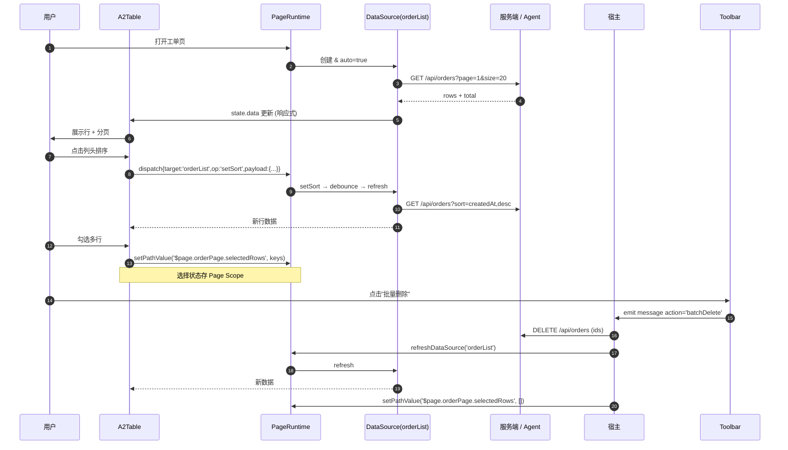
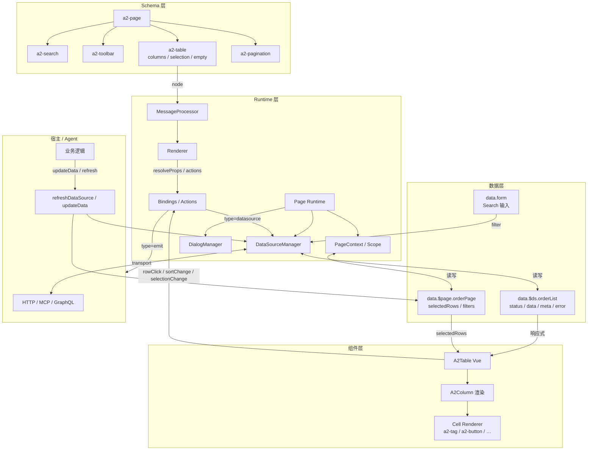

# A2Table 设计 RFC

> 本文档是 **A2Table 组件 RFC（设计文档）**，不涉及代码实现、不修改协议、不修改现有 Runtime。
>
> 目的：为未来 V2 阶段引入 `a2-table` 组件建立设计共识，覆盖动机 / 结构 / 协议 / 生命周期 / 扩展路径。
>
> 参考文档：
> - [Runtime 架构设计](/architecture/runtime-design)
> - [Page Schema 设计](/architecture/page-schema)
> - [DataSource 设计](/architecture/datasource)
> - [Page Runtime 设计](/architecture/page-runtime-design)
> - [组件开发规范](/architecture/component-development)

---

## 一、动机

### 1. 为什么需要 Table

- **业务事实**：企业内后台 60%+ 的页面是列表 / 表格页；Roadmap V2 的 CRUD 页面若无 Table，等于没有 V2。
- **协议缺口**：现有 A2UI 只有 `a2-list`（垂直堆叠）与 `a2-card`（单卡展示），无法表达「行 × 列 × 排序 × 选择 × 分页」这种二维数据结构。
- **AI 生成需求**：AI 输出「工单列表 / 订单列表 / 用户列表」时，理想的表达是「一份 Schema + 一个 DataSource」，而不是把每行手工展开成一堆 Row/Column 节点——后者既不精简，也不可扩展。
- **交互一致性**：排序、选择、翻页、批量操作、行内操作、加载态、空态——这些是列表页的标准心智模型，用户与 Agent 都期待一致的表现。
- **DataSource 收敛**：Table 与 DataSource / Pagination 的三方绑定是 [Page Runtime](/architecture/page-runtime-design) 的样板场景，Table 是这套编排的第一个直接消费者。

**结论**：需要一个一等公民的 `a2-table` 组件。

### 2. 为什么不是 List

- **表达力不足**：`a2-list` 只能表达「一列若干条」；无法表达列标题、列宽、列对齐、多列文本对齐、跨列合并。
- **交互能力不足**：`a2-list` 无排序、无表头、无分页、无选择、无固定列——即使把这些能力硬塞进 List 也会污染其「简单堆叠」的语义。
- **协议表达冗长**：若用 List 实现表格，每一行都要重复写一次列布局，AI 生成成本高、可读性差。
- **正交定位**：`a2-list` 应保留为「垂直可复用 item 列表」（例如消息流、评论、时间轴的骨架），与 Table 是不同心智模型。
- **可组合性**：Table 与 Search / Toolbar / Pagination / Dialog 组合是标准 CRUD 页面；List 的组合语义并不包含表格轴。

**结论**：Table 与 List 各司其职，不做二合一。

### 3. 为什么采用 Columns（列声明）

- **协议驱动**：Table 的核心是「列定义」——列 id / 标题 / 数据字段 / 宽度 / 对齐 / 排序 / 格式化 / 自定义渲染。协议里把列显式列出，让 Schema 自描述、可 diff、可校验。
- **AI 生成友好**：列定义是二维数据的天然轴，AI 一次生成整份列描述，比逐行拼接自然得多。
- **可组合渲染**：每一列可以是纯值、也可以是嵌套 Schema（`cellRender: A2Node`），允许在单元格中放 `a2-button / a2-tag / a2-icon` 等既有组件——**列即容器，容器即协议**。
- **可扩展**：新增列能力（例如冻结列 / 展开列 / 树形列）只需扩展列定义字段，不动 Table 主结构。
- **可条件化**：列的可见性可以走 `bindings.visible`，允许 Schema 依据权限 / 角色 / 环境显隐列。

**结论**：Columns 是 Table 与 List 的最本质差异，也是 AI 表达列表的最短路径。

### 4. 为什么采用 Actions

- **协议一致**：与所有 A2UI 组件保持一致——事件 / 副作用统一走 `actions[]`，避免为 Table 引入独立事件系统。
- **两级 Actions**：
  - **表级 Actions**：`onRowClick / onSortChange / onSelectionChange / onFilterChange`，声明在 Table 节点上；
  - **行内 Actions**：每列的 `cellRender` 可以放 `a2-button` 等组件，走该组件自身的 `actions[]`。
- **传参与上下文**：Actions 触发时 `context.event` 携带 `row / rowIndex / column / selectedRows` 等运行时数据，可通过 `payload` 声明式转发给宿主 / Page Runtime。
- **可回放**：所有 Table 交互都以 message 形式经 `A2UIRoot` 上抛，宿主 / Agent 可日志与回放。
- **与 Page Runtime 联动**：`onSortChange` 可以直接声明 `type: 'datasource', op: 'setSort'`，无需宿主参与就能触发 DataSource 刷新。

**结论**：Actions 通道把 Table 变成协议世界的普通公民，避免自造事件模型。

### 5. 为什么采用 DataSource

- **单一数据入口**：Table 的行数据只从 `DataSource.data` 取，避免出现「rows prop + refresh + loading + total」四个字段各写各的分裂状态。
- **状态治理**：loading / error / refreshing / cache / retry / debounce 全部由 DataSource 承担，Table 组件本身零状态。
- **与 Pagination / Search 天然联动**：三方都绑到同一个 DataSource，参数变化即 refresh，模块之间不需要直接通信。
- **Server / Client 双模式**：DataSource 层做「服务端分页 / 服务端排序 / 服务端搜索」；`items` 也可以是静态数组用于纯本地场景（`kind: 'static'`）。
- **AI 亲和**：AI 生成的 Schema 只需一次声明数据来源，Table / Pagination / Search 只写 `bindings.dataSource`——语义清晰、可验证。
- **可切换传输**：DataSource 的 transport 可替换（fetch / axios / MCP / GraphQL），Table 不感知。

**结论**：DataSource 是 Table 唯一的数据入口，也是 Page Runtime 收敛的直接收益者。

### 6. 为什么采用 Pagination

- **信息密度**：企业数据动辄成千上万行，一次全量展示不现实。分页是最小可用能力。
- **协议解耦**：Table 与 Pagination 是两个独立组件，通过共享 DataSource 联动——符合「模块解耦、可组合」原则。
- **双模式支持**：
  - `page` 模式：`page / pageSize / total`（标准业务后台）；
  - `cursor` 模式：`cursor / nextCursor / hasMore`（流式数据、无限滚动）。
- **状态位置**：分页状态存在 `data.$ds.<id>.meta`，Table 只读；用户翻页时 Pagination 组件 emit 事件走 DataSource Action。
- **与虚拟滚动正交**：分页是「切片展示」，虚拟滚动是「窗口渲染」，两者可组合（V2.x 视需求引入）。

**结论**：Pagination 作为独立组件，共享 DataSource；Table 只消费不管理。

### 7. 为什么采用 Selection

- **业务基线**：批量删除 / 批量导出 / 批量审批是列表页的标配能力。
- **协议表达**：`selection: { mode: 'single' | 'multiple', selectable?, preserveSelection? }` 在 Table 上声明；被选中行的 key 数组写入 Page Scope（例如 `data.$page.orderPage.selectedRows`）。
- **联动 Toolbar**：Toolbar 的批量按钮通过 `bindings.disabled = /* selectedRows.length === 0 */` 与选择状态联动，走既有 Bindings 通道。
- **跨页保留**：`preserveSelection: true` 时跨分页保留选择；关闭时切页清空——由 Table 组件负责实现。
- **单选 vs 多选**：单选常用于详情联动（点击一行显示右侧详情），多选用于批量操作；同一协议表达。

**结论**：Selection 作为可选能力独立设计，通过既有 Bindings 与 Toolbar / Description 联动。

### 8. 为什么采用 Loading

- **消除首屏空白**：DataSource `status: 'loading'` 时 Table 展示骨架屏 / spinner，避免闪烁与假空态。
- **两种状态区分**：
  - **loading**：无旧数据，展示骨架屏；
  - **refreshing**：有旧数据，保留展示 + 顶部进度条（避免闪烁）。
- **协议来源统一**：Loading 状态从 DataSource 读取，Table 不引入 `loading` prop，避免宿主手动同步。
- **组件层与协议层可覆盖**：`props.loadingRender` 可自定义骨架屏；老 Schema 无声明时走默认。

**结论**：Loading 是 DataSource 状态的直接映射，Table 只做展示。

### 9. 为什么采用 Empty

- **零结果友好**：搜索 / 过滤 / 无数据场景需要明确 UX 反馈，避免看似「卡死」。
- **区分场景**：
  - **首次空态**：无数据（例如系统未初始化）；
  - **过滤空态**：搜索 / 筛选后无结果——需要提示「清空条件」；
  - **错误空态**：DataSource `status: 'error'`——展示错误与重试按钮。
- **协议表达**：`empty: { text, image, actions }` 或 slot `empty` 自定义；Table 根据 DataSource 状态自动选择 empty 类型。
- **AI 亲和**：AI 可以按业务语义生成 `empty.text`（"暂无工单"）与 `empty.actions`（"新建工单"）。

**结论**：Empty 是 Table 状态展示的一等能力。

### 10. 为什么采用 Toolbar

- **模块解耦**：批量操作 / 新建 / 导出 / 刷新 / 列设置这些能力放在 Toolbar 而不是 Table 本身，避免 Table 组件承担过多职责。
- **可组合**：Toolbar 是独立组件（`a2-toolbar`），可以放任意 A2 组件（Button / Dropdown / Divider），并通过 [Page Schema · Toolbar](/architecture/page-schema#a2-toolbar) 与 Table 共享 Page Scope 与 DataSource。
- **左右分区**：`slots.left / slots.right` 分别放主操作与辅助操作，是通用的 UX 惯例。
- **与 Selection 联动**：批量按钮的 `disabled` 通过 `bindings` 关联 `selectedRows.length`；无需 Toolbar 直接读 Table 状态。

**结论**：Toolbar 是 Table 的邻居而不是 Table 的子组件，两者通过 Page Scope 联动。

### 11. 为什么采用 Search

- **动机同 Toolbar**：搜索 / 高级筛选是列表页首要能力，作为独立组件（`a2-search`）拥有独立职责。
- **DataSource 桥接**：Search 值变化 → `type: 'datasource', op: 'setFilter'` → DataSource debounce 后 refresh；Table 无感。
- **协议表达**：Search 是「表单在页首的应用」，字段声明与既有 Form 完全一致，符合「Form Runtime 组合 Page Runtime」的分层。
- **可折叠**：`a2-search` 支持折叠 / 展开更多筛选，AI 生成时按字段数量自适应。
- **与 URL 同步（未来）**：V2.x 可扩展 `syncToUrl: true` 让筛选条件反映到 URL，方便分享 / 收藏。

**结论**：Search 是列表页的独立模块，通过 DataSource 与 Table 松耦合。

---

## 二、Schema

以下 Schema 仅为协议说明，字段命名与既有约定一致（可选字段带 `?`）。

### 2.1 顶层 `a2-table`

```json
{
  "id": "orderTable",
  "type": "a2-table",
  "props": {
    "rowKey": "id",
    "size": "medium",
    "stripe": true,
    "border": false,
    "columns": [
      { "id": "no", "title": "工单号", "field": "no", "width": 160 },
      { "id": "title", "title": "标题", "field": "title" },
      {
        "id": "status",
        "title": "状态",
        "field": "status",
        "cellRender": {
          "type": "a2-tag",
          "bindings": { "text": { "type": "path", "value": "./row.status" } }
        }
      },
      { "id": "createdAt", "title": "创建时间", "field": "createdAt", "sortable": true, "align": "right", "width": 180 },
      {
        "id": "actions",
        "title": "操作",
        "width": 160,
        "align": "center",
        "cellRender": {
          "type": "a2-row",
          "children": [
            {
              "type": "a2-button",
              "props": { "text": "查看", "variant": "text" },
              "actions": [
                { "event": "click", "type": "emit", "payload": { "action": "viewOrder", "id": "$row.id" } }
              ]
            },
            {
              "type": "a2-button",
              "props": { "text": "删除", "variant": "text", "danger": true },
              "actions": [
                { "event": "click", "type": "emit", "payload": { "action": "deleteOrder", "id": "$row.id" } }
              ]
            }
          ]
        }
      }
    ],
    "selection": { "mode": "multiple", "preserveSelection": true },
    "empty": { "text": "暂无工单" }
  },
  "bindings": {
    "dataSource": { "type": "datasource", "value": "orderList" },
    "selectedRows": { "type": "path", "value": "./selectedRows" }
  },
  "actions": [
    {
      "event": "sortChange",
      "type": "datasource",
      "payload": { "target": "orderList", "op": "setSort" }
    },
    {
      "event": "rowClick",
      "type": "emit",
      "payload": { "action": "openDetail" }
    }
  ]
}
```

### 2.2 Column 定义

```
Column {
  id: string                     必填
  title: string                  列头文案
  field?: string                 数据字段（对应 row[field]）
  width?: number | string        列宽
  minWidth?: number
  align?: 'left' | 'center' | 'right'
  fixed?: 'left' | 'right'       固定列（V2.x）
  sortable?: boolean             启用排序
  sortDirections?: ('asc' | 'desc')[]
  filterable?: boolean           启用筛选（V2.x）
  cellRender?: A2Node            自定义单元格 Schema
  headerRender?: A2Node          自定义列头 Schema
  visible?: BindingConfig        列可见性动态绑定
  format?: 'date' | 'datetime' | 'currency' | 'number' | 'percent'
}
```

### 2.3 Selection 定义

```
Selection {
  mode: 'single' | 'multiple'
  selectable?: BindingConfig     每行是否可选（表达式）
  preserveSelection?: boolean    跨页保留
  showSelectAll?: boolean        表头是否显示全选
}
```

### 2.4 Empty 定义

```
Empty {
  text?: string
  image?: string
  actions?: A2Node[]             可放按钮等
}
```

### 2.5 事件

Table 内置支持的 `event` 名：

- `rowClick(row, index)`
- `rowDblClick(row, index)`
- `sortChange({ field, order })`
- `selectionChange(selectedRows, selectedKeys)`
- `filterChange({ filters })`（V2.x）

---

## 三、Runtime

Table 的运行时行为完全叠加在既有 A2UI Runtime + [Page Runtime](/architecture/page-runtime-design) 之上。

### 3.1 渲染路径

- Renderer 通过 `context.componentMap['a2-table']` 查表得到 A2Table 组件；
- Bindings 解析：`dataSource` → 从 `pageRuntime.getState('orderList')` 取 `DataSourceState`；
- Props 解析：`columns / selection / empty` 走既有 `resolveProps`；
- Actions 编译：`sortChange / rowClick / selectionChange` 转成 Vue 事件处理器。

**Renderer 不感知 Table 内部结构**，只知道「有个组件叫 a2-table，把 props + 事件 + slots 传进去」。

### 3.2 状态来源

Table 组件是 **无状态展示器**，所有状态都从两处来：

- **行数据 / 分页 / 加载 / 错误**：来自 DataSource（`data.$ds.<id>`）；
- **选择 / 当前排序 / 当前筛选**：来自 Page Scope（`data.$page.<pageId>.*`）。

选择行为在协议中显式写出选择状态存放路径（`bindings.selectedRows`），保持「data 单源」。

### 3.3 事件路径

- **DOM 事件 → Vue emit**：Table 组件内部（例如 el-table）emit `sort-change` → A2Table 组件 emit `sortChange` → Renderer 事件桥接 → 匹配 `actions[event='sortChange']` → `executeAction` 执行；
- **`type: 'datasource'` 分支**（新增，additive）：调用 `pageRuntime.dispatch({ target, op, ... })`；
- **`type: 'emit'` 分支**（既有）：通过 `A2UIRoot.handleEvent → emit('message', ...)` 上抛宿主。

### 3.4 单元格 Schema 渲染

Table 每一行 × 每一列在渲染时：

- 从 `row[column.field]` 取值；
- 若列声明 `cellRender: A2Node`，则以 **该单元格的 row 作为局部 context** 构造子 RenderContext，走 `renderNode(cellRender, subContext)`；
- 单元格内的 `bindings.value = './row.xxx'` 相对路径访问当前行数据。

这意味着「单元格即协议」——列内可以放任意 A2 组件（tag / avatar / button / icon）。

### 3.5 与 Page Runtime 的交互

- Table 挂载时不注册 DataSource；DataSource 由所在 `a2-page` 声明与创建；
- Table 通过 `bindings.dataSource` 引用；
- Table 派发 `type: 'datasource'` Action 时调用 Page Runtime 的 dispatch。

---

## 四、生命周期

以「工单列表」为例的完整生命周期：



关键点：

- Table 全程不发请求，请求由 DataSource 触发；
- 选择状态从不留在 Table 内部，全部落到 Page Scope；
- 批量操作的业务逻辑由宿主兜底，Page Runtime 只负责「刷新 + 清空选择」这类编排。

---

## 五、组件关系

```
a2-page (Page Scope + DataSources)
│
├─ a2-search      (bindings.dataSource → orderList, filterChange → setFilter)
│
├─ a2-toolbar     (bindings.disabled ← selectedRows, batchDelete → emit)
│
├─ a2-table       (bindings.dataSource → orderList, columns[], selection)
│    │
│    ├─ a2-tag / a2-avatar / a2-icon       (cellRender)
│    └─ a2-button / a2-row                 (cellRender: 行内操作)
│
└─ a2-pagination  (bindings.dataSource → orderList, pageChange → setPage)
```

- **共享 DataSource**：Search / Table / Pagination 三方共享 `orderList`；
- **共享 Page Scope**：Table / Toolbar 通过 `selectedRows` 联动；
- **组件独立**：任一模块都可单独存在（例如只有 Table + Pagination 也能工作）。

---

## 六、扩展方式

Table 的扩展遵循 [组件开发规范](/architecture/component-development) 三步：

### 6.1 列能力扩展

新增列能力（例如冻结列、树形列、可编辑列、可展开行）时：

- 扩展 `Column` 类型的可选字段（例如 `fixed / children / editable / expandable`）；
- 在 A2Table 内部处理该字段；
- **不影响老 Schema**（未使用该字段时行为等价）。

### 6.2 事件扩展

新增事件（例如 `expandChange / cellClick`）时：

- 追加 A2Table 的 `emits` 声明；
- Schema 中通过 `actions[{ event: 'expandChange' }]` 消费；
- 既有 Action 消费方式不变。

### 6.3 数据源扩展

- 无需修改 Table：DataSource 层扩展 `kind`（例如 `kind: 'mcp' / 'graphql'`）即可；
- Table 消费的仍是同一份 `DataSourceState`。

### 6.4 单元格扩展

- 单元格可放任意 A2 组件——扩展新的 A2 组件即等于扩展 Table 单元格能力；
- 例如未来引入 `a2-chart-mini`，可以直接放在单元格里。

### 6.5 性能扩展

- V2.x：虚拟滚动（`virtual: true`）——组件内实现，不改协议；
- V2.x：懒加载子行（`lazyChildren`）——树形表格支持；
- V3.x：Streaming 追加行（配合 `node_append` / `data_update`）。

### 6.6 主题扩展

- 通过 CSS Variables + `size / density / theme` props 扩展；
- 由 [theme-factory](/) 提供主题包。

---

## 七、完整 Table 架构图



图中箭头方向即数据流：Schema → Runtime → Data → Component；组件事件反向经 Runtime → Page Runtime → DataSource / 宿主，形成闭环。

---

## 八、向后兼容

- **协议**：`a2-table` 是新组件，`type: 'datasource'` 在 Action / Binding 中是新分支——老 Schema 不涉及即行为等价；
- **Runtime**：Table 落地随 Page Runtime 同期完成，不改动 Form Runtime 主干；
- **组件**：Table 遵循 [组件开发规范](/architecture/component-development) 注册流程，不影响任何现有组件；
- **依赖**：Table 内部实现建议基于 Element Plus `el-table`（当前项目已有依赖），复用既有 UI 基线；如需替换实现，只改组件内部即可。

---

## 九、里程碑（对齐 Roadmap）

- **V2.1 · Table MVP**：Columns / rows / rowKey / sortable / rowClick / cellRender / Pagination 联动 / Loading / Empty
- **V2.2 · Selection & Toolbar 联动**：Selection（单选 / 多选 / 跨页 preserve）/ Toolbar 批量按钮联动 / selectedRows 状态
- **V2.3 · Search 联动 & 高级过滤**：DataSource 的 `setFilter` / Search Schema 与 Table 三方联动
- **V2.4 · 列扩展能力**：冻结列 / 展开行 / 树形表格 / 可编辑单元格
- **V2.5 · 性能与主题**：虚拟滚动 / 懒加载 / 主题包
- **V3.x · Streaming Table**：与 `node_append / data_update` 结合的流式追加

---

## 十、参考实现锚点

以下路径为未来落地锚点，当前不存在，也不改动本文档要求外的任何代码：

- 新增：`packages/a2ui-vue-engine/src/components/A2Table.vue`
- 新增：`packages/a2ui-vue-engine/src/components/A2Table/A2Column.vue`
- 新增：`packages/a2ui-vue-engine/src/components/A2Table/A2CellRenderer.vue`
- 扩展：[componentMap.ts](file:///d:/work/program/tineco/UI/a2ui-vue-engine/packages/a2ui-vue-engine/src/components/componentMap.ts)（追加 `'a2-table': A2Table`）
- 扩展：[types/index.ts](file:///d:/work/program/tineco/UI/a2ui-vue-engine/packages/a2ui-vue-engine/src/types/index.ts)（追加 `Column / Selection / Empty` 类型）
- 扩展：`flat-map.ts`（组件同目录随文件；[DEBT-P1-04](/architecture/tech-debt) 收敛后落地）
- 文档：`packages/a2ui-docs/docs/components/table.md` 与 Playground 示例

---

_本文档为 RFC；不涉及任何代码或协议改动。落地节奏对齐 [Roadmap V2](/architecture/roadmap#v2-crud-页面)。_
