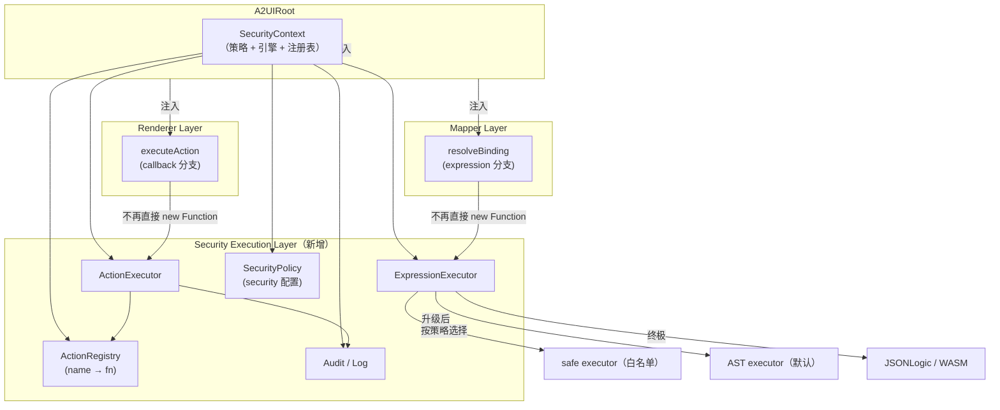
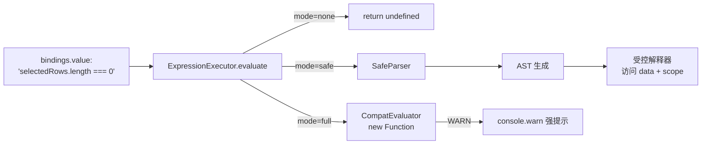
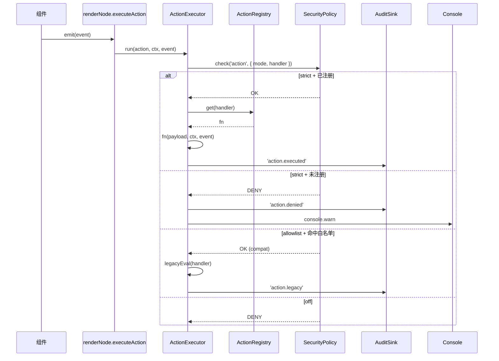
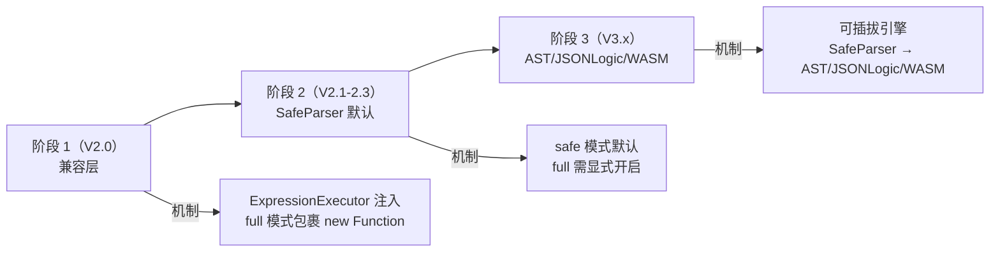
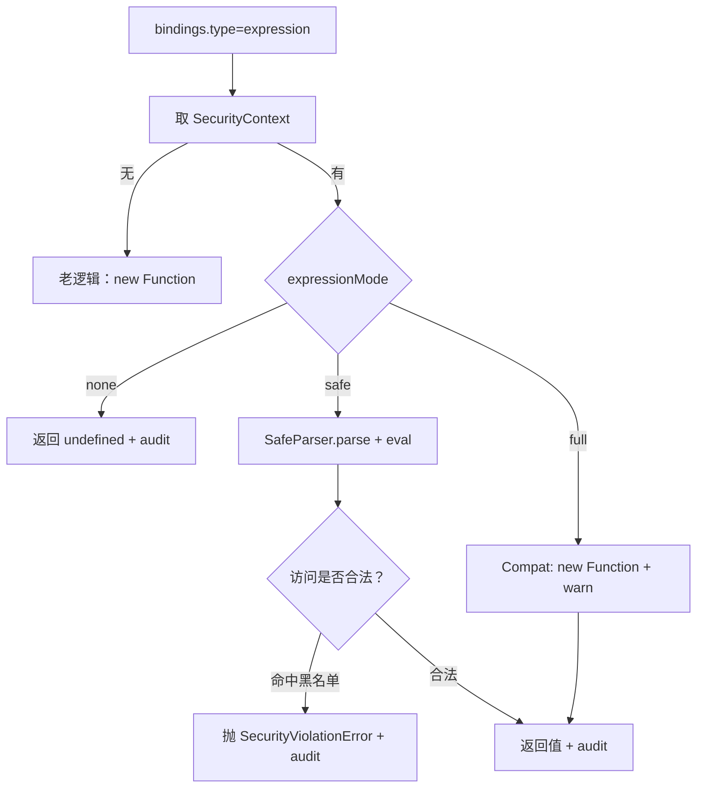

# 安全执行层设计（Security Execution Layer）

> 本文档为 [tech-debt.md](file:///d:/work/program/tineco/UI/a2ui-vue-engine/packages/md/tech-debt.md) 中 **DEBT-P0-01（表达式 / callback 求值路径未沙箱化）** 的偿还方案。
>
> 目标：在 **不修改协议、不破坏现有 expression / callback 写法、不引入重型沙箱** 的前提下，为 A2UI Runtime 加装一层可插拔、可分级、可渐进升级的安全执行能力。
>
> 阅读前建议先了解 [Runtime 架构设计](/guide/runtime-design) 与 [Action 系统](/guide/action-system)。

---

## 一、问题背景与设计约束

### 当前风险点（已在 Review 中举证）

| 风险 | 证据 |
|------|------|
| `expression` 绑定用 `new Function(...Object.keys(data), 'return ${expression}')(...)` | [mapper/binding.ts](file:///d:/work/program/tineco/UI/a2ui-vue-engine/packages/a2ui-vue-engine/src/mapper/binding.ts#L49-L58) |
| `callback` 动作用 `new Function('return ' + action.handler)()` | [renderer/renderNode.ts](file:///d:/work/program/tineco/UI/a2ui-vue-engine/packages/a2ui-vue-engine/src/renderer/renderNode.ts#L216-L221) |
| 无安全开关、无白名单、无沙箱、无权限分级 | 现有 `A2UIRootProps` 未提供任何 `security` 字段 |

### 硬性约束（用户明确要求）

1. **不修改现有 Schema 结构**：`BindingConfig.type: 'expression' / 'literal' / 'path'` 与 `ActionConfig.type: 'emit' / 'callback' / 'navigate' / 'api'` 保持不变。
2. **不破坏现有 expression / callback 写法**：老 Schema 无需迁移。
3. **不引入重型沙箱**（iframe / Worker 强隔离暂不采用）。
4. **允许渐进式升级**：Runtime 保持向后兼容。
5. **支持未来替换执行引擎**：`new Function` → 白名单表达式解析器 → AST executor / JSONLogic / WASM。

### 非目标

- 不重写整个 A2UI；
- 不引入复杂依赖（首版零依赖，后期可选装 `expr-eval` / `jsonata` / QuickJS-wasm）；
- 不阻断 Playground 与 Demo 场景（默认策略必须让示例继续跑）。

---

## 二、Security Execution Layer 架构

### 分层定位

安全执行层 **不是新模块**，而是 **一层「拦截器 + 策略引擎」**，插在既有 Runtime 之上。它同时被 Mapper 与 Renderer 复用：



### 组件职责

| 组件 | 位置（建议） | 职责 |
|------|-------------|------|
| **SecurityContext** | `src/security/context.ts` | 组合当前 `security` 配置、执行引擎、注册表、审计器；由 `A2UIRoot` 创建并通过 `RenderContext` 下发。 |
| **SecurityPolicy** | `src/security/policy.ts` | 描述当前允许的能力（模式、白名单、可访问字段等），提供 `check(op, args)` 判定入口。 |
| **ExpressionExecutor** | `src/security/expression/*` | 表达式求值接口 `evaluate(expr, ctx): any`；提供多种实现，按策略选择。 |
| **ActionExecutor** | `src/security/action/*` | 动作执行接口 `run(action, ctx, event): void`；对 `callback` 类型走 Registry + Executor。 |
| **ActionRegistry** | `src/security/action/registry.ts` | `name → fn` 的处理器注册表；宿主显式注册后才能被 `callback` 引用。 |
| **AuditSink** | `src/security/audit.ts` | 记录求值 / 动作执行结果（成功、失败、被拒），支持透传给宿主 `emit('inspect')`。 |

### 与既有模块的粘合

- **不改协议**：`BindingConfig.type: 'expression'` 与 `ActionConfig.type: 'callback'` 保持原语义。
- **不改 Runtime 主干**：`renderTree / MessageProcessor / A2UIRoot` 的既有主流程逻辑不动。
- **两处「注入 + 拦截」**：
  - [mapper/binding.ts](file:///d:/work/program/tineco/UI/a2ui-vue-engine/packages/a2ui-vue-engine/src/mapper/binding.ts) 的 `evaluateExpression` 替换为「调用 SecurityContext.expression.evaluate」；
  - [renderer/renderNode.ts](file:///d:/work/program/tineco/UI/a2ui-vue-engine/packages/a2ui-vue-engine/src/renderer/renderNode.ts) 的 `executeAction` 中 `callback` 分支替换为「调用 SecurityContext.action.run」。
- **依赖注入而非全局单例**：SecurityContext 挂在 `RenderContext` 上（新增可选字段 `security`），保证多实例可以持有各自的策略。

---

## 三、安全策略模型（SecurityPolicy）

### 3.1 配置结构

在 `A2UIRootProps` 上追加一个 **可选**（缺省即默认策略）字段：

```ts
interface A2UIRootProps {
  // ... 现有字段不动
  security?: SecurityConfig
}

interface SecurityConfig {
  allowExpression?: boolean       // 是否允许 expression 绑定
  allowAction?: boolean           // 是否允许 callback 动作
  expressionMode?: 'none' | 'safe' | 'full'   // 表达式执行模式
  actionMode?: 'strict' | 'allowlist' | 'off' // 动作执行模式
  allowlist?: {
    globals?: string[]            // 白名单可访问变量（默认仅 data、scope）
    handlers?: string[]           // 白名单 callback 名（strict 模式使用）
    identifiers?: string[]        // 表达式内允许的标识符集合
  }
  audit?: (event: SecurityAuditEvent) => void  // 审计钩子
}
```

### 3.2 默认值（安全优先）

```ts
const DEFAULT_SECURITY: Required<SecurityConfig> = {
  allowExpression: true,
  allowAction: true,
  expressionMode: 'safe',   // ← 默认使用 safe 执行器，不再 new Function
  actionMode: 'strict',      // ← 默认仅允许注册表内的 handler 名
  allowlist: {
    globals: [],             // 默认只暴露 data + scope，不注入其它全局
    handlers: [],
    identifiers: [],
  },
  audit: () => { /* noop */ },
}
```

**关键设计决策**：

- **默认「安全但可用」**：Playground 与 Demo 中的常见表达式（如 `selectedRows.length === 0`、`form.status === 'active'`）在 `safe` 模式下必须可用；
- **默认关闭「危险能力」**：任意 `new Function`、访问 `window` / `document` / `globalThis` 一律禁止；
- **多租户 / AI Native 场景可以「更严」**：`expressionMode: 'none'` + `actionMode: 'allowlist'`；
- **本地开发 / 内部工具可以「更松」**：`expressionMode: 'full'`（走兼容层的 `new Function`，产出 warning）。

### 3.3 三种模式的定义

#### expressionMode

| 模式 | 含义 | 使用场景 |
|------|------|---------|
| `none` | 直接返回 `undefined`，`bindings.type: 'expression'` 视为 `literal` | 多租户 / AI 生成 Schema 未审计的场景 |
| `safe` | 使用内置白名单解析器：仅支持成员访问、比较、逻辑、算术、字面量、`?.` / `??` | 默认；覆盖 95% 表达式需求 |
| `full` | 走兼容层的 `new Function`，等同现有行为，仅在配置显式开启时可用 | 老 Schema 兼容 / 特殊场景 |

#### actionMode

| 模式 | 含义 | 使用场景 |
|------|------|---------|
| `off` | `callback` 类型一律忽略，`console.warn` 提示 | 严格环境 |
| `strict` | 只允许 `handler` 是「注册表中的 name」；字符串函数体拒绝执行 | 默认 |
| `allowlist` | 允许 handler 字符串，但仅当 `handler` 命中 `allowlist.handlers` 白名单 | 迁移过渡期 |

### 3.4 环境切换

- **开发**（`import.meta.env.DEV`）：可放开 `expressionMode: 'full'`，帮助调试；
- **生产**：强制默认策略（`safe / strict`）；
- **多租户**：应用层根据租户配置动态传入 `security` prop；
- **AI Native**：Agent 生成 Schema 的场景，**必须** `expressionMode: 'none'` 或 `safe`，且 `actionMode: 'strict'`。

策略切换 **只发生在 A2UIRoot 挂载时**（首屏），运行时不允许「变严」——避免语义抖动；如果宿主必须动态调整，应销毁并重建 A2UIRoot 实例。

---

## 四、表达式执行替代方案

### 4.1 三层执行引擎



### 4.2 SafeParser 语法子集（首版）

支持：

- 字面量：`true / false / null / undefined / 数字 / 字符串 / 数组 / 对象`；
- 成员访问：`a.b.c` / `a[0]` / `a?.b`；
- 一元运算：`! + -`；
- 二元运算：`+ - * / % === !== == != > < >= <= && || ??`；
- 三元：`cond ? a : b`；
- 括号分组：`( ... )`；
- **仅可访问** 显式注入的变量（默认 `data` + `scope`，可通过 `allowlist.globals` 扩展）。

不支持：

- 函数调用（除了预注册的纯函数，通过 `allowlist.identifiers` 声明）；
- 赋值 `=` / 复合赋值；
- `new / delete / typeof / instanceof / in`（可通过策略再开放）；
- 访问 `window / document / globalThis / eval / Function / this`；
- 正则字面量、模板字符串、生成器、`async / await`；
- 任何解构、扩展运算符。

### 4.3 黑名单强制

无论何种模式，以下访问一律拒绝并抛 `SecurityViolationError`：

- `constructor` / `__proto__` / `prototype`；
- 全局对象 `window / document / globalThis / self / top`；
- 危险 API：`eval / Function / setTimeout / setInterval / fetch / XMLHttpRequest`。

黑名单在 SafeParser 编译期做静态检查；`full` 模式则在 `new Function` 外围包装一层 `with({ ... })` 屏蔽（仅兼容用途，不推荐）。

### 4.4 上下文注入

`evaluate(expr, ctx)` 的 `ctx` 严格白名单化：

```ts
interface ExpressionContext {
  data: Record<string, any>       // 只读代理，proxy 屏蔽 constructor 等
  scope?: Record<string, any>     // 作用域数据（未来扩展）
  now?: () => number              // 时间函数（可通过策略开启）
  // 其余标识符不注入
}
```

`data` 用 `Proxy` 包装成 **只读**（`set` 抛错），避免表达式内偷偷改状态。

### 4.5 缓存

同一份 `expression` 字符串重复求值时，SafeParser 应缓存 AST（`Map<string, AST>`）；命中缓存的求值成本接近属性访问。

### 4.6 未来替换路径

- 首版：手写 SafeParser（0 依赖，约 300 行）；
- 中期：引入 [`expr-eval`](https://github.com/silentmatt/expr-eval) 或 [`jsonata`](https://jsonata.org/) 作为可选实现，配置切换；
- 长期：可切 [QuickJS-wasm](https://github.com/justjake/quickjs-emscripten) 做真正的 JS 子集沙箱（性能与包体权衡）。

替换只影响 `ExpressionExecutor` 内部，Runtime / 协议无感。

---

## 五、Action 执行安全模型

### 5.1 ActionRegistry

宿主在 `A2UIRoot` 挂载前通过 `registerAction(name, fn)` 注册命名处理器：

```ts
// 应用侧
registerAction('submitForm', async (payload, ctx) => {
  await api.submit(ctx.formData)
  ctx.refreshDataSource('orderList')
})

registerAction('openDialog', (payload, ctx) => {
  ctx.updateData({ dialogs: { [payload.name]: { visible: true } } })
})
```

`ActionRegistry` 是 A2UIRoot 实例级的（不使用全局单例，避免多实例互相污染）。

### 5.2 callback Action 的新语义

`ActionConfig.callback` 保持字段不变，但 `handler` 的含义按策略变化：

| actionMode | `handler` 语义 | 兼容策略 |
|------------|--------------|---------|
| `strict` | 必须为已注册的 handler name，例如 `"submitForm"` | 新方式 |
| `allowlist` | 可以是完整函数字符串，但必须命中 `allowlist.handlers` 白名单 | 过渡期兼容 |
| `off` | 忽略 | 严格环境 |

**关键**：`handler` 是「name」而不是「函数体」——这是核心转变。字符串函数体的老写法在 `allowlist` 模式下仍可执行，但会 `console.warn`。

### 5.3 执行流程



### 5.4 其它 Action 类型（`emit / navigate / api`）

- `emit` / `api`：不涉及代码执行，安全策略不干预；
- `navigate`：走 `window.location`，可选加 `allowlist.urls`（正则或域白名单）作为二次防护；
- `type` 未识别：视 `expressionMode` 决定是否降级为 `emit`（策略默认降级），加 `console.warn`。

---

## 六、渐进式迁移方案

### 6.1 三阶段路线



### 6.2 阶段 1（V2.0） — 建立执行层，兼容优先

**目标**：先建立入口，最小侵入。

- 新增 `SecurityContext / ExpressionExecutor / ActionExecutor / ActionRegistry / SecurityPolicy` 模块；
- 修改 [`mapper/binding.ts`](file:///d:/work/program/tineco/UI/a2ui-vue-engine/packages/a2ui-vue-engine/src/mapper/binding.ts) 的 `evaluateExpression`：
  - 调用 `context.security.expression.evaluate(expr, data)`；
  - 未注入 SecurityContext 时（老代码路径）走原逻辑，保证零破坏；
- 修改 [`renderer/renderNode.ts`](file:///d:/work/program/tineco/UI/a2ui-vue-engine/packages/a2ui-vue-engine/src/renderer/renderNode.ts) 的 `case 'callback'`：
  - 调用 `context.security.action.run(action, ctx, event)`；
  - 未注入 SecurityContext 时走原逻辑；
- `A2UIRoot` 默认 **不** 创建 SecurityContext，保持行为完全等价；
- 提供 opt-in：`<A2UIRoot :security="{ }" />` 才启用安全层。

**验证**：Playground 与所有示例 JSON 在无 `security` prop 时行为完全一致（回归测试）。

### 6.3 阶段 2（V2.1 - V2.3） — SafeParser 成为默认

**目标**：把安全能力变成 opt-out。

- 上线 SafeParser 实现，稳定运行两个小版本；
- 修改默认策略：`A2UIRoot` 挂载时若未传 `security`，隐式使用 `DEFAULT_SECURITY`（`safe / strict`）；
- 老用户若需要 `full`，显式 `security: { expressionMode: 'full', actionMode: 'allowlist', allowlist: {...} }`；
- 文档明确「V2.0 默认关闭 → V2.1 默认开启」的语义变更，写入 [CHANGELOG](file:///d:/work/program/tineco/UI/a2ui-vue-engine/packages/a2ui-vue-engine/README.md)；
- 现有 `A2Button` 中 `bindings: { disabled: { type: 'expression', value: 'selectedRows.length === 0' } }` 类表达式在 SafeParser 下无缝工作。

**验证**：Playground 全量示例 + 三大 Page 官方模板（工单 / 用户 / 商品）跑通。

### 6.4 阶段 3（V3.x） — 可插拔引擎，废弃 `full` 模式

**目标**：彻底告别 `new Function`。

- 引入 AST executor（可基于 `acorn` + 白名单遍历）或 JSONLogic 引擎；
- 提供 `ExpressionExecutor` 插件接口，允许宿主注入自定义引擎；
- `expressionMode: 'full'` 标记为 deprecated，V3.3 开始 `console.warn`，V3.5 完全移除；
- Agent Native 场景默认切到 JSONLogic（更适合模型生成）；
- 高危场景可选 QuickJS-wasm 完全隔离。

**验证**：Agent 生成的 Schema 在 `expressionMode: 'safe'` 下 100% 可执行，且拒绝任何非法访问。

---

## 七、安全执行流程图（总览）

### 表达式求值



### 动作执行（callback 分支）

```mermaid
flowchart TD
    Start[ActionConfig.type=callback] --> Get[取 SecurityContext]
    Get -->|无| Legacy[老逻辑：new Function]
    Get -->|有| M{actionMode}
    M -->|off| Skip[忽略 + warn + audit]
    M -->|strict| Reg[从 Registry 查 handler]
    M -->|allowlist| ALW[allowlist.handlers 命中？]

    Reg -->|存在| Run[fn(payload, ctx, event) + audit]
    Reg -->|不存在| Deny1[拒绝 + warn + audit]
    ALW -->|是| Legacy2[Compat: new Function + warn]
    ALW -->|否| Deny2[拒绝 + warn + audit]
```

---

## 八、兼容策略

| 场景 | 兼容做法 |
|------|---------|
| 老应用未传 `security` prop | 阶段 1：完全等价旧行为；阶段 2 起：默认 `safe / strict`，需要老行为时显式配置 |
| 老 Schema 内含 `type: 'expression'` 常规写法 | SafeParser 直接支持成员访问 / 比较 / 逻辑，无迁移成本 |
| 老 Schema 内含 `type: 'expression'` 复杂函数调用 | 迁移到 `expressionMode: 'full' + allowlist.identifiers`，或改写为纯逻辑表达式 |
| 老 Schema 内含 `type: 'callback'` 函数字符串 | 迁移到 `handler: 'name'` 并 `registerAction(name, fn)`；过渡期可开 `actionMode: 'allowlist'` |
| Playground / Docs 示例 | 默认策略必须让所有内置示例可用；文档 [PlaygroundEmbed](file:///d:/work/program/tineco/UI/a2ui-vue-engine/packages/a2ui-docs/docs/.vitepress/theme/components/PlaygroundEmbed.vue) 显式声明策略 |
| AI 生成 Schema | 强制 `expressionMode: 'safe'` + `actionMode: 'strict'`，任何 `handler` 必须先注册 |
| 多租户 SaaS | 每个租户独立 A2UIRoot 实例，`security` 由控制台下发 |

**协议兼容承诺**：

- 不引入新的 `BindingConfig.type` / `ActionConfig.type`；
- 不改字段命名；
- 只在 `A2UIRootProps` 上新增可选 `security` 字段——**additive** 变更。

---

## 九、迁移步骤（Checklist）

### 阶段 1（V2.0）· 建立执行层

- [ ] 新增 `src/security/` 目录，实现 SecurityContext / SecurityPolicy / ExpressionExecutor / ActionExecutor / ActionRegistry / AuditSink 骨架；
- [ ] 实现 `LegacyExpressionExecutor`（包装 `new Function`）；
- [ ] 实现 `LegacyActionExecutor`（包装 `new Function`）；
- [ ] 在 `RenderContext` 新增可选 `security?: SecurityContext`；
- [ ] `mapper/binding.ts` 与 `renderer/renderNode.ts` 增加「有 security 走执行层、无则走原逻辑」的分支；
- [ ] `A2UIRoot` 新增可选 `security` prop 与 `defineExpose.registerAction`；
- [ ] 单元测试：与老逻辑对齐（表达式、动作、错误处理）；
- [ ] 文档：写入本页 + Runtime 架构补 Security 层说明。

### 阶段 2（V2.1 - V2.3）· SafeParser 默认

- [ ] 实现 SafeParser（Lexer + Parser + Interpreter，语法子集见 §4.2）；
- [ ] Proxy 化的只读 `data`；
- [ ] AST 缓存；
- [ ] 黑名单静态检查；
- [ ] 引入 `DEFAULT_SECURITY`，未传 `security` 时应用默认；
- [ ] 迁移 Playground 示例 / 三大官方 Page 模板；
- [ ] 更新文档，标注 breaking：默认策略变更；
- [ ] 提供迁移工具（可选）：扫描 Schema，识别不兼容表达式并给出改写建议。

### 阶段 3（V3.x）· 可插拔引擎

- [ ] `ExpressionExecutor` 抽象接口 + 官方实现（Safe / AST / JSONLogic / WASM 可选）；
- [ ] `expressionMode: 'full'` deprecated 提示；
- [ ] 对 AI Native / 多租户默认切 JSONLogic；
- [ ] 移除兼容层（V3.5 大版本）。

---

## 十、风险评估

### 不改造的风险（P0）

| 风险 | 等级 | 说明 |
|------|------|------|
| 代码执行漏洞 | **P0（阻断）** | AI 生成或跨租户 Schema 直接 XSS |
| 合规不通过 | **P0** | 金融 / 政企 / 车企场景无法通过安全评审 |
| 供应链攻击面 | **P0** | 只要引入下发端就构成攻击面 |
| 可审计性差 | **P1** | 无日志、无 trace，事故无从追责 |

### 改造后的收益

- **安全性**：默认关闭任意 JS 执行，AI Native 场景可上线；
- **可预测性**：SafeParser 语义确定，AI 生成命中率提升；
- **可观测**：审计钩子 + `inspect` emit（结合 [DEBT-P2-03](file:///d:/work/program/tineco/UI/a2ui-vue-engine/packages/md/tech-debt.md#debt-p2-03--缺少-runtime-观测面板与错误上报机制)）；
- **可插拔**：为未来 JSONLogic / WASM 留出接口；
- **兼容性**：老 Schema 无需修改，宿主只需 opt-in。

### 改造成本

| 项 | 估算 | 说明 |
|----|------|------|
| SecurityContext / Executor / Registry 骨架 | 小 | 约 300-500 行 TypeScript |
| SafeParser 首版 | 中 | 约 300-500 行，语法子集足够覆盖 95% 需求 |
| Legacy 兼容包装 | 极小 | 复用现有 `new Function` 代码，加日志 |
| 单元 & 回归测试 | 中 | 表达式子集测试 + Playground 全量回归 |
| 文档 & 迁移 | 中 | 本页 + 迁移工具（可选） |

### 对 Table / Page Runtime 的影响

- **零协议变更**：`bindings / actions` 字段不变；
- **零 Renderer 主干变更**：只在 `resolveBinding` / `executeAction` 两处加分支；
- **对 Page Schema 无影响**：Page / Search / Table / Dialog / Drawer / Pagination 等新组件本身不用表达式与 callback，本方案对它们透明；
- **对 DataSource 无影响**：DataSource 只走 `bindings.type: 'datasource'` 与 `ActionConfig.type: 'datasource'`，与安全层正交；
- **性能**：SafeParser + AST 缓存的求值成本 < 现有 `new Function`（一次编译多次执行）；`strict` 模式的 callback 是纯查表调用，比字符串反解更快。

---

## 十一、与技术债偿还计划的对应

| 债务 | 本方案覆盖 |
|------|-----------|
| [DEBT-P0-01 · 表达式 / callback 沙箱化](file:///d:/work/program/tineco/UI/a2ui-vue-engine/packages/md/tech-debt.md) | ✅ 全覆盖 |
| DEBT-P1-01 · handleEvent 事件通道拆分 | 部分：Audit / inspect emit 与 P1-01 拆分可协同 |
| DEBT-P2-03 · Runtime 观测面板 | 协同：`SecurityAuditEvent` 是 inspect 的第一个消费者 |

其它债务与本方案正交，不受影响。

---

## 十二、参考实现落地锚点

以下路径为未来落地时新增或修改的文件（当前仅设计，尚未新增）：

- **新增**：`packages/a2ui-vue-engine/src/security/context.ts`
- **新增**：`packages/a2ui-vue-engine/src/security/policy.ts`
- **新增**：`packages/a2ui-vue-engine/src/security/expression/index.ts`（executor 门面）
- **新增**：`packages/a2ui-vue-engine/src/security/expression/legacy.ts`（兼容层）
- **新增**：`packages/a2ui-vue-engine/src/security/expression/safe.ts`（SafeParser）
- **新增**：`packages/a2ui-vue-engine/src/security/action/index.ts`
- **新增**：`packages/a2ui-vue-engine/src/security/action/registry.ts`
- **新增**：`packages/a2ui-vue-engine/src/security/audit.ts`
- **扩展**：[mapper/binding.ts](file:///d:/work/program/tineco/UI/a2ui-vue-engine/packages/a2ui-vue-engine/src/mapper/binding.ts) 在 `evaluateExpression` 内做「有 security 走执行层，否则走 legacy」的判定；
- **扩展**：[renderer/renderNode.ts](file:///d:/work/program/tineco/UI/a2ui-vue-engine/packages/a2ui-vue-engine/src/renderer/renderNode.ts) 在 `case 'callback'` 内做同样判定；
- **扩展**：[types/index.ts](file:///d:/work/program/tineco/UI/a2ui-vue-engine/packages/a2ui-vue-engine/src/types/index.ts) 追加可选 `A2UIRootProps.security`；
- **扩展**：[root/A2UIRoot.vue](file:///d:/work/program/tineco/UI/a2ui-vue-engine/packages/a2ui-vue-engine/src/root/A2UIRoot.vue) 挂载 SecurityContext、`defineExpose.registerAction`；
- **扩展**：[renderer/renderTree.ts](file:///d:/work/program/tineco/UI/a2ui-vue-engine/packages/a2ui-vue-engine/src/renderer/renderTree.ts) 中 `createRenderContext` 支持 `security` 可选字段。

以上均为 **新增或 additive 扩展**，不改任何已有代码语义。

---

## 十三、结论

本方案通过 **「新增执行层 + 默认策略 + 渐进升级」** 三步组合，在满足所有硬性约束（不改协议、不破坏老写法、不引入重型沙箱、渐进升级、可替换引擎）的前提下，闭环偿还 P0 技术债 DEBT-P0-01。

- **阶段 1（V2.0）** 建立底盘，行为兼容旧版本；
- **阶段 2（V2.1-2.3）** 默认 `safe / strict`，覆盖 95% 场景；
- **阶段 3（V3.x）** 走向可插拔与 AI Native 首选执行引擎。

**该方案属于设计文档，不涉及任何代码或协议改动**。落地时严格按照 §九的 Checklist 分阶段执行。
